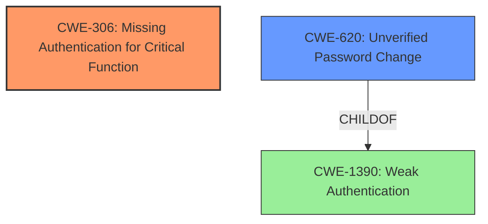

# Enhanced Analysis for CVE-2020-16839

# Summary
| CWE ID | CWE Name | Confidence | CWE Abstraction Level | CWE Vulnerability Mapping Label | CWE-Vulnerability Mapping Notes |
|---|---|---|---|---|---|
| CWE-306 | Missing Authentication for Critical Function | 1.0 | Base | Allowed | Primary CWE |
| CWE-620 | Unverified Password Change | 0.7 | Base | Allowed | Secondary Candidate |

## Evidence and Confidence

*   **Confidence Score:** 0.9
*   **Evidence Strength:** HIGH

## Relationship Analysis
The primary CWE is CWE-306 **[Missing Authentication for Critical Function]**, which indicates the core issue. CWE-620 **[Unverified Password Change]** is related, as it is a specific instance of missing authentication during a password change. CWE-620 is a child of CWE-1390 **[Weak Authentication]**, suggesting a broader category of authentication issues.



## Vulnerability Chain
The vulnerability chain starts with the **missing authentication** for a critical function (password change), leading to the ability to change passwords without proper authorization.

## Summary of Analysis
The initial analysis strongly points to CWE-306 **[Missing Authentication for Critical Function]** as the primary weakness. The vulnerability description states that the password can be changed by sending an **unauthenticated** WebSocket request, which directly aligns with the definition of CWE-306. The CVE Reference Links Content Summary explicitly mentions that the web application allows password changes by sending an **unauthenticated** Websocket request.

CWE-620 **[Unverified Password Change]** was considered as a secondary weakness because the password change process lacks verification of the original password or any other authentication mechanism. This is supported by the fact that the WebSocket request is **unauthenticated**.

CWE-306 **[Missing Authentication for Critical Function]** is chosen as the primary CWE because the core issue is the absence of authentication.

The selected CWEs are at the optimal level of specificity, as CWE-306 directly describes the **missing authentication** and CWE-620 specifies the unverified nature of the password change.

Relevant CWE Information:

# Enhanced Context (25 CWEs)

## CWE-1391: Use of Weak Credentials
**Abstraction Level**: Class
**Similarity Score**: 0.79
**Source**: dense

**Description**:
The product uses weak credentials (such as a default key or hard-coded password) that can be calculated, derived, reused, or guessed by an attacker.

**Mapping Guidance**:
- Usage: Allowed-with-Review
- Rationale: This CWE entry is a Class and might have Base-level children that would be more appropriate

This CWE is not applicable as the vulnerability involves bypassing authentication entirely, not the use of weak credentials.

## CWE-303: Incorrect Implementation of Authentication Algorithm
**Abstraction Level**: Base
**Similarity Score**: 0.79
**Source**: dense

**Description**:
The requirements for the product dictate the use of an established authentication algorithm, but the implementation of the algorithm is incorrect.

**Mapping Guidance**:
- Usage: Allowed
- Rationale: This CWE entry is at the Base level of abstraction, which is a preferred level of abstraction for mapping to the root causes of vulnerabilities.

This CWE is not applicable, as there's no mention of an existing authentication algorithm being incorrectly implemented. Instead, authentication is completely missing for the password change function.

## CWE-798: Use of Hard-coded Credentials
**Abstraction Level**: Base
**Similarity Score**: 0.79
**Source**: dense

**Description**:
The product contains hard-coded credentials, such as a password or cryptographic key.

**Mapping Guidance**:
- Usage: Allowed
- Rationale: This CWE entry is at the Base level of abstraction, which is a preferred level of abstraction for mapping to the root causes of vulnerabilities.

This CWE is not applicable because the vulnerability involves bypassing authentication entirely, not the use of hardcoded credentials.

## CWE-807: Reliance on Untrusted Inputs in a Security Decision
**Abstraction Level**: Base
**Similarity Score**: 0.78
**Source**: dense

**Description**:
The product uses a protection mechanism that relies on the existence or values of an input, but the input can be modified by an untrusted actor in a way that bypasses the protection mechanism.

**Mapping Guidance**:
- Usage: Allowed
- Rationale: This CWE entry is at the Base level of abstraction, which is a preferred level of abstraction for mapping to the root causes of vulnerabilities.

This CWE is not applicable because the core issue is the absence of authentication, not the reliance on untrusted inputs.

## CWE-1188: Initialization of a Resource with an Insecure Default
**Abstraction Level**: Base
**Similarity Score**: 0.78
**Source**: dense

**Description**:
The product initializes or sets a resource with a default that is intended to be changed by the administrator, but the default is not secure.

**Mapping Guidance**:
- Usage: Allowed
- Rationale: This CWE entry is at the Base level of abstraction, which is a preferred level of abstraction for mapping to the root causes of vulnerabilities.

This CWE is not applicable. The vulnerability is related to a missing authentication, not an insecure default.

## CWE-288: Authentication Bypass Using an Alternate Path or Channel
**Abstraction Level**: Base
**Similarity Score**: 0.77
**Source**: dense

**Description**:
The product requires authentication, but the product has an alternate path or channel that does not require authentication.

**Mapping Guidance**:
- Usage: Allowed
- Rationale: This CWE entry is at the Base level of abstraction, which is a preferred level of abstraction for mapping to the root causes of vulnerabilities.

This could be a possibility, but the description doesn't specify an alternate path - it mentions the password change is happening without authentication.

## CWE-1392: Use of Default Credentials
**Abstraction Level**: Base
**Similarity Score**: 0.77
**Source**: dense

**Description**:
The product uses default credentials (such as passwords or cryptographic keys) for potentially critical functionality.

**Mapping Guidance**:
- Usage: Allowed
- Rationale: This CWE entry is at the Base level of abstraction, which is a preferred level of abstraction for mapping to the root causes of vulnerabilities.

This CWE is not applicable because the vulnerability involves bypassing authentication entirely, not the use of default credentials.

## CWE-1390: Weak Authentication
**Abstraction Level**: Class
**Similarity Score**: 0.77
**Source**: dense

**Description**:
The product uses an authentication mechanism to restrict access to specific users or identities, but the mechanism does not sufficiently prove that the claimed identity is correct.

**Mapping Guidance**:
- Usage: Allowed-with-Review
- Rationale: This CWE entry is a Class and might have Base-level children that would be more appropriate

While this is related, the core issue is a total lack of authentication, not just a weak one.

## CWE-345: Insufficient Verification of Data Authenticity
**Abstraction Level**: Class
**Similarity Score**: 0.77
**Source**: dense

**Description**:
The product does not sufficiently verify the origin or authenticity of data, in a way that causes it to accept invalid data.

**Mapping Guidance**:
- Usage: Discouraged
- Rationale: This CWE entry is a level-1 Class (i.e., a child of a Pillar). It might have lower-level children that would be more appropriate

This CWE is not applicable because the vulnerability involves bypassing authentication entirely, not the insufficient verification of data authenticity.

## CWE-294: Authentication Bypass by Capture-replay
**Abstraction Level**: Base
**Similarity Score**: 0.77
**Source**: dense

**Description**:
A capture-replay flaw exists when the design of the product makes it possible for a malicious user to sniff network traffic and bypass authentication by replaying it to the server in question to the same effect as the original message (or with minor changes).

**Mapping Guidance**:
- Usage: Allowed
- Rationale: This CWE entry is at the Base level of abstraction, which is a preferred level of abstraction for mapping to the root causes of vulnerabilities.

This CWE is not applicable because the vulnerability involves **unauthenticated** access rather than bypassing existing authentication via replay.

## CWE-259: Use of Hard-coded Password
**Abstraction Level**: Variant
**Similarity Score**: 5606.95
**Source**: sparse

**Description**:
The product contains a hard-coded password, which it uses for its own inbound authentication or for outbound communication to external components.

**Mapping Guidance


## CWE Relationship Analysis

Current CWEs represent these abstraction levels: .


### Vulnerability Chain Analysis

**Chain starting from CWE-288:**
- 288 (Authentication Bypass Using an Alternate Path or Channel) - ROOT


**Chain starting from CWE-303:**
- 303 (Incorrect Implementation of Authentication Algorithm) - ROOT


### CWE Relationship Diagram

```mermaid
graph TD
    classDef primary fill:#f96,stroke:#333,stroke-width:2px
    classDef secondary fill:#69f,stroke:#333
    classDef tertiary fill:#9e9,stroke:#333
```