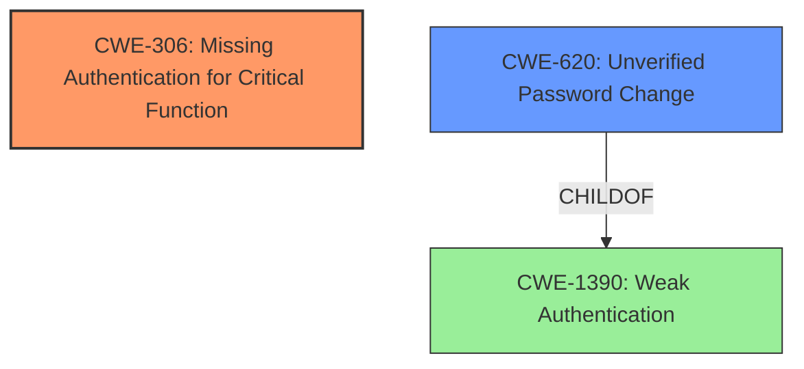

# Analysis for CVE-2020-16839

# Summary
| CWE ID | CWE Name | Confidence | CWE Abstraction Level | CWE Vulnerability Mapping Label | CWE-Vulnerability Mapping Notes |
|---|---|---|---|---|---|
| CWE-306 | Missing Authentication for Critical Function | 1.0 | Base | Allowed | Primary CWE |
| CWE-620 | Unverified Password Change | 0.7 | Base | Allowed | Secondary Candidate |

## Evidence and Confidence

*   **Confidence Score:** 0.9
*   **Evidence Strength:** HIGH

## Relationship Analysis
The primary CWE is CWE-306 **[Missing Authentication for Critical Function]**, which indicates the core issue. CWE-620 **[Unverified Password Change]** is related, as it is a specific instance of missing authentication during a password change. CWE-620 is a child of CWE-1390 **[Weak Authentication]**, suggesting a broader category of authentication issues.



## Vulnerability Chain
The vulnerability chain starts with the **missing authentication** for a critical function (password change), leading to the ability to change passwords without proper authorization.

## Summary of Analysis
The initial analysis strongly points to CWE-306 **[Missing Authentication for Critical Function]** as the primary weakness. The vulnerability description states that the password can be changed by sending an **unauthenticated** WebSocket request, which directly aligns with the definition of CWE-306. The CVE Reference Links Content Summary explicitly mentions that the web application allows password changes by sending an **unauthenticated** Websocket request.

CWE-620 **[Unverified Password Change]** was considered as a secondary weakness because the password change process lacks verification of the original password or any other authentication mechanism. This is supported by the fact that the WebSocket request is **unauthenticated**.

CWE-306 **[Missing Authentication for Critical Function]** is chosen as the primary CWE because the core issue is the absence of authentication.

The selected CWEs are at the optimal level of specificity, as CWE-306 directly describes the **missing authentication** and CWE-620 specifies the unverified nature of the password change.

Relevant CWE Information:

# Enhanced Context (25 CWEs)

## CWE-1391: Use of Weak Credentials
**Abstraction Level**: Class
**Similarity Score**: 0.79
**Source**: dense

**Description**:
The product uses weak credentials (such as a default key or hard-coded password) that can be calculated, derived, reused, or guessed by an attacker.

**Mapping Guidance**:
- Usage: Allowed-with-Review
- Rationale: This CWE entry is a Class and might have Base-level children that would be more appropriate

This CWE is not applicable as the vulnerability involves bypassing authentication entirely, not the use of weak credentials.

## CWE-303: Incorrect Implementation of Authentication Algorithm
**Abstraction Level**: Base
**Similarity Score**: 0.79
**Source**: dense

**Description**:
The requirements for the product dictate the use of an established authentication algorithm, but the implementation of the algorithm is incorrect.

**Mapping Guidance**:
- Usage: Allowed
- Rationale: This CWE entry is at the Base level of abstraction, which is a preferred level of abstraction for mapping to the root causes of vulnerabilities.

This CWE is not applicable, as there's no mention of an existing authentication algorithm being incorrectly implemented. Instead, authentication is completely missing for the password change function.

## CWE-798: Use of Hard-coded Credentials
**Abstraction Level**: Base
**Similarity Score**: 0.79
**Source**: dense

**Description**:
The product contains hard-coded credentials, such as a password or cryptographic key.

**Mapping Guidance**:
- Usage: Allowed
- Rationale: This CWE entry is at the Base level of abstraction, which is a preferred level of abstraction for mapping to the root causes of vulnerabilities.

This CWE is not applicable because the vulnerability involves bypassing authentication entirely, not the use of hardcoded credentials.

## CWE-807: Reliance on Untrusted Inputs in a Security Decision
**Abstraction Level**: Base
**Similarity Score**: 0.78
**Source**: dense

**Description**:
The product uses a protection mechanism that relies on the existence or values of an input, but the input can be modified by an untrusted actor in a way that bypasses the protection mechanism.

**Mapping Guidance**:
- Usage: Allowed
- Rationale: This CWE entry is at the Base level of abstraction, which is a preferred level of abstraction for mapping to the root causes of vulnerabilities.

This CWE is not applicable because the core issue is the absence of authentication, not the reliance on untrusted inputs.

## CWE-1188: Initialization of a Resource with an Insecure Default
**Abstraction Level**: Base
**Similarity Score**: 0.78
**Source**: dense

**Description**:
The product initializes or sets a resource with a default that is intended to be changed by the administrator, but the default is not secure.

**Mapping Guidance**:
- Usage: Allowed
- Rationale: This CWE entry is at the Base level of abstraction, which is a preferred level of abstraction for mapping to the root causes of vulnerabilities.

This CWE is not applicable. The vulnerability is related to a missing authentication, not an insecure default.

## CWE-288: Authentication Bypass Using an Alternate Path or Channel
**Abstraction Level**: Base
**Similarity Score**: 0.77
**Source**: dense

**Description**:
The product requires authentication, but the product has an alternate path or channel that does not require authentication.

**Mapping Guidance**:
- Usage: Allowed
- Rationale: This CWE entry is at the Base level of abstraction, which is a preferred level of abstraction for mapping to the root causes of vulnerabilities.

This could be a possibility, but the description doesn't specify an alternate path - it mentions the password change is happening without authentication.

## CWE-1392: Use of Default Credentials
**Abstraction Level**: Base
**Similarity Score**: 0.77
**Source**: dense

**Description**:
The product uses default credentials (such as passwords or cryptographic keys) for potentially critical functionality.

**Mapping Guidance**:
- Usage: Allowed
- Rationale: This CWE entry is at the Base level of abstraction, which is a preferred level of abstraction for mapping to the root causes of vulnerabilities.

This CWE is not applicable because the vulnerability involves bypassing authentication entirely, not the use of default credentials.

## CWE-1390: Weak Authentication
**Abstraction Level**: Class
**Similarity Score**: 0.77
**Source**: dense

**Description**:
The product uses an authentication mechanism to restrict access to specific users or identities, but the mechanism does not sufficiently prove that the claimed identity is correct.

**Mapping Guidance**:
- Usage: Allowed-with-Review
- Rationale: This CWE entry is a Class and might have Base-level children that would be more appropriate

While this is related, the core issue is a total lack of authentication, not just a weak one.

## CWE-345: Insufficient Verification of Data Authenticity
**Abstraction Level**: Class
**Similarity Score**: 0.77
**Source**: dense

**Description**:
The product does not sufficiently verify the origin or authenticity of data, in a way that causes it to accept invalid data.

**Mapping Guidance**:
- Usage: Discouraged
- Rationale: This CWE entry is a level-1 Class (i.e., a child of a Pillar). It might have lower-level children that would be more appropriate

This CWE is not applicable because the vulnerability involves bypassing authentication entirely, not the insufficient verification of data authenticity.

## CWE-294: Authentication Bypass by Capture-replay
**Abstraction Level**: Base
**Similarity Score**: 0.77
**Source**: dense

**Description**:
A capture-replay flaw exists when the design of the product makes it possible for a malicious user to sniff network traffic and bypass authentication by replaying it to the server in question to the same effect as the original message (or with minor changes).

**Mapping Guidance**:
- Usage: Allowed
- Rationale: This CWE entry is at the Base level of abstraction, which is a preferred level of abstraction for mapping to the root causes of vulnerabilities.

This CWE is not applicable because the vulnerability involves **unauthenticated** access rather than bypassing existing authentication via replay.

## CWE-259: Use of Hard-coded Password
**Abstraction Level**: Variant
**Similarity Score**: 5606.95
**Source**: sparse

**Description**:
The product contains a hard-coded password, which it uses for its own inbound authentication or for outbound communication to external components.

**Mapping Guidance

# Enhanced Query for CVE-2020-16839

## Vulnerability Description
On Crestron DM-NVX-DIR, DM-NVX-DIR80, and DM-NVX-ENT devices before the DM-XIO/1-0-3-802 patch, the password can be changed by sending an unauthenticated WebSocket request.

### Vulnerability Description Key Phrases
- **impact:** change password
- **vector:** unauthenticated WebSocket request
- **product:** Crestron DM-NVX-DIR and DM-NVX-DIR80 and DM-NVX-ENT

## CVE Reference Links Content Summary
```text
RELATED: CVE-2020-16839

- Vulnerability: Password change via Websocket request
- Affected Products: DM-NVX-DIR-80, DM-NVX-DIR-160, DM-NVX-DIR-ENT
- Root Cause: The web application allows password changes by sending an unauthenticated Websocket request.
- Impact: Unauthorized password change.
- Attack Vector: Sending an unauthenticated Websocket request to the web application.
- Resolution: Upgrade to firmware version v.1.0.3.802 or later.
```

## Retriever Results

### Top Combined Results

| Rank | CWE ID | Name | Abstraction | Usage  | Retrievers | Individual Scores |
|------|--------|------|-------------|-------|------------|-------------------|
| 1 | 620 | Unverified Password Change | Base | Allowed | sparse | 0.159 |
| 2 | 294 | Authentication Bypass by Capture-replay | Base | Allowed | sparse | 0.062 |
| 3 | 413 | Improper Resource Locking | Base | Allowed | sparse | 0.051 |
| 4 | 918 | Server-Side Request Forgery (SSRF) | Base | Allowed | sparse | 0.050 |
| 5 | 259 | Use of Hard-coded Password | Variant | Allowed | sparse | 0.047 |
| 6 | 260 | Password in Configuration File | Base | Allowed | dense | 0.463 |
| 7 | 836 | Use of Password Hash Instead of Password for Authentication | Base | Allowed | graph | 0.002 |
| 8 | 1188 | Initialization of a Resource with an Insecure Default | Base | Allowed | sparse | 0.046 |
| 9 | 78 | Improper Neutralization of Special Elements used in an OS Command ('OS Command Injection') | Base | Allowed | sparse | 0.046 |
| 10 | 306 | Missing Authentication for Critical Function | Base | Allowed | sparse | 0.045 |


# Complete CWE Specifications


## CWE-620: Unverified Password Change
**Abstraction:** Base
**Status:** Draft

### Description
When setting a new password for a user, the product does not require knowledge of the original password, or using another form of authentication.

### Extended Description
This could be used by an attacker to change passwords for another user, thus gaining the privileges associated with that user.

### Alternative Terms
None

### Relationships
ChildOf -> CWE-1390

### Mapping Guidance
**Usage:** Allowed
**Rationale:** This CWE entry is at the Base level of abstraction, which is a preferred level of abstraction for mapping to the root causes of vulnerabilities.
**Comments:** Carefully read both the name and description to ensure that this mapping is an appropriate fit. Do not try to 'force' a mapping to a lower-level Base/Variant simply to comply with this preferred level of abstraction.
**Reasons:**
- Acceptable-Use


### Observed Examples
- **CVE-2007-0681:** Web app allows remote attackers to change the passwords of arbitrary users without providing the original password, and possibly perform other unauthorized actions.
- **CVE-2000-0944:** Web application password change utility doesn't check the original password.


## CWE-294: Authentication Bypass by Capture-replay
**Abstraction:** Base
**Status:** Incomplete

### Description
A capture-replay flaw exists when the design of the product makes it possible for a malicious user to sniff network traffic and bypass authentication by replaying it to the server in question to the same effect as the original message (or with minor changes).

### Extended Description
Capture-replay attacks are common and can be difficult to defeat without cryptography. They are a subset of network injection attacks that rely on observing previously-sent valid commands, then changing them slightly if necessary and resending the same commands to the server.

### Alternative Terms
None

### Relationships
ChildOf -> CWE-1390
ChildOf -> CWE-287

### Mapping Guidance
**Usage:** Allowed
**Rationale:** This CWE entry is at the Base level of abstraction, which is a preferred level of abstraction for mapping to the root causes of vulnerabilities.
**Comments:** Carefully read both the name and description to ensure that this mapping is an appropriate fit. Do not try to 'force' a mapping to a lower-level Base/Variant simply to comply with this preferred level of abstraction.
**Reasons:**
- Acceptable-Use


### Observed Examples
- **CVE-2005-3435:** product authentication succeeds if user-provided MD5 hash matches the hash in its database; this can be subjected to replay attacks.
- **CVE-2007-4961:** Chain: cleartext transmission of the MD5 hash of password (CWE-319) enables attacks against a server that is susceptible to replay (CWE-294).


## CWE-413: Improper Resource Locking
**Abstraction:** Base
**Status:** Draft

### Description
The product does not lock or does not correctly lock a resource when the product must have exclusive access to the resource.

### Extended Description
When a resource is not properly locked, an attacker could modify the resource while it is being operated on by the product. This might violate the product's assumption that the resource will not change, potentially leading to unexpected behaviors.

### Alternative Terms
None

### Relationships
ChildOf -> CWE-667

### Mapping Guidance
**Usage:** Allowed
**Rationale:** This CWE entry is at the Base level of abstraction, which is a preferred level of abstraction for mapping to the root causes of vulnerabilities.
**Comments:** Carefully read both the name and description to ensure that this mapping is an appropriate fit. Do not try to 'force' a mapping to a lower-level Base/Variant simply to comply with this preferred level of abstraction.
**Reasons:**
- Acceptable-Use


### Observed Examples
- **CVE-2022-20141:** Chain: an operating system kernel has insufficent resource locking (CWE-413) leading to a use after free (CWE-416).


## CWE-918: Server-Side Request Forgery (SSRF)
**Abstraction:** Base
**Status:** Incomplete

### Description
The web server receives a URL or similar request from an upstream component and retrieves the contents of this URL, but it does not sufficiently ensure that the request is being sent to the expected destination.

### Extended Description
Not provided

### Alternative Terms
XSPA: Cross Site Port Attack
SSRF: Server-Side Request Forgery

### Relationships
ChildOf -> CWE-441
ChildOf -> CWE-610

### Mapping Guidance
**Usage:** Allowed
**Rationale:** This CWE entry is at the Base level of abstraction, which is a preferred level of abstraction for mapping to the root causes of vulnerabilities.
**Comments:** Carefully read both the name and description to ensure that this mapping is an appropriate fit. Do not try to 'force' a mapping to a lower-level Base/Variant simply to comply with this preferred level of abstraction.
**Reasons:**
- Acceptable-Use


### Additional Notes
**[Relationship]** CWE-918 (SSRF) and CWE-611 (XXE) are closely related, because they both involve web-related technologies and can launch outbound requests to unexpected destinations. However, XXE can be performed client-side, or in other contexts in which the software is not acting directly as a server, so the "Server" portion of the SSRF acronym does not necessarily apply.


### Observed Examples
- **CVE-2023-32786:** Chain: LLM integration framework has prompt injection (CWE-1427) that allows an attacker to force the service to retrieve data from an arbitrary URL, essentially providing SSRF (CWE-918) and potentially injecting content into downstream tasks.
- **CVE-2021-26855:** Server Side Request Forgery (SSRF) in mail server, as exploited in the wild per CISA KEV.
- **CVE-2021-21973:** Server Side Request Forgery in cloud platform, as exploited in the wild per CISA KEV.


## CWE-259: Use of Hard-coded Password
**Abstraction:** Variant
**Status:** Draft

### Description
The product contains a hard-coded password, which it uses for its own inbound authentication or for outbound communication to external components.

### Extended Description


A hard-coded password typically leads to a significant authentication failure that can be difficult for the system administrator to detect. Once detected, it can be difficult to fix, so the administrator may be forced into disabling the product entirely. There are two main variations:

```
		Inbound: the product contains an authentication mechanism that checks for a hard-coded password.
		Outbound: the product connects to another system or component, and it contains hard-coded password for connecting to that component.
```
In the Inbound variant, a default administration account is created, and a simple password is hard-coded into the product and associated with that account. This hard-coded password is the same for each installation of the product, and it usually cannot be changed or disabled by system administrators without manually modifying the program, or otherwise patching the product. If the password is ever discovered or published (a common occurrence on the Internet), then anybody with knowledge of this password can access the product. Finally, since all installations of the product will have the same password, even across different organizations, this enables massive attacks such as worms to take place.

The Outbound variant applies to front-end systems that authenticate with a back-end service. The back-end service may require a fixed password which can be easily discovered. The programmer may simply hard-code those back-end credentials into the front-end product. Any user of that program may be able to extract the password. Client-side systems with hard-coded passwords pose even more of a threat, since the extraction of a password from a binary is usually very simple.


### Alternative Terms
None

### Relationships
ChildOf -> CWE-798
ChildOf -> CWE-798
ChildOf -> CWE-798
PeerOf -> CWE-321
PeerOf -> CWE-257

### Mapping Guidance
**Usage:** Allowed
**Rationale:** This CWE entry is at the Variant level of abstraction, which is a preferred level of abstraction for mapping to the root causes of vulnerabilities.
**Comments:** Carefully read both the name and description to ensure that this mapping is an appropriate fit. Do not try to 'force' a mapping to a lower-level Base/Variant simply to comply with this preferred level of abstraction.
**Reasons:**
- Acceptable-Use


### Additional Notes
**[Maintenance]** This entry could be split into multiple variants: an inbound variant (as seen in the second demonstrative example) and an outbound variant (as seen in the first demonstrative example). These variants are likely to have different consequences, detectability, etc. More importantly, from a vulnerability theory perspective, they could be characterized as different behaviors.


### Observed Examples
- **CVE-2022-29964:** Distributed Control System (DCS) has hard-coded passwords for local shell access
- **CVE-2021-37555:** Telnet service for IoT feeder for dogs and cats has hard-coded password [REF-1288]
- **CVE-2021-35033:** Firmware for a WiFi router uses a hard-coded password for a BusyBox shell, allowing bypass of authentication through the UART port


## CWE-260: Password in Configuration File
**Abstraction:** Base
**Status:** Incomplete

### Description
The product stores a password in a configuration file that might be accessible to actors who do not know the password.

### Extended Description
This can result in compromise of the system for which the password is used. An attacker could gain access to this file and learn the stored password or worse yet, change the password to one of their choosing.

### Alternative Terms
None

### Relationships
ChildOf -> CWE-522

### Mapping Guidance
**Usage:** Allowed
**Rationale:** This CWE entry is at the Base level of abstraction, which is a preferred level of abstraction for mapping to the root causes of vulnerabilities.
**Comments:** Carefully read both the name and description to ensure that this mapping is an appropriate fit. Do not try to 'force' a mapping to a lower-level Base/Variant simply to comply with this preferred level of abstraction.
**Reasons:**
- Acceptable-Use


### Observed Examples
- **CVE-2022-38665:** A continuous delivery pipeline management tool stores an unencypted password in a configuration file.


## CWE-836: Use of Password Hash Instead of Password for Authentication
**Abstraction:** Base
**Status:** Incomplete

### Description
The product records password hashes in a data store, receives a hash of a password from a client, and compares the supplied hash to the hash obtained from the data store.

### Extended Description


Some authentication mechanisms rely on the client to generate the hash for a password, possibly to reduce load on the server or avoid sending the password across the network. However, when the client is used to generate the hash, an attacker can bypass the authentication by obtaining a copy of the hash, e.g. by using SQL injection to compromise a database of authentication credentials, or by exploiting an information exposure. The attacker could then use a modified client to replay the stolen hash without having knowledge of the original password.


As a result, the server-side comparison against a client-side hash does not provide any more security than the use of passwords without hashing.


### Alternative Terms
None

### Relationships
ChildOf -> CWE-1390
PeerOf -> CWE-602

### Mapping Guidance
**Usage:** Allowed
**Rationale:** This CWE entry is at the Base level of abstraction, which is a preferred level of abstraction for mapping to the root causes of vulnerabilities.
**Comments:** Carefully read both the name and description to ensure that this mapping is an appropriate fit. Do not try to 'force' a mapping to a lower-level Base/Variant simply to comply with this preferred level of abstraction.
**Reasons:**
- Acceptable-Use


### Observed Examples
- **CVE-2009-1283:** Product performs authentication with user-supplied password hashes that can be obtained from a separate SQL injection vulnerability (CVE-2009-1282).
- **CVE-2005-3435:** Product allows attackers to bypass authentication by obtaining the password hash for another user and specifying the hash in the pwd argument.


## CWE-1188: Initialization of a Resource with an Insecure Default
**Abstraction:** Base
**Status:** Incomplete

### Description
The product initializes or sets a resource with a default that is intended to be changed by the administrator, but the default is not secure.

### Extended Description


Developers often choose default values that leave the product as open and easy to use as possible out-of-the-box, under the assumption that the administrator can (or should) change the default value. However, this ease-of-use comes at a cost when the default is insecure and the administrator does not change it.


### Alternative Terms
None

### Relationships
ChildOf -> CWE-1419
ChildOf -> CWE-665

### Mapping Guidance
**Usage:** Allowed
**Rationale:** This CWE entry is at the Base level of abstraction, which is a preferred level of abstraction for mapping to the root causes of vulnerabilities.
**Comments:** Carefully read both the name and description to ensure that this mapping is an appropriate fit. Do not try to 'force' a mapping to a lower-level Base/Variant simply to comply with this preferred level of abstraction.
**Reasons:**
- Acceptable-Use


### Additional Notes
**[Maintenance]** This entry improves organization of concepts under initialization. The typical CWE model is to cover "Missing" and "Incorrect" behaviors. Arguably, this entry could be named as "Incorrect" instead of "Insecure." This might be changed in the near future.


### Observed Examples
- **CVE-2022-36349:** insecure default variable initialization in BIOS firmware for a hardware board allows DoS
- **CVE-2022-42467:** A generic database browser interface has a default mode that exposes a web server to the network, allowing queries to the database.


## CWE-78: Improper Neutralization of Special Elements used in an OS Command ('OS Command Injection')
**Abstraction:** Base
**Status:** Stable

### Description
The product constructs all or part of an OS command using externally-influenced input from an upstream component, but it does not neutralize or incorrectly neutralizes special elements that could modify the intended OS command when it is sent to a downstream component.

### Extended Description


This weakness can lead to a vulnerability in environments in which the attacker does not have direct access to the operating system, such as in web applications. Alternately, if the weakness occurs in a privileged program, it could allow the attacker to specify commands that normally would not be accessible, or to call alternate commands with privileges that the attacker does not have. The problem is exacerbated if the compromised process does not follow the principle of least privilege, because the attacker-controlled commands may run with special system privileges that increases the amount of damage.


There are at least two subtypes of OS command injection:


  - The application intends to execute a single, fixed program that is under its own control. It intends to use externally-supplied inputs as arguments to that program. For example, the program might use system("nslookup [HOSTNAME]") to run nslookup and allow the user to supply a HOSTNAME, which is used as an argument. Attackers cannot prevent nslookup from executing. However, if the program does not remove command separators from the HOSTNAME argument, attackers could place the separators into the arguments, which allows them to execute their own program after nslookup has finished executing.

  - The application accepts an input that it uses to fully select which program to run, as well as which commands to use. The application simply redirects this entire command to the operating system. For example, the program might use "exec([COMMAND])" to execute the [COMMAND] that was supplied by the user. If the COMMAND is under attacker control, then the attacker can execute arbitrary commands or programs. If the command is being executed using functions like exec() and CreateProcess(), the attacker might not be able to combine multiple commands together in the same line.

From a weakness standpoint, these variants represent distinct programmer errors. In the first variant, the programmer clearly intends that input from untrusted parties will be part of the arguments in the command to be executed. In the second variant, the programmer does not intend for the command to be accessible to any untrusted party, but the programmer probably has not accounted for alternate ways in which malicious attackers can provide input.

### Alternative Terms
Shell injection
Shell metacharacters
OS Command Injection

### Relationships
ChildOf -> CWE-77
ChildOf -> CWE-74
ChildOf -> CWE-77
ChildOf -> CWE-77
CanAlsoBe -> CWE-88

### Mapping Guidance
**Usage:** Allowed
**Rationale:** This CWE entry is at the Base level of abstraction, which is a preferred level of abstraction for mapping to the root causes of vulnerabilities.
**Comments:** Carefully read both the name and description to ensure that this mapping is an appropriate fit. Do not try to 'force' a mapping to a lower-level Base/Variant simply to comply with this preferred level of abstraction.
**Reasons:**
- Acceptable-Use


### Additional Notes
**[Terminology]** The "OS command injection" phrase carries different meanings to different people. For some people, it only refers to cases in which the attacker injects command separators into arguments for an application-controlled program that is being invoked. For some people, it refers to any type of attack that can allow the attacker to execute OS commands of their own choosing. This usage could include untrusted search path weaknesses (CWE-426) that cause the application to find and execute an attacker-controlled program. Further complicating the issue is the case when argument injection (CWE-88) allows alternate command-line switches or options to be inserted into the command line, such as an "-exec" switch whose purpose may be to execute the subsequent argument as a command (this -exec switch exists in the UNIX "find" command, for example). In this latter case, however, CWE-88 could be regarded as the primary weakness in a chain with CWE-78.

**[Research Gap]** More investigation is needed into the distinction between the OS command injection variants, including the role with argument injection (CWE-88). Equivalent distinctions may exist in other injection-related problems such as SQL injection.


### Observed Examples
- **CVE-2020-10987:** OS command injection in Wi-Fi router, as exploited in the wild per CISA KEV.
- **CVE-2020-10221:** Template functionality in network configuration management tool allows OS command injection, as exploited in the wild per CISA KEV.
- **CVE-2020-9054:** Chain: improper input validation (CWE-20) in username parameter, leading to OS command injection (CWE-78), as exploited in the wild per CISA KEV.


## CWE-306: Missing Authentication for Critical Function
**Abstraction:** Base
**Status:** Draft

### Description
The product does not perform any authentication for functionality that requires a provable user identity or consumes a significant amount of resources.

### Extended Description
Not provided

### Alternative Terms
None

### Relationships
ChildOf -> CWE-287
ChildOf -> CWE-287

### Mapping Guidance
**Usage:** Allowed
**Rationale:** This CWE entry is at the Base level of abstraction, which is a preferred level of abstraction for mapping to the root causes of vulnerabilities.
**Comments:** Carefully read both the name and description to ensure that this mapping is an appropriate fit. Do not try to 'force' a mapping to a lower-level Base/Variant simply to comply with this preferred level of abstraction.
**Reasons:**
- Acceptable-Use


### Observed Examples
- **CVE-2022-31260:** Chain: a digital asset management program has an undisclosed backdoor in the legacy version of a PHP script (CWE-912) that could allow an unauthenticated user to export metadata (CWE-306)
- **CVE-2022-29951:** TCP-based protocol in Programmable Logic Controller (PLC) has no authentication.
- **CVE-2022-29952:** Condition Monitor firmware uses a protocol that does not require authentication.

