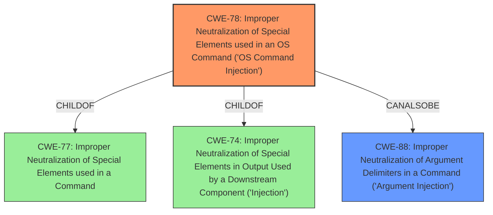

# Analysis for CVE-2020-16846

# Summary
| CWE ID | CWE Name | Confidence | CWE Abstraction Level | CWE Vulnerability Mapping Label | CWE-Vulnerability Mapping Notes |
|---|---|---|---|---|---|
| CWE-78 | Improper Neutralization of Special Elements used in an OS Command ('OS Command Injection') | 1.0 | Base | Allowed | Primary CWE |
| CWE-88 | Improper Neutralization of Argument Delimiters in a Command ('Argument Injection') | 0.6 | Base | Allowed | Secondary Candidate |

## Evidence and Confidence

*   **Confidence Score:** 0.9
*   **Evidence Strength:** HIGH

## Relationship Analysis
The primary CWE is CWE-78, which represents the **shell injection** vulnerability directly. CWE-88 is considered as a secondary candidate because it involves improper handling of argument delimiters, which can contribute to command injection, but the evidence more strongly supports direct command injection. CWE-78 is a base level CWE which is the preferred level of abstraction.

## Vulnerability Chain
The vulnerability chain starts with the **improper input validation** in the `rest_cherrypy` module, leading to the construction of a command with externally-influenced input that is not properly neutralized. This results in **OS Command Injection**, allowing arbitrary code execution.
  - Improper Input Validation (Implicit) -> Improper Neutralization (CWE-78) -> Arbitrary Code Execution (Impact)

## Summary of Analysis
The initial analysis strongly points to CWE-78 (Improper Neutralization of Special Elements used in an OS Command). The vulnerability description explicitly mentions **shell injection**, and the CVE Reference Links Content Summary confirms that the root cause is **improper input validation** in the `rest_cherrypy` module, leading to the construction of OS commands with attacker-controlled input. This aligns perfectly with the description of CWE-78, which involves constructing OS commands using externally-influenced input without proper neutralization.

The evidence from the CVE Reference Links Content Summary:
> The root cause of CVE-2020-16846 is **improper input validation** within the `rest_cherrypy` module of SaltStack Salt. Specifically, the `ssh_priv`, `ssh_options`, `ssh_remote_port_forwards`, and `ssh_port` parameters, when parsed by the `rest_cherrypy` module, are not properly sanitized before being used to construct and execute system calls. This allows an attacker to inject arbitrary shell commands into these calls.

CWE-88 (Improper Neutralization of Argument Delimiters in a Command) was considered because argument injection can be a component of command injection. However, the core issue is the ability to inject entire commands, making CWE-78 the more direct and appropriate classification.

The selection of CWE-78 is at the optimal level of specificity (Base) as it directly addresses the **shell injection** vulnerability described.

Relevant CWE Information:

# Enhanced Context (25 CWEs)
The following CWEs were identified as potentially relevant to this vulnerability:

## CWE-113: Improper Neutralization of CRLF Sequences in HTTP Headers ('HTTP Request/Response Splitting')
**Abstraction Level**: Variant
**Similarity Score**: 0.77
**Source**: dense

**Description**:
The product receives data from an HTTP agent/component (e.g., web server, proxy, browser, etc.), but it does not neutralize or incorrectly neutralizes CR and LF characters before the data is included in outgoing HTTP headers.

**Mapping Guidance**:
- Usage: Allowed
- Rationale: This CWE entry is at the Variant level of abstraction, which is a preferred level of abstraction for mapping to the root causes of vulnerabilities.

## CWE-74: Improper Neutralization of Special Elements in Output Used by a Downstream Component ('Injection')
**Abstraction Level**: Class
**Similarity Score**: 0.76
**Source**: dense

**Description**:
The product constructs all or part of a command, data structure, or record using externally-influenced input from an upstream component, but it does not neutralize or incorrectly neutralizes special elements that could modify how it is parsed or interpreted when it is sent to a downstream component.

**Mapping Guidance**:
- Usage: Discouraged
- Rationale: CWE-74 is high-level and often misused when lower-level weaknesses are more appropriate.

## CWE-93: Improper Neutralization of CRLF Sequences ('CRLF Injection')
**Abstraction Level**: Base
**Similarity Score**: 0.74
**Source**: dense

**Description**:
The product uses CRLF (carriage return line feeds) as a special element, e.g. to separate lines or records, but it does not neutralize or incorrectly neutralizes CRLF sequences from inputs.

**Mapping Guidance**:
- Usage: Allowed
- Rationale: This CWE entry is at the Base level of abstraction, which is a preferred level of abstraction for mapping to the root causes of vulnerabilities.

## CWE-41: Improper Resolution of Path Equivalence
**Abstraction Level**: Base
**Similarity Score**: 0.74
**Source**: dense

**Description**:
The product is vulnerable to file system contents disclosure through path equivalence. Path equivalence involves the use of special characters in file and directory names. The associated manipulations are intended to generate multiple names for the same object.

**Mapping Guidance**:
- Usage: Allowed
- Rationale: This CWE entry is at the Base level of abstraction, which is a preferred level of abstraction for mapping to the root causes of vulnerabilities.

## CWE-1289: Improper Validation of Unsafe Equivalence in Input
**Abstraction Level**: Base
**Similarity Score**: 0.73
**Source**: dense

**Description**:
The product receives an input value that is used as a resource identifier or other type of reference, but it does not validate or incorrectly validates that the input is equivalent to a potentially-unsafe value.

**Mapping Guidance**:
- Usage: Allowed
- Rationale: This CWE entry is at the Base level of abstraction, which is a preferred level of abstraction for mapping to the root causes of vulnerabilities.

## CWE-138: Improper Neutralization of Special Elements
**Abstraction Level**: Class
**Similarity Score**: 0.73
**Source**: dense

**Description**:
The product receives input from an upstream component, but it does not neutralize or incorrectly neutralizes special elements that could be interpreted as control elements or syntactic markers when they are sent to a downstream component.

**Mapping Guidance**:
- Usage: Discouraged
- Rationale: This CWE entry is a level-1 Class (i.e., a child of a Pillar). It might have lower-level children that would be more appropriate

## CWE-184: Incomplete List of Disallowed Inputs
**Abstraction Level**: Base
**Similarity Score**: 0.73
**Source**: dense

**Description**:
The product implements a protection mechanism that relies on a list of inputs (or properties of inputs) that are not allowed by policy or otherwise require other action to neutralize before additional processing takes place, but the list is incomplete.

**Mapping Guidance**:
- Usage: Allowed
- Rationale: This CWE entry is at the Base level of abstraction, which is a preferred level of abstraction for mapping to the root causes of vulnerabilities.

## CWE-23: Relative Path Traversal
**Abstraction Level**: Base
**Similarity Score**: 0.73
**Source**: dense

**Description**:
The product uses external input to construct a pathname that should be within a restricted directory, but it does not properly neutralize sequences such as ".." that can resolve to a location that is outside of that directory.

**Mapping Guidance**:
- Usage: Allowed
- Rationale: This CWE entry is at the Base level of abstraction, which is a preferred level of abstraction for mapping to the root causes of vulnerabilities.

## CWE-80: Improper Neutralization of Script-Related HTML Tags in a Web Page (Basic XSS)
**Abstraction Level**: Variant
**Similarity Score**: 0.72
**Source**: dense

**Description**:
The product receives input from an upstream component, but it does not neutralize or incorrectly neutralizes special characters such as "<", ">", and "&" that could be interpreted as web-scripting elements when they are sent to a downstream component that processes web pages.

**Mapping Guidance**:
- Usage: Allowed
- Rationale: This CWE entry

# Enhanced Query for CVE-2020-16846

## Vulnerability Description
An issue was discovered in SaltStack Salt through 3002. Sending crafted web requests to the Salt API, with the SSH client enabled, can result in **shell injection**.

### Vulnerability Description Key Phrases
- **weakness:** **shell injection**
- **product:** SaltStack Salt
- **version:** through 3002
- **component:** Salt API

## CVE Reference Links Content Summary
Based on the provided content, here's an analysis of CVE-2020-16846:

**Root Cause of Vulnerability:**

The root cause of CVE-2020-16846 is improper input validation within the `rest_cherrypy` module of SaltStack Salt. Specifically, the `ssh_priv`, `ssh_options`, `ssh_remote_port_forwards`, and `ssh_port` parameters, when parsed by the `rest_cherrypy` module, are not properly sanitized before being used to construct and execute system calls. This allows an attacker to inject arbitrary shell commands into these calls.

**Weaknesses/Vulnerabilities Present:**

*   **Command Injection:** The primary vulnerability is command injection. The lack of validation allows an attacker to insert arbitrary shell commands via the vulnerable parameters.
*   **Authentication Bypass (in conjunction with other CVEs):** While not directly related to CVE-2020-16846, other related vulnerabilities like CVE-2020-25592 demonstrate that eauth credentials and tokens were not properly validated, potentially allowing an attacker to bypass authentication to access and exploit the command injection vulnerability.

**Impact of Exploitation:**

*   **Arbitrary Code Execution:** The most severe impact is the ability to execute arbitrary code on the Salt master in the context of the salt-api process. This enables an attacker to gain control of the system and potentially cause significant damage.
*   **Compromise of Salt Infrastructure**: Successful exploitation can lead to complete compromise of the Salt infrastructure, allowing the attacker to control minions, manipulate configurations, and steal sensitive information.

**Attack Vectors:**

*   **Network-Based Attacks:** The vulnerability is exposed through the Salt API, making it remotely exploitable via network requests.
*   **HTTP Requests:** Attackers can send crafted HTTP requests to the Salt API with malicious parameters in the `ssh_priv`, `ssh_options`, `ssh_remote_port_forwards`, or `ssh_port` fields.

**Required Attacker Capabilities/Position:**

*   **Network Access:** The attacker needs network access to the Salt API service.
*   **No Authentication Required:** The vulnerability, as described in several sources, does not require prior authentication. An unauthenticated attacker can exploit this vulnerability.

**Additional Details:**

*   The vulnerability is present in the `rest_cherrypy` module.
*   The vulnerability was reported by the Zero Day Initiative (ZDI)
*   The issue was addressed in SaltStack releases 3000.5, 3001.3 and 3002.2.
*  The vulnerability can be triggered using the  `ssh_priv`, `ssh_options`, `ssh_remote_port_forwards`, and `ssh_port` parameters.

The provided content consistently indicates that this is a critical remote code execution vulnerability that requires immediate patching. The various sources also indicate that the issue can be triggered by multiple parameters via a network request to the Salt API and that no authentication was needed for exploitation.

## Retriever Results

### Top Combined Results

| Rank | CWE ID | Name | Abstraction | Usage  | Retrievers | Individual Scores |
|------|--------|------|-------------|-------|------------|-------------------|
| 1 | 78 | Improper Neutralization of Special Elements used in an OS Command ('OS Command Injection') | Base | Allowed | alternate_terms | 1.000 |
| 2 | 116 | Improper Encoding or Escaping of Output | Class | Allowed-with-Review | sparse | 0.191 |
| 3 | 138 | Improper Neutralization of Special Elements | Class | Discouraged | sparse | 0.167 |
| 4 | 22 | Improper Limitation of a Pathname to a Restricted Directory ('Path Traversal') | Base | Allowed | sparse | 0.159 |
| 5 | 1336 | Improper Neutralization of Special Elements Used in a Template Engine | Base | Allowed | sparse | 0.158 |
| 6 | 918 | Server-Side Request Forgery (SSRF) | Base | Allowed | dense | 0.589 |
| 7 | 88 | Improper Neutralization of Argument Delimiters in a Command ('Argument Injection') | Base | Allowed | graph | 0.002 |
| 8 | 325 | Missing Cryptographic Step | Base | Allowed | sparse | 0.158 |
| 9 | 1390 | Weak Authentication | Class | Allowed-with-Review | sparse | 0.156 |
| 10 | 93 | Improper Neutralization of CRLF Sequences ('CRLF Injection') | Base | Allowed | sparse | 0.155 |

# Complete CWE Specifications

## CWE-78: Improper Neutralization of Special Elements used in an OS Command ('OS Command Injection')
**Abstraction:** Base
**Status:** Stable

### Description
The product constructs all or part of an OS command using externally-influenced input from an upstream component, but it does not neutralize or incorrectly neutralizes special elements that could modify the intended OS command when it is sent to a downstream component.

### Extended Description

This weakness can lead to a vulnerability in environments in which the attacker does not have direct access to the operating system, such as in web applications. Alternately, if the weakness occurs in a privileged program, it could allow the attacker to specify commands that normally would not be accessible, or to call alternate commands with privileges that the attacker does not have. The problem is exacerbated if the compromised process does not follow the principle of least privilege, because the attacker-controlled commands may run with special system privileges that increases the amount of damage.

There are at least two subtypes of OS command injection:

  - The application intends to execute a single, fixed program that is under its own control. It intends to use externally-supplied inputs as arguments to that program. For example, the program might use system("nslookup [HOSTNAME]") to run nslookup and allow the user to supply a HOSTNAME, which is used as an argument. Attackers cannot prevent nslookup from executing. However, if the program does not remove command separators from the HOSTNAME argument, attackers could place the separators into the arguments, which allows them to execute their own program after nslookup has finished executing.

  - The application accepts an input that it uses to fully select which program to run, as well as which commands to use. The application simply redirects this entire command to the operating system. For example, the program might use "exec([COMMAND])" to execute the [COMMAND] that was supplied by the user. If the COMMAND is under attacker control, then the attacker can execute arbitrary commands or programs. If the command is being executed using functions like exec() and CreateProcess(), the attacker might not be able to combine multiple commands together in the same line.

From a weakness standpoint, these variants represent distinct programmer errors. In the first variant, the programmer clearly intends that input from untrusted parties will be part of the arguments in the command to be executed. In the second variant, the programmer does not intend for the command to be accessible to any untrusted party, but the programmer probably has not accounted for alternate ways in which malicious attackers can provide input.

### Alternative Terms
Shell injection
Shell metacharacters
OS Command Injection

### Relationships
ChildOf -> CWE-77
ChildOf -> CWE-74
ChildOf -> CWE-77
ChildOf -> CWE-77
CanAlsoBe -> CWE-88

### Mapping Guidance
**Usage:** Allowed
**Rationale:** This CWE entry is at the Base level of abstraction, which is a preferred level of abstraction for mapping to the root causes of vulnerabilities.
**Comments:** Carefully read both the name and description to ensure that this mapping is an appropriate fit. Do not try to 'force' a mapping to a lower-level Base/Variant simply to comply with this preferred level of abstraction.
**Reasons:**
- Acceptable-Use

### Additional Notes
**[Terminology]** The "OS command injection" phrase carries different meanings to different people. For some people, it only refers to cases in which the attacker injects command separators into arguments for an application-controlled program that is being invoked. For some people, it refers to any type of attack that can allow the attacker to execute OS commands of their own choosing. This usage could include untrusted search path weaknesses (CWE-426) that cause the application to find and execute an attacker-controlled program. Further complicating the issue is the case when argument injection (CWE-88) allows alternate command-line switches or options to be inserted into the command line, such as an "-exec" switch whose purpose may be to execute the subsequent argument as a command (this -exec switch exists in the UNIX "find" command, for example). In this latter case, however, CWE-88 could be regarded as the primary weakness in a chain with CWE-78.

**[Research Gap]** More investigation is needed into the distinction between the OS command injection variants, including the role with argument injection (CWE-88). Equivalent distinctions may exist in other injection-related problems such as SQL injection.

### Observed Examples
- **CVE-2020-10987:** OS command injection in Wi-Fi router, as exploited in the wild per CISA KEV.
- **CVE-2020-10221:** Template functionality in network configuration management tool allows OS command injection, as exploited in the wild per CISA KEV.
- **CVE-2020-9054:** Chain: improper input validation (CWE-20) in username parameter, leading to OS command injection (CWE-78), as exploited in the wild per CISA KEV.

## CWE-116: Improper Encoding or Escaping of Output
**Abstraction:** Class
**Status:** Draft

### Description
The product prepares a structured message for communication with another component, but encoding or escaping of the data is either missing or done incorrectly. As a result, the intended structure of the message is not preserved.

### Extended Description

Improper encoding or escaping can allow attackers to change the commands that are sent to another component, inserting malicious commands instead.

Most products follow a certain protocol that uses structured messages for communication between components, such as queries or commands. These structured messages can contain raw data interspersed with metadata or control information. For example, "GET /index.html HTTP/1.1" is a structured message containing a command ("GET") with a single argument ("/index.html") and metadata about which protocol version is being used ("HTTP/1.1").

If an application uses attacker-supplied inputs to construct a structured message without properly encoding or escaping, then the attacker could insert special characters that will cause the data to be interpreted as control information or metadata. Consequently, the component that receives the output will perform the wrong operations, or otherwise interpret the data incorrectly.

### Alternative Terms
Output Sanitization
Output Validation
Output Encoding

### Relationships
ChildOf -> CWE-707
CanPrecede -> CWE-74

### Mapping Guidance
**Usage:** Allowed-with-Review
**Rationale:** This CWE entry is a Class and might have Base-level children that would be more appropriate
**Comments:** Examine children of this entry to see if there is a better fit
**Reasons:**
- Abstraction

### Additional Notes
**[Relationship]** This weakness is primary to all weaknesses related to injection (CWE-74) since the inherent nature of injection involves the violation of structured messages.

**[Relationship]** 

CWE-116 and CWE-20 have a close association because, depending on the nature of the structured message, proper input validation can indirectly prevent special characters from changing the meaning of a structured message. For example, by validating that a numeric ID field should only contain the 0-9 characters, the programmer effectively prevents injection attacks.

However, input validation is not always sufficient, especially when less stringent data types must be supported, such as free-form text. Consider a SQL injection scenario in which a last name is inserted into a query. The name "O'Reilly" would likely pass the validation step since it is a common last name in the English language. However, it cannot be directly inserted into the database because it contains the "'" apostrophe character, which would need to be escaped or otherwise neutralized. In this case, stripping the apostrophe might reduce the risk of SQL injection, but it would produce incorrect behavior because the wrong name would be recorded.

**[Terminology]** The usage of the "encoding" and "escaping" terms varies widely. For example, in some programming languages, the terms are used interchangeably, while other languages provide APIs that use both terms for different tasks. This overlapping usage extends to the Web, such as the "escape" JavaScript function whose purpose is stated to be encoding. The concepts of encoding and escaping predate the Web by decades. Given such a context, it is difficult for CWE to adopt a consistent vocabulary that will not be misinterpreted by some constituency.

**[Theoretical]** This is a data/directive boundary error in which data boundaries are not sufficiently enforced before it is sent to a different control sphere.

**[Research Gap]** While many published vulnerabilities are related to insufficient output encoding, there is such an emphasis on input validation as a protection mechanism that the underlying causes are rarely described. Within CVE, the focus is primarily on well-understood issues like cross-site scripting and SQL injection. It is likely that this weakness frequently occurs in custom protocols that support multiple encodings, which are not necessarily detectable with automated techniques.

### Observed Examples
- **CVE-2021-41232:** Chain: authentication routine in Go-based agile development product does not escape user name (CWE-116), allowing LDAP injection (CWE-90)
- **CVE-2008-4636:** OS command injection in backup software using shell metacharacters in a filename; correct behavior would require that this filename could not be changed.
- **CVE-2008-0769:** Web application does not set the charset when sending a page to a browser, allowing for XSS exploitation when a browser chooses an unexpected encoding.

## CWE-138: Improper Neutralization of Special Elements
**Abstraction:** Class
**Status:** Draft

### Description
The product receives input from an upstream component, but it does not neutralize or incorrectly neutralizes special elements that could be interpreted as control elements or syntactic markers when they are sent to a downstream component.

### Extended Description
Most languages and protocols have their own special elements such as characters and reserved words. These special elements can carry control implications. If product does not prevent external control or influence over the inclusion of such special elements, the control flow of the program may be altered from what was intended. For example, both Unix and Windows interpret the symbol < ("less than") as meaning "read input from a file".

### Alternative Terms
None

### Relationships
ChildOf -> CWE-707

### Mapping Guidance
**Usage:** Discouraged
**Rationale:** This CWE entry is a level-1 Class (i.e., a child of a Pillar). It might have lower-level children that would be more appropriate
**Comments:** Examine children of this entry to see if there is a better fit
**Reasons:**
- Abstraction

### Additional Notes
**[Relationship]** This weakness can be related to interpretation conflicts or interaction errors in intermediaries (such as proxies or application firewalls) when the intermediary's model of an endpoint does not account for protocol-specific special elements.

**[Relationship]** See this entry's children for different types of special elements that have been observed at one point or another. However, it can be difficult to find suitable CVE examples. In an attempt to be complete, CWE includes some types that do not have any associated observed example.

**[Research Gap]** This weakness is probably under-studied for proprietary or custom formats. It is likely that these issues are fairly common in applications that use their own custom format for configuration files, logs, meta-data, messaging, etc. They would only be found by accident or with a focused effort based on an understanding of the format.

### Observed Examples
- **CVE-2001-0677:** Read arbitrary files from mail client by providing a special MIME header that is internally used to store pathnames for attachments.
- **CVE-2000-0703:** Setuid program does not cleanse special escape sequence before sending data to a mail program, causing the mail program to process those sequences.
- **CVE-2003-0020:** Multi-channel issue. Terminal escape sequences not filtered from log files.

## CWE-22: Improper Limitation of a Pathname to a Restricted Directory ('Path Traversal')
**Abstraction:** Base
**Status:** Stable

### Description
The product uses external input to construct a pathname that is intended to identify a file or directory that is located underneath a restricted parent directory, but the product does not properly neutralize special elements within the pathname that can cause the pathname to resolve to a location that is outside of the restricted directory.

### Extended Description

Many file operations are intended to take place within a restricted directory. By using special elements such as ".." and "/" separators, attackers can escape outside of the restricted location to access files or directories that are elsewhere on the system. One of the most common special elements is the "../" sequence, which in most modern operating systems is interpreted as the parent directory of the current location. This is referred to as relative path traversal. Path traversal also covers the use of absolute pathnames such as "/usr/local/bin" to access unexpected files. This is referred to as absolute path traversal.

### Alternative Terms
Directory traversal
Path traversal: "Path traversal" is preferred over "directory traversal," but both terms are attack-focused.

### Relationships
ChildOf -> CWE-706
ChildOf -> CWE-706
ChildOf -> CWE-668

### Mapping Guidance
**Usage:** Allowed
**Rationale:** This CWE entry is at the Base level of abstraction, which is a preferred level of abstraction for mapping to the root causes of vulnerabilities.
**Comments:** Carefully read both the name and description to ensure that this mapping is an appropriate fit. Do not try to 'force' a mapping to a lower-level Base/Variant simply to comply with this preferred level of abstraction.
**Reasons:**
- Acceptable-Use

### Additional Notes
**[Other]** In many programming languages, the injection of a null byte (the 0 or NUL) may allow an attacker to truncate a generated filename to apply to a wider range of files. For example, the product may add ".txt" to any pathname, thus limiting the attacker to text files, but a null injection may effectively remove this restriction.

**[Relationship]** Pathname equivalence can be regarded as a type of canonicalization error.

**[Relationship]** Some pathname equivalence issues are not directly related to directory traversal, rather are used to bypass security-relevant checks for whether a file/directory can be accessed by the attacker (e.g. a trailing "/" on a filename could bypass access rules that don't expect a trailing /, causing a server to provide the file when it normally would not).

**[Terminology]** 

Like other weaknesses, terminology is often based on the types of manipulations used, instead of the underlying weaknesses. Some people use "directory traversal" only to refer to the injection of ".." and equivalent sequences whose specific meaning is to traverse directories.

Other variants like "absolute pathname" and "drive letter" have the *effect* of directory traversal, but some people may not call it such, since it doesn't involve ".." or equivalent.

**[Research Gap]** Many variants of path traversal attacks are probably under-studied with respect to root cause. CWE-790 and CWE-182 begin to cover part of this gap.

**[Research Gap]** 

Incomplete diagnosis or reporting of vulnerabilities can make it difficult to know which variant is affected. For example, a researcher might say that "..\" is vulnerable, but not test "../" which may also be vulnerable.

Any combination of directory separators ("/", "\", etc.) and numbers of "." (e.g. "....") can produce unique variants; for example, the "//../" variant is not listed (CVE-2004-0325). See this entry's children and lower-level descendants.

### Observed Examples
- **CVE-2024-37032:** Large language model (LLM) management tool does not validate the format of a digest value (CWE-1287) from a private, untrusted model registry, enabling relative path traversal (CWE-23), a.k.a. Probllama
- **CVE-2024-4315:** Chain: API for text generation using Large Language Models (LLMs) does not include the "\" Windows folder separator in its denylist (CWE-184) when attempting to prevent Local File Inclusion via path traversal (CWE-22), allowing deletion of arbitrary files on Windows systems.
- **CVE-2022-45918:** Chain: a learning management tool debugger uses external input to locate previous session logs (CWE-73) and does not properly validate the given path (CWE-20), allowing for filesystem path traversal using "../" sequences (CWE-24)

## CWE-1336: Improper Neutralization of Special Elements Used in a Template Engine
**Abstraction:** Base
**Status:** Incomplete

### Description
The product uses a template engine to insert or process externally-influenced input, but it does not neutralize or incorrectly neutralizes special elements or syntax that can be interpreted as template expressions or other code directives when processed by the engine.

### Extended Description

Many web applications use template engines that allow developers to insert externally-influenced values into free text or messages in order to generate a full web page, document, message, etc. Such engines include Twig, Jinja2, Pug, Java Server Pages, FreeMarker, Velocity, ColdFusion, Smarty, and many others - including PHP itself. Some CMS (Content Management Systems) also use templates.

Template engines often have their own custom command or expression language. If an attacker can influence input into a template before it is processed, then the attacker can invoke arbitrary expressions, i.e. perform injection attacks. For example, in some template languages, an attacker could inject the expression "{{7*7}}" and determine if the output returns "49" instead. The syntax varies depending on the language.

In some cases, XSS-style attacks can work, which can obscure the root cause if the developer does not closely investigate the root cause of the error.

Template engines can be used on the server or client, so both "sides" could be affected by injection. The mechanisms of attack or the affected technologies might be different, but the mistake is fundamentally the same.

### Alternative Terms
Server-Side Template Injection / SSTI: This term is used for injection into template engines being used by a server.
Client-Side Template Injection / CSTI: This term is used for injection into template engines being used by a client.

### Relationships
ChildOf -> CWE-94

### Mapping Guidance
**Usage:** Allowed
**Rationale:** This CWE entry is at the Base level of abstraction, which is a preferred level of abstraction for mapping to the root causes of vulnerabilities.
**Comments:** Carefully read both the name and description to ensure that this mapping is an appropriate fit. Do not try to 'force' a mapping to a lower-level Base/Variant simply to comply with this preferred level of abstraction.
**Reasons:**
- Acceptable-Use

### Additional Notes
**[Relationship]** Since expression languages are often used in templating languages, there may be some overlap with CWE-917 (Expression Language Injection). XSS (CWE-79) is also co-located with template injection.

**[Maintenance]** The interrelationships and differences between CWE-917 and CWE-1336 need to be further clarified.

### Observed Examples
- **CVE-2024-34359:** Chain: Python bindings for LLM library do not use a sandboxed environment when parsing a template and constructing a prompt, allowing jinja2 Server Side Template Injection and code execution - one variant of a "prompt injection" attack.
- **CVE-2017-16783:** server-side template injection in content management server
- **CVE-2020-9437:** authentication / identity management product has client-side template injection

## CWE-918: Server-Side Request Forgery (SSRF)
**Abstraction:** Base
**Status:** Incomplete

### Description
The web server receives a URL or similar request from an upstream component and retrieves the contents of this URL, but it does not sufficiently ensure that the request is being sent to the expected destination.

### Extended Description
Not provided

### Alternative Terms
XSPA: Cross Site Port Attack
SSRF: Server-Side Request Forgery

### Relationships
ChildOf -> CWE-441
ChildOf -> CWE-610

### Mapping Guidance
**Usage:** Allowed
**Rationale:** This CWE entry is at the Base level of abstraction, which is a preferred level of abstraction for mapping to the root causes of vulnerabilities.
**Comments:** Carefully read both the name and description to ensure that this mapping is an appropriate fit. Do not try to 'force' a mapping to a lower-level Base/Variant simply to comply with this preferred level of abstraction.
**Reasons:**
- Acceptable-Use

### Additional Notes
**[Relationship]** CWE-918 (SSRF) and CWE-611 (XXE) are closely related, because they both involve web-related technologies and can launch outbound requests to unexpected destinations. However, XXE can be performed client-side, or in other contexts in which the software is not acting directly as a server, so the "Server" portion of the SSRF acronym does not necessarily apply.

### Observed Examples
- **CVE-2023-32786:** Chain: LLM integration framework has prompt injection (CWE-1427) that allows an attacker to force the service to retrieve data from an arbitrary URL, essentially providing SSRF (CWE-918) and potentially injecting content into downstream tasks.
- **CVE-2021-26855:** Server Side Request Forgery (SSRF) in mail server, as exploited in the wild per CISA KEV.
- **CVE-2021-21973:** Server Side Request Forgery in cloud platform, as exploited in the wild per CISA KEV.

## CWE-88: Improper Neutralization of Argument Delimiters in a Command ('Argument Injection')
**Abstraction:** Base
**Status:** Draft

### Description
The product constructs a string for a command to be executed by a separate component
in another control sphere, but it does not properly delimit the
intended arguments, options, or switches within that command string.

### Extended Description

When creating commands using interpolation into a string, developers may assume that only the arguments/options that they specify will be processed. This assumption may be even stronger when the programmer has encoded the command in a way that prevents separate commands from being provided maliciously, e.g. in the case of shell metacharacters. When constructing the command, the developer may use whitespace or other delimiters that are required to separate arguments when the command. However, if an attacker can provide an untrusted input that contains argument-separating delimiters, then the resulting command will have more arguments than intended by the developer. The attacker may then be able to change the behavior of the command. Depending on the functionality supported by the extraneous arguments, this may have security-relevant consequences.

### Alternative Terms
None

### Relationships
ChildOf -> CWE-77
ChildOf -> CWE-74
ChildOf -> CWE-77
ChildOf -> CWE-77

### Mapping Guidance
**Usage:** Allowed
**Rationale:** This CWE entry is at the Base level of abstraction, which is a preferred level of abstraction for mapping to the root causes of vulnerabilities.
**Comments:** Carefully read both the name and description to ensure that this mapping is an appropriate fit. Do not try to 'force' a mapping to a lower-level Base/Variant simply to comply with this preferred level of abstraction.
**Reasons:**
- Acceptable-Use

### Additional Notes
**[Relationship]** At one layer of abstraction, this can overlap other weaknesses that have whitespace problems, e.g. injection of javascript into attributes of HTML tags.

### Observed Examples
- **CVE-2022-36069:** Python-based dependency management tool avoids OS command injection when generating Git commands but allows injection of optional arguments with input beginning with a dash (CWE-88), potentially allowing for code execution.
- **CVE-1999-0113:** Canonical Example - "-froot" argument is passed on to another program, where the "-f" causes execution as user "root"
- **CVE-2001-0150:** Web browser executes Telnet sessions using command line arguments that are specified by the web site, which could allow remote attackers to execute arbitrary commands.

## CWE-325: Missing Cryptographic Step
**Abstraction:** Base
**Status:** Draft

### Description
The product does not implement a required step in a cryptographic algorithm, resulting in weaker encryption than advertised by the algorithm.

### Extended Description
Not provided

### Alternative Terms
None

### Relationships
ChildOf -> CWE-573
PeerOf -> CWE-358

### Mapping Guidance
**Usage:** Allowed
**Rationale:** This CWE entry is at the Base level of abstraction, which is a preferred level of abstraction for mapping to the root causes of vulnerabilities.
**Comments:** Carefully read both the name and description to ensure that this mapping is an appropriate fit. Do not try to 'force' a mapping to a lower-level Base/Variant simply to comply with this preferred level of abstraction.
**Reasons:**
- Acceptable-Use

### Additional Notes
**[Relationship]** Overlaps incomplete/missing security check.

**[Relationship]** Can be resultant.

### Observed Examples
- **CVE-2001-1585:** Missing challenge-response step allows authentication bypass using public key.

## CWE-1390: Weak Authentication
**Abstraction:** Class
**Status:** Incomplete

### Description
The product uses an authentication mechanism to restrict access to specific users or identities, but the mechanism does not sufficiently prove that the claimed identity is correct.

### Extended Description

Attackers may be able to bypass weak authentication faster and/or with less effort than expected.

### Alternative Terms
None

### Relationships
ChildOf -> CWE-287

### Mapping Guidance
**Usage:** Allowed-with-Review
**Rationale:** This CWE entry is a Class and might have Base-level children that would be more appropriate
**Comments:** Examine children of this entry to see if there is a better fit
**Reasons:**
- Abstraction

### Observed Examples
- **CVE-2022-30034:** Chain: Web UI for a Python RPC framework does not use regex anchors to validate user login emails (CWE-777), potentially allowing bypass of OAuth (CWE-1390).
- **CVE-2022-35248:** Chat application skips validation when Central Authentication Service (CAS) is enabled, effectively removing the second factor from two-factor authentication
- **CVE-2021-3116:** Chain: Python-based HTTP Proxy server uses the wrong boolean operators (CWE-480) causing an incorrect comparison (CWE-697) that identifies an authN failure if all three conditions are met instead of only one, allowing bypass of the proxy authentication (CWE-1390)

## CWE-93: Improper Neutralization of CRLF Sequences ('CRLF Injection')
**Abstraction:** Base
**Status:** Draft

### Description
The product uses CRLF (carriage return line feeds) as a special element, e.g. to separate lines or records, but it does not neutralize or incorrectly neutralizes CRLF sequences from inputs.

### Extended Description
Not provided

### Alternative Terms
None

### Relationships
ChildOf -> CWE-74
CanPrecede -> CWE-117

### Mapping Guidance
**Usage:** Allowed
**Rationale:** This CWE entry is at the Base level of abstraction, which is a preferred level of abstraction for mapping to the root causes of vulnerabilities.
**Comments:** Carefully read both the name and description to ensure that this mapping is an appropriate fit. Do not try to 'force' a mapping to a lower-level Base/Variant simply to comply with this preferred level of abstraction.
**Reasons:**
- Acceptable-Use

### Observed Examples
- **CVE-2002-1771:** CRLF injection enables spam proxy (add mail headers) using email address or name.
- **CVE-2002-1783:** CRLF injection in API function arguments modify headers for outgoing requests.
- **CVE-2004-1513:** Spoofed entries in web server log file via carriage returns

