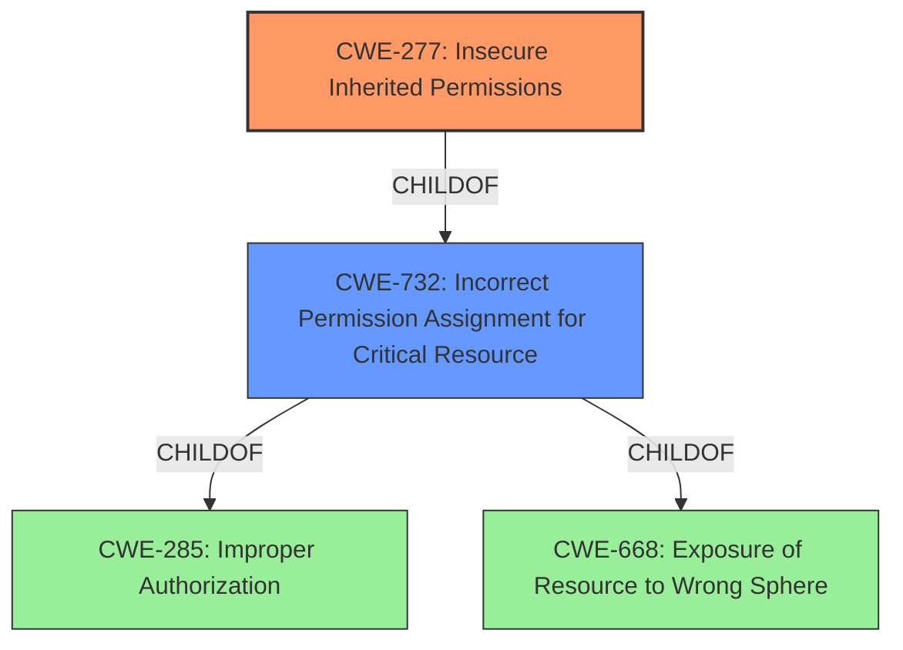

# Analysis for CVE-2020-1701

# Summary
| CWE ID    | CWE Name                                                     | Confidence | CWE Abstraction Level | CWE Vulnerability Mapping Label | CWE-Vulnerability Mapping Notes |
| --------- | ------------------------------------------------------------ | ---------- | --------------------- | ------------------------------- | ----------------------------- |
| CWE-277   | Insecure Inherited Permissions                               | 0.9        | Variant               | Allowed                         | Primary CWE                   |
| CWE-732   | Incorrect Permission Assignment for Critical Resource        | 0.7        | Class                 | Allowed-with-Review             | Secondary Candidate           |

## Evidence and Confidence

*   **Confidence Score:** 0.8
*   **Evidence Strength:** HIGH

## Relationship Analysis
The primary CWE is CWE-277 which is a Variant of CWE-732. Since there was an **incorrect permission assignment** which was then **inherited** the CWE-277 is the better choice.

## Vulnerability Chain
The **root cause** is the **insufficient access control** due to **overly permissive cluster role access** granted to the `virt-handler` component. This allows an attacker with the ability to create VMs to attach and read any secret within their namespace, leading to **secret disclosure**.

## Summary of Analysis
The initial assessment identified several candidate CWEs. However, after a thorough review of the vulnerability description, CVE details, and CWE specifications, the most accurate mapping is CWE-277 (Insecure Inherited Permissions).

The primary evidence supporting this decision is the **insufficient access control** due to **overly permissive cluster role access** granted to the `virt-handler` component, as stated in the "CVE Reference Links Content Summary". This aligns with the description of CWE-277, where a product defines a set of **insecure permissions** that are **inherited** by objects that are created by the program. In this case, the virt-handler daemonset inherits overly permissive permissions, allowing it to access secrets within the same namespace as the virtual machines.

CWE-732 (Incorrect Permission Assignment for Critical Resource) was considered as a secondary candidate because it describes the **incorrect assignment of permissions** for a security-critical resource. While this is partially true, CWE-277 provides a more specific description of the vulnerability by highlighting the inheritance aspect of the **insecure permissions**.

The selected CWE is at the optimal level of specificity (Variant) because it accurately represents the root cause of the vulnerability, which is the inheritance of **insecure permissions** by the virt-handler daemonset.

Relevant CWE Information:

# Enhanced Context (25 CWEs)

## CWE-639: Authorization Bypass Through User-Controlled Key
**Abstraction Level**: Base
**Similarity Score**: 0.76
**Source**: dense

**Description**:
The system's authorization functionality does not prevent one user from gaining access to another user's data or record by modifying the key value identifying the data.

**Mapping Guidance**:
- Usage: Allowed
- Rationale: This CWE entry is at the Base level of abstraction, which is a preferred level of abstraction for mapping to the root causes of vulnerabilities.

## CWE-807: Reliance on Untrusted Inputs in a Security Decision
**Abstraction Level**: Base
**Similarity Score**: 0.75
**Source**: dense

**Description**:
The product uses a protection mechanism that relies on the existence or values of an input, but the input can be modified by an untrusted actor in a way that bypasses the protection mechanism.

**Mapping Guidance**:
- Usage: Allowed
- Rationale: This CWE entry is at the Base level of abstraction, which is a preferred level of abstraction for mapping to the root causes of vulnerabilities.

## CWE-212: Improper Removal of Sensitive Information Before Storage or Transfer
**Abstraction Level**: Base
**Similarity Score**: 0.75
**Source**: dense

**Description**:
The product stores, transfers, or shares a resource that contains sensitive information, but it does not properly remove that information before the product makes the resource available to unauthorized actors.

**Mapping Guidance**:
- Usage: Allowed
- Rationale: This CWE entry is at the Base level of abstraction, which is a preferred level of abstraction for mapping to the root causes of vulnerabilities.

## CWE-472: External Control of Assumed-Immutable Web Parameter
**Abstraction Level**: Base
**Similarity Score**: 0.75
**Source**: dense

**Description**:
The web application does not sufficiently verify inputs that are assumed to be immutable but are actually externally controllable, such as hidden form fields.

**Mapping Guidance**:
- Usage: Allowed
- Rationale: This CWE entry is at the Base level of abstraction, which is a preferred level of abstraction for mapping to the root causes of vulnerabilities.

## CWE-668: Exposure of Resource to Wrong Sphere
**Abstraction Level**: Class
**Similarity Score**: 0.75
**Source**: dense

**Description**:
The product exposes a resource to the wrong control sphere, providing unintended actors with inappropriate access to the resource.

**Mapping Guidance**:
- Usage: Discouraged
- Rationale: CWE-668 is high-level and is often misused as a catch-all when lower-level CWE IDs might be applicable. It is sometimes used for low-information vulnerability reports [REF-1287]. It is a level-1 Class (i.e., a child of a Pillar). It is not useful for trend analysis.

## CWE-319: Cleartext Transmission of Sensitive Information
**Abstraction Level**: Base
**Similarity Score**: 0.75
**Source**: dense

**Description**:
The product transmits sensitive or security-critical data in cleartext in a communication channel that can be sniffed by unauthorized actors.

**Mapping Guidance**:
- Usage: Allowed
- Rationale: This CWE entry is at the Base level of abstraction, which is a preferred level of abstraction for mapping to the root causes of vulnerabilities.

## CWE-1391: Use of Weak Credentials
**Abstraction Level**: Class
**Similarity Score**: 0.75
**Source**: dense

**Description**:
The product uses weak credentials (such as a default key or hard-coded password) that can be calculated, derived, reused, or guessed by an attacker.

**Mapping Guidance**:
- Usage: Allowed-with-Review
- Rationale: This CWE entry is a Class and might have Base-level children that would be more appropriate

## CWE-266: Incorrect Privilege Assignment
**Abstraction Level**: Base
**Similarity Score**: 0.75
**Source**: dense

**Description**:
A product incorrectly assigns a privilege to a particular actor, creating an unintended sphere of control for that actor.

**Mapping Guidance**:
- Usage: Allowed
- Rationale: This CWE entry is at the Base level of abstraction, which is a preferred level of abstraction for mapping to the root causes of vulnerabilities.

## CWE-267: Privilege Defined With Unsafe Actions
**Abstraction Level**: Base
**Similarity Score**: 0.75
**Source**: dense

**Description**:
A particular privilege, role, capability, or right can be used to perform unsafe actions that were not intended, even when it is assigned to the correct entity.

**Mapping Guidance**:
- Usage: Allowed
- Rationale: This CWE entry is at the Base level of abstraction, which is a preferred level of abstraction for mapping to the root causes of vulnerabilities.

## CWE-538: Insertion of Sensitive Information into Externally-Accessible File or Directory
**Abstraction Level**: Base
**Similarity Score**: 0.75
**Source**: dense

**Description**:
The product places sensitive information into files or directories that are accessible to actors who are allowed to have access to the files, but not to the sensitive information.

**Mapping Guidance**:
- Usage: Allowed
- Rationale: This CWE entry is at the Base level of abstraction, which is a preferred level of abstraction for mapping to the root causes of vulnerabilities.

## CWE-79: Improper Neutralization of Input During Web Page Generation ('Cross-site Scripting')
**Abstraction Level**: Base
**Similarity Score**: 6262.73
**Source**: sparse

**Description**:
The product does not neutralize or incorrectly neutralizes user-controllable input before it is placed in output that is used as a web page that is served to other users.

**Mapping

# Enhanced Query for CVE-2020-1701

## Vulnerability Description
A flaw was found in the KubeVirt main virt-handler versions before 0.26.0 regarding the access permissions of virt-handler. An attacker with access to create VMs could attach any secret within their namespace, allowing them to read the contents of that secret.

### Vulnerability Description Key Phrases
- **impact:** read the contents of that secret
- **vector:** create VMs
- **attacker:** attacker with access to create VMs
- **product:** KubeVirt main virt-handler
- **version:** before 0.26.0

## CVE Reference Links Content Summary
Based on the provided information, here's an analysis of CVE-2020-1701:

**Root Cause of Vulnerability:**
- The virt-handler daemonset in KubeVirt had overly permissive cluster role access.

**Weaknesses/Vulnerabilities Present:**
- **Insufficient Access Control:** The virt-handler daemonset's cluster roles allowed it to access secrets within the same namespace as the virtual machines. This was due to overly permissive permissions granted to the virt-handler component.

**Impact of Exploitation:**
- **Secret Disclosure:** An attacker with the ability to create virtual machines (VMs) could exploit this vulnerability to attach and read any secret within their namespace. This includes sensitive information such as passwords, API keys, and other credentials.
- **Potential for Lateral Movement or Privilege Escalation**: By gaining access to secrets, an attacker could potentially move laterally within the cluster or escalate their privileges depending on the nature and usage of the accessed secrets.

**Attack Vectors:**
- **VM Creation:** The attacker needs to have the ability to create VMs within the target namespace in order to exploit this vulnerability.
- **Attaching Secrets:** The vulnerability is exploited by attaching a secret to the created VM.

**Required Attacker Capabilities/Position:**
- **Namespace Access:** The attacker needs to have permissions to create VMs within a specific namespace.
- **Basic Kubernetes Knowledge:** Basic understanding of how Kubernetes secrets and VMs work is required.

**Additional Notes:**

* The bug report mentions a fix in `kubevirt 0.26.0`.
* The vulnerability was due to overly permissive cluster role access granted to the `virt-handler` component.
* The provided bug report and description provide more detail than the placeholder CVE description by specifying the affected component (virt-handler), the access control weakness and the impact of the vulnerability.

## Retriever Results

### Top Combined Results

| Rank | CWE ID | Name | Abstraction | Usage  | Retrievers | Individual Scores |
|------|--------|------|-------------|-------|------------|-------------------|
| 1 | 732 | Incorrect Permission Assignment for Critical Resource | Class | Allowed-with-Review | sparse | 0.093 |
| 2 | 863 | Incorrect Authorization | Class | Allowed-with-Review | sparse | 0.079 |
| 3 | 201 | Insertion of Sensitive Information Into Sent Data | Base | Allowed | sparse | 0.078 |
| 4 | 285 | Improper Authorization | Class | Discouraged | sparse | 0.078 |
| 5 | 923 | Improper Restriction of Communication Channel to Intended Endpoints | Class | Allowed-with-Review | sparse | 0.077 |
| 6 | 277 | Insecure Inherited Permissions | Variant | Allowed | dense | 0.509 |
| 7 | 322 | Key Exchange without Entity Authentication | Base | Allowed | graph | 0.003 |
| 8 | 79 | Improper Neutralization of Input During Web Page Generation ('Cross-site Scripting') | Base | Allowed | sparse | 0.077 |
| 9 | 256 | Plaintext Storage of a Password | Base | Allowed | sparse | 0.077 |
| 10 | 862 | Missing Authorization | Class | Allowed-with-Review | sparse | 0.075 |

# Complete CWE Specifications

## CWE-732: Incorrect Permission Assignment for Critical Resource
**Abstraction:** Class
**Status:** Draft

### Description
The product specifies permissions for a security-critical resource in a way that allows that resource to be read or modified by unintended actors.

### Extended Description
When a resource is given a permission setting that provides access to a wider range of actors than required, it could lead to the exposure of sensitive information, or the modification of that resource by unintended parties. This is especially dangerous when the resource is related to program configuration, execution, or sensitive user data. For example, consider a misconfigured storage account for the cloud that can be read or written by a public or anonymous user.

### Alternative Terms
None

### Relationships
ChildOf -> CWE-285
ChildOf -> CWE-668

### Mapping Guidance
**Usage:** Allowed-with-Review
**Rationale:** While the name itself indicates an assignment of permissions for resources, this is often misused for vulnerabilities in which "permissions" are not checked, which is an "authorization" weakness (CWE-285 or descendants) within CWE's model [REF-1287].
**Comments:** Closely analyze the specific mistake that is allowing the resource to be exposed, and perform a CWE mapping for that mistake.
**Reasons:**
- Frequent Misuse

### Additional Notes
**[Maintenance]** The relationships between privileges, permissions, and actors (e.g. users and groups) need further refinement within the Research view. One complication is that these concepts apply to two different pillars, related to control of resources (CWE-664) and protection mechanism failures (CWE-693).

### Observed Examples
- **CVE-2022-29527:** Go application for cloud management creates a world-writable sudoers file that allows local attackers to inject sudo rules and escalate privileges to root by winning a race condition.
- **CVE-2009-3482:** Anti-virus product sets insecure "Everyone: Full Control" permissions for files under the "Program Files" folder, allowing attackers to replace executables with Trojan horses.
- **CVE-2009-3897:** Product creates directories with 0777 permissions at installation, allowing users to gain privileges and access a socket used for authentication.

## CWE-863: Incorrect Authorization
**Abstraction:** Class
**Status:** Incomplete

### Description
The product performs an authorization check when an actor attempts to access a resource or perform an action, but it does not correctly perform the check.

### Extended Description
Not provided

### Alternative Terms
AuthZ: "AuthZ" is typically used as an abbreviation of "authorization" within the web application security community. It is distinct from "AuthN" (or, sometimes, "AuthC") which is an abbreviation of "authentication." The use of "Auth" as an abbreviation is discouraged, since it could be used for either authentication or authorization.

### Relationships
ChildOf -> CWE-285
ChildOf -> CWE-284

### Mapping Guidance
**Usage:** Allowed-with-Review
**Rationale:** This CWE entry is a Class and might have Base-level children that would be more appropriate
**Comments:** Examine children of this entry to see if there is a better fit
**Reasons:**
- Abstraction

### Additional Notes
**[Terminology]** 

Assuming a user with a given identity, authorization is the process of determining whether that user can access a given resource, based on the user's privileges and any permissions or other access-control specifications that apply to the resource.

### Observed Examples
- **CVE-2021-39155:** Chain: A microservice integration and management platform compares the hostname in the HTTP Host header in a case-sensitive way (CWE-178, CWE-1289), allowing bypass of the authorization policy (CWE-863) using a hostname with mixed case or other variations.
- **CVE-2019-15900:** Chain: sscanf() call is used to check if a username and group exists, but the return value of sscanf() call is not checked (CWE-252), causing an uninitialized variable to be checked (CWE-457), returning success to allow authorization bypass for executing a privileged (CWE-863).
- **CVE-2009-2213:** Gateway uses default "Allow" configuration for its authorization settings.

## CWE-201: Insertion of Sensitive Information Into Sent Data
**Abstraction:** Base
**Status:** Draft

### Description
The code transmits data to another actor, but a portion of the data includes sensitive information that should not be accessible to that actor.

### Extended Description
Not provided

### Alternative Terms
None

### Relationships
ChildOf -> CWE-200
CanAlsoBe -> CWE-209
CanAlsoBe -> CWE-202

### Mapping Guidance
**Usage:** Allowed
**Rationale:** This CWE entry is at the Base level of abstraction, which is a preferred level of abstraction for mapping to the root causes of vulnerabilities.
**Comments:** Carefully read both the name and description to ensure that this mapping is an appropriate fit. Do not try to 'force' a mapping to a lower-level Base/Variant simply to comply with this preferred level of abstraction.
**Reasons:**
- Acceptable-Use

### Additional Notes
**[Other]** Sensitive information could include data that is sensitive in and of itself (such as credentials or private messages), or otherwise useful in the further exploitation of the system (such as internal file system structure).

### Observed Examples
- **CVE-2022-0708:** Collaboration platform does not clear team emails in a response, allowing leak of email addresses

## CWE-285: Improper Authorization
**Abstraction:** Class
**Status:** Draft

### Description
The product does not perform or incorrectly performs an authorization check when an actor attempts to access a resource or perform an action.

### Extended Description

Assuming a user with a given identity, authorization is the process of determining whether that user can access a given resource, based on the user's privileges and any permissions or other access-control specifications that apply to the resource.

When access control checks are not applied consistently - or not at all - users are able to access data or perform actions that they should not be allowed to perform. This can lead to a wide range of problems, including information exposures, denial of service, and arbitrary code execution.

### Alternative Terms
AuthZ: "AuthZ" is typically used as an abbreviation of "authorization" within the web application security community. It is distinct from "AuthN" (or, sometimes, "AuthC") which is an abbreviation of "authentication." The use of "Auth" as an abbreviation is discouraged, since it could be used for either authentication or authorization.

### Relationships
ChildOf -> CWE-284
ChildOf -> CWE-284

### Mapping Guidance
**Usage:** Discouraged
**Rationale:** CWE-285 is high-level and lower-level CWEs can frequently be used instead. It is a level-1 Class (i.e., a child of a Pillar).
**Comments:** Look at CWE-285's children and consider mapping to CWEs such as CWE-862: Missing Authorization, CWE-863: Incorrect Authorization, CWE-732: Incorrect Permission Assignment for Critical Resource, or others.
**Reasons:**
- Abstraction
**Suggested Alternatives:**
- CWE-862: Missing Authorization
- CWE-863: Incorrect Authorization
- CWE-732: Incorrect Permission Assignment for Critical Resource

### Observed Examples
- **CVE-2022-24730:** Go-based continuous deployment product does not check that a user has certain privileges to update or create an app, allowing adversaries to read sensitive repository information
- **CVE-2009-3168:** Web application does not restrict access to admin scripts, allowing authenticated users to reset administrative passwords.
- **CVE-2009-2960:** Web application does not restrict access to admin scripts, allowing authenticated users to modify passwords of other users.

## CWE-923: Improper Restriction of Communication Channel to Intended Endpoints
**Abstraction:** Class
**Status:** Incomplete

### Description
The product establishes a communication channel to (or from) an endpoint for privileged or protected operations, but it does not properly ensure that it is communicating with the correct endpoint.

### Extended Description

Attackers might be able to spoof the intended endpoint from a different system or process, thus gaining the same level of access as the intended endpoint.

While this issue frequently involves authentication between network-based clients and servers, other types of communication channels and endpoints can have this weakness.

### Alternative Terms
None

### Relationships
ChildOf -> CWE-284

### Mapping Guidance
**Usage:** Allowed-with-Review
**Rationale:** This CWE entry is a Class and might have Base-level children that would be more appropriate
**Comments:** Examine children of this entry to see if there is a better fit
**Reasons:**
- Abstraction

### Observed Examples
- **CVE-2022-30319:** S-bus functionality in a home automation product performs access control using an IP allowlist, which can be bypassed by a forged IP address.
- **CVE-2022-22547:** A troubleshooting tool exposes a web server on a random port between 9000-65535 that could be used for information gathering
- **CVE-2022-4390:** A WAN interface on a router has firewall restrictions enabled for IPv4, but it does not for IPv6, which is enabled by default

## CWE-277: Insecure Inherited Permissions
**Abstraction:** Variant
**Status:** Draft

### Description
A product defines a set of insecure permissions that are inherited by objects that are created by the program.

### Extended Description
Not provided

### Alternative Terms
None

### Relationships
ChildOf -> CWE-732

### Mapping Guidance
**Usage:** Allowed
**Rationale:** This CWE entry is at the Variant level of abstraction, which is a preferred level of abstraction for mapping to the root causes of vulnerabilities.
**Comments:** Carefully read both the name and description to ensure that this mapping is an appropriate fit. Do not try to 'force' a mapping to a lower-level Base/Variant simply to comply with this preferred level of abstraction.
**Reasons:**
- Acceptable-Use

### Observed Examples
- **CVE-2005-1841:** User's umask is used when creating temp files.
- **CVE-2002-1786:** Insecure umask for core dumps [is the umask preserved or assigned?].

## CWE-322: Key Exchange without Entity Authentication
**Abstraction:** Base
**Status:** Draft

### Description
The product performs a key exchange with an actor without verifying the identity of that actor.

### Extended Description
Performing a key exchange will preserve the integrity of the information sent between two entities, but this will not guarantee that the entities are who they claim they are. This may enable an attacker to impersonate an actor by modifying traffic between the two entities. Typically, this involves a victim client that contacts a malicious server that is impersonating a trusted server. If the client skips authentication or ignores an authentication failure, the malicious server may request authentication information from the user. The malicious server can then use this authentication information to log in to the trusted server using the victim's credentials, sniff traffic between the victim and trusted server, etc.

### Alternative Terms
None

### Relationships
ChildOf -> CWE-306
CanPrecede -> CWE-923
PeerOf -> CWE-295

### Mapping Guidance
**Usage:** Allowed
**Rationale:** This CWE entry is at the Base level of abstraction, which is a preferred level of abstraction for mapping to the root causes of vulnerabilities.
**Comments:** Carefully read both the name and description to ensure that this mapping is an appropriate fit. Do not try to 'force' a mapping to a lower-level Base/Variant simply to comply with this preferred level of abstraction.
**Reasons:**
- Acceptable-Use

## CWE-79: Improper Neutralization of Input During Web Page Generation ('Cross-site Scripting')
**Abstraction:** Base
**Status:** Stable

### Description
The product does not neutralize or incorrectly neutralizes user-controllable input before it is placed in output that is used as a web page that is served to other users.

### Extended Description

Cross-site scripting (XSS) vulnerabilities occur when:

  1. Untrusted data enters a web application, typically from a web request.

  1. The web application dynamically generates a web page that contains this untrusted data.

  1. During page generation, the application does not prevent the data from containing content that is executable by a web browser, such as JavaScript, HTML tags, HTML attributes, mouse events, Flash, ActiveX, etc.

  1. A victim visits the generated web page through a web browser, which contains malicious script that was injected using the untrusted data.

  1. Since the script comes from a web page that was sent by the web server, the victim's web browser executes the malicious script in the context of the web server's domain.

  1. This effectively violates the intention of the web browser's same-origin policy, which states that scripts in one domain should not be able to access resources or run code in a different domain.

There are three main kinds of XSS:

  -  **Type 1: Reflected XSS (or Non-Persistent)**  - The server reads data directly from the HTTP request and reflects it back in the HTTP response. Reflected XSS exploits occur when an attacker causes a victim to supply dangerous content to a vulnerable web application, which is then reflected back to the victim and executed by the web browser. The most common mechanism for delivering malicious content is to include it as a parameter in a URL that is posted publicly or e-mailed directly to the victim. URLs constructed in this manner constitute the core of many phishing schemes, whereby an attacker convinces a victim to visit a URL that refers to a vulnerable site. After the site reflects the attacker's content back to the victim, the content is executed by the victim's browser.

  -  **Type 2: Stored XSS (or Persistent)**  - The application stores dangerous data in a database, message forum, visitor log, or other trusted data store. At a later time, the dangerous data is subsequently read back into the application and included in dynamic content. From an attacker's perspective, the optimal place to inject malicious content is in an area that is displayed to either many users or particularly interesting users. Interesting users typically have elevated privileges in the application or interact with sensitive data that is valuable to the attacker. If one of these users executes malicious content, the attacker may be able to perform privileged operations on behalf of the user or gain access to sensitive data belonging to the user. For example, the attacker might inject XSS into a log message, which might not be handled properly when an administrator views the logs. 

  -  **Type 0: DOM-Based XSS**  - In DOM-based XSS, the client performs the injection of XSS into the page; in the other types, the server performs the injection. DOM-based XSS generally involves server-controlled, trusted script that is sent to the client, such as Javascript that performs sanity checks on a form before the user submits it. If the server-supplied script processes user-supplied data and then injects it back into the web page (such as with dynamic HTML), then DOM-based XSS is possible. 

Once the malicious script is injected, the attacker can perform a variety of malicious activities. The attacker could transfer private information, such as cookies that may include session information, from the victim's machine to the attacker. The attacker could send malicious requests to a web site on behalf of the victim, which could be especially dangerous to the site if the victim has administrator privileges to manage that site. Phishing attacks could be used to emulate trusted web sites and trick the victim into entering a password, allowing the attacker to compromise the victim's account on that web site. Finally, the script could exploit a vulnerability in the web browser itself possibly taking over the victim's machine, sometimes referred to as "drive-by hacking."

In many cases, the attack can be launched without the victim even being aware of it. Even with careful users, attackers frequently use a variety of methods to encode the malicious portion of the attack, such as URL encoding or Unicode, so the request looks less suspicious.

### Alternative Terms
XSS: A common abbreviation for Cross-Site Scripting.
HTML Injection: Used as a synonym of stored (Type 2) XSS.
CSS: In the early years after initial discovery of XSS, "CSS" was a commonly-used acronym. However, this would cause confusion with "Cascading Style Sheets," so usage of this acronym has declined significantly.

### Relationships
ChildOf -> CWE-74
ChildOf -> CWE-74
CanPrecede -> CWE-494
PeerOf -> CWE-352

### Mapping Guidance
**Usage:** Allowed
**Rationale:** This CWE entry is at the Base level of abstraction, which is a preferred level of abstraction for mapping to the root causes of vulnerabilities.
**Comments:** Carefully read both the name and description to ensure that this mapping is an appropriate fit. Do not try to 'force' a mapping to a lower-level Base/Variant simply to comply with this preferred level of abstraction.
**Reasons:**
- Acceptable-Use

### Additional Notes
**[Relationship]** 

There can be a close relationship between XSS and CSRF (CWE-352). An attacker might use CSRF in order to trick the victim into submitting requests to the server in which the requests contain an XSS payload. A well-known example of this was the Samy worm on MySpace [REF-956]. The worm used XSS to insert malicious HTML sequences into a user's profile and add the attacker as a MySpace friend. MySpace friends of that victim would then execute the payload to modify their own profiles, causing the worm to propagate exponentially. Since the victims did not intentionally insert the malicious script themselves, CSRF was a root cause.

**[Applicable Platform]** 

XSS flaws are very common in web applications, since they require a great deal of developer discipline to avoid them.

### Observed Examples
- **CVE-2021-25926:** Python Library Manager did not sufficiently neutralize a user-supplied search term, allowing reflected XSS.
- **CVE-2021-25963:** Python-based e-commerce platform did not escape returned content on error pages, allowing for reflected Cross-Site Scripting attacks.
- **CVE-2021-1879:** Universal XSS in mobile operating system, as exploited in the wild per CISA KEV.

## CWE-256: Plaintext Storage of a Password
**Abstraction:** Base
**Status:** Incomplete

### Description
Storing a password in plaintext may result in a system compromise.

### Extended Description
Password management issues occur when a password is stored in plaintext in an application's properties, configuration file, or memory. Storing a plaintext password in a configuration file allows anyone who can read the file access to the password-protected resource. In some contexts, even storage of a plaintext password in memory is considered a security risk if the password is not cleared immediately after it is used.

### Alternative Terms
None

### Relationships
ChildOf -> CWE-522

### Mapping Guidance
**Usage:** Allowed
**Rationale:** This CWE entry is at the Base level of abstraction, which is a preferred level of abstraction for mapping to the root causes of vulnerabilities.
**Comments:** Carefully read both the name and description to ensure that this mapping is an appropriate fit. Do not try to 'force' a mapping to a lower-level Base/Variant simply to comply with this preferred level of abstraction.
**Reasons:**
- Acceptable-Use

### Observed Examples
- **CVE-2022-30275:** Remote Terminal Unit (RTU) uses a driver that relies on a password stored in plaintext.

## CWE-862: Missing Authorization
**Abstraction:** Class
**Status:** Incomplete

### Description
The product does not perform an authorization check when an actor attempts to access a resource or perform an action.

### Extended Description
Not provided

### Alternative Terms
AuthZ: "AuthZ" is typically used as an abbreviation of "authorization" within the web application security community. It is distinct from "AuthN" (or, sometimes, "AuthC") which is an abbreviation of "authentication." The use of "Auth" as an abbreviation is discouraged, since it could be used for either authentication or authorization.

### Relationships
ChildOf -> CWE-285
ChildOf -> CWE-284

### Mapping Guidance
**Usage:** Allowed-with-Review
**Rationale:** This CWE entry is a Class and might have Base-level children that would be more appropriate
**Comments:** Examine children of this entry to see if there is a better fit
**Reasons:**
- Abstraction

### Additional Notes
**[Terminology]** Assuming a user with a given identity, authorization is the process of determining whether that user can access a given resource, based on the user's privileges and any permissions or other access-control specifications that apply to the resource.

### Observed Examples
- **CVE-2022-24730:** Go-based continuous deployment product does not check that a user has certain privileges to update or create an app, allowing adversaries to read sensitive repository information
- **CVE-2009-3168:** Web application does not restrict access to admin scripts, allowing authenticated users to reset administrative passwords.
- **CVE-2009-3597:** Web application stores database file under the web root with insufficient access control (CWE-219), allowing direct request.

