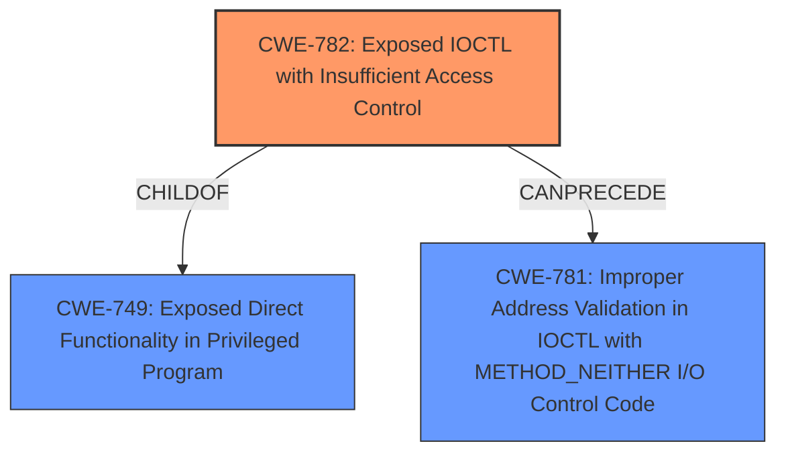

# Analysis for CVE-2020-17087

# Summary
| CWE ID | CWE Name | Confidence | CWE Abstraction Level | CWE Vulnerability Mapping Label | CWE-Vulnerability Mapping Notes |
|---|---|---|---|---|---|
| CWE-782 | Exposed IOCTL with Insufficient Access Control | 0.7 | Variant | Allowed | Primary CWE |

## Evidence and Confidence

*   **Confidence Score:** 0.7
*   **Evidence Strength:** LOW

## Relationship Analysis
The primary CWE selected, CWE-782, is a Variant of CWE-749, indicating a more specific case of a broader weakness. The vulnerability involves an exposed IOCTL without proper access control, aligning with the description of CWE-782. There is a CanPrecede relationship to CWE-781, Improper Address Validation in IOCTL with METHOD_NEITHER I/O Control Code which could be present.

## Vulnerability Chain
The chain starts with the **improper access control** on an exposed IOCTL (CWE-782), potentially leading to other vulnerabilities if the IOCTL's functionality is misused or if input validation is lacking.

## Summary of Analysis
The analysis is based on the limited evidence provided in the vulnerability description. The key phrase "Local Elevation of Privilege" and the product "Windows Kernel" suggest a potential vulnerability related to privilege management within the kernel.

The retriever results indicate CWE-782 as a high-scoring candidate due to the "Exposed IOCTL with Insufficient Access Control". The description of CWE-782 aligns with the concept of an IOCTL being exposed without proper access control, which could lead to elevation of privilege.

The other CWEs considered were:
*   CWE-59: Improper Link Resolution Before File Access ('Link Following') - While file access is a component of many vulnerabilities, there is no mention of symlinks or link resolution.
*   CWE-123: Write-what-where Condition - While the impact could be this, there is no root cause related to writing to an arbitrary location
*   CWE-1285: Improper Validation of Specified Index, Position, or Offset in Input - While input validation could be an issue if the IOCTL is exposed, the root cause is the exposure itself.
*   CWE-362: Concurrent Execution using Shared Resource with Improper Synchronization ('Race Condition') - There is no mention of concurrency.
*   CWE-1386: Insecure Operation on Windows Junction / Mount Point - Similar to CWE-59, there is no mention of junctions or mount points.
*   CWE-364: Signal Handler Race Condition - There is no mention of signal handlers.
*   CWE-367: Time-of-check Time-of-use (TOCTOU) Race Condition - There is no mention of time-of-check time-of-use issues.
*   CWE-667: Improper Locking - There is no mention of locking.
*   CWE-266: Incorrect Privilege Assignment - While this is a high level description of the impact, the root cause is likely the exposed IOCTL.

CWE-782 is selected as the primary CWE because it directly addresses the **lack of access control** on an exposed IOCTL, which is a plausible root cause for a local elevation of privilege vulnerability in the Windows Kernel. The weakness is at the Variant level of specificity.