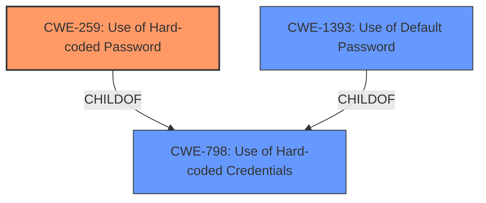

# Analysis for CVE-2020-1716

# Summary
| CWE ID | CWE Name | Confidence | CWE Abstraction Level | CWE Vulnerability Mapping Label | CWE-Vulnerability Mapping Notes |
|---|---|---|---|---|---|
| CWE-259 | Use of Hard-coded Password | 1.0 | Variant | Allowed | Primary CWE. The product contains a **hard-coded password**, which it uses for its own inbound authentication or for outbound communication to external components. |
| CWE-798 | Use of Hard-coded Credentials | 0.7 | Base | Allowed | Secondary CWE. The product contains **hard-coded credentials**, such as a password or cryptographic key. |
| CWE-1393 | Use of Default Password | 0.6 | Base | Allowed | Secondary CWE. The product uses **default passwords** for potentially critical functionality. |

## Evidence and Confidence

*   **Confidence Score:** 0.9
*   **Evidence Strength:** HIGH

## Relationship Analysis
The primary CWE is CWE-259, a variant of CWE-798. CWE-798 is a more general base CWE that describes the use of **hard-coded credentials**, while CWE-259 specifically refers to **hard-coded passwords**. CWE-1393 (Use of Default Password) is also relevant as the **hard-coded passwords** are being used as default passwords.

## Vulnerability Chain
The vulnerability chain starts with the **hardcoded passwords** in the `ceph-ansible` playbook, which leads to the ability for an authenticated attacker to brute-force Ceph deployments. This, in turn, grants the attacker administrator access to Ceph clusters, allowing them to read, write, and delete Ceph clusters and modify Ceph cluster configurations.

## Summary of Analysis
The primary weakness is the use of **hard-coded passwords** in the `ceph-ansible` playbook. This directly matches CWE-259 (Use of Hard-coded Password), which is a variant-level CWE and is therefore more specific than its parent, CWE-798 (Use of Hard-coded Credentials). The vulnerability description states "A flaw was found in the ceph-ansible playbook where it contained **hardcoded passwords** that were being used as default passwords while deploying Ceph services." The CVE Reference Links Content Summary also mentions that the root cause of the vulnerability is that "The `ceph-ansible` playbook contained hardcoded default passwords within the `roles/ceph-defaults/defaults/main.yml` file" and that "**Hardcoded Credentials:** The presence of hardcoded passwords constitutes a significant security vulnerability."

I considered CWE-1393 (Use of Default Password) because the **hardcoded passwords** are being used as default passwords. However, the core issue is the hardcoding itself, so CWE-259 is the more direct representation.

Other CWEs considered but not used:

*   CWE-532 (Insertion of Sensitive Information into Log File), CWE-93 (Improper Neutralization of CRLF Sequences ('CRLF Injection')), CWE-522 (Insufficiently Protected Credentials), CWE-117 (Improper Output Neutralization for Logs), CWE-306 (Missing Authentication for Critical Function), and CWE-201 (Insertion of Sensitive Information Into Sent Data): These CWEs do not directly relate to the root cause of the vulnerability, which is the presence of **hard-coded passwords**. They represent different types of weaknesses.

Relevant CWE Information:

# Enhanced Context (25 CWEs)

## CWE-538: Insertion of Sensitive Information into Externally-Accessible File or Directory
**Abstraction Level**: Base
**Similarity Score**: 0.78
**Source**: dense

**Description**:
The product places sensitive information into files or directories that are accessible to actors who are allowed to have access to the files, but not to the sensitive information.

**Mapping Guidance**:
- Usage: Allowed
- Rationale: This CWE entry is at the Base level of abstraction, which is a preferred level of abstraction for mapping to the root causes of vulnerabilities.

## CWE-798: Use of Hard-coded Credentials
**Abstraction Level**: Base
**Similarity Score**: 0.77
**Source**: dense

**Description**:
The product contains **hard-coded credentials**, such as a password or cryptographic key.

**Mapping Guidance**:
- Usage: Allowed
- Rationale: This CWE entry is at the Base level of abstraction, which is a preferred level of abstraction for mapping to the root causes of vulnerabilities.

## CWE-312: Cleartext Storage of Sensitive Information
**Abstraction Level**: Base
**Similarity Score**: 0.77
**Source**: dense

**Description**:
The product stores sensitive information in cleartext within a resource that might be accessible to another control sphere.

**Mapping Guidance**:
- Usage: Allowed
- Rationale: This CWE entry is at the Base level of abstraction, which is a preferred level of abstraction for mapping to the root causes of vulnerabilities.

## CWE-1391: Use of Weak Credentials
**Abstraction Level**: Class
**Similarity Score**: 0.77
**Source**: dense

**Description**:
The product uses weak credentials (such as a default key or **hard-coded password**) that can be calculated, derived, reused, or guessed by an attacker.

**Mapping Guidance**:
- Usage: Allowed-with-Review
- Rationale: This CWE entry is a Class and might have Base-level children that would be more appropriate

## CWE-212: Improper Removal of Sensitive Information Before Storage or Transfer
**Abstraction Level**: Base
**Similarity Score**: 0.76
**Source**: dense

**Description**:
The product stores, transfers, or shares a resource that contains sensitive information, but it does not properly remove that information before the product makes the resource available to unauthorized actors.

**Mapping Guidance**:
- Usage: Allowed
- Rationale: This CWE entry is at the Base level of abstraction, which is a preferred level of abstraction for mapping to the root causes of vulnerabilities.

## CWE-807: Reliance on Untrusted Inputs in a Security Decision
**Abstraction Level**: Base
**Similarity Score**: 0.76
**Source**: dense

**Description**:
The product uses a protection mechanism that relies on the existence or values of an input, but the input can be modified by an untrusted actor in a way that bypasses the protection mechanism.

**Mapping Guidance**:
- Usage: Allowed
- Rationale: This CWE entry is at the Base level of abstraction, which is a preferred level of abstraction for mapping to the root causes of vulnerabilities.

## CWE-668: Exposure of Resource to Wrong Sphere
**Abstraction Level**: Class
**Similarity Score**: 0.75
**Source**: dense

**Description**:
The product exposes a resource to the wrong control sphere, providing unintended actors with inappropriate access to the resource.

**Mapping Guidance**:
- Usage: Discouraged
- Rationale: CWE-668 is high-level and is often misused as a catch-all when lower-level CWE IDs might be applicable. It is sometimes used for low-information vulnerability reports [REF-1287]. It is a level-1 Class (i.e., a child of a Pillar). It is not useful for trend analysis.

## CWE-497: Exposure of Sensitive System Information to an Unauthorized Control Sphere
**Abstraction Level**: Base
**Similarity Score**: 0.75
**Source**: dense

**Description**:
The product does not properly prevent sensitive system-level information from being accessed by unauthorized actors who do not have the same level of access to the underlying system as the product does.

**Mapping Guidance**:
- Usage: Allowed
- Rationale: This CWE entry is at the Base level of abstraction, which is a preferred level of abstraction for mapping to the root causes of vulnerabilities.

## CWE-319: Cleartext Transmission of Sensitive Information
**Abstraction Level**: Base
**Similarity Score**: 0.75
**Source**: dense

**Description**:
The product transmits sensitive or security-critical data in cleartext in a communication channel that can be sniffed by unauthorized actors.

**Mapping Guidance**:
- Usage: Allowed
- Rationale: This CWE entry is at the Base level of abstraction, which is a preferred level of abstraction for mapping to the root causes of vulnerabilities.

## CWE-74: Improper Neutralization of Special Elements in Output Used by a Downstream Component ('Injection')
**Abstraction Level**: Class
**Similarity Score**: 0.75
**Source**: dense

**Description**:
The product constructs all or part of a command, data structure, or record using externally-influenced input from an upstream component,