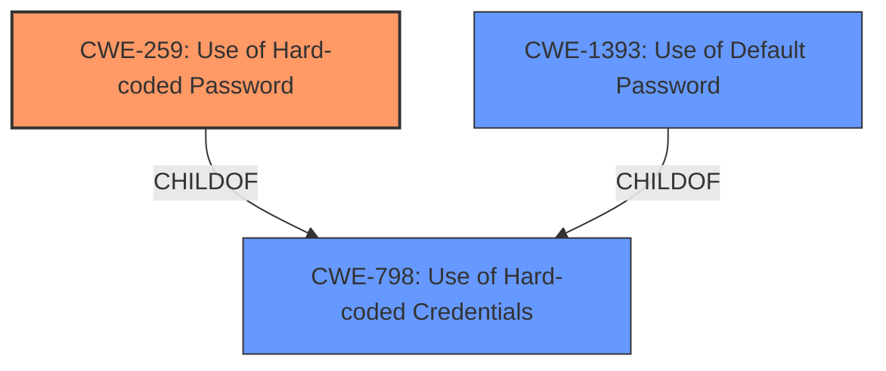

# Analysis for CVE-2020-1716

# Summary
| CWE ID | CWE Name | Confidence | CWE Abstraction Level | CWE Vulnerability Mapping Label | CWE-Vulnerability Mapping Notes |
|---|---|---|---|---|---|
| CWE-259 | Use of Hard-coded Password | 1.0 | Variant | Allowed | Primary CWE. The product contains a **hard-coded password**, which it uses for its own inbound authentication or for outbound communication to external components. |
| CWE-798 | Use of Hard-coded Credentials | 0.7 | Base | Allowed | Secondary CWE. The product contains **hard-coded credentials**, such as a password or cryptographic key. |
| CWE-1393 | Use of Default Password | 0.6 | Base | Allowed | Secondary CWE. The product uses **default passwords** for potentially critical functionality. |

## Evidence and Confidence

*   **Confidence Score:** 0.9
*   **Evidence Strength:** HIGH

## Relationship Analysis
The primary CWE is CWE-259, a variant of CWE-798. CWE-798 is a more general base CWE that describes the use of **hard-coded credentials**, while CWE-259 specifically refers to **hard-coded passwords**. CWE-1393 (Use of Default Password) is also relevant as the **hard-coded passwords** are being used as default passwords.



## Vulnerability Chain
The vulnerability chain starts with the **hardcoded passwords** in the `ceph-ansible` playbook, which leads to the ability for an authenticated attacker to brute-force Ceph deployments. This, in turn, grants the attacker administrator access to Ceph clusters, allowing them to read, write, and delete Ceph clusters and modify Ceph cluster configurations.

## Summary of Analysis
The primary weakness is the use of **hard-coded passwords** in the `ceph-ansible` playbook. This directly matches CWE-259 (Use of Hard-coded Password), which is a variant-level CWE and is therefore more specific than its parent, CWE-798 (Use of Hard-coded Credentials). The vulnerability description states "A flaw was found in the ceph-ansible playbook where it contained **hardcoded passwords** that were being used as default passwords while deploying Ceph services." The CVE Reference Links Content Summary also mentions that the root cause of the vulnerability is that "The `ceph-ansible` playbook contained hardcoded default passwords within the `roles/ceph-defaults/defaults/main.yml` file" and that "**Hardcoded Credentials:** The presence of hardcoded passwords constitutes a significant security vulnerability."

I considered CWE-1393 (Use of Default Password) because the **hardcoded passwords** are being used as default passwords. However, the core issue is the hardcoding itself, so CWE-259 is the more direct representation.

Other CWEs considered but not used:

*   CWE-532 (Insertion of Sensitive Information into Log File), CWE-93 (Improper Neutralization of CRLF Sequences ('CRLF Injection')), CWE-522 (Insufficiently Protected Credentials), CWE-117 (Improper Output Neutralization for Logs), CWE-306 (Missing Authentication for Critical Function), and CWE-201 (Insertion of Sensitive Information Into Sent Data): These CWEs do not directly relate to the root cause of the vulnerability, which is the presence of **hard-coded passwords**. They represent different types of weaknesses.

Relevant CWE Information:

# Enhanced Context (25 CWEs)

## CWE-538: Insertion of Sensitive Information into Externally-Accessible File or Directory
**Abstraction Level**: Base
**Similarity Score**: 0.78
**Source**: dense

**Description**:
The product places sensitive information into files or directories that are accessible to actors who are allowed to have access to the files, but not to the sensitive information.

**Mapping Guidance**:
- Usage: Allowed
- Rationale: This CWE entry is at the Base level of abstraction, which is a preferred level of abstraction for mapping to the root causes of vulnerabilities.

## CWE-798: Use of Hard-coded Credentials
**Abstraction Level**: Base
**Similarity Score**: 0.77
**Source**: dense

**Description**:
The product contains **hard-coded credentials**, such as a password or cryptographic key.

**Mapping Guidance**:
- Usage: Allowed
- Rationale: This CWE entry is at the Base level of abstraction, which is a preferred level of abstraction for mapping to the root causes of vulnerabilities.

## CWE-312: Cleartext Storage of Sensitive Information
**Abstraction Level**: Base
**Similarity Score**: 0.77
**Source**: dense

**Description**:
The product stores sensitive information in cleartext within a resource that might be accessible to another control sphere.

**Mapping Guidance**:
- Usage: Allowed
- Rationale: This CWE entry is at the Base level of abstraction, which is a preferred level of abstraction for mapping to the root causes of vulnerabilities.

## CWE-1391: Use of Weak Credentials
**Abstraction Level**: Class
**Similarity Score**: 0.77
**Source**: dense

**Description**:
The product uses weak credentials (such as a default key or **hard-coded password**) that can be calculated, derived, reused, or guessed by an attacker.

**Mapping Guidance**:
- Usage: Allowed-with-Review
- Rationale: This CWE entry is a Class and might have Base-level children that would be more appropriate

## CWE-212: Improper Removal of Sensitive Information Before Storage or Transfer
**Abstraction Level**: Base
**Similarity Score**: 0.76
**Source**: dense

**Description**:
The product stores, transfers, or shares a resource that contains sensitive information, but it does not properly remove that information before the product makes the resource available to unauthorized actors.

**Mapping Guidance**:
- Usage: Allowed
- Rationale: This CWE entry is at the Base level of abstraction, which is a preferred level of abstraction for mapping to the root causes of vulnerabilities.

## CWE-807: Reliance on Untrusted Inputs in a Security Decision
**Abstraction Level**: Base
**Similarity Score**: 0.76
**Source**: dense

**Description**:
The product uses a protection mechanism that relies on the existence or values of an input, but the input can be modified by an untrusted actor in a way that bypasses the protection mechanism.

**Mapping Guidance**:
- Usage: Allowed
- Rationale: This CWE entry is at the Base level of abstraction, which is a preferred level of abstraction for mapping to the root causes of vulnerabilities.

## CWE-668: Exposure of Resource to Wrong Sphere
**Abstraction Level**: Class
**Similarity Score**: 0.75
**Source**: dense

**Description**:
The product exposes a resource to the wrong control sphere, providing unintended actors with inappropriate access to the resource.

**Mapping Guidance**:
- Usage: Discouraged
- Rationale: CWE-668 is high-level and is often misused as a catch-all when lower-level CWE IDs might be applicable. It is sometimes used for low-information vulnerability reports [REF-1287]. It is a level-1 Class (i.e., a child of a Pillar). It is not useful for trend analysis.

## CWE-497: Exposure of Sensitive System Information to an Unauthorized Control Sphere
**Abstraction Level**: Base
**Similarity Score**: 0.75
**Source**: dense

**Description**:
The product does not properly prevent sensitive system-level information from being accessed by unauthorized actors who do not have the same level of access to the underlying system as the product does.

**Mapping Guidance**:
- Usage: Allowed
- Rationale: This CWE entry is at the Base level of abstraction, which is a preferred level of abstraction for mapping to the root causes of vulnerabilities.

## CWE-319: Cleartext Transmission of Sensitive Information
**Abstraction Level**: Base
**Similarity Score**: 0.75
**Source**: dense

**Description**:
The product transmits sensitive or security-critical data in cleartext in a communication channel that can be sniffed by unauthorized actors.

**Mapping Guidance**:
- Usage: Allowed
- Rationale: This CWE entry is at the Base level of abstraction, which is a preferred level of abstraction for mapping to the root causes of vulnerabilities.

## CWE-74: Improper Neutralization of Special Elements in Output Used by a Downstream Component ('Injection')
**Abstraction Level**: Class
**Similarity Score**: 0.75
**Source**: dense

**Description**:
The product constructs all or part of a command, data structure, or record using externally-influenced input from an upstream component,

# Enhanced Query for CVE-2020-1716

## Vulnerability Description
A flaw was found in the ceph-ansible playbook where it contained **hardcoded passwords** that were being used as default passwords while deploying Ceph services. Any authenticated attacker can abuse this flaw to brute-force Ceph deployments, and gain administrator access to Ceph clusters via the Ceph dashboard to initiate read, write, and delete Ceph clusters and also modify Ceph cluster configurations. Versions before ceph-ansible 6.0.0alpha1 are affected.

### Vulnerability Description Key Phrases
- **rootcause:** **hardcoded passwords**
- **impact:** brute-force Ceph deployments and gain administrator access to Ceph clusters
- **attacker:** authenticated attacker
- **product:** ceph-ansible
- **version:** before 6.0.0alpha1

## CVE Reference Links Content Summary
Based on the provided information, here's a breakdown of the vulnerability:

**CVE ID:** CVE-2020-1716

**Root Cause of Vulnerability:**
- The `ceph-ansible` playbook contained hardcoded default passwords within the `roles/ceph-defaults/defaults/main.yml` file.

**Weaknesses/Vulnerabilities Present:**
- **Hardcoded Credentials:** The presence of hardcoded passwords constitutes a significant security vulnerability.

**Impact of Exploitation:**
- An attacker could exploit the hardcoded credentials to brute-force Ceph deployments.
- Successful exploitation grants administrator access to Ceph clusters via the Ceph dashboard.
- With admin access, an attacker could initiate read, write, and delete operations on Ceph clusters, as well as modify cluster configurations.

**Attack Vectors:**
- The attack vector involves an authenticated attacker leveraging the hardcoded passwords within the `ceph-ansible` playbook to gain unauthorized access.

**Required Attacker Capabilities/Position:**
- The attacker must be able to authenticate to the Ceph deployment which was setup using the vulnerable playbook or have access to the playbook and then use the hardcoded credentials.

**Additional Details:**
- The vulnerability was located in `roles/ceph-defaults/defaults/main.yml`, specifically around lines 701 and 711 of the referenced file in the `ceph-ansible` repository.
- The issue was fixed in `ceph-ansible` version 6.0.0alpha1.
- Mitigation steps involve changing and using strong passwords in the `ceph-ansible` playbook.
- Red Hat addressed this issue in Red Hat Ceph Storage 4.1 via RHSA-2020:2231.

## Retriever Results

### Top Combined Results

| Rank | CWE ID | Name | Abstraction | Usage  | Retrievers | Individual Scores |
|------|--------|------|-------------|-------|------------|-------------------|
| 1 | 259 | Use of Hard-coded Password | Variant | Allowed | sparse | 0.730 |
| 2 | 1391 | Use of Weak Credentials | Class | Allowed-with-Review | sparse | 0.444 |
| 3 | 532 | Insertion of Sensitive Information into Log File | Base | Allowed | sparse | 0.378 |
| 4 | 93 | Improper Neutralization of CRLF Sequences ('CRLF Injection') | Base | Allowed | sparse | 0.378 |
| 5 | 522 | Insufficiently Protected Credentials | Class | Allowed-with-Review | sparse | 0.367 |
| 6 | 1393 | Use of Default Password | Base | Allowed | dense | 0.574 |
| 7 | 117 | Improper Output Neutralization for Logs | Base | Allowed | graph | 0.002 |
| 8 | 798 | Use of Hard-coded Credentials | Base | Allowed | sparse | 0.350 |
| 9 | 306 | Missing Authentication for Critical Function | Base | Allowed | sparse | 0.350 |
| 10 | 201 | Insertion of Sensitive Information Into Sent Data | Base | Allowed | sparse | 0.348 |


# Complete CWE Specifications


## CWE-259: Use of Hard-coded Password
**Abstraction:** Variant
**Status:** Draft

### Description
The product contains a hard-coded password, which it uses for its own inbound authentication or for outbound communication to external components.

### Extended Description


A hard-coded password typically leads to a significant authentication failure that can be difficult for the system administrator to detect. Once detected, it can be difficult to fix, so the administrator may be forced into disabling the product entirely. There are two main variations:

```
		Inbound: the product contains an authentication mechanism that checks for a hard-coded password.
		Outbound: the product connects to another system or component, and it contains hard-coded password for connecting to that component.
```
In the Inbound variant, a default administration account is created, and a simple password is hard-coded into the product and associated with that account. This hard-coded password is the same for each installation of the product, and it usually cannot be changed or disabled by system administrators without manually modifying the program, or otherwise patching the product. If the password is ever discovered or published (a common occurrence on the Internet), then anybody with knowledge of this password can access the product. Finally, since all installations of the product will have the same password, even across different organizations, this enables massive attacks such as worms to take place.

The Outbound variant applies to front-end systems that authenticate with a back-end service. The back-end service may require a fixed password which can be easily discovered. The programmer may simply hard-code those back-end credentials into the front-end product. Any user of that program may be able to extract the password. Client-side systems with hard-coded passwords pose even more of a threat, since the extraction of a password from a binary is usually very simple.


### Alternative Terms
None

### Relationships
ChildOf -> CWE-798
ChildOf -> CWE-798
ChildOf -> CWE-798
PeerOf -> CWE-321
PeerOf -> CWE-257

### Mapping Guidance
**Usage:** Allowed
**Rationale:** This CWE entry is at the Variant level of abstraction, which is a preferred level of abstraction for mapping to the root causes of vulnerabilities.
**Comments:** Carefully read both the name and description to ensure that this mapping is an appropriate fit. Do not try to 'force' a mapping to a lower-level Base/Variant simply to comply with this preferred level of abstraction.
**Reasons:**
- Acceptable-Use


### Additional Notes
**[Maintenance]** This entry could be split into multiple variants: an inbound variant (as seen in the second demonstrative example) and an outbound variant (as seen in the first demonstrative example). These variants are likely to have different consequences, detectability, etc. More importantly, from a vulnerability theory perspective, they could be characterized as different behaviors.


### Observed Examples
- **CVE-2022-29964:** Distributed Control System (DCS) has hard-coded passwords for local shell access
- **CVE-2021-37555:** Telnet service for IoT feeder for dogs and cats has hard-coded password [REF-1288]
- **CVE-2021-35033:** Firmware for a WiFi router uses a hard-coded password for a BusyBox shell, allowing bypass of authentication through the UART port


## CWE-1391: Use of Weak Credentials
**Abstraction:** Class
**Status:** Incomplete

### Description
The product uses weak credentials (such as a default key or hard-coded password) that can be calculated, derived, reused, or guessed by an attacker.

### Extended Description


By design, authentication protocols try to ensure that attackers must perform brute force attacks if they do not know the credentials such as a key or password. However, when these credentials are easily predictable or even fixed (as with default or hard-coded passwords and keys), then the attacker can defeat the mechanism without relying on brute force.


Credentials may be weak for different reasons, such as:


  - Hard-coded (i.e., static and unchangeable by the administrator)

  - Default (i.e., the same static value across different deployments/installations, but able to be changed by the administrator)

  - Predictable (i.e., generated in a way that produces unique credentials across deployments/installations, but can still be guessed with reasonable efficiency)

Even if a new, unique credential is intended to be generated for each product installation, if the generation is predictable, then that may also simplify guessing attacks.

### Alternative Terms
None

### Relationships
ChildOf -> CWE-1390

### Mapping Guidance
**Usage:** Allowed-with-Review
**Rationale:** This CWE entry is a Class and might have Base-level children that would be more appropriate
**Comments:** Examine children of this entry to see if there is a better fit
**Reasons:**
- Abstraction


### Observed Examples
- **[REF-1374]:** Chain: JavaScript-based cryptocurrency library can fall back to the insecure Math.random() function instead of reporting a failure (CWE-392), thus reducing the entropy (CWE-332) and leading to generation of non-unique cryptographic keys for Bitcoin wallets (CWE-1391)
- **CVE-2022-30270:** Remote Terminal Unit (RTU) uses default credentials for some SSH accounts
- **CVE-2022-29965:** Distributed Control System (DCS) uses a deterministic algorithm to generate utility passwords


## CWE-532: Insertion of Sensitive Information into Log File
**Abstraction:** Base
**Status:** Incomplete

### Description
The product writes sensitive information to a log file.

### Extended Description
Not provided

### Alternative Terms
None

### Relationships
ChildOf -> CWE-538
ChildOf -> CWE-200

### Mapping Guidance
**Usage:** Allowed
**Rationale:** This CWE entry is at the Base level of abstraction, which is a preferred level of abstraction for mapping to the root causes of vulnerabilities.
**Comments:** Carefully read both the name and description to ensure that this mapping is an appropriate fit. Do not try to 'force' a mapping to a lower-level Base/Variant simply to comply with this preferred level of abstraction.
**Reasons:**
- Acceptable-Use


### Observed Examples
- **CVE-2017-9615:** verbose logging stores admin credentials in a world-readable log file
- **CVE-2018-1999036:** SSH password for private key stored in build log


## CWE-93: Improper Neutralization of CRLF Sequences ('CRLF Injection')
**Abstraction:** Base
**Status:** Draft

### Description
The product uses CRLF (carriage return line feeds) as a special element, e.g. to separate lines or records, but it does not neutralize or incorrectly neutralizes CRLF sequences from inputs.

### Extended Description
Not provided

### Alternative Terms
None

### Relationships
ChildOf -> CWE-74
CanPrecede -> CWE-117

### Mapping Guidance
**Usage:** Allowed
**Rationale:** This CWE entry is at the Base level of abstraction, which is a preferred level of abstraction for mapping to the root causes of vulnerabilities.
**Comments:** Carefully read both the name and description to ensure that this mapping is an appropriate fit. Do not try to 'force' a mapping to a lower-level Base/Variant simply to comply with this preferred level of abstraction.
**Reasons:**
- Acceptable-Use


### Observed Examples
- **CVE-2002-1771:** CRLF injection enables spam proxy (add mail headers) using email address or name.
- **CVE-2002-1783:** CRLF injection in API function arguments modify headers for outgoing requests.
- **CVE-2004-1513:** Spoofed entries in web server log file via carriage returns


## CWE-522: Insufficiently Protected Credentials
**Abstraction:** Class
**Status:** Incomplete

### Description
The product transmits or stores authentication credentials, but it uses an insecure method that is susceptible to unauthorized interception and/or retrieval.

### Extended Description
Not provided

### Alternative Terms
None

### Relationships
ChildOf -> CWE-1390
ChildOf -> CWE-287
ChildOf -> CWE-668

### Mapping Guidance
**Usage:** Allowed-with-Review
**Rationale:** This CWE entry is a Class and might have Base-level children that would be more appropriate
**Comments:** Examine children of this entry to see if there is a better fit
**Reasons:**
- Abstraction


### Observed Examples
- **CVE-2022-30018:** A messaging platform serializes all elements of User/Group objects, making private information available to adversaries
- **CVE-2022-29959:** Initialization file contains credentials that can be decoded using a "simple string transformation"
- **CVE-2022-35411:** Python-based RPC framework enables pickle functionality by default, allowing clients to unpickle untrusted data.


## CWE-1393: Use of Default Password
**Abstraction:** Base
**Status:** Incomplete

### Description
The product uses default passwords for potentially critical functionality.

### Extended Description
It is common practice for products to be designed to use default passwords for authentication. The rationale is to simplify the manufacturing process or the system administrator's task of installation and deployment into an enterprise. However, if admins do not change the defaults, then it makes it easier for attackers to quickly bypass authentication across multiple organizations. There are many lists of default passwords and default-password scanning tools that are easily available from the World Wide Web.

### Alternative Terms
None

### Relationships
ChildOf -> CWE-1392

### Mapping Guidance
**Usage:** Allowed
**Rationale:** This CWE entry is at the Base level of abstraction, which is a preferred level of abstraction for mapping to the root causes of vulnerabilities.
**Comments:** Carefully read both the name and description to ensure that this mapping is an appropriate fit. Do not try to 'force' a mapping to a lower-level Base/Variant simply to comply with this preferred level of abstraction.
**Reasons:**
- Acceptable-Use


### Observed Examples
- **CVE-2022-30270:** Remote Terminal Unit (RTU) uses default credentials for some SSH accounts
- **CVE-2022-2336:** OPC Unified Architecture (OPC UA) industrial automation product has a default password
- **CVE-2021-38759:** microcontroller board has default password


## CWE-117: Improper Output Neutralization for Logs
**Abstraction:** Base
**Status:** Draft

### Description
The product does not neutralize or incorrectly neutralizes output that is written to logs.

### Extended Description


This can allow an attacker to forge log entries or inject malicious content into logs.


Log forging vulnerabilities occur when:


  1. Data enters an application from an untrusted source.

  1. The data is written to an application or system log file.


### Alternative Terms
None

### Relationships
ChildOf -> CWE-116
ChildOf -> CWE-20

### Mapping Guidance
**Usage:** Allowed
**Rationale:** This CWE entry is at the Base level of abstraction, which is a preferred level of abstraction for mapping to the root causes of vulnerabilities.
**Comments:** Carefully read both the name and description to ensure that this mapping is an appropriate fit. Do not try to 'force' a mapping to a lower-level Base/Variant simply to comply with this preferred level of abstraction.
**Reasons:**
- Acceptable-Use


### Observed Examples
- **CVE-2006-4624:** Chain: inject fake log entries with fake timestamps using CRLF injection


## CWE-798: Use of Hard-coded Credentials
**Abstraction:** Base
**Status:** Draft

### Description
The product contains hard-coded credentials, such as a password or cryptographic key.

### Extended Description


There are two main variations:


  - Inbound: the product contains an authentication mechanism that checks the input credentials against a hard-coded set of credentials. In this variant, a default administration account is created, and a simple password is hard-coded into the product and associated with that account. This hard-coded password is the same for each installation of the product, and it usually cannot be changed or disabled by system administrators without manually modifying the program, or otherwise patching the product. It can also be difficult for the administrator to detect.

  - Outbound: the product connects to another system or component, and it contains hard-coded credentials for connecting to that component. This variant applies to front-end systems that authenticate with a back-end service. The back-end service may require a fixed password that can be easily discovered. The programmer may simply hard-code those back-end credentials into the front-end product.


### Alternative Terms
None

### Relationships
ChildOf -> CWE-1391
ChildOf -> CWE-287
ChildOf -> CWE-344
ChildOf -> CWE-671
PeerOf -> CWE-257

### Mapping Guidance
**Usage:** Allowed
**Rationale:** This CWE entry is at the Base level of abstraction, which is a preferred level of abstraction for mapping to the root causes of vulnerabilities.
**Comments:** Carefully read both the name and description to ensure that this mapping is an appropriate fit. Do not try to 'force' a mapping to a lower-level Base/Variant simply to comply with this preferred level of abstraction.
**Reasons:**
- Acceptable-Use


### Additional Notes
**[Maintenance]** The Taxonomy_Mappings to ISA/IEC 62443 were added in CWE 4.10, but they are still under review and might change in future CWE versions. These draft mappings were performed by members of the "Mapping CWE to 62443" subgroup of the CWE-CAPEC ICS/OT Special Interest Group (SIG), and their work is incomplete as of CWE 4.10. The mappings are included to facilitate discussion and review by the broader ICS/OT community, and they are likely to change in future CWE versions.


### Observed Examples
- **CVE-2022-29953:** Condition Monitor firmware has a maintenance interface with hard-coded credentials
- **CVE-2022-29960:** Engineering Workstation uses hard-coded cryptographic keys that could allow for unathorized filesystem access and privilege escalation
- **CVE-2022-29964:** Distributed Control System (DCS) has hard-coded passwords for local shell access


## CWE-306: Missing Authentication for Critical Function
**Abstraction:** Base
**Status:** Draft

### Description
The product does not perform any authentication for functionality that requires a provable user identity or consumes a significant amount of resources.

### Extended Description
Not provided

### Alternative Terms
None

### Relationships
ChildOf -> CWE-287
ChildOf -> CWE-287

### Mapping Guidance
**Usage:** Allowed
**Rationale:** This CWE entry is at the Base level of abstraction, which is a preferred level of abstraction for mapping to the root causes of vulnerabilities.
**Comments:** Carefully read both the name and description to ensure that this mapping is an appropriate fit. Do not try to 'force' a mapping to a lower-level Base/Variant simply to comply with this preferred level of abstraction.
**Reasons:**
- Acceptable-Use


### Observed Examples
- **CVE-2022-31260:** Chain: a digital asset management program has an undisclosed backdoor in the legacy version of a PHP script (CWE-912) that could allow an unauthenticated user to export metadata (CWE-306)
- **CVE-2022-29951:** TCP-based protocol in Programmable Logic Controller (PLC) has no authentication.
- **CVE-2022-29952:** Condition Monitor firmware uses a protocol that does not require authentication.


## CWE-201: Insertion of Sensitive Information Into Sent Data
**Abstraction:** Base
**Status:** Draft

### Description
The code transmits data to another actor, but a portion of the data includes sensitive information that should not be accessible to that actor.

### Extended Description
Not provided

### Alternative Terms
None

### Relationships
ChildOf -> CWE-200
CanAlsoBe -> CWE-209
CanAlsoBe -> CWE-202

### Mapping Guidance
**Usage:** Allowed
**Rationale:** This CWE entry is at the Base level of abstraction, which is a preferred level of abstraction for mapping to the root causes of vulnerabilities.
**Comments:** Carefully read both the name and description to ensure that this mapping is an appropriate fit. Do not try to 'force' a mapping to a lower-level Base/Variant simply to comply with this preferred level of abstraction.
**Reasons:**
- Acceptable-Use


### Additional Notes
**[Other]** Sensitive information could include data that is sensitive in and of itself (such as credentials or private messages), or otherwise useful in the further exploitation of the system (such as internal file system structure).


### Observed Examples
- **CVE-2022-0708:** Collaboration platform does not clear team emails in a response, allowing leak of email addresses

