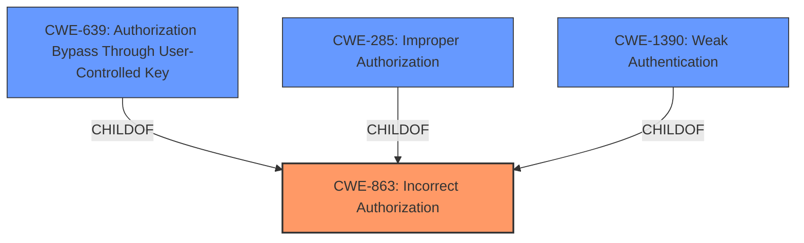

# Analysis for CVE-2020-1725

# Summary
| CWE ID | CWE Name | Confidence | CWE Abstraction Level | CWE Vulnerability Mapping Label | CWE-Vulnerability Mapping Notes |
|---|---|---|---|---|---|
| CWE-863 | Incorrect Authorization | 0.8 | Class | Primary | Allowed-with-Review |
| CWE-639 | Authorization Bypass Through User-Controlled Key | 0.7 | Base | Secondary | Allowed |
| CWE-285 | Improper Authorization | 0.6 | Class | Secondary | Discouraged |
| CWE-1390 | Weak Authentication | 0.5 | Class | Secondary | Allowed-with-Review |

## Evidence and Confidence

*   **Confidence Score:** 0.8
*   **Evidence Strength:** HIGH

## Relationship Analysis
The primary relationship is between CWE-863 (Incorrect Authorization), which is a class-level CWE, and CWE-639 (Authorization Bypass Through User-Controlled Key), which is a base-level CWE and a child of CWE-863. The description specifies that a user retains access to a resource after their roles have been changed, indicating an authorization problem. CWE-639 is considered because the vulnerability involves a user potentially manipulating a key to retain access, although the exact mechanism isn't fully detailed, making it a secondary consideration. Also considered and listed are CWE-285 and CWE-1390, but the description does not explicitly describe an authentication problem, so it's lower ranked.



## Vulnerability Chain
The chain starts with the **improper handling of role mappings** and token expiration in Keycloak. This leads to **incorrect authorization**, where users retain access to resources they should no longer have access to. The final impact is **unauthorized resource access**, potentially compromising data confidentiality and integrity.

## Summary of Analysis
The initial analysis focused on the fact that users retain access to resources after their roles have been revoked, which points to an authorization issue. The "**Root Cause of Vulnerability**" is the "Improper usage of parsed claims for authorization within keycloak-gatekeeper." The "**Weaknesses/Vulnerabilities Present**" section stated that "changes in user role mappings in Keycloak aren't immediately reflected in resource access due to **improper handling of claims** after access token expiry."

CWE-863 (Incorrect Authorization) is the most appropriate primary CWE, as it directly addresses the vulnerability of the product performing an authorization check incorrectly. The retriever results also listed CWE-639 (Authorization Bypass Through User-Controlled Key) because there is mention of modifying the key value identifying the data.

CWE-863 is a Class-level CWE, but it still is the best fit, so no other CWEs are required.

Relevant CWE Information:

# Enhanced Context (25 CWEs)
The following CWEs were identified as potentially relevant to this vulnerability:

## CWE-404: Improper Resource Shutdown or Release
**Abstraction Level**: Class
**Similarity Score**: 0.77
**Source**: dense

**Description**:
The product does not release or incorrectly releases a resource before it is made available for re-use.

**Mapping Guidance**:
- Usage: Allowed-with-Review
- Rationale: This CWE entry is a Class and might have Base-level children that would be more appropriate

## CWE-614: Sensitive Cookie in HTTPS Session Without 'Secure' Attribute
**Abstraction Level**: Variant
**Similarity Score**: 0.77
**Source**: dense

**Description**:
The Secure attribute for sensitive cookies in HTTPS sessions is not set, which could cause the user agent to send those cookies in plaintext over an HTTP session.

**Mapping Guidance**:
- Usage: Allowed
- Rationale: This CWE entry is at the Variant level of abstraction, which is a preferred level of abstraction for mapping to the root causes of vulnerabilities.

## CWE-668: Exposure of Resource to Wrong Sphere
**Abstraction Level**: Class
**Similarity Score**: 0.76
**Source**: dense

**Description**:
The product exposes a resource to the wrong control sphere, providing unintended actors with inappropriate access to the resource.

**Mapping Guidance**:
- Usage: Discouraged
- Rationale: CWE-668 is high-level and is often misused as a catch-all when lower-level CWE IDs might be applicable. It is sometimes used for low-information vulnerability reports [REF-1287]. It is a level-1 Class (i.e., a child of a Pillar). It is not useful for trend analysis.

## CWE-226: Sensitive Information in Resource Not Removed Before Reuse
**Abstraction Level**: Base
**Similarity Score**: 0.76
**Source**: dense

**Description**:
The product releases a resource such as memory or a file so that it can be made available for reuse, but it does not clear or "zeroize" the information contained in the resource before the product performs a critical state transition or makes the resource available for reuse by other entities.

**Mapping Guidance**:
- Usage: Allowed
- Rationale: This CWE entry is at the Base level of abstraction, which is a preferred level of abstraction for mapping to the root causes of vulnerabilities.

## CWE-807: Reliance on Untrusted Inputs in a Security Decision
**Abstraction Level**: Base
**Similarity Score**: 0.76
**Source**: dense

**Description**:
The product uses a protection mechanism that relies on the existence or values of an input, but the input can be modified by an untrusted actor in a way that bypasses the protection mechanism.

**Mapping Guidance**:
- Usage: Allowed
- Rationale: This CWE entry is at the Base level of abstraction, which is a preferred level of abstraction for mapping to the root causes of vulnerabilities.

## CWE-212: Improper Removal of Sensitive Information Before Storage or Transfer
**Abstraction Level**: Base
**Similarity Score**: 0.76
**Source**: dense

**Description**:
The product stores, transfers, or shares a resource that contains sensitive information, but it does not properly remove that information before the product makes the resource available to unauthorized actors.

**Mapping Guidance**:
- Usage: Allowed
- Rationale: This CWE entry is at the Base level of abstraction, which is a preferred level of abstraction for mapping to the root causes of vulnerabilities.

## CWE-1289: Improper Validation of Unsafe Equivalence in Input
**Abstraction Level**: Base
**Similarity Score**: 0.75
**Source**: dense

**Description**:
The product receives an input value that is used as a resource identifier or other type of reference, but it does not validate or incorrectly validates that the input is equivalent to a potentially-unsafe value.

**Mapping Guidance**:
- Usage: Allowed
- Rationale: This CWE entry is at the Base level of abstraction, which is a preferred level of abstraction for mapping to the root causes of vulnerabilities.

## CWE-319: Cleartext Transmission of Sensitive Information
**Abstraction Level**: Base
**Similarity Score**: 0.75
**Source**: dense

**Description**:
The product transmits sensitive or security-critical data in cleartext in a communication channel that can be sniffed by unauthorized actors.

**Mapping Guidance**:
- Usage: Allowed
- Rationale: This CWE entry is at the Base level of abstraction, which is a preferred level of abstraction for mapping to the root causes of vulnerabilities.

## CWE-274: Improper Handling of Insufficient Privileges
**Abstraction Level**: Base
**Similarity Score**: 0.75
**Source**: dense

**Description**:
The product does not handle or incorrectly handles when it has insufficient privileges to perform an operation, leading to resultant weaknesses.

**Mapping Guidance**:
- Usage: Discouraged
- Rationale: This CWE entry could be deprecated in a future version of CWE.

## CWE-41: Improper Resolution of Path Equivalence
**Abstraction Level**: Base
**Similarity Score**: 0.75
**Source**: dense

**Description**:
The product is vulnerable to file system contents disclosure through path equivalence. Path equivalence involves the use of special characters in file and directory names. The associated manipulations are intended to generate multiple names for the same object.

**Mapping Guidance**:
- Usage: Allowed
- Rationale: This CWE entry is at the Base level of abstraction, which is a preferred level of abstraction for mapping to the root causes of vulnerabilities.

## CWE-639: Authorization Bypass Through User

# Enhanced Query for CVE-2020-1725

## Vulnerability Description
A flaw was found in keycloak before version 13.0.0. In some scenarios a user still has access to a resource after changing the role mappings in Keycloak and after expiration of the previous access token.

### Vulnerability Description Key Phrases
- **impact:** access to resource after role mapping change and access token expiration
- **attacker:** user
- **product:** keycloak
- **version:** before version 13.0.0

## CVE Reference Links Content Summary
Based on the provided content, here's a breakdown of the vulnerability described in CVE-2020-1725:

**Root Cause of Vulnerability:**

*   Improper usage of parsed claims for authorization within keycloak-gatekeeper.

**Weaknesses/Vulnerabilities Present:**

*   The vulnerability lies in how keycloak-gatekeeper processes and uses claims from access tokens to determine authorization. Specifically, changes in user role mappings in Keycloak aren't immediately reflected in resource access due to improper handling of claims after access token expiry.

**Impact of Exploitation:**

*   **Improper Resource Access**: Users might retain access to resources even after their roles are revoked or modified in Keycloak, and after expiration of the previous access token. This allows a user to perform actions they are no longer authorized to do.
*   **Data Confidentiality and Integrity**: This could lead to unauthorized access to sensitive information and potentially manipulation of data by unauthorized users, thus compromising both data confidentiality and integrity.

**Attack Vectors:**

*   The attack vector involves a user with previously granted roles having those roles changed/revoked in Keycloak and their previous access token expired. Due to the vulnerability, the user might still have access to the resource.
*   This involves a user who has had their roles changed in Keycloak and their previous access token expires.

**Required Attacker Capabilities/Position:**

*   The attacker must be a user who previously had access to a resource and whose role mappings are subsequently changed in Keycloak.
*   The attacker must have a valid access token before role mappings are changed.

**Additional Details:**

*   The bug report mentions that a user can still access resources even after their roles have been changed in Keycloak and their previous access token has expired.
*   The upstream issue is tracked at [https://issues.jboss.org/browse/KEYCLOAK-11145](https://issues.jboss.org/browse/KEYCLOAK-11145).
*   The bug is classified as "CLOSED NOTABUG", indicating that the issue might have been addressed in a different manner or is considered an expected behavior within the context of Keycloak-gatekeeper.
*   A fix for this was not specifically mentioned, the bug report indicates that further updates for individual products will be reflected on the CVE page.

This information provides a good overview of the vulnerability, its implications, and how it can be exploited.

## Retriever Results

### Top Combined Results

| Rank | CWE ID | Name | Abstraction | Usage  | Retrievers | Individual Scores |
|------|--------|------|-------------|-------|------------|-------------------|
| 1 | 1390 | Weak Authentication | Class | Allowed-with-Review | sparse | 0.078 |
| 2 | 863 | Incorrect Authorization | Class | Allowed-with-Review | sparse | 0.078 |
| 3 | 639 | Authorization Bypass Through User-Controlled Key | Base | Allowed | sparse | 0.072 |
| 4 | 285 | Improper Authorization | Class | Discouraged | sparse | 0.071 |
| 5 | 287 | Improper Authentication | Class | Discouraged | sparse | 0.071 |
| 6 | 267 | Privilege Defined With Unsafe Actions | Base | Allowed | dense | 0.457 |
| 7 | 178 | Improper Handling of Case Sensitivity | Base | Allowed | graph | 0.002 |
| 8 | 362 | Concurrent Execution using Shared Resource with Improper Synchronization ('Race Condition') | Class | Allowed-with-Review | sparse | 0.070 |
| 9 | 404 | Improper Resource Shutdown or Release | Class | Allowed-with-Review | sparse | 0.069 |
| 10 | 614 | Sensitive Cookie in HTTPS Session Without 'Secure' Attribute | Variant | Allowed | sparse | 0.068 |


# Complete CWE Specifications


## CWE-1390: Weak Authentication
**Abstraction:** Class
**Status:** Incomplete

### Description
The product uses an authentication mechanism to restrict access to specific users or identities, but the mechanism does not sufficiently prove that the claimed identity is correct.

### Extended Description


Attackers may be able to bypass weak authentication faster and/or with less effort than expected.


### Alternative Terms
None

### Relationships
ChildOf -> CWE-287

### Mapping Guidance
**Usage:** Allowed-with-Review
**Rationale:** This CWE entry is a Class and might have Base-level children that would be more appropriate
**Comments:** Examine children of this entry to see if there is a better fit
**Reasons:**
- Abstraction


### Observed Examples
- **CVE-2022-30034:** Chain: Web UI for a Python RPC framework does not use regex anchors to validate user login emails (CWE-777), potentially allowing bypass of OAuth (CWE-1390).
- **CVE-2022-35248:** Chat application skips validation when Central Authentication Service (CAS) is enabled, effectively removing the second factor from two-factor authentication
- **CVE-2021-3116:** Chain: Python-based HTTP Proxy server uses the wrong boolean operators (CWE-480) causing an incorrect comparison (CWE-697) that identifies an authN failure if all three conditions are met instead of only one, allowing bypass of the proxy authentication (CWE-1390)


## CWE-863: Incorrect Authorization
**Abstraction:** Class
**Status:** Incomplete

### Description
The product performs an authorization check when an actor attempts to access a resource or perform an action, but it does not correctly perform the check.

### Extended Description
Not provided

### Alternative Terms
AuthZ: "AuthZ" is typically used as an abbreviation of "authorization" within the web application security community. It is distinct from "AuthN" (or, sometimes, "AuthC") which is an abbreviation of "authentication." The use of "Auth" as an abbreviation is discouraged, since it could be used for either authentication or authorization.

### Relationships
ChildOf -> CWE-285
ChildOf -> CWE-284

### Mapping Guidance
**Usage:** Allowed-with-Review
**Rationale:** This CWE entry is a Class and might have Base-level children that would be more appropriate
**Comments:** Examine children of this entry to see if there is a better fit
**Reasons:**
- Abstraction


### Additional Notes
**[Terminology]** 

Assuming a user with a given identity, authorization is the process of determining whether that user can access a given resource, based on the user's privileges and any permissions or other access-control specifications that apply to the resource.


### Observed Examples
- **CVE-2021-39155:** Chain: A microservice integration and management platform compares the hostname in the HTTP Host header in a case-sensitive way (CWE-178, CWE-1289), allowing bypass of the authorization policy (CWE-863) using a hostname with mixed case or other variations.
- **CVE-2019-15900:** Chain: sscanf() call is used to check if a username and group exists, but the return value of sscanf() call is not checked (CWE-252), causing an uninitialized variable to be checked (CWE-457), returning success to allow authorization bypass for executing a privileged (CWE-863).
- **CVE-2009-2213:** Gateway uses default "Allow" configuration for its authorization settings.


## CWE-639: Authorization Bypass Through User-Controlled Key
**Abstraction:** Base
**Status:** Incomplete

### Description
The system's authorization functionality does not prevent one user from gaining access to another user's data or record by modifying the key value identifying the data.

### Extended Description


Retrieval of a user record occurs in the system based on some key value that is under user control. The key would typically identify a user-related record stored in the system and would be used to lookup that record for presentation to the user. It is likely that an attacker would have to be an authenticated user in the system. However, the authorization process would not properly check the data access operation to ensure that the authenticated user performing the operation has sufficient entitlements to perform the requested data access, hence bypassing any other authorization checks present in the system.


For example, attackers can look at places where user specific data is retrieved (e.g. search screens) and determine whether the key for the item being looked up is controllable externally. The key may be a hidden field in the HTML form field, might be passed as a URL parameter or as an unencrypted cookie variable, then in each of these cases it will be possible to tamper with the key value.


One manifestation of this weakness is when a system uses sequential or otherwise easily-guessable session IDs that would allow one user to easily switch to another user's session and read/modify their data.


### Alternative Terms
Insecure Direct Object Reference / IDOR: The "Insecure Direct Object Reference" term, as described in the OWASP Top Ten, is broader than this CWE because it also covers path traversal (CWE-22). Within the context of vulnerability theory, there is a similarity between the OWASP concept and CWE-706: Use of Incorrectly-Resolved Name or Reference.
Broken Object Level Authorization / BOLA: BOLA is used in the 2019 OWASP API Security Top 10 and is said to be the same as IDOR.
Horizontal Authorization: "Horizontal Authorization" is used to describe situations in which two users have the same privilege level, but must be prevented from accessing each other's resources. This is fairly common when using key-based access to resources in a multi-user context.

### Relationships
ChildOf -> CWE-863
ChildOf -> CWE-863
ChildOf -> CWE-284

### Mapping Guidance
**Usage:** Allowed
**Rationale:** This CWE entry is at the Base level of abstraction, which is a preferred level of abstraction for mapping to the root causes of vulnerabilities.
**Comments:** Carefully read both the name and description to ensure that this mapping is an appropriate fit. Do not try to 'force' a mapping to a lower-level Base/Variant simply to comply with this preferred level of abstraction.
**Reasons:**
- Acceptable-Use


### Observed Examples
- **CVE-2021-36539:** An educational application does not appropriately restrict file IDs to a particular user. The attacker can brute-force guess IDs, indicating IDOR.


## CWE-285: Improper Authorization
**Abstraction:** Class
**Status:** Draft

### Description
The product does not perform or incorrectly performs an authorization check when an actor attempts to access a resource or perform an action.

### Extended Description


Assuming a user with a given identity, authorization is the process of determining whether that user can access a given resource, based on the user's privileges and any permissions or other access-control specifications that apply to the resource.


When access control checks are not applied consistently - or not at all - users are able to access data or perform actions that they should not be allowed to perform. This can lead to a wide range of problems, including information exposures, denial of service, and arbitrary code execution.


### Alternative Terms
AuthZ: "AuthZ" is typically used as an abbreviation of "authorization" within the web application security community. It is distinct from "AuthN" (or, sometimes, "AuthC") which is an abbreviation of "authentication." The use of "Auth" as an abbreviation is discouraged, since it could be used for either authentication or authorization.

### Relationships
ChildOf -> CWE-284
ChildOf -> CWE-284

### Mapping Guidance
**Usage:** Discouraged
**Rationale:** CWE-285 is high-level and lower-level CWEs can frequently be used instead. It is a level-1 Class (i.e., a child of a Pillar).
**Comments:** Look at CWE-285's children and consider mapping to CWEs such as CWE-862: Missing Authorization, CWE-863: Incorrect Authorization, CWE-732: Incorrect Permission Assignment for Critical Resource, or others.
**Reasons:**
- Abstraction
**Suggested Alternatives:**
- CWE-862: Missing Authorization
- CWE-863: Incorrect Authorization
- CWE-732: Incorrect Permission Assignment for Critical Resource


### Observed Examples
- **CVE-2022-24730:** Go-based continuous deployment product does not check that a user has certain privileges to update or create an app, allowing adversaries to read sensitive repository information
- **CVE-2009-3168:** Web application does not restrict access to admin scripts, allowing authenticated users to reset administrative passwords.
- **CVE-2009-2960:** Web application does not restrict access to admin scripts, allowing authenticated users to modify passwords of other users.


## CWE-287: Improper Authentication
**Abstraction:** Class
**Status:** Draft

### Description
When an actor claims to have a given identity, the product does not prove or insufficiently proves that the claim is correct.

### Extended Description
Not provided

### Alternative Terms
authentification: An alternate term is "authentification", which appears to be most commonly used by people from non-English-speaking countries.
AuthN: "AuthN" is typically used as an abbreviation of "authentication" within the web application security community. It is also distinct from "AuthZ," which is an abbreviation of "authorization." The use of "Auth" as an abbreviation is discouraged, since it could be used for either authentication or authorization.
AuthC: "AuthC" is used as an abbreviation of "authentication," but it appears to used less frequently than "AuthN."

### Relationships
ChildOf -> CWE-284
ChildOf -> CWE-284

### Mapping Guidance
**Usage:** Discouraged
**Rationale:** This CWE entry might be misused when lower-level CWE entries are likely to be applicable. It is a level-1 Class (i.e., a child of a Pillar).
**Comments:** Consider children or descendants, beginning with CWE-1390: Weak Authentication or CWE-306: Missing Authentication for Critical Function.
**Reasons:**
- Frequent Misuse
**Suggested Alternatives:**
- CWE-1390: Weak Authentication
- CWE-306: Missing Authentication for Critical Function


### Additional Notes
**[Relationship]** This can be resultant from SQL injection vulnerabilities and other issues.

**[Maintenance]** The Taxonomy_Mappings to ISA/IEC 62443 were added in CWE 4.10, but they are still under review and might change in future CWE versions. These draft mappings were performed by members of the "Mapping CWE to 62443" subgroup of the CWE-CAPEC ICS/OT Special Interest Group (SIG), and their work is incomplete as of CWE 4.10. The mappings are included to facilitate discussion and review by the broader ICS/OT community, and they are likely to change in future CWE versions.


### Observed Examples
- **CVE-2022-35248:** Chat application skips validation when Central Authentication Service (CAS) is enabled, effectively removing the second factor from two-factor authentication
- **CVE-2022-36436:** Python-based authentication proxy does not enforce password authentication during the initial handshake, allowing the client to bypass authentication by specifying a 'None' authentication type.
- **CVE-2022-30034:** Chain: Web UI for a Python RPC framework does not use regex anchors to validate user login emails (CWE-777), potentially allowing bypass of OAuth (CWE-1390).


## CWE-267: Privilege Defined With Unsafe Actions
**Abstraction:** Base
**Status:** Incomplete

### Description
A particular privilege, role, capability, or right can be used to perform unsafe actions that were not intended, even when it is assigned to the correct entity.

### Extended Description
Not provided

### Alternative Terms
None

### Relationships
ChildOf -> CWE-269

### Mapping Guidance
**Usage:** Allowed
**Rationale:** This CWE entry is at the Base level of abstraction, which is a preferred level of abstraction for mapping to the root causes of vulnerabilities.
**Comments:** Carefully read both the name and description to ensure that this mapping is an appropriate fit. Do not try to 'force' a mapping to a lower-level Base/Variant simply to comply with this preferred level of abstraction.
**Reasons:**
- Acceptable-Use


### Additional Notes
**[Maintenance]** 

Note: there are 2 separate sub-categories here:

```
		- privilege incorrectly allows entities to perform certain actions
		- object is incorrectly accessible to entities with a given privilege
```


### Observed Examples
- **CVE-2002-1981:** Roles have access to dangerous procedures (Accessible entities).
- **CVE-2002-1671:** Untrusted object/method gets access to clipboard (Accessible entities).
- **CVE-2004-2204:** Gain privileges using functions/tags that should be restricted (Accessible entities).


## CWE-178: Improper Handling of Case Sensitivity
**Abstraction:** Base
**Status:** Incomplete

### Description
The product does not properly account for differences in case sensitivity when accessing or determining the properties of a resource, leading to inconsistent results.

### Extended Description


Improperly handled case sensitive data can lead to several possible consequences, including:


  - case-insensitive passwords reducing the size of the key space, making brute force attacks easier

  - bypassing filters or access controls using alternate names

  - multiple interpretation errors using alternate names.


### Alternative Terms
None

### Relationships
ChildOf -> CWE-706
ChildOf -> CWE-706
CanPrecede -> CWE-433
CanPrecede -> CWE-289

### Mapping Guidance
**Usage:** Allowed
**Rationale:** This CWE entry is at the Base level of abstraction, which is a preferred level of abstraction for mapping to the root causes of vulnerabilities.
**Comments:** Carefully read both the name and description to ensure that this mapping is an appropriate fit. Do not try to 'force' a mapping to a lower-level Base/Variant simply to comply with this preferred level of abstraction.
**Reasons:**
- Acceptable-Use


### Additional Notes
**[Research Gap]** These are probably under-studied in Windows and Mac environments, where file names are case-insensitive and thus are subject to equivalence manipulations involving case.


### Observed Examples
- **CVE-2000-0499:** Application server allows attackers to bypass execution of a jsp page and read the source code using an upper case JSP extension in the request.
- **CVE-2000-0497:** The server is case sensitive, so filetype handlers treat .jsp and .JSP as different extensions. JSP source code may be read because .JSP defaults to the filetype "text".
- **CVE-2000-0498:** The server is case sensitive, so filetype handlers treat .jsp and .JSP as different extensions. JSP source code may be read because .JSP defaults to the filetype "text".


## CWE-362: Concurrent Execution using Shared Resource with Improper Synchronization ('Race Condition')
**Abstraction:** Class
**Status:** Draft

### Description
The product contains a concurrent code sequence that requires temporary, exclusive access to a shared resource, but a timing window exists in which the shared resource can be modified by another code sequence operating concurrently.

### Extended Description


A race condition occurs within concurrent environments, and it is effectively a property of a code sequence. Depending on the context, a code sequence may be in the form of a function call, a small number of instructions, a series of program invocations, etc.


A race condition violates these properties, which are closely related:


  - Exclusivity - the code sequence is given exclusive access to the shared resource, i.e., no other code sequence can modify properties of the shared resource before the original sequence has completed execution.

  - Atomicity - the code sequence is behaviorally atomic, i.e., no other thread or process can concurrently execute the same sequence of instructions (or a subset) against the same resource.

A race condition exists when an "interfering code sequence" can still access the shared resource, violating exclusivity.

The interfering code sequence could be "trusted" or "untrusted." A trusted interfering code sequence occurs within the product; it cannot be modified by the attacker, and it can only be invoked indirectly. An untrusted interfering code sequence can be authored directly by the attacker, and typically it is external to the vulnerable product.


### Alternative Terms
Race Condition

### Relationships
ChildOf -> CWE-691
CanPrecede -> CWE-416
CanPrecede -> CWE-476

### Mapping Guidance
**Usage:** Allowed-with-Review
**Rationale:** This CWE entry is a Class and might have Base-level children that would be more appropriate
**Comments:** Examine children of this entry to see if there is a better fit
**Reasons:**
- Abstraction


### Additional Notes
**[Maintenance]** The relationship between race conditions and synchronization problems (CWE-662) needs to be further developed. They are not necessarily two perspectives of the same core concept, since synchronization is only one technique for avoiding race conditions, and synchronization can be used for other purposes besides race condition prevention.

**[Research Gap]** Race conditions in web applications are under-studied and probably under-reported. However, in 2008 there has been growing interest in this area.

**[Research Gap]** Much of the focus of race condition research has been in Time-of-check Time-of-use (TOCTOU) variants (CWE-367), but many race conditions are related to synchronization problems that do not necessarily require a time-of-check.

**[Research Gap]** From a classification/taxonomy perspective, the relationships between concurrency and program state need closer investigation and may be useful in organizing related issues.


### Observed Examples
- **CVE-2022-29527:** Go application for cloud management creates a world-writable sudoers file that allows local attackers to inject sudo rules and escalate privileges to root by winning a race condition.
- **CVE-2021-1782:** Chain: improper locking (CWE-667) leads to race condition (CWE-362), as exploited in the wild per CISA KEV.
- **CVE-2021-0920:** Chain: mobile platform race condition (CWE-362) leading to use-after-free (CWE-416), as exploited in the wild per CISA KEV.


## CWE-404: Improper Resource Shutdown or Release
**Abstraction:** Class
**Status:** Draft

### Description
The product does not release or incorrectly releases a resource before it is made available for re-use.

### Extended Description
When a resource is created or allocated, the developer is responsible for properly releasing the resource as well as accounting for all potential paths of expiration or invalidation, such as a set period of time or revocation.

### Alternative Terms
None

### Relationships
ChildOf -> CWE-664
PeerOf -> CWE-405
CanPrecede -> CWE-619

### Mapping Guidance
**Usage:** Allowed-with-Review
**Rationale:** This CWE entry is a Class and might have Base-level children that would be more appropriate
**Comments:** Examine children of this entry to see if there is a better fit
**Reasons:**
- Abstraction


### Additional Notes
**[Relationship]** Overlaps memory leaks, asymmetric resource consumption, malformed input errors.


### Observed Examples
- **CVE-1999-1127:** Does not shut down named pipe connections if malformed data is sent.
- **CVE-2001-0830:** Sockets not properly closed when attacker repeatedly connects and disconnects from server.
- **CVE-2002-1372:** Chain: Return values of file/socket operations are not checked (CWE-252), allowing resultant consumption of file descriptors (CWE-772).


## CWE-614: Sensitive Cookie in HTTPS Session Without 'Secure' Attribute
**Abstraction:** Variant
**Status:** Draft

### Description
The Secure attribute for sensitive cookies in HTTPS sessions is not set, which could cause the user agent to send those cookies in plaintext over an HTTP session.

### Extended Description
Not provided

### Alternative Terms
None

### Relationships
ChildOf -> CWE-319

### Mapping Guidance
**Usage:** Allowed
**Rationale:** This CWE entry is at the Variant level of abstraction, which is a preferred level of abstraction for mapping to the root causes of vulnerabilities.
**Comments:** Carefully read both the name and description to ensure that this mapping is an appropriate fit. Do not try to 'force' a mapping to a lower-level Base/Variant simply to comply with this preferred level of abstraction.
**Reasons:**
- Acceptable-Use


### Observed Examples
- **CVE-2004-0462:** A product does not set the Secure attribute for sensitive cookies in HTTPS sessions, which could cause the user agent to send those cookies in plaintext over an HTTP session with the product.
- **CVE-2008-3663:** A product does not set the secure flag for the session cookie in an https session, which can cause the cookie to be sent in http requests and make it easier for remote attackers to capture this cookie.
- **CVE-2008-3662:** A product does not set the secure flag for the session cookie in an https session, which can cause the cookie to be sent in http requests and make it easier for remote attackers to capture this cookie.

