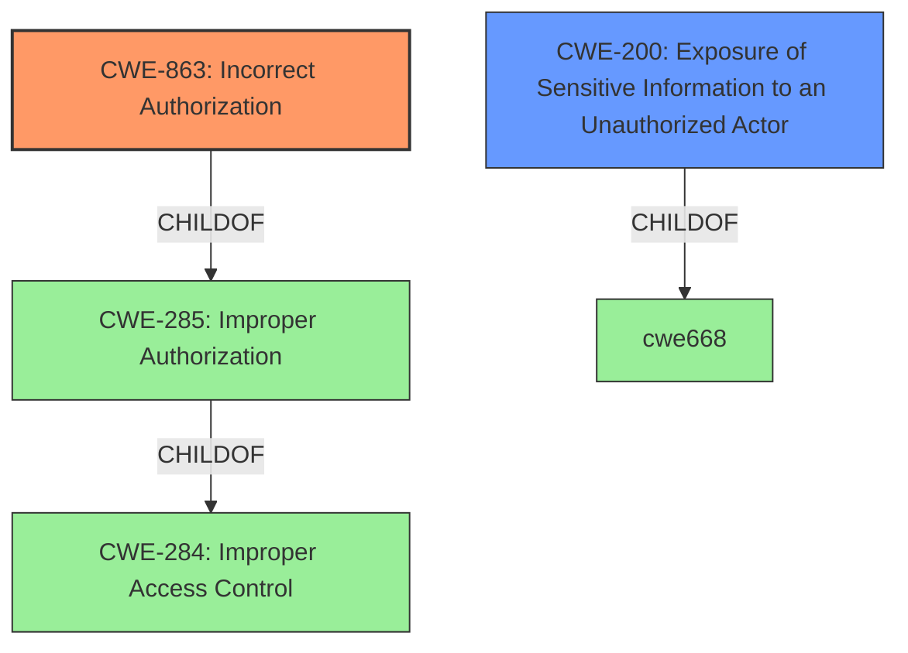

# Analysis for CVE-2020-1729

# Summary
| CWE ID  | CWE Name                                                        | Confidence | CWE Abstraction Level | CWE Vulnerability Mapping Label | CWE-Vulnerability Mapping Notes |
| :-------- | :-------------------------------------------------------------- | :--------- | :---------------------- | :------------------------------ | :-------------------------------- |
| CWE-863   | Incorrect Authorization                                         | 0.85       | Class                   | Primary                         | Allowed-with-Review                 |
| CWE-200   | Exposure of Sensitive Information to an Unauthorized Actor  | 0.70       | Class                   | Secondary                       | Discouraged                      |

## Evidence and Confidence

*   **Confidence Score:** 0.80
*   **Evidence Strength:** HIGH

## Relationship Analysis
The primary CWE is CWE-863, Incorrect Authorization, which is a Class-level CWE. It sits below CWE-285 (Improper Authorization) and CWE-284 (Improper Access Control). CWE-200 (Exposure of Sensitive Information to an Unauthorized Actor) is considered a secondary concern, reflecting the potential impact of the authorization failure. The relationship between CWE-863 and its parents (CWE-285 and CWE-284) indicates a general category of authorization problems. The choice of CWE-863 is more specific than its parents, since it refers to an explicit check that is performed incorrectly, rather than a missing check.

## Vulnerability Chain
The chain of events begins with the **insecure API exposure** of the `SecuritySupport` class. This allows an attacker to obtain the ClassLoader, which then leads to the **bypass of permission checks**, potentially resulting in **exposure of sensitive information**. The root cause is the public accessibility of a class that should have been internal.

## Summary of Analysis
The vulnerability involves the exposure of a class (`SecuritySupport`) that provides a means to obtain the ClassLoader, effectively bypassing permission checks. This directly aligns with **Incorrect Authorization (CWE-863)**, as the intended authorization mechanisms are circumvented. The potential impact is **exposure of sensitive information (CWE-200)**, but this is a secondary concern, stemming from the initial authorization failure.

The selection of CWE-863 is justified by the vulnerability description key phrases, specifically "**bypass any permissions checks**" and the CVE Reference Links Content Summary, which indicates that the **SecuritySupport** class should not have been publicly accessible. This evidence supports the incorrect authorization.

CWE-863 is more appropriate than its parent CWE-285 (Improper Authorization) because it specifically describes an authorization check that is performed incorrectly, while CWE-285 is more general. CWE-863 is at the Class level of abstraction, which is suitable given the available information. While a more specific Base or Variant CWE would be ideal, the current evidence does not support a more granular classification.

The retriever results and graph relationships support the choice of CWE-863, as it is identified as the top candidate with a high similarity score.

Relevant CWE Information:

# Enhanced Context (25 CWEs)
The following CWEs were identified as potentially relevant to this vulnerability:

## CWE-367: Time-of-check Time-of-use (TOCTOU) Race Condition
**Abstraction Level**: Base
**Similarity Score**: 0.78
**Source**: dense

**Description**:
The product checks the state of a resource before using that resource, but the resource's state can change between the check and the use in a way that invalidates the results of the check. This can cause the product to perform invalid actions when the resource is in an unexpected state.

**Mapping Guidance**:
- Usage: Allowed
- Rationale: This CWE entry is at the Base level of abstraction, which is a preferred level of abstraction for mapping to the root causes of vulnerabilities.

I considered CWE-367 since it involves bypassing checks, but this vulnerability doesn't involve a time-of-check time-of-use race condition.

## CWE-404: Improper Resource Shutdown or Release
**Abstraction Level**: Class
**Similarity Score**: 0.77
**Source**: dense

**Description**:
The product does not release or incorrectly releases a resource before it is made available for re-use.

**Mapping Guidance**:
- Usage: Allowed-with-Review
- Rationale: This CWE entry is a Class and might have Base-level children that would be more appropriate

CWE-404 is not related to this vulnerability since there is no improper resource shutdown.

## CWE-668: Exposure of Resource to Wrong Sphere
**Abstraction Level**: Class
**Similarity Score**: 0.77
**Source**: dense

**Description**:
The product exposes a resource to the wrong control sphere, providing unintended actors with inappropriate access to the resource.

**Mapping Guidance**:
- Usage: Discouraged
- Rationale: CWE-668 is high-level and is often misused as a catch-all when lower-level CWE IDs might be applicable. It is sometimes used for low-information vulnerability reports [REF-1287]. It is a level-1 Class (i.e., a child of a Pillar). It is not useful for trend analysis.

CWE-668 is too high level and doesn't accurately represent the root cause. The more specific CWE-863 is a better fit.

## CWE-208: Observable Timing Discrepancy
**Abstraction Level**: Base
**Similarity Score**: 0.76
**Source**: dense

**Description**:
Two separate operations in a product require different amounts of time to complete, in a way that is observable to an actor and reveals security-relevant information about the state of the product, such as whether a particular operation was successful or not.

**Mapping Guidance**:
- Usage: Allowed
- Rationale: This CWE entry is at the Base level of abstraction, which is a preferred level of abstraction for mapping to the root causes of vulnerabilities.

CWE-208 is incorrect since the vulnerability doesn't involve timing discrepancies.

## CWE-41: Improper Resolution of Path Equivalence
**Abstraction Level**: Base
**Similarity Score**: 0.76
**Source**: dense

**Description**:
The product is vulnerable to file system contents disclosure through path equivalence. Path equivalence involves the use of special characters in file and directory names. The associated manipulations are intended to generate multiple names for the same object.

**Mapping Guidance**:
- Usage: Allowed
- Rationale: This CWE entry is at the Base level of abstraction, which is a preferred level of abstraction for mapping to the root causes of vulnerabilities.

CWE-41 is incorrect since the vulnerability doesn't involve path equivalence issues.

## CWE-667: Improper Locking
**Abstraction Level**: Class
**Similarity Score**: 0.76
**Source**: dense

**Description**:
The product does not properly acquire or release a lock on a resource, leading to unexpected resource state changes and behaviors.

**Mapping Guidance**:
- Usage: Allowed-with-Review
- Rationale: This CWE entry is a Class and might have Base-level children that would be more appropriate

CWE-667 is incorrect since the vulnerability doesn't involve improper locking.

## CWE-362: Concurrent Execution using Shared Resource with Improper Synchronization ('Race Condition')
**Abstraction Level**: Class
**Similarity Score**: 0.76
**Source**: dense

**Description**:
The product contains a concurrent code sequence that requires temporary, exclusive access to a shared resource, but a timing window exists in which the shared resource can be modified by another code sequence operating concurrently.

**Mapping Guidance**:
- Usage: Allowed-with-Review
- Rationale: This CWE entry is a Class and might have Base-level children that would be more appropriate

CWE-362 is not related as the vulnerability doesn't involve concurrent execution or race conditions.

## CWE-226: Sensitive Information in Resource Not Removed Before Reuse
**Abstraction Level**: Base
**Similarity Score**: 0.76
**Source**: dense

**Description**:
The product releases a resource such as memory or a file so that it can be made available for reuse, but it does not clear or "zeroize" the information contained in the resource before the product performs a critical state transition or makes the resource available for reuse by other entities.

**Mapping Guidance**:
- Usage: Allowed