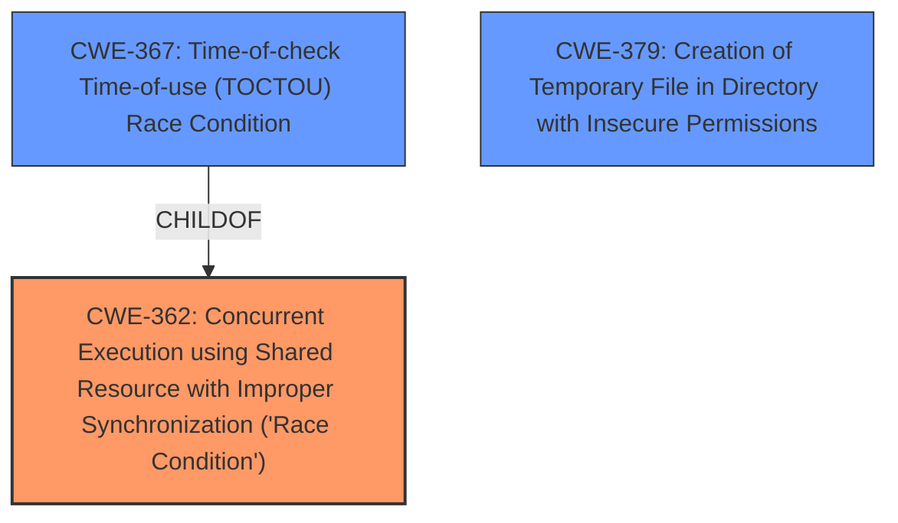

# Raw Analyzer Response for CVE-2020-1733

# Summary
| CWE ID | CWE Name | Confidence | CWE Abstraction Level | CWE Vulnerability Mapping Label | CWE-Vulnerability Mapping Notes |
|---|---|---|---|---|---|
| CWE-362 | Concurrent Execution using Shared Resource with Improper Synchronization ('**Race Condition**') | 0.9 | Class | Allowed-with-Review | Primary CWE |
| CWE-367 | Time-of-check Time-of-use (TOCTOU) **Race Condition** | 0.7 | Base | Allowed | Secondary Candidate |
| CWE-379 | Creation of Temporary File in Directory with Insecure Permissions | 0.6 | Base | Allowed | Secondary Candidate |

## Evidence and Confidence

*   **Confidence Score:** 0.8
*   **Evidence Strength:** HIGH

## Relationship Analysis
The primary relationship influencing the selection was the hierarchical relationship between CWE-362 (Class) and CWE-367 (Base), where CWE-367 is a child of CWE-362 and represents a specific type of **race condition**. Additionally, CWE-379 was considered due to the insecure creation of temporary files. The decision favored the higher-level CWE-362 as the initial **race condition** provides the context, while CWE-367 represents a specific instance that is present in the description.

## Vulnerability Chain
The vulnerability chain starts with the **race condition** during temporary directory creation, followed by the potential for an attacker to gain control of the `become_user`. This leads to the impact of privilege escalation and the ability to execute commands with elevated privileges.

**Race Condition** (CWE-362) -> Insecure Directory Creation -> Privilege Escalation

## Summary of Analysis
The initial assessment identified a **race condition** flaw during the creation of temporary directories in Ansible Engine. The analysis considered several CWEs, particularly those related to **race conditions**, file permissions, and privilege management. The final decision focused on CWE-362 (Concurrent Execution using Shared Resource with Improper Synchronization ('**Race Condition**')) as the primary CWE, as it accurately captures the core issue of concurrent access to shared resources without proper synchronization. The evidence for this includes the vulnerability description stating a **race condition** exists when creating the temporary directory, and the CVE Reference Links Content Summary highlighting the lack of validation on existing directories and permissions.

CWE-367 (Time-of-check Time-of-use (TOCTOU) **Race Condition**) was considered due to the time-sensitive nature of the directory creation process. However, CWE-362 was favored as the broader class, with TOCTOU being a potential specific instance, but not explicitly confirmed.

CWE-379 (Creation of Temporary File in Directory with Insecure Permissions) was also considered because the temporary directory is created with `umask 77`, which might be considered insecure. However, the primary issue is the **race condition**, not the insecure permissions themselves.

The selected CWEs are at the optimal level of specificity because they directly address the **root cause** of the vulnerability, which is the **race condition** during the creation of temporary directories. This decision is based on the vulnerability description, the CVE Reference Links Content Summary, and the relationships between the considered CWEs.

Relevant CWE Information:

# Enhanced Context (25 CWEs)

## CWE-59: Improper Link Resolution Before File Access ('Link Following')
**Abstraction Level**: Base
**Similarity Score**: 0.80
**Source**: dense

**Description**:
The product attempts to access a file based on the filename, but it does not properly prevent that filename from identifying a link or shortcut that resolves to an unintended resource.

**Mapping Guidance**:
- Usage: Allowed
- Rationale: This CWE entry is at the Base level of abstraction, which is a preferred level of abstraction for mapping to the root causes of vulnerabilities.

## CWE-427: Uncontrolled Search Path Element
**Abstraction Level**: Base
**Similarity Score**: 0.78
**Source**: dense

**Description**:
The product uses a fixed or controlled search path to find resources, but one or more locations in that path can be under the control of unintended actors.

**Mapping Guidance**:
- Usage: Allowed
- Rationale: This CWE entry is at the Base level of abstraction, which is a preferred level of abstraction for mapping to the root causes of vulnerabilities.

## CWE-267: Privilege Defined With Unsafe Actions
**Abstraction Level**: Base
**Similarity Score**: 0.78
**Source**: dense

**Description**:
A particular privilege, role, capability, or right can be used to perform unsafe actions that were not intended, even when it is assigned to the correct entity.

**Mapping Guidance**:
- Usage: Allowed
- Rationale: This CWE entry is at the Base level of abstraction, which is a preferred level of abstraction for mapping to the root causes of vulnerabilities.

## CWE-73: External Control of File Name or Path
**Abstraction Level**: Base
**Similarity Score**: 0.78
**Source**: dense

**Description**:
The product allows user input to control or influence paths or file names that are used in filesystem operations.

**Mapping Guidance**:
- Usage: Allowed
- Rationale: This CWE entry is at the Base level of abstraction, which is a preferred level of abstraction for mapping to the root causes of vulnerabilities.

## CWE-266: Incorrect Privilege Assignment
**Abstraction Level**: Base
**Similarity Score**: 0.78
**Source**: dense

**Description**:
A product incorrectly assigns a privilege to a particular actor, creating an unintended sphere of control for that actor.

**Mapping Guidance**:
- Usage: Allowed
- Rationale: This CWE entry is at the Base level of abstraction, which is a preferred level of abstraction for mapping to the root causes of vulnerabilities.

## CWE-41: Improper Resolution of Path Equivalence
**Abstraction Level**: Base
**Similarity Score**: 0.78
**Source**: dense

**Description**:
The product is vulnerable to file system contents disclosure through path equivalence. Path equivalence involves the use of special characters in file and directory names. The associated manipulations are intended to generate multiple names for the same object.

**Mapping Guidance**:
- Usage: Allowed
- Rationale: This CWE entry is at the Base level of abstraction, which is a preferred level of abstraction for mapping to the root causes of vulnerabilities.

## CWE-367: Time-of-check Time-of-use (TOCTOU) Race Condition
**Abstraction Level**: Base
**Similarity Score**: 0.78
**Source**: dense

**Description**:
The product checks the state of a resource before using that resource, but the resource's state can change between the check and the use in a way that invalidates the results of the check. This can cause the product to perform invalid actions when the resource is in an unexpected state.

**Mapping Guidance**:
- Usage: Allowed
- Rationale: This CWE entry is at the Base level of abstraction, which is a preferred level of abstraction for mapping to the root causes of vulnerabilities.

## CWE-667: Improper Locking
**Abstraction Level**: Class
**Similarity Score**: 0.78
**Source**: dense

**Description**:
The product does not properly acquire or release a lock on a resource, leading to unexpected resource state changes and behaviors.

**Mapping Guidance**:
- Usage: Allowed-with-Review
- Rationale: This CWE entry is a Class and might have Base-level children that would be more appropriate

## CWE-362: Concurrent Execution using Shared Resource with Improper Synchronization ('Race Condition')
**Abstraction Level**: Class
**Similarity Score**: 0.77
**Source**: dense

**Description**:
The product contains a concurrent code sequence that requires temporary, exclusive access to a shared resource, but a timing window exists in which the shared resource can be modified by another code sequence operating concurrently.

**Mapping Guidance**:
- Usage: Allowed-with-Review
- Rationale: This CWE entry is a Class and might have Base-level children that would be more appropriate

## CWE-668: Exposure of Resource to Wrong Sphere
**Abstraction Level**: Class
**Similarity Score**: 0.77
**Source**: dense

**Description**:
The product exposes a resource to the wrong control sphere, providing unintended actors with inappropriate access to the resource.

**Mapping Guidance**:
- Usage: Discouraged
- Rationale: CWE-668 is high-level and is often misused as a catch-all when lower-level CWE IDs might be applicable. It is sometimes