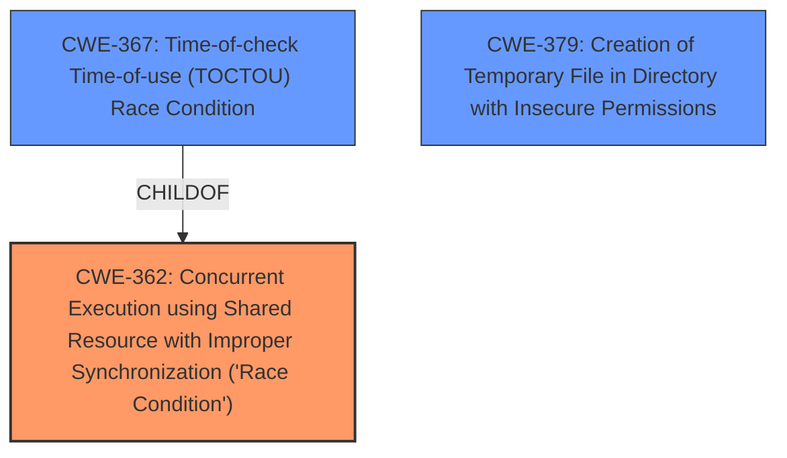

# Analysis for CVE-2020-1733

# Summary
| CWE ID | CWE Name | Confidence | CWE Abstraction Level | CWE Vulnerability Mapping Label | CWE-Vulnerability Mapping Notes |
|---|---|---|---|---|---|
| CWE-362 | Concurrent Execution using Shared Resource with Improper Synchronization ('**Race Condition**') | 0.9 | Class | Allowed-with-Review | Primary CWE |
| CWE-367 | Time-of-check Time-of-use (TOCTOU) **Race Condition** | 0.7 | Base | Allowed | Secondary Candidate |
| CWE-379 | Creation of Temporary File in Directory with Insecure Permissions | 0.6 | Base | Allowed | Secondary Candidate |

## Evidence and Confidence

*   **Confidence Score:** 0.8
*   **Evidence Strength:** HIGH

## Relationship Analysis
The primary relationship influencing the selection was the hierarchical relationship between CWE-362 (Class) and CWE-367 (Base), where CWE-367 is a child of CWE-362 and represents a specific type of **race condition**. Additionally, CWE-379 was considered due to the insecure creation of temporary files. The decision favored the higher-level CWE-362 as the initial **race condition** provides the context, while CWE-367 represents a specific instance that is present in the description.

## Vulnerability Chain
The vulnerability chain starts with the **race condition** during temporary directory creation, followed by the potential for an attacker to gain control of the `become_user`. This leads to the impact of privilege escalation and the ability to execute commands with elevated privileges.

**Race Condition** (CWE-362) -> Insecure Directory Creation -> Privilege Escalation

## Summary of Analysis
The initial assessment identified a **race condition** flaw during the creation of temporary directories in Ansible Engine. The analysis considered several CWEs, particularly those related to **race conditions**, file permissions, and privilege management. The final decision focused on CWE-362 (Concurrent Execution using Shared Resource with Improper Synchronization ('**Race Condition**')) as the primary CWE, as it accurately captures the core issue of concurrent access to shared resources without proper synchronization. The evidence for this includes the vulnerability description stating a **race condition** exists when creating the temporary directory, and the CVE Reference Links Content Summary highlighting the lack of validation on existing directories and permissions.

CWE-367 (Time-of-check Time-of-use (TOCTOU) **Race Condition**) was considered due to the time-sensitive nature of the directory creation process. However, CWE-362 was favored as the broader class, with TOCTOU being a potential specific instance, but not explicitly confirmed.

CWE-379 (Creation of Temporary File in Directory with Insecure Permissions) was also considered because the temporary directory is created with `umask 77`, which might be considered insecure. However, the primary issue is the **race condition**, not the insecure permissions themselves.

The selected CWEs are at the optimal level of specificity because they directly address the **root cause** of the vulnerability, which is the **race condition** during the creation of temporary directories. This decision is based on the vulnerability description, the CVE Reference Links Content Summary, and the relationships between the considered CWEs.

Relevant CWE Information:

# Enhanced Context (25 CWEs)

## CWE-59: Improper Link Resolution Before File Access ('Link Following')
**Abstraction Level**: Base
**Similarity Score**: 0.80
**Source**: dense

**Description**:
The product attempts to access a file based on the filename, but it does not properly prevent that filename from identifying a link or shortcut that resolves to an unintended resource.

**Mapping Guidance**:
- Usage: Allowed
- Rationale: This CWE entry is at the Base level of abstraction, which is a preferred level of abstraction for mapping to the root causes of vulnerabilities.

## CWE-427: Uncontrolled Search Path Element
**Abstraction Level**: Base
**Similarity Score**: 0.78
**Source**: dense

**Description**:
The product uses a fixed or controlled search path to find resources, but one or more locations in that path can be under the control of unintended actors.

**Mapping Guidance**:
- Usage: Allowed
- Rationale: This CWE entry is at the Base level of abstraction, which is a preferred level of abstraction for mapping to the root causes of vulnerabilities.

## CWE-267: Privilege Defined With Unsafe Actions
**Abstraction Level**: Base
**Similarity Score**: 0.78
**Source**: dense

**Description**:
A particular privilege, role, capability, or right can be used to perform unsafe actions that were not intended, even when it is assigned to the correct entity.

**Mapping Guidance**:
- Usage: Allowed
- Rationale: This CWE entry is at the Base level of abstraction, which is a preferred level of abstraction for mapping to the root causes of vulnerabilities.

## CWE-73: External Control of File Name or Path
**Abstraction Level**: Base
**Similarity Score**: 0.78
**Source**: dense

**Description**:
The product allows user input to control or influence paths or file names that are used in filesystem operations.

**Mapping Guidance**:
- Usage: Allowed
- Rationale: This CWE entry is at the Base level of abstraction, which is a preferred level of abstraction for mapping to the root causes of vulnerabilities.

## CWE-266: Incorrect Privilege Assignment
**Abstraction Level**: Base
**Similarity Score**: 0.78
**Source**: dense

**Description**:
A product incorrectly assigns a privilege to a particular actor, creating an unintended sphere of control for that actor.

**Mapping Guidance**:
- Usage: Allowed
- Rationale: This CWE entry is at the Base level of abstraction, which is a preferred level of abstraction for mapping to the root causes of vulnerabilities.

## CWE-41: Improper Resolution of Path Equivalence
**Abstraction Level**: Base
**Similarity Score**: 0.78
**Source**: dense

**Description**:
The product is vulnerable to file system contents disclosure through path equivalence. Path equivalence involves the use of special characters in file and directory names. The associated manipulations are intended to generate multiple names for the same object.

**Mapping Guidance**:
- Usage: Allowed
- Rationale: This CWE entry is at the Base level of abstraction, which is a preferred level of abstraction for mapping to the root causes of vulnerabilities.

## CWE-367: Time-of-check Time-of-use (TOCTOU) Race Condition
**Abstraction Level**: Base
**Similarity Score**: 0.78
**Source**: dense

**Description**:
The product checks the state of a resource before using that resource, but the resource's state can change between the check and the use in a way that invalidates the results of the check. This can cause the product to perform invalid actions when the resource is in an unexpected state.

**Mapping Guidance**:
- Usage: Allowed
- Rationale: This CWE entry is at the Base level of abstraction, which is a preferred level of abstraction for mapping to the root causes of vulnerabilities.

## CWE-667: Improper Locking
**Abstraction Level**: Class
**Similarity Score**: 0.78
**Source**: dense

**Description**:
The product does not properly acquire or release a lock on a resource, leading to unexpected resource state changes and behaviors.

**Mapping Guidance**:
- Usage: Allowed-with-Review
- Rationale: This CWE entry is a Class and might have Base-level children that would be more appropriate

## CWE-362: Concurrent Execution using Shared Resource with Improper Synchronization ('Race Condition')
**Abstraction Level**: Class
**Similarity Score**: 0.77
**Source**: dense

**Description**:
The product contains a concurrent code sequence that requires temporary, exclusive access to a shared resource, but a timing window exists in which the shared resource can be modified by another code sequence operating concurrently.

**Mapping Guidance**:
- Usage: Allowed-with-Review
- Rationale: This CWE entry is a Class and might have Base-level children that would be more appropriate

## CWE-668: Exposure of Resource to Wrong Sphere
**Abstraction Level**: Class
**Similarity Score**: 0.77
**Source**: dense

**Description**:
The product exposes a resource to the wrong control sphere, providing unintended actors with inappropriate access to the resource.

**Mapping Guidance**:
- Usage: Discouraged
- Rationale: CWE-668 is high-level and is often misused as a catch-all when lower-level CWE IDs might be applicable. It is sometimes

# Enhanced Query for CVE-2020-1733

## Vulnerability Description
A **race condition** flaw was found in Ansible Engine 2.7.17 and prior, 2.8.9 and prior, 2.9.6 and prior when running a playbook with an unprivileged become user. When Ansible needs to run a module with become user, the temporary directory is created in /var/tmp. This directory is created with umask 77 && mkdir -p this operation does not fail if the directory already exists and is owned by another user. An attacker could take advantage to gain control of the become user as the target directory can be retrieved by iterating /proc//cmdline.

### Vulnerability Description Key Phrases
- **rootcause:** **race condition**
- **impact:** gain control of become user
- **attacker:** attacker
- **product:** Ansible Engine
- **version:** 2.7.17 and prior, 2.8.9 and prior, 2.9.6 and prior

## CVE Reference Links Content Summary
Based on the provided information, here's a breakdown of the vulnerability described in CVE-2020-1733:

**Root Cause of Vulnerability:**

- The vulnerability stems from the insecure creation of temporary directories by Ansible when using the `become_user` functionality.
- Ansible creates a temporary directory for the `become_user` with `umask 077` in `/var/tmp` without proper checks.

**Weaknesses/Vulnerabilities Present:**

- **Race Condition:**  The core issue is a race condition. Ansible uses `umask 77 && mkdir -p <dir>` to create the temporary directory. This operation does not fail if the directory already exists and is owned by another user.
- **Insecure Directory Creation:**  Ansible does not validate if the directory already exists or if it has the expected permissions before creating it, leading to a potential time-of-check to time-of-use (TOCTOU) vulnerability.
- **Predictable Path:** The temporary directory path can be retrieved by iterating through `/proc/<pid>/cmdline`, making it easier for an attacker to target the directory.

**Impact of Exploitation:**

- **Privilege Escalation:** A local attacker can gain control of the `become_user` if they can create the directory before Ansible does or modify an existing directory. This effectively allows an unprivileged user to execute commands with the privileges of the `become_user`.
- **Modification of File Permissions:** An attacker can potentially modify the permissions of files owned by the original SSH user on the node if the attacker controls the created directory.

**Attack Vectors:**

- **Local Access:** An attacker needs local access to the target system where Ansible is being used.
- **Race Condition:** The attacker exploits a race condition during the temporary directory creation process by another user on the system.

**Required Attacker Capabilities/Position:**

- **Local User:** The attacker must have an existing user account on the target system.
- **Timing Control:** The attacker must be able to execute commands in a timely manner to win the race condition.
- **Access to `/proc`:** The attacker needs access to the `/proc` filesystem to find the process ID and identify the temporary directory path.

**Additional Notes:**

- The vulnerability is present in Ansible versions prior to 2.7.17, 2.8.11, and 2.9.7
- The vulnerability was fixed by adding checks for existing directories and their permissions.
- Mounting the proc filesystem with `hidepid=2` is a potential mitigation to make it harder to extract the temporary directory path.

## Retriever Results

### Top Combined Results

| Rank | CWE ID | Name | Abstraction | Usage  | Retrievers | Individual Scores |
|------|--------|------|-------------|-------|------------|-------------------|
| 1 | 362 | Concurrent Execution using Shared Resource with Improper Synchronization ('Race Condition') | Class | Allowed-with-Review | alternate_terms | 1.000 |
| 2 | 59 | Improper Link Resolution Before File Access ('Link Following') | Base | Allowed | sparse | 0.623 |
| 3 | 277 | Insecure Inherited Permissions | Variant | Allowed | sparse | 0.580 |
| 4 | 367 | Time-of-check Time-of-use (TOCTOU) Race Condition | Base | Allowed | sparse | 0.575 |
| 5 | 732 | Incorrect Permission Assignment for Critical Resource | Class | Allowed-with-Review | sparse | 0.566 |
| 6 | 214 | Invocation of Process Using Visible Sensitive Information | Base | Allowed | dense | 0.569 |
| 7 | 386 | Symbolic Name not Mapping to Correct Object | Base | Allowed | graph | 0.002 |
| 8 | 427 | Uncontrolled Search Path Element | Base | Allowed | sparse | 0.538 |
| 9 | 379 | Creation of Temporary File in Directory with Insecure Permissions | Base | Allowed | sparse | 0.536 |
| 10 | 250 | Execution with Unnecessary Privileges | Base | Allowed | sparse | 0.529 |

# Complete CWE Specifications

## CWE-362: Concurrent Execution using Shared Resource with Improper Synchronization ('Race Condition')
**Abstraction:** Class
**Status:** Draft

### Description
The product contains a concurrent code sequence that requires temporary, exclusive access to a shared resource, but a timing window exists in which the shared resource can be modified by another code sequence operating concurrently.

### Extended Description

A race condition occurs within concurrent environments, and it is effectively a property of a code sequence. Depending on the context, a code sequence may be in the form of a function call, a small number of instructions, a series of program invocations, etc.

A race condition violates these properties, which are closely related:

  - Exclusivity - the code sequence is given exclusive access to the shared resource, i.e., no other code sequence can modify properties of the shared resource before the original sequence has completed execution.

  - Atomicity - the code sequence is behaviorally atomic, i.e., no other thread or process can concurrently execute the same sequence of instructions (or a subset) against the same resource.

A race condition exists when an "interfering code sequence" can still access the shared resource, violating exclusivity.

The interfering code sequence could be "trusted" or "untrusted." A trusted interfering code sequence occurs within the product; it cannot be modified by the attacker, and it can only be invoked indirectly. An untrusted interfering code sequence can be authored directly by the attacker, and typically it is external to the vulnerable product.

### Alternative Terms
Race Condition

### Relationships
ChildOf -> CWE-691
CanPrecede -> CWE-416
CanPrecede -> CWE-476

### Mapping Guidance
**Usage:** Allowed-with-Review
**Rationale:** This CWE entry is a Class and might have Base-level children that would be more appropriate
**Comments:** Examine children of this entry to see if there is a better fit
**Reasons:**
- Abstraction

### Additional Notes
**[Maintenance]** The relationship between race conditions and synchronization problems (CWE-662) needs to be further developed. They are not necessarily two perspectives of the same core concept, since synchronization is only one technique for avoiding race conditions, and synchronization can be used for other purposes besides race condition prevention.

**[Research Gap]** Race conditions in web applications are under-studied and probably under-reported. However, in 2008 there has been growing interest in this area.

**[Research Gap]** Much of the focus of race condition research has been in Time-of-check Time-of-use (TOCTOU) variants (CWE-367), but many race conditions are related to synchronization problems that do not necessarily require a time-of-check.

**[Research Gap]** From a classification/taxonomy perspective, the relationships between concurrency and program state need closer investigation and may be useful in organizing related issues.

### Observed Examples
- **CVE-2022-29527:** Go application for cloud management creates a world-writable sudoers file that allows local attackers to inject sudo rules and escalate privileges to root by winning a race condition.
- **CVE-2021-1782:** Chain: improper locking (CWE-667) leads to race condition (CWE-362), as exploited in the wild per CISA KEV.
- **CVE-2021-0920:** Chain: mobile platform race condition (CWE-362) leading to use-after-free (CWE-416), as exploited in the wild per CISA KEV.

## CWE-59: Improper Link Resolution Before File Access ('Link Following')
**Abstraction:** Base
**Status:** Draft

### Description
The product attempts to access a file based on the filename, but it does not properly prevent that filename from identifying a link or shortcut that resolves to an unintended resource.

### Extended Description
Not provided

### Alternative Terms
insecure temporary file: Some people use the phrase "insecure temporary file" when referring to a link following weakness, but other weaknesses can produce insecure temporary files without any symlink involvement at all.
Zip Slip: "Zip slip" is an attack that uses file archives (e.g., ZIP, tar, rar, etc.) that contain filenames with path traversal sequences that cause the files to be written outside of the directory under which the archive is expected to be extracted [REF-1282]. It is most commonly used for relative path traversal (CWE-23) and link following (CWE-59).

### Relationships
ChildOf -> CWE-706
ChildOf -> CWE-706

### Mapping Guidance
**Usage:** Allowed
**Rationale:** This CWE entry is at the Base level of abstraction, which is a preferred level of abstraction for mapping to the root causes of vulnerabilities.
**Comments:** Carefully read both the name and description to ensure that this mapping is an appropriate fit. Do not try to 'force' a mapping to a lower-level Base/Variant simply to comply with this preferred level of abstraction.
**Reasons:**
- Acceptable-Use

### Additional Notes
**[Theoretical]** 

Link following vulnerabilities are Multi-factor Vulnerabilities (MFV). They are the combination of multiple elements: file or directory permissions, filename predictability, race conditions, and in some cases, a design limitation in which there is no mechanism for performing atomic file creation operations.

Some potential factors are race conditions, permissions, and predictability.

### Observed Examples
- **CVE-1999-1386:** Some versions of Perl follow symbolic links when running with the -e option, which allows local users to overwrite arbitrary files via a symlink attack.
- **CVE-2000-1178:** Text editor follows symbolic links when creating a rescue copy during an abnormal exit, which allows local users to overwrite the files of other users.
- **CVE-2004-0217:** Antivirus update allows local users to create or append to arbitrary files via a symlink attack on a logfile.

## CWE-277: Insecure Inherited Permissions
**Abstraction:** Variant
**Status:** Draft

### Description
A product defines a set of insecure permissions that are inherited by objects that are created by the program.

### Extended Description
Not provided

### Alternative Terms
None

### Relationships
ChildOf -> CWE-732

### Mapping Guidance
**Usage:** Allowed
**Rationale:** This CWE entry is at the Variant level of abstraction, which is a preferred level of abstraction for mapping to the root causes of vulnerabilities.
**Comments:** Carefully read both the name and description to ensure that this mapping is an appropriate fit. Do not try to 'force' a mapping to a lower-level Base/Variant simply to comply with this preferred level of abstraction.
**Reasons:**
- Acceptable-Use

### Observed Examples
- **CVE-2005-1841:** User's umask is used when creating temp files.
- **CVE-2002-1786:** Insecure umask for core dumps [is the umask preserved or assigned?].

## CWE-367: Time-of-check Time-of-use (TOCTOU) Race Condition
**Abstraction:** Base
**Status:** Incomplete

### Description
The product checks the state of a resource before using that resource, but the resource's state can change between the check and the use in a way that invalidates the results of the check. This can cause the product to perform invalid actions when the resource is in an unexpected state.

### Extended Description
This weakness can be security-relevant when an attacker can influence the state of the resource between check and use. This can happen with shared resources such as files, memory, or even variables in multithreaded programs.

### Alternative Terms
TOCTTOU: The TOCTTOU acronym expands to "Time Of Check To Time Of Use".
TOCCTOU: The TOCCTOU acronym is most likely a typo of TOCTTOU, but it has been used in some influential documents, so the typo is repeated fairly frequently.

### Relationships
ChildOf -> CWE-362
ChildOf -> CWE-362

### Mapping Guidance
**Usage:** Allowed
**Rationale:** This CWE entry is at the Base level of abstraction, which is a preferred level of abstraction for mapping to the root causes of vulnerabilities.
**Comments:** Carefully read both the name and description to ensure that this mapping is an appropriate fit. Do not try to 'force' a mapping to a lower-level Base/Variant simply to comply with this preferred level of abstraction.
**Reasons:**
- Acceptable-Use

### Additional Notes
**[Relationship]** TOCTOU issues do not always involve symlinks, and not every symlink issue is a TOCTOU problem.

**[Research Gap]** Non-symlink TOCTOU issues are not reported frequently, but they are likely to occur in code that attempts to be secure.

### Observed Examples
- **CVE-2015-1743:** TOCTOU in sandbox process allows installation of untrusted browser add-ons by replacing a file after it has been verified, but before it is executed
- **CVE-2003-0813:** A multi-threaded race condition allows remote attackers to cause a denial of service (crash or reboot) by causing two threads to process the same RPC request, which causes one thread to use memory after it has been freed.
- **CVE-2004-0594:** PHP flaw allows remote attackers to execute arbitrary code by aborting execution before the initialization of key data structures is complete.

## CWE-732: Incorrect Permission Assignment for Critical Resource
**Abstraction:** Class
**Status:** Draft

### Description
The product specifies permissions for a security-critical resource in a way that allows that resource to be read or modified by unintended actors.

### Extended Description
When a resource is given a permission setting that provides access to a wider range of actors than required, it could lead to the exposure of sensitive information, or the modification of that resource by unintended parties. This is especially dangerous when the resource is related to program configuration, execution, or sensitive user data. For example, consider a misconfigured storage account for the cloud that can be read or written by a public or anonymous user.

### Alternative Terms
None

### Relationships
ChildOf -> CWE-285
ChildOf -> CWE-668

### Mapping Guidance
**Usage:** Allowed-with-Review
**Rationale:** While the name itself indicates an assignment of permissions for resources, this is often misused for vulnerabilities in which "permissions" are not checked, which is an "authorization" weakness (CWE-285 or descendants) within CWE's model [REF-1287].
**Comments:** Closely analyze the specific mistake that is allowing the resource to be exposed, and perform a CWE mapping for that mistake.
**Reasons:**
- Frequent Misuse

### Additional Notes
**[Maintenance]** The relationships between privileges, permissions, and actors (e.g. users and groups) need further refinement within the Research view. One complication is that these concepts apply to two different pillars, related to control of resources (CWE-664) and protection mechanism failures (CWE-693).

### Observed Examples
- **CVE-2022-29527:** Go application for cloud management creates a world-writable sudoers file that allows local attackers to inject sudo rules and escalate privileges to root by winning a race condition.
- **CVE-2009-3482:** Anti-virus product sets insecure "Everyone: Full Control" permissions for files under the "Program Files" folder, allowing attackers to replace executables with Trojan horses.
- **CVE-2009-3897:** Product creates directories with 0777 permissions at installation, allowing users to gain privileges and access a socket used for authentication.

## CWE-214: Invocation of Process Using Visible Sensitive Information
**Abstraction:** Base
**Status:** Incomplete

### Description
A process is invoked with sensitive command-line arguments, environment variables, or other elements that can be seen by other processes on the operating system.

### Extended Description
Many operating systems allow a user to list information about processes that are owned by other users. Other users could see information such as command line arguments or environment variable settings. When this data contains sensitive information such as credentials, it might allow other users to launch an attack against the product or related resources.

### Alternative Terms
None

### Relationships
ChildOf -> CWE-497

### Mapping Guidance
**Usage:** Allowed
**Rationale:** This CWE entry is at the Base level of abstraction, which is a preferred level of abstraction for mapping to the root causes of vulnerabilities.
**Comments:** Carefully read both the name and description to ensure that this mapping is an appropriate fit. Do not try to 'force' a mapping to a lower-level Base/Variant simply to comply with this preferred level of abstraction.
**Reasons:**
- Acceptable-Use

### Additional Notes
**[Research Gap]** Under-studied, especially environment variables.

### Observed Examples
- **CVE-2005-1387:** password passed on command line
- **CVE-2005-2291:** password passed on command line
- **CVE-2001-1565:** username/password on command line allows local users to view via "ps" or other process listing programs

## CWE-386: Symbolic Name not Mapping to Correct Object
**Abstraction:** Base
**Status:** Draft

### Description
A constant symbolic reference to an object is used, even though the reference can resolve to a different object over time.

### Extended Description
Not provided

### Alternative Terms
None

### Relationships
ChildOf -> CWE-706
PeerOf -> CWE-367
PeerOf -> CWE-610
PeerOf -> CWE-486

### Mapping Guidance
**Usage:** Allowed
**Rationale:** This CWE entry is at the Base level of abstraction, which is a preferred level of abstraction for mapping to the root causes of vulnerabilities.
**Comments:** Carefully read both the name and description to ensure that this mapping is an appropriate fit. Do not try to 'force' a mapping to a lower-level Base/Variant simply to comply with this preferred level of abstraction.
**Reasons:**
- Acceptable-Use

## CWE-427: Uncontrolled Search Path Element
**Abstraction:** Base
**Status:** Draft

### Description
The product uses a fixed or controlled search path to find resources, but one or more locations in that path can be under the control of unintended actors.

### Extended Description

Although this weakness can occur with any type of resource, it is frequently introduced when a product uses a directory search path to find executables or code libraries, but the path contains a directory that can be modified by an attacker, such as "/tmp" or the current working directory.

In Windows-based systems, when the LoadLibrary or LoadLibraryEx function is called with a DLL name that does not contain a fully qualified path, the function follows a search order that includes two path elements that might be uncontrolled:

  - the directory from which the program has been loaded

  - the current working directory

In some cases, the attack can be conducted remotely, such as when SMB or WebDAV network shares are used.

One or more locations in that path could include the Windows drive root or its subdirectories. This often exists in Linux-based code assuming the controlled nature of the root directory (/) or its subdirectories (/etc, etc), or a code that recursively accesses the parent directory. In Windows, the drive root and some of its subdirectories have weak permissions by default, which makes them uncontrolled.

In some Unix-based systems, a PATH might be created that contains an empty element, e.g. by splicing an empty variable into the PATH. This empty element can be interpreted as equivalent to the current working directory, which might be an untrusted search element.

In software package management frameworks (e.g., npm, RubyGems, or PyPi), the framework may identify dependencies on third-party libraries or other packages, then consult a repository that contains the desired package. The framework may search a public repository before a private repository. This could be exploited by attackers by placing a malicious package in the public repository that has the same name as a package from the private repository. The search path might not be directly under control of the developer relying on the framework, but this search order effectively contains an untrusted element.

### Alternative Terms
DLL preloading: This term is one of several that are used to describe exploitation of untrusted search path elements in Windows systems, which received wide attention in August 2010. From a weakness perspective, the term is imprecise because it can apply to both CWE-426 and CWE-427.
Binary planting: This term is one of several that are used to describe exploitation of untrusted search path elements in Windows systems, which received wide attention in August 2010. From a weakness perspective, the term is imprecise because it can apply to both CWE-426 and CWE-427.
Insecure library loading: This term is one of several that are used to describe exploitation of untrusted search path elements in Windows systems, which received wide attention in August 2010. From a weakness perspective, the term is imprecise because it can apply to both CWE-426 and CWE-427.
Dependency confusion: As of February 2021, this term is used to describe CWE-427 in the context of managing installation of software package dependencies, in which attackers release packages on public sites where the names are the same as package names used by private repositories, and the search for the dependent package tries the public site first, downloading untrusted code. It may also be referred to as a "substitution attack."

### Relationships
ChildOf -> CWE-668
ChildOf -> CWE-668

### Mapping Guidance
**Usage:** Allowed
**Rationale:** This CWE entry is at the Base level of abstraction, which is a preferred level of abstraction for mapping to the root causes of vulnerabilities.
**Comments:** Carefully read both the name and description to ensure that this mapping is an appropriate fit. Do not try to 'force' a mapping to a lower-level Base/Variant simply to comply with this preferred level of abstraction.
**Reasons:**
- Acceptable-Use

### Additional Notes
**[Relationship]** Unlike untrusted search path (CWE-426), which inherently involves control over the definition of a control sphere (i.e., modification of a search path), this entry concerns a fixed control sphere in which some part of the sphere may be under attacker control (i.e., the search path cannot be modified by an attacker, but one element of the path can be under attacker control).

**[Theoretical]** This weakness is not a clean fit under CWE-668 or CWE-610, which suggests that the control sphere model might need enhancement or clarification.

### Observed Examples
- **CVE-2023-25815:** chain: a change in an underlying package causes the gettext function to use implicit initialization with a hard-coded path (CWE-1419) under the user-writable C:\ drive, introducing an untrusted search path element (CWE-427) that enables spoofing of messages.
- **CVE-2022-4826:** Go-based git extension on Windows can search for and execute a malicious "..exe" in a repository because Go searches the current working directory if git.exe is not found in the PATH
- **CVE-2020-26284:** A Static Site Generator built in Go, when running on Windows, searches the current working directory for a command, possibly allowing code execution using a malicious .exe or .bat file with the name being searched

## CWE-379: Creation of Temporary File in Directory with Insecure Permissions
**Abstraction:** Base
**Status:** Incomplete

### Description
The product creates a temporary file in a directory whose permissions allow unintended actors to determine the file's existence or otherwise access that file.

### Extended Description
On some operating systems, the fact that the temporary file exists may be apparent to any user with sufficient privileges to access that directory. Since the file is visible, the application that is using the temporary file could be known. If one has access to list the processes on the system, the attacker has gained information about what the user is doing at that time. By correlating this with the applications the user is running, an attacker could potentially discover what a user's actions are. From this, higher levels of security could be breached.

### Alternative Terms
None

### Relationships
ChildOf -> CWE-377

### Mapping Guidance
**Usage:** Allowed
**Rationale:** This CWE entry is at the Base level of abstraction, which is a preferred level of abstraction for mapping to the root causes of vulnerabilities.
**Comments:** Carefully read both the name and description to ensure that this mapping is an appropriate fit. Do not try to 'force' a mapping to a lower-level Base/Variant simply to comply with this preferred level of abstraction.
**Reasons:**
- Acceptable-Use

### Observed Examples
- **CVE-2022-27818:** A hotkey daemon written in Rust creates a domain socket file underneath /tmp, which is accessible by any user.
- **CVE-2021-21290:** A Java-based application for a rapid-development framework uses File.createTempFile() to create a random temporary file with insecure default permissions.

## CWE-250: Execution with Unnecessary Privileges
**Abstraction:** Base
**Status:** Draft

### Description
The product performs an operation at a privilege level that is higher than the minimum level required, which creates new weaknesses or amplifies the consequences of other weaknesses.

### Extended Description

New weaknesses can be exposed because running with extra privileges, such as root or Administrator, can disable the normal security checks being performed by the operating system or surrounding environment. Other pre-existing weaknesses can turn into security vulnerabilities if they occur while operating at raised privileges.

Privilege management functions can behave in some less-than-obvious ways, and they have different quirks on different platforms. These inconsistencies are particularly pronounced if you are transitioning from one non-root user to another. Signal handlers and spawned processes run at the privilege of the owning process, so if a process is running as root when a signal fires or a sub-process is executed, the signal handler or sub-process will operate with root privileges.

### Alternative Terms
None

### Relationships
ChildOf -> CWE-269
ChildOf -> CWE-657

### Mapping Guidance
**Usage:** Allowed
**Rationale:** This CWE entry is at the Base level of abstraction, which is a preferred level of abstraction for mapping to the root causes of vulnerabilities.
**Comments:** Carefully read both the name and description to ensure that this mapping is an appropriate fit. Do not try to 'force' a mapping to a lower-level Base/Variant simply to comply with this preferred level of abstraction.
**Reasons:**
- Acceptable-Use

### Additional Notes
**[Relationship]** There is a close association with CWE-653 (Insufficient Separation of Privileges). CWE-653 is about providing separate components for each privilege; CWE-250 is about ensuring that each component has the least amount of privileges possible.

**[Maintenance]** CWE-271, CWE-272, and CWE-250 are all closely related and possibly overlapping. CWE-271 is probably better suited as a category. Both CWE-272 and CWE-250 are in active use by the community. The "least privilege" phrase has multiple interpretations.

**[Maintenance]** The Taxonomy_Mappings to ISA/IEC 62443 were added in CWE 4.10, but they are still under review and might change in future CWE versions. These draft mappings were performed by members of the "Mapping CWE to 62443" subgroup of the CWE-CAPEC ICS/OT Special Interest Group (SIG), and their work is incomplete as of CWE 4.10. The mappings are included to facilitate discussion and review by the broader ICS/OT community, and they are likely to change in future CWE versions.

### Observed Examples
- **CVE-2007-4217:** FTP client program on a certain OS runs with setuid privileges and has a buffer overflow. Most clients do not need extra privileges, so an overflow is not a vulnerability for those clients.
- **CVE-2008-1877:** Program runs with privileges and calls another program with the same privileges, which allows read of arbitrary files.
- **CVE-2007-5159:** OS incorrectly installs a program with setuid privileges, allowing users to gain privileges.

