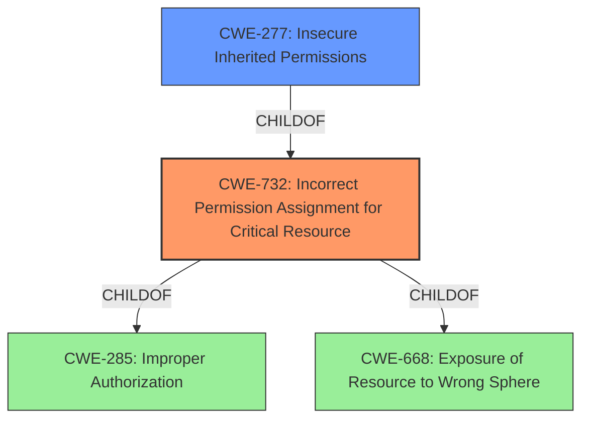

# Raw Analyzer Response for CVE-2020-1742

# Summary
| CWE ID | CWE Name | Confidence | CWE Abstraction Level | CWE Vulnerability Mapping Label | CWE-Vulnerability Mapping Notes |
|---|---|---|---|---|---|
| CWE-732 | Incorrect Permission Assignment for Critical Resource | 0.9 | Class | Allowed-with-Review | Primary CWE |
| CWE-277 | Insecure Inherited Permissions | 0.7 | Variant | Allowed | Secondary Candidate |

## Evidence and Confidence

*   **Confidence Score:** 0.8
*   **Evidence Strength:** HIGH

## Relationship Analysis
The primary CWE is CWE-732, which falls under the Class abstraction level. It has hierarchical relationships with CWE-285 (Improper Authorization) and CWE-668 (Exposure of Resource to Wrong Sphere) as its parents. CWE-277 (Insecure Inherited Permissions) is a child (more specific) of CWE-732. Selecting CWE-732 is suitable because it accurately describes the **incorrect permission assignment** that enables the **insecure modification vulnerability**. The relationship to CWE-277 was considered, because inherited permissions might be involved, but the description doesn't provide enough evidence.

## Vulnerability Chain
The vulnerability chain starts with the **incorrect permission assignment** on `/etc/passwd`, which leads to an attacker being able to modify the file and escalate privileges.
  - Root Cause: **Incorrect Permission Assignment**
  - Weakness: Modifiable `/etc/passwd`
  - Impact: Privilege escalation

## Summary of Analysis
The initial assessment identified CWE-732 as the primary candidate due to the **incorrect permission assignment** on the `/etc/passwd` file. The evidence in the "CVE Reference Links Content Summary" section states that the "nmstate/kubernetes-nmstate-handler container incorrectly modifies the permissions of `/etc/passwd`, making it writable by users other than root." This aligns directly with CWE-732's description of specifying permissions for a security-critical resource (in this case, `/etc/passwd`) in a way that allows unintended actors (non-root users) to modify it.

The relationship graph shows that CWE-732 is a child of CWE-285 (Improper Authorization) and CWE-668 (Exposure of Resource to Wrong Sphere). While both of these could be considered, CWE-732 provides a more specific description of the **weakness**. CWE-277 (Insecure Inherited Permissions) was considered, since the **incorrect permissions** could be related to how permissions are inherited, however, there is no evidence to support this.

The final decision to select CWE-732 as the primary CWE is based on the direct evidence of **incorrect permission assignment**, its alignment with the CWE's description, and its position in the relationship graph as a more specific description of the vulnerability than its parents.

Relevant CWE Information:

# Enhanced Context (25 CWEs)

## CWE-266: Incorrect Privilege Assignment
**Abstraction Level**: Base
**Similarity Score**: 0.79
**Source**: dense

**Description**:
A product incorrectly assigns a privilege to a particular actor, creating an unintended sphere of control for that actor.
**Why it was not selected:** This CWE focuses on the assignment of a privilege, whereas the issue is with file permissions.

## CWE-274: Improper Handling of Insufficient Privileges
**Abstraction Level**: Base
**Similarity Score**: 0.79
**Source**: dense

**Description**:
The product does not handle or incorrectly handles when it has insufficient privileges to perform an operation, leading to resultant weaknesses.
**Why it was not selected:** The vulnerability is due to overly permissive privileges, not insufficient ones.

## CWE-280: Improper Handling of Insufficient Permissions or Privileges 
**Abstraction Level**: Base
**Similarity Score**: 0.78
**Source**: dense

**Description**:
The product does not handle or incorrectly handles when it has insufficient privileges to access resources or functionality as specified by their permissions. This may cause it to follow unexpected code paths that may leave the product in an invalid state.
**Why it was not selected:** This is also about insufficient privileges, not incorrect permissions.

## CWE-267: Privilege Defined With Unsafe Actions
**Abstraction Level**: Base
**Similarity Score**: 0.78
**Source**: dense

**Description**:
A particular privilege, role, capability, or right can be used to perform unsafe actions that were not intended, even when it is assigned to the correct entity.
**Why it was not selected:** The issue is not about a privilege allowing unsafe actions, but about incorrect file permissions.

## CWE-59: Improper Link Resolution Before File Access ('Link Following')
**Abstraction Level**: Base
**Similarity Score**: 0.78
**Source**: dense

**Description**:
The product attempts to access a file based on the filename, but it does not properly prevent that filename from identifying a link or shortcut that resolves to an unintended resource.
**Why it was not selected:** This CWE describes link following issues, which is not related to the vulnerability.

## CWE-653: Improper Isolation or Compartmentalization
**Abstraction Level**: Class
**Similarity Score**: 0.78
**Source**: dense

**Description**:
The product does not properly compartmentalize or isolate functionality, processes, or resources that require different privilege levels, rights, or permissions.
**Why it was not selected:** The description is about **improper isolation**, not file permissions.

## CWE-668: Exposure of Resource to Wrong Sphere
**Abstraction Level**: Class
**Similarity Score**: 0.78
**Source**: dense

**Description**:
The product exposes a resource to the wrong control sphere, providing unintended actors with inappropriate access to the resource.
**Why it was not selected:** This is a higher-level CWE, and CWE-732 provides more specificity.

## CWE-73: External Control of File Name or Path
**Abstraction Level**: Base
**Similarity Score**: 0.78
**Source**: dense

**Description**:
The product allows user input to control or influence paths or file names that are used in filesystem operations.
**Why it was not selected:** This CWE focuses on external control of file names or paths.

## CWE-41: Improper Resolution of Path Equivalence
**Abstraction Level**: Base
**Similarity Score**: 0.77
**Source**: dense

**Description**:
The product is vulnerable to file system contents disclosure through path equivalence. Path equivalence involves the use of special characters in file and directory names. The associated manipulations are intended to generate multiple names for the same object.
**Why it was not selected:** This CWE focuses on path equivalence issues.

## CWE-552: Files or Directories Accessible to External Parties
**Abstraction Level**: Base
**Similarity Score**: 0.76
**Source**: dense

**Description**:
The product makes files or directories accessible to unauthorized actors, even though they should not be.
**Why it was not selected:** While the vulnerability does make `/etc/passwd` accessible to unauthorized actors, CWE-732 describes the root cause more accurately (incorrect permission assignment).

## CWE-285: Improper Authorization
**Abstraction Level**: Class
**Similarity Score**: 5938.02
**Source**: sparse

**Description**:
The product does not perform or incorrectly performs an authorization check when an actor attempts to access a resource or perform an action.
**Why it was not selected:** Too high-level and doesn't describe the root cause of the **weakness**.

## CWE-863: Incorrect Authorization
**Abstraction Level**: Class
**Similarity Score**: 6061.01
**Source**: sparse

**Description**:
The product performs an authorization check when an actor attempts to access a resource or perform an action, but it does not correctly perform the check.
**Why it was not selected:** Too high-level and doesn't describe the root cause of the **weakness**.

## CWE-250: Execution with Unnecessary Privileges
**Abstraction Level**: Base
**Similarity Score**: 6061.01
**Source**: sparse

**Description**:
The product performs an operation at a privilege level that is higher than the minimum level required, which creates new weaknesses or amplifies the consequences of other weaknesses.
**Why it was not selected:** Doesn't describe the