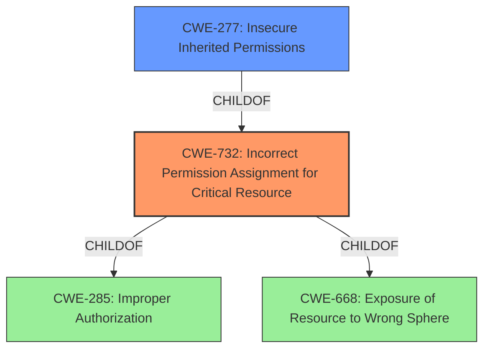

# Analysis for CVE-2020-1742

# Summary
| CWE ID | CWE Name | Confidence | CWE Abstraction Level | CWE Vulnerability Mapping Label | CWE-Vulnerability Mapping Notes |
|---|---|---|---|---|---|
| CWE-732 | Incorrect Permission Assignment for Critical Resource | 0.9 | Class | Allowed-with-Review | Primary CWE |
| CWE-277 | Insecure Inherited Permissions | 0.7 | Variant | Allowed | Secondary Candidate |

## Evidence and Confidence

*   **Confidence Score:** 0.8
*   **Evidence Strength:** HIGH

## Relationship Analysis
The primary CWE is CWE-732, which falls under the Class abstraction level. It has hierarchical relationships with CWE-285 (Improper Authorization) and CWE-668 (Exposure of Resource to Wrong Sphere) as its parents. CWE-277 (Insecure Inherited Permissions) is a child (more specific) of CWE-732. Selecting CWE-732 is suitable because it accurately describes the **incorrect permission assignment** that enables the **insecure modification vulnerability**. The relationship to CWE-277 was considered, because inherited permissions might be involved, but the description doesn't provide enough evidence.



## Vulnerability Chain
The vulnerability chain starts with the **incorrect permission assignment** on `/etc/passwd`, which leads to an attacker being able to modify the file and escalate privileges.
  - Root Cause: **Incorrect Permission Assignment**
  - Weakness: Modifiable `/etc/passwd`
  - Impact: Privilege escalation

## Summary of Analysis
The initial assessment identified CWE-732 as the primary candidate due to the **incorrect permission assignment** on the `/etc/passwd` file. The evidence in the "CVE Reference Links Content Summary" section states that the "nmstate/kubernetes-nmstate-handler container incorrectly modifies the permissions of `/etc/passwd`, making it writable by users other than root." This aligns directly with CWE-732's description of specifying permissions for a security-critical resource (in this case, `/etc/passwd`) in a way that allows unintended actors (non-root users) to modify it.

The relationship graph shows that CWE-732 is a child of CWE-285 (Improper Authorization) and CWE-668 (Exposure of Resource to Wrong Sphere). While both of these could be considered, CWE-732 provides a more specific description of the **weakness**. CWE-277 (Insecure Inherited Permissions) was considered, since the **incorrect permissions** could be related to how permissions are inherited, however, there is no evidence to support this.

The final decision to select CWE-732 as the primary CWE is based on the direct evidence of **incorrect permission assignment**, its alignment with the CWE's description, and its position in the relationship graph as a more specific description of the vulnerability than its parents.

Relevant CWE Information:

# Enhanced Context (25 CWEs)

## CWE-266: Incorrect Privilege Assignment
**Abstraction Level**: Base
**Similarity Score**: 0.79
**Source**: dense

**Description**:
A product incorrectly assigns a privilege to a particular actor, creating an unintended sphere of control for that actor.
**Why it was not selected:** This CWE focuses on the assignment of a privilege, whereas the issue is with file permissions.

## CWE-274: Improper Handling of Insufficient Privileges
**Abstraction Level**: Base
**Similarity Score**: 0.79
**Source**: dense

**Description**:
The product does not handle or incorrectly handles when it has insufficient privileges to perform an operation, leading to resultant weaknesses.
**Why it was not selected:** The vulnerability is due to overly permissive privileges, not insufficient ones.

## CWE-280: Improper Handling of Insufficient Permissions or Privileges 
**Abstraction Level**: Base
**Similarity Score**: 0.78
**Source**: dense

**Description**:
The product does not handle or incorrectly handles when it has insufficient privileges to access resources or functionality as specified by their permissions. This may cause it to follow unexpected code paths that may leave the product in an invalid state.
**Why it was not selected:** This is also about insufficient privileges, not incorrect permissions.

## CWE-267: Privilege Defined With Unsafe Actions
**Abstraction Level**: Base
**Similarity Score**: 0.78
**Source**: dense

**Description**:
A particular privilege, role, capability, or right can be used to perform unsafe actions that were not intended, even when it is assigned to the correct entity.
**Why it was not selected:** The issue is not about a privilege allowing unsafe actions, but about incorrect file permissions.

## CWE-59: Improper Link Resolution Before File Access ('Link Following')
**Abstraction Level**: Base
**Similarity Score**: 0.78
**Source**: dense

**Description**:
The product attempts to access a file based on the filename, but it does not properly prevent that filename from identifying a link or shortcut that resolves to an unintended resource.
**Why it was not selected:** This CWE describes link following issues, which is not related to the vulnerability.

## CWE-653: Improper Isolation or Compartmentalization
**Abstraction Level**: Class
**Similarity Score**: 0.78
**Source**: dense

**Description**:
The product does not properly compartmentalize or isolate functionality, processes, or resources that require different privilege levels, rights, or permissions.
**Why it was not selected:** The description is about **improper isolation**, not file permissions.

## CWE-668: Exposure of Resource to Wrong Sphere
**Abstraction Level**: Class
**Similarity Score**: 0.78
**Source**: dense

**Description**:
The product exposes a resource to the wrong control sphere, providing unintended actors with inappropriate access to the resource.
**Why it was not selected:** This is a higher-level CWE, and CWE-732 provides more specificity.

## CWE-73: External Control of File Name or Path
**Abstraction Level**: Base
**Similarity Score**: 0.78
**Source**: dense

**Description**:
The product allows user input to control or influence paths or file names that are used in filesystem operations.
**Why it was not selected:** This CWE focuses on external control of file names or paths.

## CWE-41: Improper Resolution of Path Equivalence
**Abstraction Level**: Base
**Similarity Score**: 0.77
**Source**: dense

**Description**:
The product is vulnerable to file system contents disclosure through path equivalence. Path equivalence involves the use of special characters in file and directory names. The associated manipulations are intended to generate multiple names for the same object.
**Why it was not selected:** This CWE focuses on path equivalence issues.

## CWE-552: Files or Directories Accessible to External Parties
**Abstraction Level**: Base
**Similarity Score**: 0.76
**Source**: dense

**Description**:
The product makes files or directories accessible to unauthorized actors, even though they should not be.
**Why it was not selected:** While the vulnerability does make `/etc/passwd` accessible to unauthorized actors, CWE-732 describes the root cause more accurately (incorrect permission assignment).

## CWE-285: Improper Authorization
**Abstraction Level**: Class
**Similarity Score**: 5938.02
**Source**: sparse

**Description**:
The product does not perform or incorrectly performs an authorization check when an actor attempts to access a resource or perform an action.
**Why it was not selected:** Too high-level and doesn't describe the root cause of the **weakness**.

## CWE-863: Incorrect Authorization
**Abstraction Level**: Class
**Similarity Score**: 6061.01
**Source**: sparse

**Description**:
The product performs an authorization check when an actor attempts to access a resource or perform an action, but it does not correctly perform the check.
**Why it was not selected:** Too high-level and doesn't describe the root cause of the **weakness**.

## CWE-250: Execution with Unnecessary Privileges
**Abstraction Level**: Base
**Similarity Score**: 6061.01
**Source**: sparse

**Description**:
The product performs an operation at a privilege level that is higher than the minimum level required, which creates new weaknesses or amplifies the consequences of other weaknesses.
**Why it was not selected:** Doesn't describe the

# Enhanced Query for CVE-2020-1742

## Vulnerability Description
An **insecure modification vulnerability** flaw was found in containers using nmstate/kubernetes-nmstate-handler. An attacker with access to the container could use this flaw to modify /etc/passwd and escalate their privileges. Versions before kubernetes-nmstate-handler-container-v2.3.0-30 are affected.

### Vulnerability Description Key Phrases
- **weakness:** **insecure modification vulnerability**
- **impact:** modify /etc/passwd and escalate privileges
- **attacker:** attacker with access to container
- **product:** containers using nmstate/kubernetes-nmstate-handler
- **version:** before kubernetes-nmstate-handler-container-v2.3.0-30

## CVE Reference Links Content Summary
Based on the provided information, here's an analysis of CVE-2020-1742:

**Root Cause of Vulnerability:**

- The `nmstate/kubernetes-nmstate-handler` container incorrectly modifies the permissions of `/etc/passwd`, making it writable by users other than root.

**Weaknesses/Vulnerabilities Present:**

- **Insecure File Permissions:**  The core vulnerability lies in setting overly permissive write permissions on the `/etc/passwd` file. This file should only be modifiable by the root user to ensure system integrity.

**Impact of Exploitation:**

- **Privilege Escalation:** An attacker with access to the running container can exploit this flaw to modify `/etc/passwd`. By doing so, they can add a new user or modify existing user accounts to gain elevated privileges (potentially root access) within the container and possibly the host system depending on container configuration.

**Attack Vectors:**

- **Container Access:** The primary attack vector is through an attacker gaining access to a running container that is using the vulnerable `nmstate/kubernetes-nmstate-handler`.

**Required Attacker Capabilities/Position:**

- **Container Access:** The attacker must have some level of access to a running container instance utilizing the flawed container image. This could be through a compromised application running within the container or by other means allowing command execution.
- **Basic Knowledge of Linux Systems:** The attacker needs knowledge on how to modify the `/etc/passwd` file to create new users with elevated privileges.

**Additional Notes:**

*   The vulnerability was found in multiple containers but is specifically related to the `nmstate/kubernetes-nmstate-handler` container for CVE-2020-1742
*   The bugzilla entry mentions that this vulnerability is not exploitable by default in unprivileged containers running on OpenShift Container Platform due to the default `seccomp` policy blocking `SETUID` and `SETGID` system calls. However, containers running with different configurations or on different platforms may be exploitable.
*   The fix was included in `kubernetes-nmstate-handler-container-v2.3.0-30`.

## Retriever Results

### Top Combined Results

| Rank | CWE ID | Name | Abstraction | Usage  | Retrievers | Individual Scores |
|------|--------|------|-------------|-------|------------|-------------------|
| 1 | 732 | Incorrect Permission Assignment for Critical Resource | Class | Allowed-with-Review | sparse | 0.309 |
| 2 | 668 | Exposure of Resource to Wrong Sphere | Class | Discouraged | sparse | 0.253 |
| 3 | 277 | Insecure Inherited Permissions | Variant | Allowed | sparse | 0.218 |
| 4 | 59 | Improper Link Resolution Before File Access ('Link Following') | Base | Allowed | sparse | 0.216 |
| 5 | 269 | Improper Privilege Management | Class | Discouraged | sparse | 0.214 |
| 6 | 286 | Incorrect User Management | Class | Allowed-with-Review | dense | 0.535 |
| 7 | 73 | External Control of File Name or Path | Base | Allowed | graph | 0.003 |
| 8 | 285 | Improper Authorization | Class | Discouraged | sparse | 0.211 |
| 9 | 863 | Incorrect Authorization | Class | Allowed-with-Review | sparse | 0.210 |
| 10 | 250 | Execution with Unnecessary Privileges | Base | Allowed | sparse | 0.209 |


# Complete CWE Specifications


## CWE-732: Incorrect Permission Assignment for Critical Resource
**Abstraction:** Class
**Status:** Draft

### Description
The product specifies permissions for a security-critical resource in a way that allows that resource to be read or modified by unintended actors.

### Extended Description
When a resource is given a permission setting that provides access to a wider range of actors than required, it could lead to the exposure of sensitive information, or the modification of that resource by unintended parties. This is especially dangerous when the resource is related to program configuration, execution, or sensitive user data. For example, consider a misconfigured storage account for the cloud that can be read or written by a public or anonymous user.

### Alternative Terms
None

### Relationships
ChildOf -> CWE-285
ChildOf -> CWE-668

### Mapping Guidance
**Usage:** Allowed-with-Review
**Rationale:** While the name itself indicates an assignment of permissions for resources, this is often misused for vulnerabilities in which "permissions" are not checked, which is an "authorization" weakness (CWE-285 or descendants) within CWE's model [REF-1287].
**Comments:** Closely analyze the specific mistake that is allowing the resource to be exposed, and perform a CWE mapping for that mistake.
**Reasons:**
- Frequent Misuse


### Additional Notes
**[Maintenance]** The relationships between privileges, permissions, and actors (e.g. users and groups) need further refinement within the Research view. One complication is that these concepts apply to two different pillars, related to control of resources (CWE-664) and protection mechanism failures (CWE-693).


### Observed Examples
- **CVE-2022-29527:** Go application for cloud management creates a world-writable sudoers file that allows local attackers to inject sudo rules and escalate privileges to root by winning a race condition.
- **CVE-2009-3482:** Anti-virus product sets insecure "Everyone: Full Control" permissions for files under the "Program Files" folder, allowing attackers to replace executables with Trojan horses.
- **CVE-2009-3897:** Product creates directories with 0777 permissions at installation, allowing users to gain privileges and access a socket used for authentication.


## CWE-668: Exposure of Resource to Wrong Sphere
**Abstraction:** Class
**Status:** Draft

### Description
The product exposes a resource to the wrong control sphere, providing unintended actors with inappropriate access to the resource.

### Extended Description


Resources such as files and directories may be inadvertently exposed through mechanisms such as insecure permissions, or when a program accidentally operates on the wrong object. For example, a program may intend that private files can only be provided to a specific user. This effectively defines a control sphere that is intended to prevent attackers from accessing these private files. If the file permissions are insecure, then parties other than the user will be able to access those files.


A separate control sphere might effectively require that the user can only access the private files, but not any other files on the system. If the program does not ensure that the user is only requesting private files, then the user might be able to access other files on the system.


In either case, the end result is that a resource has been exposed to the wrong party.


### Alternative Terms
None

### Relationships
ChildOf -> CWE-664

### Mapping Guidance
**Usage:** Discouraged
**Rationale:** CWE-668 is high-level and is often misused as a catch-all when lower-level CWE IDs might be applicable. It is sometimes used for low-information vulnerability reports [REF-1287]. It is a level-1 Class (i.e., a child of a Pillar). It is not useful for trend analysis.
**Comments:** Closely analyze the specific mistake that is allowing the resource to be exposed, and perform a CWE mapping for that mistake.
**Reasons:**
- Frequent Misuse
- Abstraction


### Additional Notes
**[Theoretical]** A "control sphere" is a set of resources and behaviors that are accessible to a single actor, or a group of actors. A product's security model will typically define multiple spheres, possibly implicitly. For example, a server might define one sphere for "administrators" who can create new user accounts with subdirectories under /home/server/, and a second sphere might cover the set of users who can create or delete files within their own subdirectories. A third sphere might be "users who are authenticated to the operating system on which the product is installed." Each sphere has different sets of actors and allowable behaviors.


## CWE-277: Insecure Inherited Permissions
**Abstraction:** Variant
**Status:** Draft

### Description
A product defines a set of insecure permissions that are inherited by objects that are created by the program.

### Extended Description
Not provided

### Alternative Terms
None

### Relationships
ChildOf -> CWE-732

### Mapping Guidance
**Usage:** Allowed
**Rationale:** This CWE entry is at the Variant level of abstraction, which is a preferred level of abstraction for mapping to the root causes of vulnerabilities.
**Comments:** Carefully read both the name and description to ensure that this mapping is an appropriate fit. Do not try to 'force' a mapping to a lower-level Base/Variant simply to comply with this preferred level of abstraction.
**Reasons:**
- Acceptable-Use


### Observed Examples
- **CVE-2005-1841:** User's umask is used when creating temp files.
- **CVE-2002-1786:** Insecure umask for core dumps [is the umask preserved or assigned?].


## CWE-59: Improper Link Resolution Before File Access ('Link Following')
**Abstraction:** Base
**Status:** Draft

### Description
The product attempts to access a file based on the filename, but it does not properly prevent that filename from identifying a link or shortcut that resolves to an unintended resource.

### Extended Description
Not provided

### Alternative Terms
insecure temporary file: Some people use the phrase "insecure temporary file" when referring to a link following weakness, but other weaknesses can produce insecure temporary files without any symlink involvement at all.
Zip Slip: "Zip slip" is an attack that uses file archives (e.g., ZIP, tar, rar, etc.) that contain filenames with path traversal sequences that cause the files to be written outside of the directory under which the archive is expected to be extracted [REF-1282]. It is most commonly used for relative path traversal (CWE-23) and link following (CWE-59).

### Relationships
ChildOf -> CWE-706
ChildOf -> CWE-706

### Mapping Guidance
**Usage:** Allowed
**Rationale:** This CWE entry is at the Base level of abstraction, which is a preferred level of abstraction for mapping to the root causes of vulnerabilities.
**Comments:** Carefully read both the name and description to ensure that this mapping is an appropriate fit. Do not try to 'force' a mapping to a lower-level Base/Variant simply to comply with this preferred level of abstraction.
**Reasons:**
- Acceptable-Use


### Additional Notes
**[Theoretical]** 

Link following vulnerabilities are Multi-factor Vulnerabilities (MFV). They are the combination of multiple elements: file or directory permissions, filename predictability, race conditions, and in some cases, a design limitation in which there is no mechanism for performing atomic file creation operations.


Some potential factors are race conditions, permissions, and predictability.


### Observed Examples
- **CVE-1999-1386:** Some versions of Perl follow symbolic links when running with the -e option, which allows local users to overwrite arbitrary files via a symlink attack.
- **CVE-2000-1178:** Text editor follows symbolic links when creating a rescue copy during an abnormal exit, which allows local users to overwrite the files of other users.
- **CVE-2004-0217:** Antivirus update allows local users to create or append to arbitrary files via a symlink attack on a logfile.


## CWE-269: Improper Privilege Management
**Abstraction:** Class
**Status:** Draft

### Description
The product does not properly assign, modify, track, or check privileges for an actor, creating an unintended sphere of control for that actor.

### Extended Description
Not provided

### Alternative Terms
None

### Relationships
ChildOf -> CWE-284

### Mapping Guidance
**Usage:** Discouraged
**Rationale:** CWE-269 is commonly misused. It can be conflated with "privilege escalation," which is a technical impact that is listed in many low-information vulnerability reports [REF-1287]. It is not useful for trend analysis.
**Comments:** If an error or mistake allows privilege escalation, then use the CWE ID for that mistake. Avoid using CWE-269 when only phrases such as "privilege escalation" or "gain privileges" are available, as these indicate technical impact of the vulnerability - not the root cause weakness. If the root cause seems to be directly related to privileges, then examine the children of CWE-269 for additional hints, such as Execution with Unnecessary Privileges (CWE-250) or Incorrect Privilege Assignment (CWE-266).
**Reasons:**
- Frequent Misuse


### Additional Notes
**[Maintenance]** The relationships between privileges, permissions, and actors (e.g. users and groups) need further refinement within the Research view. One complication is that these concepts apply to two different pillars, related to control of resources (CWE-664) and protection mechanism failures (CWE-693).


### Observed Examples
- **CVE-2001-1555:** Terminal privileges are not reset when a user logs out.
- **CVE-2001-1514:** Does not properly pass security context to child processes in certain cases, allows privilege escalation.
- **CVE-2001-0128:** Does not properly compute roles.


## CWE-286: Incorrect User Management
**Abstraction:** Class
**Status:** Incomplete

### Description
The product does not properly manage a user within its environment.

### Extended Description
Users can be assigned to the wrong group (class) of permissions resulting in unintended access rights to sensitive objects.

### Alternative Terms
None

### Relationships
ChildOf -> CWE-284

### Mapping Guidance
**Usage:** Allowed-with-Review
**Rationale:** This CWE entry is a Class and might have Base-level children that would be more appropriate
**Comments:** Examine children of this entry to see if there is a better fit
**Reasons:**
- Abstraction


### Additional Notes
**[Maintenance]** The relationships between privileges, permissions, and actors (e.g. users and groups) need further refinement within the Research view. One complication is that these concepts apply to two different pillars, related to control of resources (CWE-664) and protection mechanism failures (CWE-693).

**[Maintenance]** This item needs more work. Possible sub-categories include: user in wrong group, and user with insecure profile or "configuration". It also might be better expressed as a category than a weakness.


### Observed Examples
- **CVE-2022-36109:** Containerization product does not record a user's supplementary group ID, allowing bypass of group restrictions.
- **CVE-1999-1193:** Operating system assigns user to privileged wheel group, allowing the user to gain root privileges.


## CWE-73: External Control of File Name or Path
**Abstraction:** Base
**Status:** Draft

### Description
The product allows user input to control or influence paths or file names that are used in filesystem operations.

### Extended Description


This could allow an attacker to access or modify system files or other files that are critical to the application.


Path manipulation errors occur when the following two conditions are met:

```
		1. An attacker can specify a path used in an operation on the filesystem.
		2. By specifying the resource, the attacker gains a capability that would not otherwise be permitted.
```
For example, the program may give the attacker the ability to overwrite the specified file or run with a configuration controlled by the attacker.

### Alternative Terms
None

### Relationships
ChildOf -> CWE-642
ChildOf -> CWE-610
ChildOf -> CWE-20
CanPrecede -> CWE-22
CanPrecede -> CWE-41
CanPrecede -> CWE-98
CanPrecede -> CWE-434
CanPrecede -> CWE-59

### Mapping Guidance
**Usage:** Allowed
**Rationale:** This CWE entry is at the Base level of abstraction, which is a preferred level of abstraction for mapping to the root causes of vulnerabilities.
**Comments:** Carefully read both the name and description to ensure that this mapping is an appropriate fit. Do not try to 'force' a mapping to a lower-level Base/Variant simply to comply with this preferred level of abstraction.
**Reasons:**
- Acceptable-Use


### Additional Notes
**[Maintenance]** CWE-114 is a Class, but it is listed a child of CWE-73 in view 1000. This suggests some abstraction problems that should be resolved in future versions.

**[Relationship]** 

The external control of filenames can be the primary link in chains with other file-related weaknesses, as seen in the CanPrecede relationships. This is because software systems use files for many different purposes: to execute programs, load code libraries, to store application data, to store configuration settings, record temporary data, act as signals or semaphores to other processes, etc.


However, those weaknesses do not always require external control. For example, link-following weaknesses (CWE-59) often involve pathnames that are not controllable by the attacker at all.


The external control can be resultant from other issues. For example, in PHP applications, the register_globals setting can allow an attacker to modify variables that the programmer thought were immutable, enabling file inclusion (CWE-98) and path traversal (CWE-22). Operating with excessive privileges (CWE-250) might allow an attacker to specify an input filename that is not directly readable by the attacker, but is accessible to the privileged program. A buffer overflow (CWE-119) might give an attacker control over nearby memory locations that are related to pathnames, but were not directly modifiable by the attacker.


### Observed Examples
- **CVE-2022-45918:** Chain: a learning management tool debugger uses external input to locate previous session logs (CWE-73) and does not properly validate the given path (CWE-20), allowing for filesystem path traversal using "../" sequences (CWE-24)
- **CVE-2008-5748:** Chain: external control of values for user's desired language and theme enables path traversal.
- **CVE-2008-5764:** Chain: external control of user's target language enables remote file inclusion.


## CWE-285: Improper Authorization
**Abstraction:** Class
**Status:** Draft

### Description
The product does not perform or incorrectly performs an authorization check when an actor attempts to access a resource or perform an action.

### Extended Description


Assuming a user with a given identity, authorization is the process of determining whether that user can access a given resource, based on the user's privileges and any permissions or other access-control specifications that apply to the resource.


When access control checks are not applied consistently - or not at all - users are able to access data or perform actions that they should not be allowed to perform. This can lead to a wide range of problems, including information exposures, denial of service, and arbitrary code execution.


### Alternative Terms
AuthZ: "AuthZ" is typically used as an abbreviation of "authorization" within the web application security community. It is distinct from "AuthN" (or, sometimes, "AuthC") which is an abbreviation of "authentication." The use of "Auth" as an abbreviation is discouraged, since it could be used for either authentication or authorization.

### Relationships
ChildOf -> CWE-284
ChildOf -> CWE-284

### Mapping Guidance
**Usage:** Discouraged
**Rationale:** CWE-285 is high-level and lower-level CWEs can frequently be used instead. It is a level-1 Class (i.e., a child of a Pillar).
**Comments:** Look at CWE-285's children and consider mapping to CWEs such as CWE-862: Missing Authorization, CWE-863: Incorrect Authorization, CWE-732: Incorrect Permission Assignment for Critical Resource, or others.
**Reasons:**
- Abstraction
**Suggested Alternatives:**
- CWE-862: Missing Authorization
- CWE-863: Incorrect Authorization
- CWE-732: Incorrect Permission Assignment for Critical Resource


### Observed Examples
- **CVE-2022-24730:** Go-based continuous deployment product does not check that a user has certain privileges to update or create an app, allowing adversaries to read sensitive repository information
- **CVE-2009-3168:** Web application does not restrict access to admin scripts, allowing authenticated users to reset administrative passwords.
- **CVE-2009-2960:** Web application does not restrict access to admin scripts, allowing authenticated users to modify passwords of other users.


## CWE-863: Incorrect Authorization
**Abstraction:** Class
**Status:** Incomplete

### Description
The product performs an authorization check when an actor attempts to access a resource or perform an action, but it does not correctly perform the check.

### Extended Description
Not provided

### Alternative Terms
AuthZ: "AuthZ" is typically used as an abbreviation of "authorization" within the web application security community. It is distinct from "AuthN" (or, sometimes, "AuthC") which is an abbreviation of "authentication." The use of "Auth" as an abbreviation is discouraged, since it could be used for either authentication or authorization.

### Relationships
ChildOf -> CWE-285
ChildOf -> CWE-284

### Mapping Guidance
**Usage:** Allowed-with-Review
**Rationale:** This CWE entry is a Class and might have Base-level children that would be more appropriate
**Comments:** Examine children of this entry to see if there is a better fit
**Reasons:**
- Abstraction


### Additional Notes
**[Terminology]** 

Assuming a user with a given identity, authorization is the process of determining whether that user can access a given resource, based on the user's privileges and any permissions or other access-control specifications that apply to the resource.


### Observed Examples
- **CVE-2021-39155:** Chain: A microservice integration and management platform compares the hostname in the HTTP Host header in a case-sensitive way (CWE-178, CWE-1289), allowing bypass of the authorization policy (CWE-863) using a hostname with mixed case or other variations.
- **CVE-2019-15900:** Chain: sscanf() call is used to check if a username and group exists, but the return value of sscanf() call is not checked (CWE-252), causing an uninitialized variable to be checked (CWE-457), returning success to allow authorization bypass for executing a privileged (CWE-863).
- **CVE-2009-2213:** Gateway uses default "Allow" configuration for its authorization settings.


## CWE-250: Execution with Unnecessary Privileges
**Abstraction:** Base
**Status:** Draft

### Description
The product performs an operation at a privilege level that is higher than the minimum level required, which creates new weaknesses or amplifies the consequences of other weaknesses.

### Extended Description


New weaknesses can be exposed because running with extra privileges, such as root or Administrator, can disable the normal security checks being performed by the operating system or surrounding environment. Other pre-existing weaknesses can turn into security vulnerabilities if they occur while operating at raised privileges.


Privilege management functions can behave in some less-than-obvious ways, and they have different quirks on different platforms. These inconsistencies are particularly pronounced if you are transitioning from one non-root user to another. Signal handlers and spawned processes run at the privilege of the owning process, so if a process is running as root when a signal fires or a sub-process is executed, the signal handler or sub-process will operate with root privileges.


### Alternative Terms
None

### Relationships
ChildOf -> CWE-269
ChildOf -> CWE-657

### Mapping Guidance
**Usage:** Allowed
**Rationale:** This CWE entry is at the Base level of abstraction, which is a preferred level of abstraction for mapping to the root causes of vulnerabilities.
**Comments:** Carefully read both the name and description to ensure that this mapping is an appropriate fit. Do not try to 'force' a mapping to a lower-level Base/Variant simply to comply with this preferred level of abstraction.
**Reasons:**
- Acceptable-Use


### Additional Notes
**[Relationship]** There is a close association with CWE-653 (Insufficient Separation of Privileges). CWE-653 is about providing separate components for each privilege; CWE-250 is about ensuring that each component has the least amount of privileges possible.

**[Maintenance]** CWE-271, CWE-272, and CWE-250 are all closely related and possibly overlapping. CWE-271 is probably better suited as a category. Both CWE-272 and CWE-250 are in active use by the community. The "least privilege" phrase has multiple interpretations.

**[Maintenance]** The Taxonomy_Mappings to ISA/IEC 62443 were added in CWE 4.10, but they are still under review and might change in future CWE versions. These draft mappings were performed by members of the "Mapping CWE to 62443" subgroup of the CWE-CAPEC ICS/OT Special Interest Group (SIG), and their work is incomplete as of CWE 4.10. The mappings are included to facilitate discussion and review by the broader ICS/OT community, and they are likely to change in future CWE versions.


### Observed Examples
- **CVE-2007-4217:** FTP client program on a certain OS runs with setuid privileges and has a buffer overflow. Most clients do not need extra privileges, so an overflow is not a vulnerability for those clients.
- **CVE-2008-1877:** Program runs with privileges and calls another program with the same privileges, which allows read of arbitrary files.
- **CVE-2007-5159:** OS incorrectly installs a program with setuid privileges, allowing users to gain privileges.

