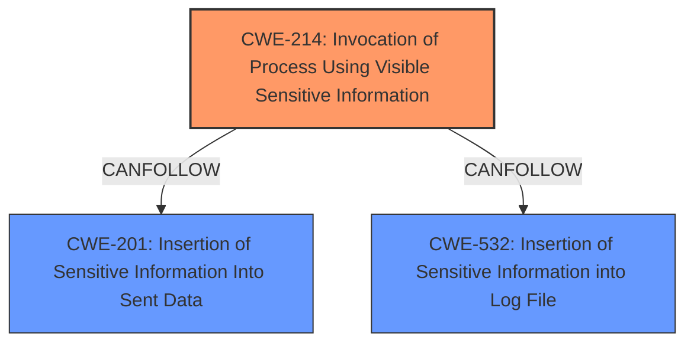

# Analysis for CVE-2020-1753

# Summary
| CWE ID  | CWE Name                                                                              | Confidence | CWE Abstraction Level | CWE Vulnerability Mapping Label | CWE-Vulnerability Mapping Notes |
| :-------- | :------------------------------------------------------------------------------------ | :--------- | :---------------------- | :------------------------------ | :------------------------------ |
| CWE-214   | Invocation of Process Using Visible Sensitive Information                           | 0.9        | Base                    | Primary                         | Allowed                         |
| CWE-201   | Insertion of Sensitive Information Into Sent Data                                   | 0.7        | Base                    | Secondary                       | Allowed                         |
| CWE-532   | Insertion of Sensitive Information into Log File                                    | 0.6        | Base                    | Secondary                       | Allowed                         |

## Evidence and Confidence

*   **Confidence Score:** 0.8
*   **Evidence Strength:** HIGH

## Relationship Analysis
The primary CWE is CWE-214, which directly addresses the core issue of passing sensitive information via command-line arguments. CWE-201 and CWE-532 are secondary as they describe the broader issue of sending sensitive data and writing to logs, respectively, which are consequences of the root cause (CWE-214). There isn't a strong parent-child relationship, more of a cause-and-effect chain where CWE-214 leads to CWE-201/532. All are at the Base level of abstraction, providing appropriate specificity.

## Vulnerability Chain
The vulnerability chain starts with the **incorrect** method of passing sensitive parameters (passwords, tokens) via the command line (CWE-214). This leads to the **insertion** of this sensitive information into the process list, standard output, and log files (CWE-201 and CWE-532). The final impact is the **disclosure** of passwords and tokens.

## Summary of Analysis
The primary assessment focuses on the root cause: the use of command-line arguments to pass sensitive information to `kubectl` (CWE-214). The vulnerability description explicitly states: "Sensitive parameters such as passwords and tokens are passed to kubectl from the command line". The "CVE Reference Links Content Summary" also highlights this, stating that the Ansible `kubectl` connection plugin passes sensitive parameters directly on the command line. This makes CWE-214 the most appropriate primary CWE.

CWE-201 (Insertion of Sensitive Information Into Sent Data) and CWE-532 (Insertion of Sensitive Information into Log File) are included as secondary CWEs because the command-line arguments become part of the process's data, and this data is then often written to logs. While not the direct root cause, they accurately describe how the sensitive information becomes exposed.

Other CWEs were considered but not selected:

*   CWE-522 (Insufficiently Protected Credentials): While credentials are involved, the core issue isn't the protection of the credentials themselves, but how they're passed around.
*   CWE-285 (Improper Authorization) and CWE-863 (Incorrect Authorization): Authorization isn't the primary flaw here. The problem is the exposure of credentials, not a bypass of authorization.
*   CWE-1336 (Improper Neutralization of Special Elements Used in a Template Engine): Template engines are not involved in this vulnerability.
*   CWE-212 (Improper Removal of Sensitive Information Before Storage or Transfer): While relevant, the issue is not the improper *removal* of sensitive data, but its initial, insecure transmission.

The selected CWEs are at the optimal level of specificity because they accurately reflect the root cause and the resulting information exposure. CWE-214 directly captures the flawed use of command-line arguments, while CWE-201 and CWE-532 detail the downstream consequences of this flaw.