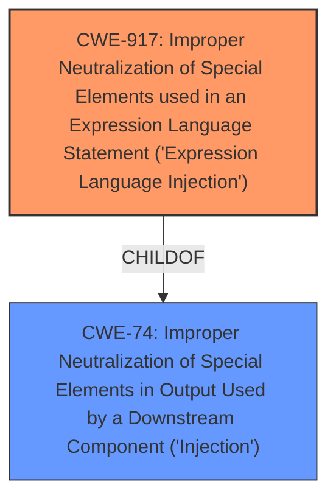

# Enhanced Analysis for CVE-2020-17530

# Summary
| CWE ID  | CWE Name   | Confidence | CWE Abstraction Level | CWE Vulnerability Mapping Label | CWE-Vulnerability Mapping Notes |
|--------------|-------------------------------------------------------------------------------------------------|------------------|---------------------------|------------------------------------|------------------------------------------------------------------------------------------------------------------------------------|
| CWE-917  | Improper Neutralization of Special Elements used in an Expression Language Statement ('Expression Language Injection') | 0.9 | Base   | Primary | Allowed |
| CWE-74  | Improper Neutralization of Special Elements in Output Used by a Downstream Component ('Injection') | 0.6 | Class  | Secondary | Discouraged |

## Evidence and Confidence

*   **Confidence Score:** 0.9
*   **Evidence Strength:** HIGH

## Relationship Analysis
The primary CWE is CWE-917, which is a base-level CWE that is a child of CWE-74, which is a class level CWE. The relationship shows a progression from the general injection to the specific Expression Language Injection. The abstraction level of CWE-917 as a base level is more specific than CWE-74 as a class level.



## Vulnerability Chain
The vulnerability chain starts with the **Forced OGNL evaluation** which leads to **Improper Neutralization of Special Elements used in an Expression Language Statement ('Expression Language Injection')** (CWE-917), ultimately resulting in remote code execution.

## Summary of Analysis
The initial assessment, based on the vulnerability description and supporting evidence, strongly indicates that CWE-917 is the most appropriate classification. The vulnerability description mentions "**Forced OGNL evaluation**" which is an Expression Language. The CVE Reference Links Content Summary confirms this by stating "Forced OGNL evaluation, when evaluated on raw user input in tag attributes, may lead to remote code execution". It also identifies "Double evaluation of tag attributes due to forced OGNL evaluation" as a weakness.

The graph relationships influenced the final selection by showing that CWE-917 is a specific type of injection, making it more suitable than the general CWE-74.

The selected CWE is at the optimal level of specificity because it accurately reflects the root cause of the vulnerability, which is the improper neutralization of special elements in an expression language statement.

Relevant CWE Information:

# Enhanced Context (25 CWEs)

## CWE-74: Improper Neutralization of Special Elements in Output Used by a Downstream Component ('Injection')
**Abstraction Level**: Class
**Similarity Score**: 0.78
**Source**: dense

**Description**:
The product constructs all or part of a command, data structure, or record using externally-influenced input from an upstream component, but it does not neutralize or incorrectly neutralizes special elements that could modify how it is parsed or interpreted when it is sent to a downstream component.

**Mapping Guidance**:
- Usage: Discouraged
- Rationale: CWE-74 is high-level and often misused when lower-level weaknesses are more appropriate.

## CWE-917: Improper Neutralization of Special Elements used in an Expression Language Statement ('Expression Language Injection')
**Abstraction Level**: Base
**Similarity Score**: 0.77
**Source**: dense

**Description**:
The product constructs all or part of an expression language (EL) statement in a framework such as a Java Server Page (JSP) using externally-influenced input from an upstream component, but it does not neutralize or incorrectly neutralizes special elements that could modify the intended EL statement before it is executed.

**Mapping Guidance**:
- Usage: Allowed
- Rationale: This CWE entry is at the Base level of abstraction, which is a preferred level of abstraction for mapping to the root causes of vulnerabilities.

### CWE Selection:

*   **CWE-917: Improper Neutralization of Special Elements used in an Expression Language Statement ('Expression Language Injection')**
    *   **Justification:** The vulnerability description clearly indicates that the issue stems from the **improper handling of special elements within an expression language statement** (OGNL). The "CVE Reference Links Content Summary" confirms that the **forced OGNL evaluation** on raw user input leads to remote code execution. CWE-917 directly addresses this scenario.
    *   **Technical Explanation:** The application fails to neutralize special elements in the OGNL expression, allowing an attacker to inject malicious code that is then executed by the system. This can be achieved by manipulating tag attributes that undergo double evaluation due to forced OGNL evaluation.
    *   **Security Implications:** This vulnerability can lead to remote code execution, allowing an attacker to gain complete control of the affected system.
    *   **Relationship to Other CWEs:** CWE-917 is a child of CWE-74 (Improper Neutralization of Special Elements in Output Used by a Downstream Component ('Injection')), representing a more specific type of injection vulnerability.
    *   **Mapping Guidance:** The MITRE mapping guidance allows the usage of CWE-917, as it is at the Base level of abstraction.
    *   **Confidence:** 0.9

*   **CWE-74: Improper Neutralization of Special Elements in Output Used by a Downstream Component ('Injection')**
    *   **Justification:** While CWE-917 is a more precise match, CWE-74 provides a broader classification for injection vulnerabilities. The vulnerability involves injecting malicious code through user-controlled input, which falls under the general category of improper neutralization of special elements.
    *   **Technical Explanation:** The application does not properly sanitize user-supplied input before using it in a command or data structure that is passed to a downstream component (in this case, the OGNL evaluator). This allows an attacker to inject arbitrary code.
    *   **Security Implications:** Depending on the injected code, this vulnerability can lead to remote code execution, data leakage, or denial of service.
    *   **Relationship to Other CWEs:** CWE-74 is a parent of CWE-917, indicating a hierarchical relationship where CWE-917 is a specific type of CWE-74.
    *   **Mapping Guidance:** The MITRE mapping guidance discourages the usage of CWE-74 when lower-level weaknesses are more appropriate. However, it can still be considered as a secondary classification to highlight the general nature of the injection vulnerability.
    *   **Confidence:** 0.6

### CWEs Considered but Not Used:

*   **CWE-95: Improper Neutralization of Directives in Dynamically Evaluated Code ('Eval Injection')** - While the vulnerability leads to code execution, the root cause is specifically related to OGNL expression evaluation, making CWE-917 a more accurate match.
*   **CWE-116: Improper Encoding or Escaping of Output** - This CWE focuses on encoding/escaping issues, which are not the primary cause of this vulnerability. The core issue is the improper handling of special elements in the OGNL expression, not the encoding of the output.
*   **CWE-425: Direct Request ('Forced Browsing')** - This CWE is not relevant as the vulnerability does not involve bypassing authorization checks or directly requesting resources.
*   **CWE-1321: Improperly Controlled Modification of Object Prototype Attributes ('Prototype Pollution')** - This CWE is not relevant as the vulnerability does not involve the modification of object prototype attributes.
*   **CWE-106: Struts: Plug-in Framework not in Use** - This CWE is too specific to the Struts framework and is not directly related to the root cause of the vulnerability, which is the improper handling of OGNL expressions.
*   **CWE-471: Modification of Assumed-Immutable Data (MAID)** - This CWE is not relevant as the vulnerability does not involve the modification of assumed-immutable data.
*   **CWE-835: Loop with Unreachable Exit Condition ('Infinite Loop')** - This CWE is not relevant as the vulnerability does not involve infinite loops.
*   **CWE-1286: Improper Validation of Syntactic Correctness of Input** - This CWE is not directly applicable, as the issue is not about syntactic correctness but rather the evaluation of special elements in the expression language.


## CWE Relationship Analysis

Current CWEs represent these abstraction levels: .


### Vulnerability Chain Analysis

**Chain starting from CWE-425:**
- 425 (Direct Request ('Forced Browsing')) - ROOT


**Chain starting from CWE-116:**
- 116 (Improper Encoding or Escaping of Output) - ROOT


### CWE Relationship Diagram

```mermaid
graph TD
    classDef primary fill:#f96,stroke:#333,stroke-width:2px
    classDef secondary fill:#69f,stroke:#333
    classDef tertiary fill:#9e9,stroke:#333
```