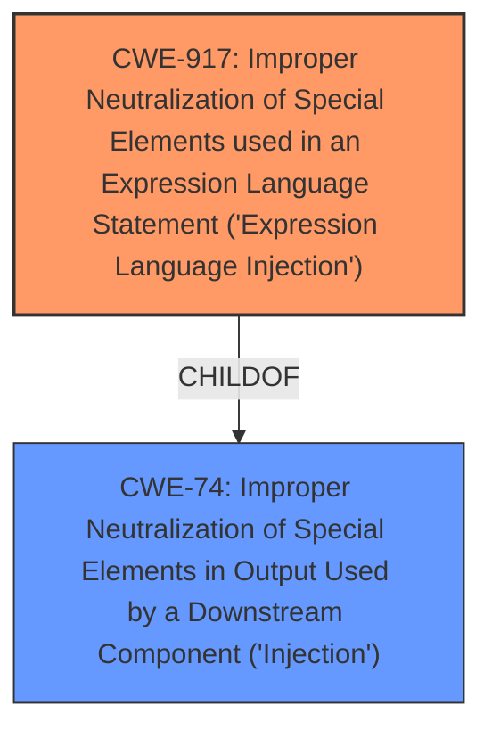

# Analysis for CVE-2020-17530

# Summary
| CWE ID  | CWE Name   | Confidence | CWE Abstraction Level | CWE Vulnerability Mapping Label | CWE-Vulnerability Mapping Notes |
|--------------|-------------------------------------------------------------------------------------------------|------------------|---------------------------|------------------------------------|------------------------------------------------------------------------------------------------------------------------------------|
| CWE-917  | Improper Neutralization of Special Elements used in an Expression Language Statement ('Expression Language Injection') | 0.9 | Base   | Primary | Allowed |
| CWE-74  | Improper Neutralization of Special Elements in Output Used by a Downstream Component ('Injection') | 0.6 | Class  | Secondary | Discouraged |

## Evidence and Confidence

*   **Confidence Score:** 0.9
*   **Evidence Strength:** HIGH

## Relationship Analysis
The primary CWE is CWE-917, which is a base-level CWE that is a child of CWE-74, which is a class level CWE. The relationship shows a progression from the general injection to the specific Expression Language Injection. The abstraction level of CWE-917 as a base level is more specific than CWE-74 as a class level.



## Vulnerability Chain
The vulnerability chain starts with the **Forced OGNL evaluation** which leads to **Improper Neutralization of Special Elements used in an Expression Language Statement ('Expression Language Injection')** (CWE-917), ultimately resulting in remote code execution.

## Summary of Analysis
The initial assessment, based on the vulnerability description and supporting evidence, strongly indicates that CWE-917 is the most appropriate classification. The vulnerability description mentions "**Forced OGNL evaluation**" which is an Expression Language. The CVE Reference Links Content Summary confirms this by stating "Forced OGNL evaluation, when evaluated on raw user input in tag attributes, may lead to remote code execution". It also identifies "Double evaluation of tag attributes due to forced OGNL evaluation" as a weakness.

The graph relationships influenced the final selection by showing that CWE-917 is a specific type of injection, making it more suitable than the general CWE-74.

The selected CWE is at the optimal level of specificity because it accurately reflects the root cause of the vulnerability, which is the improper neutralization of special elements in an expression language statement.

Relevant CWE Information:

# Enhanced Context (25 CWEs)

## CWE-74: Improper Neutralization of Special Elements in Output Used by a Downstream Component ('Injection')
**Abstraction Level**: Class
**Similarity Score**: 0.78
**Source**: dense

**Description**:
The product constructs all or part of a command, data structure, or record using externally-influenced input from an upstream component, but it does not neutralize or incorrectly neutralizes special elements that could modify how it is parsed or interpreted when it is sent to a downstream component.

**Mapping Guidance**:
- Usage: Discouraged
- Rationale: CWE-74 is high-level and often misused when lower-level weaknesses are more appropriate.

## CWE-917: Improper Neutralization of Special Elements used in an Expression Language Statement ('Expression Language Injection')
**Abstraction Level**: Base
**Similarity Score**: 0.77
**Source**: dense

**Description**:
The product constructs all or part of an expression language (EL) statement in a framework such as a Java Server Page (JSP) using externally-influenced input from an upstream component, but it does not neutralize or incorrectly neutralizes special elements that could modify the intended EL statement before it is executed.

**Mapping Guidance**:
- Usage: Allowed
- Rationale: This CWE entry is at the Base level of abstraction, which is a preferred level of abstraction for mapping to the root causes of vulnerabilities.

### CWE Selection:

*   **CWE-917: Improper Neutralization of Special Elements used in an Expression Language Statement ('Expression Language Injection')**
    *   **Justification:** The vulnerability description clearly indicates that the issue stems from the **improper handling of special elements within an expression language statement** (OGNL). The "CVE Reference Links Content Summary" confirms that the **forced OGNL evaluation** on raw user input leads to remote code execution. CWE-917 directly addresses this scenario.
    *   **Technical Explanation:** The application fails to neutralize special elements in the OGNL expression, allowing an attacker to inject malicious code that is then executed by the system. This can be achieved by manipulating tag attributes that undergo double evaluation due to forced OGNL evaluation.
    *   **Security Implications:** This vulnerability can lead to remote code execution, allowing an attacker to gain complete control of the affected system.
    *   **Relationship to Other CWEs:** CWE-917 is a child of CWE-74 (Improper Neutralization of Special Elements in Output Used by a Downstream Component ('Injection')), representing a more specific type of injection vulnerability.
    *   **Mapping Guidance:** The MITRE mapping guidance allows the usage of CWE-917, as it is at the Base level of abstraction.
    *   **Confidence:** 0.9

*   **CWE-74: Improper Neutralization of Special Elements in Output Used by a Downstream Component ('Injection')**
    *   **Justification:** While CWE-917 is a more precise match, CWE-74 provides a broader classification for injection vulnerabilities. The vulnerability involves injecting malicious code through user-controlled input, which falls under the general category of improper neutralization of special elements.
    *   **Technical Explanation:** The application does not properly sanitize user-supplied input before using it in a command or data structure that is passed to a downstream component (in this case, the OGNL evaluator). This allows an attacker to inject arbitrary code.
    *   **Security Implications:** Depending on the injected code, this vulnerability can lead to remote code execution, data leakage, or denial of service.
    *   **Relationship to Other CWEs:** CWE-74 is a parent of CWE-917, indicating a hierarchical relationship where CWE-917 is a specific type of CWE-74.
    *   **Mapping Guidance:** The MITRE mapping guidance discourages the usage of CWE-74 when lower-level weaknesses are more appropriate. However, it can still be considered as a secondary classification to highlight the general nature of the injection vulnerability.
    *   **Confidence:** 0.6

### CWEs Considered but Not Used:

*   **CWE-95: Improper Neutralization of Directives in Dynamically Evaluated Code ('Eval Injection')** - While the vulnerability leads to code execution, the root cause is specifically related to OGNL expression evaluation, making CWE-917 a more accurate match.
*   **CWE-116: Improper Encoding or Escaping of Output** - This CWE focuses on encoding/escaping issues, which are not the primary cause of this vulnerability. The core issue is the improper handling of special elements in the OGNL expression, not the encoding of the output.
*   **CWE-425: Direct Request ('Forced Browsing')** - This CWE is not relevant as the vulnerability does not involve bypassing authorization checks or directly requesting resources.
*   **CWE-1321: Improperly Controlled Modification of Object Prototype Attributes ('Prototype Pollution')** - This CWE is not relevant as the vulnerability does not involve the modification of object prototype attributes.
*   **CWE-106: Struts: Plug-in Framework not in Use** - This CWE is too specific to the Struts framework and is not directly related to the root cause of the vulnerability, which is the improper handling of OGNL expressions.
*   **CWE-471: Modification of Assumed-Immutable Data (MAID)** - This CWE is not relevant as the vulnerability does not involve the modification of assumed-immutable data.
*   **CWE-835: Loop with Unreachable Exit Condition ('Infinite Loop')** - This CWE is not relevant as the vulnerability does not involve infinite loops.
*   **CWE-1286: Improper Validation of Syntactic Correctness of Input** - This CWE is not directly applicable, as the issue is not about syntactic correctness but rather the evaluation of special elements in the expression language.

# Enhanced Query for CVE-2020-17530

## Vulnerability Description
**Forced OGNL evaluation**, when evaluated on raw user input in tag attributes, may lead to remote code execution. Affected software : Apache Struts 2.0.0 - Struts 2.5.25.

### Vulnerability Description Key Phrases
- **rootcause:** **Forced OGNL evaluation**
- **impact:** remote code execution
- **product:** Apache Struts
- **version:** 2.0.0 - Struts 2.5.25

## CVE Reference Links Content Summary
```
{
  "CVE-2020-17530": {
    "description": "Forced OGNL evaluation, when evaluated on raw user input in tag attributes, may lead to remote code execution - similar to S2-059.",
    "root_cause": "Some of the tag's attributes could perform a double evaluation if a developer applied forced OGNL evaluation by using the `%{...}`syntax. Using forced OGNL evaluation on untrusted user input can lead to a Remote Code Execution and security degradation.",
    "weaknesses": [
      "Improper Input Validation",
      "Double evaluation of tag attributes due to forced OGNL evaluation"
    ],
    "impact": "Remote code execution",
    "attack_vectors": [
      "Tag attributes with forced OGNL evaluation (%{...}) containing untrusted user input"
    ],
     "attacker_capabilities": "Attacker must be able to supply malicious user input that is then used in forced OGNL evaluation in tag's attributes"
  }
}
```

## Retriever Results

### Top Combined Results

| Rank | CWE ID | Name | Abstraction | Usage  | Retrievers | Individual Scores |
|------|--------|------|-------------|-------|------------|-------------------|
| 1 | 917 | Improper Neutralization of Special Elements used in an Expression Language Statement ('Expression Language Injection') | Base | Allowed | sparse | 0.282 |
| 2 | 95 | Improper Neutralization of Directives in Dynamically Evaluated Code ('Eval Injection') | Variant | Allowed | sparse | 0.126 |
| 3 | 116 | Improper Encoding or Escaping of Output | Class | Allowed-with-Review | sparse | 0.125 |
| 4 | 425 | Direct Request ('Forced Browsing') | Base | Allowed | sparse | 0.125 |
| 5 | 1321 | Improperly Controlled Modification of Object Prototype Attributes ('Prototype Pollution') | Variant | Allowed | sparse | 0.120 |
| 6 | 106 | Struts: Plug-in Framework not in Use | Variant | Allowed | dense | 0.602 |
| 7 | 471 | Modification of Assumed-Immutable Data (MAID) | Base | Allowed | graph | 0.002 |
| 8 | 835 | Loop with Unreachable Exit Condition ('Infinite Loop') | Base | Allowed | sparse | 0.120 |
| 9 | 1286 | Improper Validation of Syntactic Correctness of Input | Base | Allowed | sparse | 0.115 |
| 10 | 74 | Improper Neutralization of Special Elements in Output Used by a Downstream Component ('Injection') | Class | Discouraged | sparse | 0.113 |


# Complete CWE Specifications


## CWE-917: Improper Neutralization of Special Elements used in an Expression Language Statement ('Expression Language Injection')
**Abstraction:** Base
**Status:** Incomplete

### Description
The product constructs all or part of an expression language (EL) statement in a framework such as a Java Server Page (JSP) using externally-influenced input from an upstream component, but it does not neutralize or incorrectly neutralizes special elements that could modify the intended EL statement before it is executed.

### Extended Description
Frameworks such as Java Server Page (JSP) allow a developer to insert executable expressions within otherwise-static content. When the developer is not aware of the executable nature of these expressions and/or does not disable them, then if an attacker can inject expressions, this could lead to code execution or other unexpected behaviors.

### Alternative Terms
EL Injection

### Relationships
ChildOf -> CWE-77
PeerOf -> CWE-1336
ChildOf -> CWE-74
ChildOf -> CWE-77
ChildOf -> CWE-77

### Mapping Guidance
**Usage:** Allowed
**Rationale:** This CWE entry is at the Base level of abstraction, which is a preferred level of abstraction for mapping to the root causes of vulnerabilities.
**Comments:** Carefully read both the name and description to ensure that this mapping is an appropriate fit. Do not try to 'force' a mapping to a lower-level Base/Variant simply to comply with this preferred level of abstraction.
**Reasons:**
- Acceptable-Use


### Additional Notes
**[Maintenance]** The interrelationships and differences between CWE-917 and CWE-1336 need to be further clarified.

**[Relationship]** In certain versions of Spring 3.0.5 and earlier, there was a vulnerability (CVE-2011-2730) in which Expression Language tags would be evaluated twice, which effectively exposed any application to EL injection. However, even for later versions, this weakness is still possible depending on configuration.


### Observed Examples
- **CVE-2021-44228:** Product does not neutralize ${xyz} style expressions, allowing remote code execution. (log4shell vulnerability in log4j)


## CWE-95: Improper Neutralization of Directives in Dynamically Evaluated Code ('Eval Injection')
**Abstraction:** Variant
**Status:** Incomplete

### Description
The product receives input from an upstream component, but it does not neutralize or incorrectly neutralizes code syntax before using the input in a dynamic evaluation call (e.g. "eval").

### Extended Description
This may allow an attacker to execute arbitrary code, or at least modify what code can be executed.

### Alternative Terms
None

### Relationships
ChildOf -> CWE-94

### Mapping Guidance
**Usage:** Allowed
**Rationale:** This CWE entry is at the Variant level of abstraction, which is a preferred level of abstraction for mapping to the root causes of vulnerabilities.
**Comments:** Carefully read both the name and description to ensure that this mapping is an appropriate fit. Do not try to 'force' a mapping to a lower-level Base/Variant simply to comply with this preferred level of abstraction.
**Reasons:**
- Acceptable-Use


### Additional Notes
**[Other]** Factors: special character errors can play a role in increasing the variety of code that can be injected, although some vulnerabilities do not require special characters at all, e.g. when a single function without arguments can be referenced and a terminator character is not necessary.


### Observed Examples
- **CVE-2024-4181:** Framework for LLM applications allows eval injection via a crafted response from a hosting provider.
- **CVE-2022-2054:** Python compiler uses eval() to execute malicious strings as Python code.
- **CVE-2021-22204:** Chain: regex in EXIF processor code does not correctly determine where a string ends (CWE-625), enabling eval injection (CWE-95), as exploited in the wild per CISA KEV.


## CWE-116: Improper Encoding or Escaping of Output
**Abstraction:** Class
**Status:** Draft

### Description
The product prepares a structured message for communication with another component, but encoding or escaping of the data is either missing or done incorrectly. As a result, the intended structure of the message is not preserved.

### Extended Description


Improper encoding or escaping can allow attackers to change the commands that are sent to another component, inserting malicious commands instead.


Most products follow a certain protocol that uses structured messages for communication between components, such as queries or commands. These structured messages can contain raw data interspersed with metadata or control information. For example, "GET /index.html HTTP/1.1" is a structured message containing a command ("GET") with a single argument ("/index.html") and metadata about which protocol version is being used ("HTTP/1.1").


If an application uses attacker-supplied inputs to construct a structured message without properly encoding or escaping, then the attacker could insert special characters that will cause the data to be interpreted as control information or metadata. Consequently, the component that receives the output will perform the wrong operations, or otherwise interpret the data incorrectly.


### Alternative Terms
Output Sanitization
Output Validation
Output Encoding

### Relationships
ChildOf -> CWE-707
CanPrecede -> CWE-74

### Mapping Guidance
**Usage:** Allowed-with-Review
**Rationale:** This CWE entry is a Class and might have Base-level children that would be more appropriate
**Comments:** Examine children of this entry to see if there is a better fit
**Reasons:**
- Abstraction


### Additional Notes
**[Relationship]** This weakness is primary to all weaknesses related to injection (CWE-74) since the inherent nature of injection involves the violation of structured messages.

**[Relationship]** 

CWE-116 and CWE-20 have a close association because, depending on the nature of the structured message, proper input validation can indirectly prevent special characters from changing the meaning of a structured message. For example, by validating that a numeric ID field should only contain the 0-9 characters, the programmer effectively prevents injection attacks.


However, input validation is not always sufficient, especially when less stringent data types must be supported, such as free-form text. Consider a SQL injection scenario in which a last name is inserted into a query. The name "O'Reilly" would likely pass the validation step since it is a common last name in the English language. However, it cannot be directly inserted into the database because it contains the "'" apostrophe character, which would need to be escaped or otherwise neutralized. In this case, stripping the apostrophe might reduce the risk of SQL injection, but it would produce incorrect behavior because the wrong name would be recorded.


**[Terminology]** The usage of the "encoding" and "escaping" terms varies widely. For example, in some programming languages, the terms are used interchangeably, while other languages provide APIs that use both terms for different tasks. This overlapping usage extends to the Web, such as the "escape" JavaScript function whose purpose is stated to be encoding. The concepts of encoding and escaping predate the Web by decades. Given such a context, it is difficult for CWE to adopt a consistent vocabulary that will not be misinterpreted by some constituency.

**[Theoretical]** This is a data/directive boundary error in which data boundaries are not sufficiently enforced before it is sent to a different control sphere.

**[Research Gap]** While many published vulnerabilities are related to insufficient output encoding, there is such an emphasis on input validation as a protection mechanism that the underlying causes are rarely described. Within CVE, the focus is primarily on well-understood issues like cross-site scripting and SQL injection. It is likely that this weakness frequently occurs in custom protocols that support multiple encodings, which are not necessarily detectable with automated techniques.


### Observed Examples
- **CVE-2021-41232:** Chain: authentication routine in Go-based agile development product does not escape user name (CWE-116), allowing LDAP injection (CWE-90)
- **CVE-2008-4636:** OS command injection in backup software using shell metacharacters in a filename; correct behavior would require that this filename could not be changed.
- **CVE-2008-0769:** Web application does not set the charset when sending a page to a browser, allowing for XSS exploitation when a browser chooses an unexpected encoding.


## CWE-425: Direct Request ('Forced Browsing')
**Abstraction:** Base
**Status:** Incomplete

### Description
The web application does not adequately enforce appropriate authorization on all restricted URLs, scripts, or files.

### Extended Description
Web applications susceptible to direct request attacks often make the false assumption that such resources can only be reached through a given navigation path and so only apply authorization at certain points in the path.

### Alternative Terms
forced browsing: The "forced browsing" term could be misinterpreted to include weaknesses such as CSRF or XSS, so its use is discouraged.

### Relationships
ChildOf -> CWE-862
ChildOf -> CWE-862
ChildOf -> CWE-288
ChildOf -> CWE-424
CanPrecede -> CWE-471
CanPrecede -> CWE-98

### Mapping Guidance
**Usage:** Allowed
**Rationale:** This CWE entry is at the Base level of abstraction, which is a preferred level of abstraction for mapping to the root causes of vulnerabilities.
**Comments:** Carefully read both the name and description to ensure that this mapping is an appropriate fit. Do not try to 'force' a mapping to a lower-level Base/Variant simply to comply with this preferred level of abstraction.
**Reasons:**
- Acceptable-Use


### Additional Notes
**[Relationship]** Overlaps Modification of Assumed-Immutable Data (MAID), authorization errors, container errors; often primary to other weaknesses such as XSS and SQL injection.

**[Theoretical]** "Forced browsing" is a step-based manipulation involving the omission of one or more steps, whose order is assumed to be immutable. The application does not verify that the first step was performed successfully before the second step. The consequence is typically "authentication bypass" or "path disclosure," although it can be primary to all kinds of weaknesses, especially in languages such as PHP, which allow external modification of assumed-immutable variables.


### Observed Examples
- **CVE-2022-29238:** Access-control setting in web-based document collaboration tool is not properly implemented by the code, which prevents listing hidden directories but does not prevent direct requests to files in those directories.
- **CVE-2022-23607:** Python-based HTTP library did not scope cookies to a particular domain such that "supercookies" could be sent to any domain on redirect.
- **CVE-2004-2144:** Bypass authentication via direct request.


## CWE-1321: Improperly Controlled Modification of Object Prototype Attributes ('Prototype Pollution')
**Abstraction:** Variant
**Status:** Incomplete

### Description
The product receives input from an upstream component that specifies attributes that are to be initialized or updated in an object, but it does not properly control modifications of attributes of the object prototype.

### Extended Description


By adding or modifying attributes of an object prototype, it is possible to create attributes that exist on every object, or replace critical attributes with malicious ones. This can be problematic if the product depends on existence or non-existence of certain attributes, or uses pre-defined attributes of object prototype (such as hasOwnProperty, toString or valueOf).


This weakness is usually exploited by using a special attribute of objects called proto, constructor or prototype. Such attributes give access to the object prototype. This weakness is often found in code that assigns object attributes based on user input, or merges or clones objects recursively.


### Alternative Terms
None

### Relationships
ChildOf -> CWE-915
ChildOf -> CWE-913
CanPrecede -> CWE-471

### Mapping Guidance
**Usage:** Allowed
**Rationale:** This CWE entry is at the Variant level of abstraction, which is a preferred level of abstraction for mapping to the root causes of vulnerabilities.
**Comments:** Carefully read both the name and description to ensure that this mapping is an appropriate fit. Do not try to 'force' a mapping to a lower-level Base/Variant simply to comply with this preferred level of abstraction.
**Reasons:**
- Acceptable-Use


### Observed Examples
- **CVE-2018-3721:** Prototype pollution by merging objects.
- **CVE-2019-10744:** Prototype pollution by setting default values to object attributes recursively.
- **CVE-2019-11358:** Prototype pollution by merging objects recursively.


## CWE-106: Struts: Plug-in Framework not in Use
**Abstraction:** Variant
**Status:** Draft

### Description
When an application does not use an input validation framework such as the Struts Validator, there is a greater risk of introducing weaknesses related to insufficient input validation.

### Extended Description


Unchecked input is the leading cause of vulnerabilities in J2EE applications. Unchecked input leads to cross-site scripting, process control, and SQL injection vulnerabilities, among others.


Although J2EE applications are not generally susceptible to memory corruption attacks, if a J2EE application interfaces with native code that does not perform array bounds checking, an attacker may be able to use an input validation mistake in the J2EE application to launch a buffer overflow attack.


### Alternative Terms
None

### Relationships
ChildOf -> CWE-1173
ChildOf -> CWE-20

### Mapping Guidance
**Usage:** Allowed
**Rationale:** This CWE entry is at the Variant level of abstraction, which is a preferred level of abstraction for mapping to the root causes of vulnerabilities.
**Comments:** Carefully read both the name and description to ensure that this mapping is an appropriate fit. Do not try to 'force' a mapping to a lower-level Base/Variant simply to comply with this preferred level of abstraction.
**Reasons:**
- Acceptable-Use


## CWE-471: Modification of Assumed-Immutable Data (MAID)
**Abstraction:** Base
**Status:** Draft

### Description
The product does not properly protect an assumed-immutable element from being modified by an attacker.

### Extended Description
This occurs when a particular input is critical enough to the functioning of the application that it should not be modifiable at all, but it is. Certain resources are often assumed to be immutable when they are not, such as hidden form fields in web applications, cookies, and reverse DNS lookups.

### Alternative Terms
None

### Relationships
ChildOf -> CWE-664

### Mapping Guidance
**Usage:** Allowed
**Rationale:** This CWE entry is at the Base level of abstraction, which is a preferred level of abstraction for mapping to the root causes of vulnerabilities.
**Comments:** Carefully read both the name and description to ensure that this mapping is an appropriate fit. Do not try to 'force' a mapping to a lower-level Base/Variant simply to comply with this preferred level of abstraction.
**Reasons:**
- Acceptable-Use


### Additional Notes
**[Relationship]** MAID issues can be primary to many other weaknesses, and they are a major factor in languages that provide easy access to internal program constructs, such as PHP's register_globals and similar features. However, MAID issues can also be resultant from weaknesses that modify internal state; for example, a program might validate some data and store it in memory, but a buffer overflow could overwrite that validated data, leading to a change in program logic.

**[Theoretical]** There are many examples where the MUTABILITY property is a major factor in a vulnerability.


### Observed Examples
- **CVE-2002-1757:** Relies on $PHP_SELF variable for authentication.
- **CVE-2005-1905:** Gain privileges by modifying assumed-immutable code addresses that are accessed by a driver.


## CWE-835: Loop with Unreachable Exit Condition ('Infinite Loop')
**Abstraction:** Base
**Status:** Incomplete

### Description
The product contains an iteration or loop with an exit condition that cannot be reached, i.e., an infinite loop.

### Extended Description
Not provided

### Alternative Terms
None

### Relationships
ChildOf -> CWE-834
ChildOf -> CWE-834

### Mapping Guidance
**Usage:** Allowed
**Rationale:** This CWE entry is at the Base level of abstraction, which is a preferred level of abstraction for mapping to the root causes of vulnerabilities.
**Comments:** Carefully read both the name and description to ensure that this mapping is an appropriate fit. Do not try to 'force' a mapping to a lower-level Base/Variant simply to comply with this preferred level of abstraction.
**Reasons:**
- Acceptable-Use


### Observed Examples
- **CVE-2022-22224:** Chain: an operating system does not properly process malformed Open Shortest Path First (OSPF) Type/Length/Value Identifiers (TLV) (CWE-703), which can cause the process to enter an infinite loop (CWE-835)
- **CVE-2022-25304:** A Python machine communication platform did not account for receiving a malformed packet with a null size, causing the receiving function to never update the message buffer and be caught in an infinite loop.
- **CVE-2011-1027:** Chain: off-by-one error (CWE-193) leads to infinite loop (CWE-835) using invalid hex-encoded characters.


## CWE-1286: Improper Validation of Syntactic Correctness of Input
**Abstraction:** Base
**Status:** Incomplete

### Description
The product receives input that is expected to be well-formed - i.e., to comply with a certain syntax - but it does not validate or incorrectly validates that the input complies with the syntax.

### Extended Description


Often, complex inputs are expected to follow a particular syntax, which is either assumed by the input itself, or declared within metadata such as headers. The syntax could be for data exchange formats, markup languages, or even programming languages. When untrusted input is not properly validated for the expected syntax, attackers could cause parsing failures, trigger unexpected errors, or expose latent vulnerabilities that might not be directly exploitable if the input had conformed to the syntax.


### Alternative Terms
None

### Relationships
ChildOf -> CWE-20

### Mapping Guidance
**Usage:** Allowed
**Rationale:** This CWE entry is at the Base level of abstraction, which is a preferred level of abstraction for mapping to the root causes of vulnerabilities.
**Comments:** Carefully read both the name and description to ensure that this mapping is an appropriate fit. Do not try to 'force' a mapping to a lower-level Base/Variant simply to comply with this preferred level of abstraction.
**Reasons:**
- Acceptable-Use


### Additional Notes
**[Maintenance]** This entry is still under development and will continue to see updates and content improvements.


### Observed Examples
- **CVE-2016-4029:** Chain: incorrect validation of intended decimal-based IP address format (CWE-1286) enables parsing of octal or hexadecimal formats (CWE-1389), allowing bypass of an SSRF protection mechanism (CWE-918).
- **CVE-2007-5893:** HTTP request with missing protocol version number leads to crash


## CWE-74: Improper Neutralization of Special Elements in Output Used by a Downstream Component ('Injection')
**Abstraction:** Class
**Status:** Incomplete

### Description
The product constructs all or part of a command, data structure, or record using externally-influenced input from an upstream component, but it does not neutralize or incorrectly neutralizes special elements that could modify how it is parsed or interpreted when it is sent to a downstream component.

### Extended Description
Software or other automated logic has certain assumptions about what constitutes data and control respectively. It is the lack of verification of these assumptions for user-controlled input that leads to injection problems. Injection problems encompass a wide variety of issues -- all mitigated in very different ways and usually attempted in order to alter the control flow of the process. For this reason, the most effective way to discuss these weaknesses is to note the distinct features that classify them as injection weaknesses. The most important issue to note is that all injection problems share one thing in common -- i.e., they allow for the injection of control plane data into the user-controlled data plane. This means that the execution of the process may be altered by sending code in through legitimate data channels, using no other mechanism. While buffer overflows, and many other flaws, involve the use of some further issue to gain execution, injection problems need only for the data to be parsed.

### Alternative Terms
None

### Relationships
ChildOf -> CWE-707

### Mapping Guidance
**Usage:** Discouraged
**Rationale:** CWE-74 is high-level and often misused when lower-level weaknesses are more appropriate.
**Comments:** Examine the children and descendants of this entry to find a more precise mapping.
**Reasons:**
- Frequent Misuse
- Abstraction


### Additional Notes
**[Theoretical]** Many people treat injection only as an input validation problem (CWE-20) because many people do not distinguish between the consequence/attack (injection) and the protection mechanism that prevents the attack from succeeding. However, input validation is only one potential protection mechanism (output encoding is another), and there is a chaining relationship between improper input validation and the improper enforcement of the structure of messages to other components. Other issues not directly related to input validation, such as race conditions, could similarly impact message structure.


### Observed Examples
- **CVE-2024-5184:** API service using a large generative AI model allows direct prompt injection to leak hard-coded system prompts or execute other prompts.
- **CVE-2022-36069:** Python-based dependency management tool avoids OS command injection when generating Git commands but allows injection of optional arguments with input beginning with a dash (CWE-88), potentially allowing for code execution.
- **CVE-1999-0067:** Canonical example of OS command injection. CGI program does not neutralize "|" metacharacter when invoking a phonebook program.

