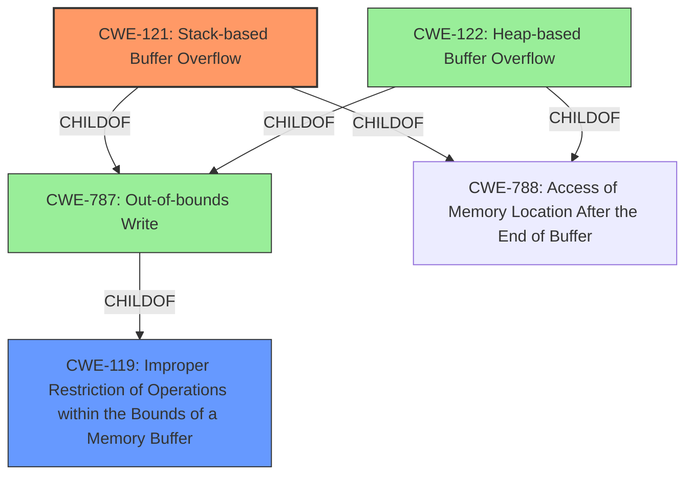

# Enhanced Analysis for CVE-2020-17541

# Summary
| CWE ID | CWE Name | Confidence | CWE Abstraction Level | CWE Vulnerability Mapping Label | CWE-Vulnerability Mapping Notes |
|---|---|---|---|---|---|
| CWE-121 | Stack-based Buffer Overflow | 1.0 | Variant | Primary CWE | Allowed |
| CWE-119 | Improper Restriction of Operations within the Bounds of a Memory Buffer | 0.5 | Class | Secondary Candidate | Discouraged |

## Evidence and Confidence

*   **Confidence Score:** 1.0
*   **Evidence Strength:** HIGH

## Relationship Analysis
The primary CWE selected is CWE-121, which is a variant of CWE-787 (Out-of-bounds Write). CWE-787 is a parent of CWE-121. CWE-787 is also a parent of CWE-122 (Heap-based Buffer Overflow). Both CWE-121 and CWE-122 are children of CWE-788. CWE-787 is a child of CWE-119 (Improper Restriction of Operations within the Bounds of a Memory Buffer), which is a more general class. The relationships show a clear path from general buffer handling issues (CWE-119) to specific types of out-of-bounds writes, with CWE-121 being the most specific and accurate based on the provided description.



## Vulnerability Chain
The vulnerability chain starts with a malformed JPEG file being processed, leading to a **stack-based buffer overflow** in the `encode_one_block` function, and potentially resulting in arbitrary code execution or denial of service. The root cause is the **stack-based buffer overflow** and the impact is arbitrary code execution or denial of service.

## Summary of Analysis
The initial analysis identified a **stack-based buffer overflow** vulnerability. The "Vulnerability Description Key Phrases" section explicitly mentions "**stack-based buffer overflow**" as the **weakness**. The "CVE Reference Links Content Summary" section confirms that the overflow occurs in the `encode_one_block` function due to writing to the `_buffer` variable on the stack.

The retriever results listed CWE-121 (Stack-based Buffer Overflow) at rank 3. The primary match was CWE-119 (Improper Restriction of Operations within the Bounds of a Memory Buffer), but since the evidence clearly points to a stack-based overflow, CWE-121 is more appropriate. CWE-121 is a Variant of CWE-787 (Out-of-bounds Write) and a child of CWE-119.

CWE-120 (Buffer Copy without Checking Size of Input ('Classic Buffer Overflow')) was considered but rejected because the description doesn't explicitly mention a buffer copy operation without size checking. While this might be the underlying mechanism, the available information focuses on the location of the overflow (stack) rather than the specific copy operation.

CWE-190 (Integer Overflow or Wraparound) was considered but rejected as there is no mention of integer overflow in the description.

The selection of CWE-121 is at the optimal level of specificity because the description explicitly states that the overflow is stack-based. The evidence supports this classification with high confidence.

Relevant CWE Information:

# Enhanced Context (25 CWEs)

## CWE-805: Buffer Access with Incorrect Length Value
**Abstraction Level**: Base
**Similarity Score**: 0.78

## CWE-191: Integer Underflow (Wrap or Wraparound)
**Abstraction Level**: Base
**Similarity Score**: 0.78

## CWE-131: Incorrect Calculation of Buffer Size
**Abstraction Level**: Base
**Similarity Score**: 0.78

## CWE-130: Improper Handling of Length Parameter Inconsistency
**Abstraction Level**: Base
**Similarity Score**: 0.77

## CWE-124: Buffer Underwrite ('Buffer Underflow')
**Abstraction Level**: Base
**Similarity Score**: 0.77

## CWE-193: Off-by-one Error
**Abstraction Level**: Base
**Similarity Score**: 0.76

## CWE-126: Buffer Over-read
**Abstraction Level**: Variant
**Similarity Score**: 0.76

## CWE-125: Out-of-bounds Read
**Abstraction Level**: Base
**Similarity Score**: 0.75

## CWE-197: Numeric Truncation Error
**Abstraction Level**: Base
**Similarity Score**: 0.75

## CWE-681: Incorrect Conversion between Numeric Types
**Abstraction Level**: Base
**Similarity Score**: 0.75

## CWE-190: Integer Overflow or Wraparound
**Abstraction Level**: Base
**Similarity Score**: 6753.09

## CWE-125: Out-of-bounds Read
**Abstraction Level**: Base
**Similarity Score**: 6414.90

## CWE-193: Off-by-one Error
**Abstraction Level**: Base
**Similarity Score**: 6306.15

## CWE-1284: Improper Validation of Specified Quantity in Input
**Abstraction Level**: Base
**Similarity Score**: 6174.90

## CWE-119: Improper Restriction of Operations within the Bounds of a Memory Buffer
**Abstraction Level**: Class
**Similarity Score**: 6103.08

## CWE-128: Wrap-around Error
**Abstraction Level**: base
**Similarity Score**: 5.03

## CWE-120: Buffer Copy without Checking Size of Input ('Classic Buffer Overflow')
**Abstraction Level**: base
**Similarity Score**: 4.82

## CWE-123: Write-what-where Condition
**Abstraction Level**: base
**Similarity Score**: 4.33

## CWE-170: Improper Null Termination
**Abstraction Level**: base
**Similarity Score**: 4.33

## CWE-1284: Improper Validation of Specified Quantity in Input
**Abstraction Level**: base
**Similarity Score**: 4.33

## CWE-617: Reachable Assertion
**Abstraction Level**: base
**Similarity Score**: 4.33

## CWE-195: Signed to Unsigned Conversion Error
**Abstraction Level**: variant
**Similarity Score**: 3.88

## CWE-1339: Insufficient Precision or Accuracy of a Real Number
**Abstraction Level**: base
**Similarity Score**: 3.57

## CWE-190: Integer Overflow or Wraparound
**Abstraction Level**: Base
**Similarity Score**: 3.32

## CWE-787: Out-of-bounds Write
**Abstraction Level**: base
**Similarity Score**: 3.30


## CWE Relationship Analysis

Current CWEs represent these abstraction levels: .


### Vulnerability Chain Analysis

**Chain starting from CWE-787:**
- 787 (Out-of-bounds Write) - ROOT


**Chain starting from CWE-123:**
- 123 (Write-what-where Condition) - ROOT


### CWE Relationship Diagram

```mermaid
graph TD
    classDef primary fill:#f96,stroke:#333,stroke-width:2px
    classDef secondary fill:#69f,stroke:#333
    classDef tertiary fill:#9e9,stroke:#333
```