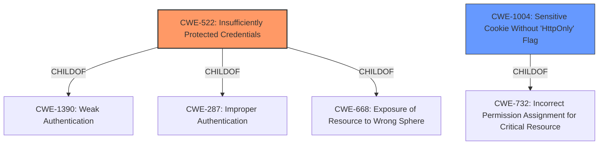

# Enhanced Analysis for CVE-2020-1761

# Summary
| CWE ID | CWE Name | Confidence | CWE Abstraction Level | CWE Vulnerability Mapping Label | CWE-Vulnerability Mapping Notes |
|---|---|---|---|---|---|
| CWE-522 | Insufficiently Protected Credentials | 0.9 | Class | Primary | Allowed-with-Review |
| CWE-1004 | Sensitive Cookie Without 'HttpOnly' Flag | 0.7 | Variant | Secondary | Allowed |

## Evidence and Confidence

*   **Confidence Score:** 0.8
*   **Evidence Strength:** HIGH

## Relationship Analysis
The primary CWE is CWE-522 (Insufficiently Protected Credentials), which is a Class-level CWE. The secondary CWE is CWE-1004 (Sensitive Cookie Without 'HttpOnly' Flag), which is a Variant-level CWE.



## Vulnerability Chain
The vulnerability chain starts with the **insecure storage** of the access token in the browser's local storage, leading to potential **access token theft** and ultimately **account compromise**.
  - **Root Cause**: Insecure storage of access tokens in local storage.
  - **Weakness**: Accessible to malicious scripts and attackers with physical access.
  - **Impact**: Access token theft, account compromise.

## Summary of Analysis
The primary weakness lies in the **insufficient protection of credentials**, specifically the access token stored in the browser's local storage. This aligns with CWE-522 (Insufficiently Protected Credentials). The vulnerability description explicitly states that the access token is stored in the browser's local storage, making it accessible to attackers via physical access or XSS attacks. The impact is that attackers can steal the access token and compromise accounts.

The retriever results also support CWE-522 as a potential match.

CWE-1004 (Sensitive Cookie Without 'HttpOnly' Flag) was considered as a secondary weakness. While the vulnerability description doesn't mention cookies, the storage of the access token in local storage has a similar impact as storing sensitive information in a cookie without the HttpOnly flag. Both scenarios expose sensitive information to malicious scripts. However, since local storage is being used, rather than a cookie, this is a secondary concern.

Other CWEs considered but not used:
*   CWE-358: Improperly Implemented Security Check for Standard - While there may be a failure to properly implement security checks, it is better described by CWE-522.
*   CWE-287: Improper Authentication - While related, this is a broader category and CWE-522 is a more precise fit.
*   CWE-488: Exposure of Data Element to Wrong Session, CWE-567: Unsynchronized Access to Shared Data in a Multithreaded Context - These CWEs are not relevant as the vulnerability does not involve session management or multithreading issues.

The selection of CWE-522 is at the optimal level of specificity as it directly addresses the **insufficient protection of credentials** due to the storage of access tokens in local storage. CWE-1004 is a reasonable secondary concern.

Relevant CWE Information:

# Enhanced Context (25 CWEs)
The following CWEs were identified as potentially relevant to this vulnerability:

## CWE-522: Insufficiently Protected Credentials
**Abstraction Level**: Class
**Similarity Score**: 0.110
**Source**: sparse

**Description**:
The product transmits or stores authentication credentials, but it uses an insecure method that is susceptible to unauthorized interception and/or retrieval.

**Mapping Guidance**:
- Usage: Allowed-with-Review
- Rationale: This CWE entry is a Class and might have Base-level children that would be more appropriate

## CWE-1004: Sensitive Cookie Without 'HttpOnly' Flag
**Abstraction Level**: Variant
**Similarity Score**: 0.106
**Source**: sparse

**Description**:
The product uses a cookie to store sensitive information, but the cookie is not marked with the HttpOnly flag.

**Mapping Guidance**:
- Usage: Allowed
- Rationale: This CWE entry is at the Variant level of abstraction, which is a preferred level of abstraction for mapping to the root causes of vulnerabilities.


## CWE Relationship Analysis

Current CWEs represent these abstraction levels: .


### Vulnerability Chain Analysis

**Chain starting from CWE-732:**
- 732 (Incorrect Permission Assignment for Critical Resource) - ROOT


**Chain starting from CWE-567:**
- 567 (Unsynchronized Access to Shared Data in a Multithreaded Context) - ROOT


### CWE Relationship Diagram

```mermaid
graph TD
    classDef primary fill:#f96,stroke:#333,stroke-width:2px
    classDef secondary fill:#69f,stroke:#333
    classDef tertiary fill:#9e9,stroke:#333
```