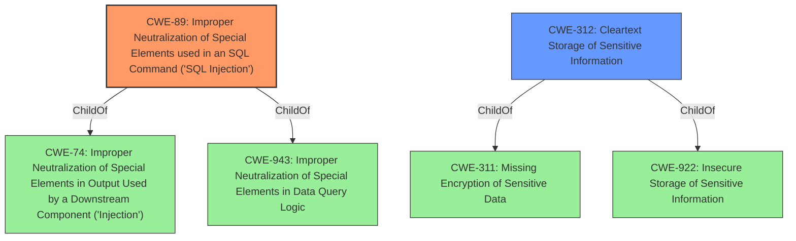

# Analysis for CVE-2020-18081

# Summary
| CWE ID | CWE Name | Confidence | CWE Abstraction Level | CWE Vulnerability Mapping Label | CWE-Vulnerability Mapping Notes |
|---|---|---|---|---|---|
| CWE-89 | Improper Neutralization of Special Elements used in an SQL Command ('SQL Injection') | 1.0 | Base | Allowed | Primary CWE |
| CWE-312 | Cleartext Storage of Sensitive Information | 0.75 | Base | Allowed | Secondary Candidate |

## Evidence and Confidence

*   **Confidence Score:** 0.9
*   **Evidence Strength:** HIGH

## Relationship Analysis
The primary CWE is CWE-89 **(Improper Neutralization of Special Elements used in an SQL Command ('SQL Injection'))**, which is a Base level CWE. This is related to CWE-74 and CWE-943 as parents. CWE-312 **(Cleartext Storage of Sensitive Information)** is a child of CWE-311 and CWE-922, both of which relate to sensitive data handling. The relationship between CWE-89 and CWE-312 is not direct, but consequential, since the SQL injection leads to exposure of plaintext passwords.

## Vulnerability Chain
The vulnerability chain starts with the **Improper Neutralization of Special Elements used in an SQL Command ('SQL Injection')** (CWE-89) due to inadequate input validation. This allows an attacker to inject malicious SQL code, leading to the retrieval of user passwords stored in **Cleartext Storage of Sensitive Information** (CWE-312). The initial root cause is the SQL injection, and the impact is the exposure of plaintext passwords.

## Summary of Analysis
Initially, the analysis focused on the provided information about the vulnerability in SEMCMS 3.8. The key point is that the `checkuser` function is vulnerable to SQL injection, which allows attackers to retrieve user passwords in plaintext.

The vulnerability description clearly states that the **impact** is "obtain the password in plaintext" via a "SQL query". The CVE Reference Links Content Summary confirms this, highlighting that the **root cause** is a SQL injection flaw. The provided SQL query example shows how an attacker can bypass authentication due to insufficient input sanitization. The `verify_str()` function filters `=` but not `-`, allowing the bypass.

Given the evidence, **CWE-89 (Improper Neutralization of Special Elements used in an SQL Command ('SQL Injection'))** is the primary and most accurate classification. It precisely describes how the SQL injection flaw allows unauthorized access to data. The Retriever Results also supports this, with CWE-89 having a high score.

Additionally, since the passwords are being obtained in plaintext due to the SQL Injection, CWE-312 (Cleartext Storage of Sensitive Information) is a secondary concern, but the primary weakness is the method used to get the information which is SQL Injection.

Other considered CWEs, such as CWE-259 **(Use of Hard-coded Password)**, CWE-798 **(Use of Hard-coded Credentials)**, and CWE-916 **(Use of Password Hash With Insufficient Computational Effort)**, were rejected because they do not accurately describe the vulnerability. The passwords are not hard-coded, nor is the issue related to password hashing.

The final classification is based on direct evidence from the vulnerability description and the CVE Reference Links Content Summary. The chosen CWEs are at the optimal level of specificity, accurately reflecting the root cause and impact of the vulnerability.

Relevant CWE Information:
# Enhanced Context (25 CWEs)
The following CWEs were identified as potentially relevant to this vulnerability:

## CWE-798: Use of Hard-coded Credentials
**Abstraction Level**: Base
**Similarity Score**: 0.80
**Source**: dense

**Description**:
The product contains hard-coded credentials, such as a password or cryptographic key.

**Mapping Guidance**:
- Usage: Allowed
- Rationale: This CWE entry is at the Base level of abstraction, which is a preferred level of abstraction for mapping to the root causes of vulnerabilities.

## CWE-916: Use of Password Hash With Insufficient Computational Effort
**Abstraction Level**: Base
**Similarity Score**: 0.79
**Source**: dense

**Description**:
The product generates a hash for a password, but it uses a scheme that does not provide a sufficient level of computational effort that would make password cracking attacks infeasible or expensive.

**Mapping Guidance**:
- Usage: Allowed
- Rationale: This CWE entry is at the Base level of abstraction, which is a preferred level of abstraction for mapping to the root causes of vulnerabilities.

## CWE-312: Cleartext Storage of Sensitive Information
**Abstraction Level**: Base
**Similarity Score**: 0.79
**Source**: dense

**Description**:
The product stores sensitive information in cleartext within a resource that might be accessible to another control sphere.

**Mapping Guidance**:
- Usage: Allowed
- Rationale: This CWE entry is at the Base level of abstraction, which is a preferred level of abstraction for mapping to the root causes of vulnerabilities.

## CWE-1391: Use of Weak Credentials
**Abstraction Level**: Class
**Similarity Score**: 0.79
**Source**: dense

**Description**:
The product uses weak credentials (such as a default key or hard-coded password) that can be calculated, derived, reused, or guessed by an attacker.

**Mapping Guidance**:
- Usage: Allowed-with-Review
- Rationale: This CWE entry is a Class and might have Base-level children that would be more appropriate

## CWE-319: Cleartext Transmission of Sensitive Information
**Abstraction Level**: Base
**Similarity Score**: 0.77
**Source**: dense

**Description**:
The product transmits sensitive or security-critical data in cleartext in a communication channel that can be sniffed by unauthorized actors.

**Mapping Guidance**:
- Usage: Allowed
- Rationale: This CWE entry is at the Base level of abstraction, which is a preferred level of abstraction for mapping to the root causes of vulnerabilities.

## CWE-836: Use of Password Hash Instead of Password for Authentication
**Abstraction Level**: Base
**Similarity Score**: 0.76
**Source**: dense

**Description**:
The product records password hashes in a data store, receives a hash of a password from a client, and compares the supplied hash to the hash obtained from the data store.

**Mapping Guidance**:
- Usage: Allowed
- Rationale: This CWE entry is at the Base level of abstraction, which is a preferred level of abstraction for mapping to the root causes of vulnerabilities.

## CWE-257: Storing Passwords in a Recoverable Format
**Abstraction Level**: Base
**Similarity Score**: 0.76
**Source**: dense

**Description**:
The storage of passwords in a recoverable format makes them subject to password reuse attacks by malicious users. In fact, it should be noted that recoverable encrypted passwords provide no significant benefit over plaintext passwords since they are subject not only to reuse by malicious attackers but also by malicious insiders. If a system administrator can recover a password directly, or use a brute force search on the available information, the administrator can use the password on other accounts.

**Mapping Guidance**:
- Usage: Allowed
- Rationale: This CWE entry is at the Base level of abstraction, which is a preferred level of abstraction for mapping to the root causes of vulnerabilities.

## CWE-259: Use of Hard-coded Password
**Abstraction Level**: Variant
**Similarity Score**: 0.76
**Source**: dense

**Description**:
The product contains a hard-coded password, which it uses for its own inbound authentication or for outbound communication to external components.

**Mapping Guidance**:
- Usage: Allowed
- Rationale: This CWE entry is at the Variant level of abstraction, which is a preferred level of abstraction for mapping to the root causes of vulnerabilities.

## CWE-1392: Use of Default Credentials
**Abstraction Level**: Base
**Similarity Score**: 0.76
**Source**: