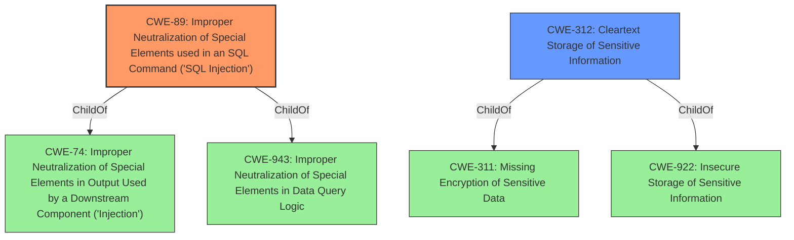

# Analysis for CVE-2020-18081

# Summary
| CWE ID | CWE Name | Confidence | CWE Abstraction Level | CWE Vulnerability Mapping Label | CWE-Vulnerability Mapping Notes |
|---|---|---|---|---|---|
| CWE-89 | Improper Neutralization of Special Elements used in an SQL Command ('SQL Injection') | 1.0 | Base | Allowed | Primary CWE |
| CWE-312 | Cleartext Storage of Sensitive Information | 0.75 | Base | Allowed | Secondary Candidate |

## Evidence and Confidence

*   **Confidence Score:** 0.9
*   **Evidence Strength:** HIGH

## Relationship Analysis
The primary CWE is CWE-89 **(Improper Neutralization of Special Elements used in an SQL Command ('SQL Injection'))**, which is a Base level CWE. This is related to CWE-74 and CWE-943 as parents. CWE-312 **(Cleartext Storage of Sensitive Information)** is a child of CWE-311 and CWE-922, both of which relate to sensitive data handling. The relationship between CWE-89 and CWE-312 is not direct, but consequential, since the SQL injection leads to exposure of plaintext passwords.



## Vulnerability Chain
The vulnerability chain starts with the **Improper Neutralization of Special Elements used in an SQL Command ('SQL Injection')** (CWE-89) due to inadequate input validation. This allows an attacker to inject malicious SQL code, leading to the retrieval of user passwords stored in **Cleartext Storage of Sensitive Information** (CWE-312). The initial root cause is the SQL injection, and the impact is the exposure of plaintext passwords.

## Summary of Analysis
Initially, the analysis focused on the provided information about the vulnerability in SEMCMS 3.8. The key point is that the `checkuser` function is vulnerable to SQL injection, which allows attackers to retrieve user passwords in plaintext.

The vulnerability description clearly states that the **impact** is "obtain the password in plaintext" via a "SQL query". The CVE Reference Links Content Summary confirms this, highlighting that the **root cause** is a SQL injection flaw. The provided SQL query example shows how an attacker can bypass authentication due to insufficient input sanitization. The `verify_str()` function filters `=` but not `-`, allowing the bypass.

Given the evidence, **CWE-89 (Improper Neutralization of Special Elements used in an SQL Command ('SQL Injection'))** is the primary and most accurate classification. It precisely describes how the SQL injection flaw allows unauthorized access to data. The Retriever Results also supports this, with CWE-89 having a high score.

Additionally, since the passwords are being obtained in plaintext due to the SQL Injection, CWE-312 (Cleartext Storage of Sensitive Information) is a secondary concern, but the primary weakness is the method used to get the information which is SQL Injection.

Other considered CWEs, such as CWE-259 **(Use of Hard-coded Password)**, CWE-798 **(Use of Hard-coded Credentials)**, and CWE-916 **(Use of Password Hash With Insufficient Computational Effort)**, were rejected because they do not accurately describe the vulnerability. The passwords are not hard-coded, nor is the issue related to password hashing.

The final classification is based on direct evidence from the vulnerability description and the CVE Reference Links Content Summary. The chosen CWEs are at the optimal level of specificity, accurately reflecting the root cause and impact of the vulnerability.

Relevant CWE Information:
# Enhanced Context (25 CWEs)
The following CWEs were identified as potentially relevant to this vulnerability:

## CWE-798: Use of Hard-coded Credentials
**Abstraction Level**: Base
**Similarity Score**: 0.80
**Source**: dense

**Description**:
The product contains hard-coded credentials, such as a password or cryptographic key.

**Mapping Guidance**:
- Usage: Allowed
- Rationale: This CWE entry is at the Base level of abstraction, which is a preferred level of abstraction for mapping to the root causes of vulnerabilities.

## CWE-916: Use of Password Hash With Insufficient Computational Effort
**Abstraction Level**: Base
**Similarity Score**: 0.79
**Source**: dense

**Description**:
The product generates a hash for a password, but it uses a scheme that does not provide a sufficient level of computational effort that would make password cracking attacks infeasible or expensive.

**Mapping Guidance**:
- Usage: Allowed
- Rationale: This CWE entry is at the Base level of abstraction, which is a preferred level of abstraction for mapping to the root causes of vulnerabilities.

## CWE-312: Cleartext Storage of Sensitive Information
**Abstraction Level**: Base
**Similarity Score**: 0.79
**Source**: dense

**Description**:
The product stores sensitive information in cleartext within a resource that might be accessible to another control sphere.

**Mapping Guidance**:
- Usage: Allowed
- Rationale: This CWE entry is at the Base level of abstraction, which is a preferred level of abstraction for mapping to the root causes of vulnerabilities.

## CWE-1391: Use of Weak Credentials
**Abstraction Level**: Class
**Similarity Score**: 0.79
**Source**: dense

**Description**:
The product uses weak credentials (such as a default key or hard-coded password) that can be calculated, derived, reused, or guessed by an attacker.

**Mapping Guidance**:
- Usage: Allowed-with-Review
- Rationale: This CWE entry is a Class and might have Base-level children that would be more appropriate

## CWE-319: Cleartext Transmission of Sensitive Information
**Abstraction Level**: Base
**Similarity Score**: 0.77
**Source**: dense

**Description**:
The product transmits sensitive or security-critical data in cleartext in a communication channel that can be sniffed by unauthorized actors.

**Mapping Guidance**:
- Usage: Allowed
- Rationale: This CWE entry is at the Base level of abstraction, which is a preferred level of abstraction for mapping to the root causes of vulnerabilities.

## CWE-836: Use of Password Hash Instead of Password for Authentication
**Abstraction Level**: Base
**Similarity Score**: 0.76
**Source**: dense

**Description**:
The product records password hashes in a data store, receives a hash of a password from a client, and compares the supplied hash to the hash obtained from the data store.

**Mapping Guidance**:
- Usage: Allowed
- Rationale: This CWE entry is at the Base level of abstraction, which is a preferred level of abstraction for mapping to the root causes of vulnerabilities.

## CWE-257: Storing Passwords in a Recoverable Format
**Abstraction Level**: Base
**Similarity Score**: 0.76
**Source**: dense

**Description**:
The storage of passwords in a recoverable format makes them subject to password reuse attacks by malicious users. In fact, it should be noted that recoverable encrypted passwords provide no significant benefit over plaintext passwords since they are subject not only to reuse by malicious attackers but also by malicious insiders. If a system administrator can recover a password directly, or use a brute force search on the available information, the administrator can use the password on other accounts.

**Mapping Guidance**:
- Usage: Allowed
- Rationale: This CWE entry is at the Base level of abstraction, which is a preferred level of abstraction for mapping to the root causes of vulnerabilities.

## CWE-259: Use of Hard-coded Password
**Abstraction Level**: Variant
**Similarity Score**: 0.76
**Source**: dense

**Description**:
The product contains a hard-coded password, which it uses for its own inbound authentication or for outbound communication to external components.

**Mapping Guidance**:
- Usage: Allowed
- Rationale: This CWE entry is at the Variant level of abstraction, which is a preferred level of abstraction for mapping to the root causes of vulnerabilities.

## CWE-1392: Use of Default Credentials
**Abstraction Level**: Base
**Similarity Score**: 0.76
**Source**:

# Enhanced Query for CVE-2020-18081

## Vulnerability Description
The checkuser function of SEMCMS 3.8 was discovered to contain a vulnerability which allows attackers to obtain the password in plaintext through a SQL query.

### Vulnerability Description Key Phrases
- **impact:** obtain the password in plaintext
- **vector:** SQL query
- **attacker:** attackers
- **product:** SEMCMS
- **version:** 3.8
- **component:** checkuser function

## CVE Reference Links Content Summary
Based on the provided content, here's an analysis of the vulnerability:

**Root Cause:**

The vulnerability lies in the `checkuser` function within the `Include\contorl.php` file of SEMCMS. This function authenticates users by querying the `sc_user` database table based on user credentials obtained from cookies. The function uses `test_input()` and `verify_str()` to sanitize the inputs from cookies.

**Weaknesses/Vulnerabilities:**

*   **SQL Injection:**  The core vulnerability is a SQL injection flaw. Although the `verify_str()` function filters out the equals sign (`=`), it does not prevent all forms of SQL injection. The provided example demonstrates that a payload with `or -1`  bypasses the sanitization, allowing an attacker to manipulate the SQL query.

**Impact of Exploitation:**

*   **Bypass Authentication:** An attacker can bypass the authentication mechanism by injecting a carefully crafted payload into the `user_ps` cookie. This would allow them to log in as any user in the `sc_user` table, potentially gaining administrator access.

**Attack Vectors:**

*   **Cookie Manipulation:**  The attack vector is through the manipulation of HTTP cookies: `user_admin` and `user_ps`.  An attacker would modify these cookies to inject the malicious SQL payload.

**Required Attacker Capabilities/Position:**

*   **Knowledge of Cookie Structure:** The attacker needs to know the names of the cookies used for authentication (`user_admin` and `user_ps`).
*   **Ability to Modify Cookies:** The attacker must be able to modify the cookies sent to the server. This could be done through a proxy, browser developer tools, or through other means of intercepting and modifying HTTP requests.

**Technical Details:**

The code snippet `select * from sc_user where user_admin='$cookieuseradmin' and user_ps='$cookieuserpass'` shows how the cookie values are directly inserted into the SQL query. The vulnerability exploits this by crafting a `cookieuserpass` value that results in the following query after injection:

```sql
select * from sc_user where user_admin='\' and user_ps=' or -1 #'
```

This SQL injection bypasses the authentication, because ' or -1' is a true condition and the comment '#' ignores the rest of the query.

The `verify_str()` function filters out `=` but not `-` allowing for the bypass to occur.

## Retriever Results

### Top Combined Results

| Rank | CWE ID | Name | Abstraction | Usage  | Retrievers | Individual Scores |
|------|--------|------|-------------|-------|------------|-------------------|
| 1 | 89 | Improper Neutralization of Special Elements used in an SQL Command ('SQL Injection') | Base | Allowed | sparse | 0.062 |
| 2 | 209 | Generation of Error Message Containing Sensitive Information | Base | Allowed | sparse | 0.055 |
| 3 | 522 | Insufficiently Protected Credentials | Class | Allowed-with-Review | sparse | 0.053 |
| 4 | 256 | Plaintext Storage of a Password | Base | Allowed | sparse | 0.052 |
| 5 | 319 | Cleartext Transmission of Sensitive Information | Base | Allowed | sparse | 0.051 |
| 6 | 620 | Unverified Password Change | Base | Allowed | dense | 0.545 |
| 7 | 756 | Missing Custom Error Page | Base | Allowed | graph | 0.002 |
| 8 | 312 | Cleartext Storage of Sensitive Information | Base | Allowed | sparse | 0.051 |
| 9 | 916 | Use of Password Hash With Insufficient Computational Effort | Base | Allowed | sparse | 0.050 |
| 10 | 259 | Use of Hard-coded Password | Variant | Allowed | sparse | 0.050 |


# Complete CWE Specifications


## CWE-89: Improper Neutralization of Special Elements used in an SQL Command ('SQL Injection')
**Abstraction:** Base
**Status:** Stable

### Description
The product constructs all or part of an SQL command using externally-influenced input from an upstream component, but it does not neutralize or incorrectly neutralizes special elements that could modify the intended SQL command when it is sent to a downstream component. Without sufficient removal or quoting of SQL syntax in user-controllable inputs, the generated SQL query can cause those inputs to be interpreted as SQL instead of ordinary user data.

### Extended Description
Not provided

### Alternative Terms
SQL injection: a common attack-oriented phrase
SQLi: a common abbreviation for "SQL injection"

### Relationships
ChildOf -> CWE-943
ChildOf -> CWE-74

### Mapping Guidance
**Usage:** Allowed
**Rationale:** This CWE entry is at the Base level of abstraction, which is a preferred level of abstraction for mapping to the root causes of vulnerabilities.
**Comments:** Carefully read both the name and description to ensure that this mapping is an appropriate fit. Do not try to 'force' a mapping to a lower-level Base/Variant simply to comply with this preferred level of abstraction.
**Reasons:**
- Acceptable-Use


### Additional Notes
**[Relationship]** SQL injection can be resultant from special character mismanagement, MAID, or denylist/allowlist problems. It can be primary to authentication errors.


### Observed Examples
- **CVE-2023-32530:** SQL injection in security product dashboard using crafted certificate fields
- **CVE-2021-42258:** SQL injection in time and billing software, as exploited in the wild per CISA KEV.
- **CVE-2021-27101:** SQL injection in file-transfer system via a crafted Host header, as exploited in the wild per CISA KEV.


## CWE-209: Generation of Error Message Containing Sensitive Information
**Abstraction:** Base
**Status:** Draft

### Description
The product generates an error message that includes sensitive information about its environment, users, or associated data.

### Extended Description


The sensitive information may be valuable information on its own (such as a password), or it may be useful for launching other, more serious attacks. The error message may be created in different ways:


  - self-generated: the source code explicitly constructs the error message and delivers it

  - externally-generated: the external environment, such as a language interpreter, handles the error and constructs its own message, whose contents are not under direct control by the programmer

An attacker may use the contents of error messages to help launch another, more focused attack. For example, an attempt to exploit a path traversal weakness (CWE-22) might yield the full pathname of the installed application. In turn, this could be used to select the proper number of ".." sequences to navigate to the targeted file. An attack using SQL injection (CWE-89) might not initially succeed, but an error message could reveal the malformed query, which would expose query logic and possibly even passwords or other sensitive information used within the query.

### Alternative Terms
None

### Relationships
ChildOf -> CWE-200
ChildOf -> CWE-200
ChildOf -> CWE-755

### Mapping Guidance
**Usage:** Allowed
**Rationale:** This CWE entry is at the Base level of abstraction, which is a preferred level of abstraction for mapping to the root causes of vulnerabilities.
**Comments:** Carefully read both the name and description to ensure that this mapping is an appropriate fit. Do not try to 'force' a mapping to a lower-level Base/Variant simply to comply with this preferred level of abstraction.
**Reasons:**
- Acceptable-Use


### Observed Examples
- **CVE-2008-2049:** POP3 server reveals a password in an error message after multiple APOP commands are sent. Might be resultant from another weakness.
- **CVE-2007-5172:** Program reveals password in error message if attacker can trigger certain database errors.
- **CVE-2008-4638:** Composite: application running with high privileges (CWE-250) allows user to specify a restricted file to process, which generates a parsing error that leaks the contents of the file (CWE-209).


## CWE-522: Insufficiently Protected Credentials
**Abstraction:** Class
**Status:** Incomplete

### Description
The product transmits or stores authentication credentials, but it uses an insecure method that is susceptible to unauthorized interception and/or retrieval.

### Extended Description
Not provided

### Alternative Terms
None

### Relationships
ChildOf -> CWE-1390
ChildOf -> CWE-287
ChildOf -> CWE-668

### Mapping Guidance
**Usage:** Allowed-with-Review
**Rationale:** This CWE entry is a Class and might have Base-level children that would be more appropriate
**Comments:** Examine children of this entry to see if there is a better fit
**Reasons:**
- Abstraction


### Observed Examples
- **CVE-2022-30018:** A messaging platform serializes all elements of User/Group objects, making private information available to adversaries
- **CVE-2022-29959:** Initialization file contains credentials that can be decoded using a "simple string transformation"
- **CVE-2022-35411:** Python-based RPC framework enables pickle functionality by default, allowing clients to unpickle untrusted data.


## CWE-256: Plaintext Storage of a Password
**Abstraction:** Base
**Status:** Incomplete

### Description
Storing a password in plaintext may result in a system compromise.

### Extended Description
Password management issues occur when a password is stored in plaintext in an application's properties, configuration file, or memory. Storing a plaintext password in a configuration file allows anyone who can read the file access to the password-protected resource. In some contexts, even storage of a plaintext password in memory is considered a security risk if the password is not cleared immediately after it is used.

### Alternative Terms
None

### Relationships
ChildOf -> CWE-522

### Mapping Guidance
**Usage:** Allowed
**Rationale:** This CWE entry is at the Base level of abstraction, which is a preferred level of abstraction for mapping to the root causes of vulnerabilities.
**Comments:** Carefully read both the name and description to ensure that this mapping is an appropriate fit. Do not try to 'force' a mapping to a lower-level Base/Variant simply to comply with this preferred level of abstraction.
**Reasons:**
- Acceptable-Use


### Observed Examples
- **CVE-2022-30275:** Remote Terminal Unit (RTU) uses a driver that relies on a password stored in plaintext.


## CWE-319: Cleartext Transmission of Sensitive Information
**Abstraction:** Base
**Status:** Draft

### Description
The product transmits sensitive or security-critical data in cleartext in a communication channel that can be sniffed by unauthorized actors.

### Extended Description


Many communication channels can be "sniffed" (monitored) by adversaries during data transmission. For example, in networking, packets can traverse many intermediary nodes from the source to the destination, whether across the internet, an internal network, the cloud, etc. Some actors might have privileged access to a network interface or any link along the channel, such as a router, but they might not be authorized to collect the underlying data. As a result, network traffic could be sniffed by adversaries, spilling security-critical data.


Applicable communication channels are not limited to software products. Applicable channels include hardware-specific technologies such as internal hardware networks and external debug channels, supporting remote JTAG debugging. When mitigations are not applied to combat adversaries within the product's threat model, this weakness significantly lowers the difficulty of exploitation by such adversaries.


When full communications are recorded or logged, such as with a packet dump, an adversary could attempt to obtain the dump long after the transmission has occurred and try to "sniff" the cleartext from the recorded communications in the dump itself. Even if the information is encoded in a way that is not human-readable, certain techniques could determine which encoding is being used, then decode the information. 


### Alternative Terms
None

### Relationships
ChildOf -> CWE-311
ChildOf -> CWE-311

### Mapping Guidance
**Usage:** Allowed
**Rationale:** This CWE entry is at the Base level of abstraction, which is a preferred level of abstraction for mapping to the root causes of vulnerabilities.
**Comments:** Carefully read both the name and description to ensure that this mapping is an appropriate fit. Do not try to 'force' a mapping to a lower-level Base/Variant simply to comply with this preferred level of abstraction.
**Reasons:**
- Acceptable-Use


### Additional Notes
**[Maintenance]** The Taxonomy_Mappings to ISA/IEC 62443 were added in CWE 4.10, but they are still under review and might change in future CWE versions. These draft mappings were performed by members of the "Mapping CWE to 62443" subgroup of the CWE-CAPEC ICS/OT Special Interest Group (SIG), and their work is incomplete as of CWE 4.10. The mappings are included to facilitate discussion and review by the broader ICS/OT community, and they are likely to change in future CWE versions.


### Observed Examples
- **CVE-2022-29519:** Programmable Logic Controller (PLC) sends sensitive information in plaintext, including passwords and session tokens.
- **CVE-2022-30312:** Building Controller uses a protocol that transmits authentication credentials in plaintext.
- **CVE-2022-31204:** Programmable Logic Controller (PLC) sends password in plaintext.


## CWE-620: Unverified Password Change
**Abstraction:** Base
**Status:** Draft

### Description
When setting a new password for a user, the product does not require knowledge of the original password, or using another form of authentication.

### Extended Description
This could be used by an attacker to change passwords for another user, thus gaining the privileges associated with that user.

### Alternative Terms
None

### Relationships
ChildOf -> CWE-1390

### Mapping Guidance
**Usage:** Allowed
**Rationale:** This CWE entry is at the Base level of abstraction, which is a preferred level of abstraction for mapping to the root causes of vulnerabilities.
**Comments:** Carefully read both the name and description to ensure that this mapping is an appropriate fit. Do not try to 'force' a mapping to a lower-level Base/Variant simply to comply with this preferred level of abstraction.
**Reasons:**
- Acceptable-Use


### Observed Examples
- **CVE-2007-0681:** Web app allows remote attackers to change the passwords of arbitrary users without providing the original password, and possibly perform other unauthorized actions.
- **CVE-2000-0944:** Web application password change utility doesn't check the original password.


## CWE-756: Missing Custom Error Page
**Abstraction:** Base
**Status:** Incomplete

### Description
The product does not return custom error pages to the user, possibly exposing sensitive information.

### Extended Description
Not provided

### Alternative Terms
None

### Relationships
ChildOf -> CWE-755
CanPrecede -> CWE-209

### Mapping Guidance
**Usage:** Allowed
**Rationale:** This CWE entry is at the Base level of abstraction, which is a preferred level of abstraction for mapping to the root causes of vulnerabilities.
**Comments:** Carefully read both the name and description to ensure that this mapping is an appropriate fit. Do not try to 'force' a mapping to a lower-level Base/Variant simply to comply with this preferred level of abstraction.
**Reasons:**
- Acceptable-Use


## CWE-312: Cleartext Storage of Sensitive Information
**Abstraction:** Base
**Status:** Draft

### Description
The product stores sensitive information in cleartext within a resource that might be accessible to another control sphere.

### Extended Description


Because the information is stored in cleartext (i.e., unencrypted), attackers could potentially read it. Even if the information is encoded in a way that is not human-readable, certain techniques could determine which encoding is being used, then decode the information.


When organizations adopt cloud services, it can be easier for attackers to access the data from anywhere on the Internet.


In some systems/environments such as cloud, the use of "double encryption" (at both the software and hardware layer) might be required, and the developer might be solely responsible for both layers, instead of shared responsibility with the administrator of the broader system/environment.


### Alternative Terms
None

### Relationships
ChildOf -> CWE-311
ChildOf -> CWE-311
ChildOf -> CWE-922

### Mapping Guidance
**Usage:** Allowed
**Rationale:** This CWE entry is at the Base level of abstraction, which is a preferred level of abstraction for mapping to the root causes of vulnerabilities.
**Comments:** Carefully read both the name and description to ensure that this mapping is an appropriate fit. Do not try to 'force' a mapping to a lower-level Base/Variant simply to comply with this preferred level of abstraction.
**Reasons:**
- Acceptable-Use


### Additional Notes
**[Terminology]** Different people use "cleartext" and "plaintext" to mean the same thing: the lack of encryption. However, within cryptography, these have more precise meanings. Plaintext is the information just before it is fed into a cryptographic algorithm, including already-encrypted text. Cleartext is any information that is unencrypted, although it might be in an encoded form that is not easily human-readable (such as base64 encoding).


### Observed Examples
- **CVE-2022-30275:** Remote Terminal Unit (RTU) uses a driver that relies on a password stored in plaintext.
- **CVE-2009-2272:** password and username stored in cleartext in a cookie
- **CVE-2009-1466:** password stored in cleartext in a file with insecure permissions


## CWE-916: Use of Password Hash With Insufficient Computational Effort
**Abstraction:** Base
**Status:** Incomplete

### Description
The product generates a hash for a password, but it uses a scheme that does not provide a sufficient level of computational effort that would make password cracking attacks infeasible or expensive.

### Extended Description


Many password storage mechanisms compute a hash and store the hash, instead of storing the original password in plaintext. In this design, authentication involves accepting an incoming password, computing its hash, and comparing it to the stored hash.


Many hash algorithms are designed to execute quickly with minimal overhead, even cryptographic hashes. However, this efficiency is a problem for password storage, because it can reduce an attacker's workload for brute-force password cracking. If an attacker can obtain the hashes through some other method (such as SQL injection on a database that stores hashes), then the attacker can store the hashes offline and use various techniques to crack the passwords by computing hashes efficiently. Without a built-in workload, modern attacks can compute large numbers of hashes, or even exhaust the entire space of all possible passwords, within a very short amount of time, using massively-parallel computing (such as cloud computing) and GPU, ASIC, or FPGA hardware. In such a scenario, an efficient hash algorithm helps the attacker.


There are several properties of a hash scheme that are relevant to its strength against an offline, massively-parallel attack:


  - The amount of CPU time required to compute the hash ("stretching")

  - The amount of memory required to compute the hash ("memory-hard" operations)

  - Including a random value, along with the password, as input to the hash computation ("salting")

  - Given a hash, there is no known way of determining an input (e.g., a password) that produces this hash value, other than by guessing possible inputs ("one-way" hashing)

  - Relative to the number of all possible hashes that can be generated by the scheme, there is a low likelihood of producing the same hash for multiple different inputs ("collision resistance")

Note that the security requirements for the product may vary depending on the environment and the value of the passwords. Different schemes might not provide all of these properties, yet may still provide sufficient security for the environment. Conversely, a solution might be very strong in preserving one property, which still being very weak for an attack against another property, or it might not be able to significantly reduce the efficiency of a massively-parallel attack.

### Alternative Terms
None

### Relationships
ChildOf -> CWE-328
ChildOf -> CWE-327

### Mapping Guidance
**Usage:** Allowed
**Rationale:** This CWE entry is at the Base level of abstraction, which is a preferred level of abstraction for mapping to the root causes of vulnerabilities.
**Comments:** Carefully read both the name and description to ensure that this mapping is an appropriate fit. Do not try to 'force' a mapping to a lower-level Base/Variant simply to comply with this preferred level of abstraction.
**Reasons:**
- Acceptable-Use


### Observed Examples
- **CVE-2008-1526:** Router does not use a salt with a hash, making it easier to crack passwords.
- **CVE-2006-1058:** Router does not use a salt with a hash, making it easier to crack passwords.
- **CVE-2008-4905:** Blogging software uses a hard-coded salt when calculating a password hash.


## CWE-259: Use of Hard-coded Password
**Abstraction:** Variant
**Status:** Draft

### Description
The product contains a hard-coded password, which it uses for its own inbound authentication or for outbound communication to external components.

### Extended Description


A hard-coded password typically leads to a significant authentication failure that can be difficult for the system administrator to detect. Once detected, it can be difficult to fix, so the administrator may be forced into disabling the product entirely. There are two main variations:

```
		Inbound: the product contains an authentication mechanism that checks for a hard-coded password.
		Outbound: the product connects to another system or component, and it contains hard-coded password for connecting to that component.
```
In the Inbound variant, a default administration account is created, and a simple password is hard-coded into the product and associated with that account. This hard-coded password is the same for each installation of the product, and it usually cannot be changed or disabled by system administrators without manually modifying the program, or otherwise patching the product. If the password is ever discovered or published (a common occurrence on the Internet), then anybody with knowledge of this password can access the product. Finally, since all installations of the product will have the same password, even across different organizations, this enables massive attacks such as worms to take place.

The Outbound variant applies to front-end systems that authenticate with a back-end service. The back-end service may require a fixed password which can be easily discovered. The programmer may simply hard-code those back-end credentials into the front-end product. Any user of that program may be able to extract the password. Client-side systems with hard-coded passwords pose even more of a threat, since the extraction of a password from a binary is usually very simple.


### Alternative Terms
None

### Relationships
ChildOf -> CWE-798
ChildOf -> CWE-798
ChildOf -> CWE-798
PeerOf -> CWE-321
PeerOf -> CWE-257

### Mapping Guidance
**Usage:** Allowed
**Rationale:** This CWE entry is at the Variant level of abstraction, which is a preferred level of abstraction for mapping to the root causes of vulnerabilities.
**Comments:** Carefully read both the name and description to ensure that this mapping is an appropriate fit. Do not try to 'force' a mapping to a lower-level Base/Variant simply to comply with this preferred level of abstraction.
**Reasons:**
- Acceptable-Use


### Additional Notes
**[Maintenance]** This entry could be split into multiple variants: an inbound variant (as seen in the second demonstrative example) and an outbound variant (as seen in the first demonstrative example). These variants are likely to have different consequences, detectability, etc. More importantly, from a vulnerability theory perspective, they could be characterized as different behaviors.


### Observed Examples
- **CVE-2022-29964:** Distributed Control System (DCS) has hard-coded passwords for local shell access
- **CVE-2021-37555:** Telnet service for IoT feeder for dogs and cats has hard-coded password [REF-1288]
- **CVE-2021-35033:** Firmware for a WiFi router uses a hard-coded password for a BusyBox shell, allowing bypass of authentication through the UART port

