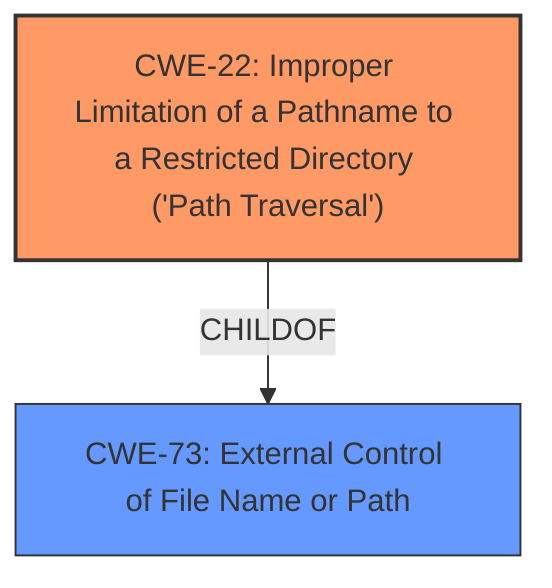

# Enhanced Analysis for CVE-2020-18127

# Summary
| CWE ID | CWE Name | Confidence | CWE Abstraction Level | CWE Vulnerability Mapping Label | CWE-Vulnerability Mapping Notes |
|---|---|---|---|---|---|
| CWE-22 | Improper Limitation of a Pathname to a Restricted Directory ('Path Traversal') | 1.0 | Base | Allowed | Primary CWE |
| CWE-73 | External Control of File Name or Path | 0.8 | Base | Allowed | Secondary Candidate |

## Evidence and Confidence

*   **Confidence Score:** 0.9
*   **Evidence Strength:** HIGH

## Relationship Analysis
The primary CWE is CWE-22 which represents the **improper limitation of a pathname to a restricted directory**. This is a base-level CWE. The secondary CWE is CWE-73 which represents the **external control of filename or path**. This is also a base-level CWE. CWE-22 is a specific type of CWE-73 and represents a more accurate classification of the weakness since the input directly influences the path.



## Vulnerability Chain
The chain of root cause and weaknesses are as follows:
1.  The application **does not properly neutralize** special elements within the pathname.
2.  This leads to **improper limitation of a pathname to a restricted directory** (CWE-22).
3.  This allows attackers to **view arbitrary files**.

## Summary of Analysis
The initial analysis of the vulnerability description indicates a path traversal issue, where the application **fails to properly restrict a pathname to a restricted directory**. The vulnerability description and the "CVE Reference Links Content Summary" specifically highlight the ability to use `../` sequences to access sensitive files outside the intended directory.

The primary CWE selected is **CWE-22: Improper Limitation of a Pathname to a Restricted Directory ('Path Traversal')**. This selection is based on the following evidence:

*   The "Vulnerability Description Key Phrases" state that attackers can "arbitrarily view files."
*   The "CVE Reference Links Content Summary" indicates that the vulnerability stems from insecure permission configuration, allowing arbitrary file access through the `ndxzstudio/?a=system&q=assets&edit=` parameter.
*   The summary explicitly mentions **directory traversal** as a primary vulnerability, where attackers can use `../` sequences to navigate outside the intended assets directory and access sensitive files.
*   The application **does not properly sanitize or validate user-supplied input**.

CWE-22 aligns well with these details because it specifically describes the scenario where a product uses external input to construct a pathname but **does not properly neutralize** special elements that can cause the pathname to resolve to a location outside the restricted directory.

The secondary CWE considered is **CWE-73: External Control of File Name or Path**. While this CWE is relevant, it's a more general case. CWE-22 is a more specific instance of CWE-73, focusing explicitly on path traversal issues.

The relationship analysis shows that CWE-22 is a child of CWE-73, indicating that CWE-22 provides a more detailed and precise classification of the vulnerability.

The MITRE mapping guidance for both CWE-22 and CWE-73 indicates that they are "ALLOWED" and at the Base level of abstraction, which is a preferred level for mapping root causes.

Therefore, the selection of CWE-22 as the primary CWE is strongly supported by the evidence, relationship analysis, and mapping guidance. It provides the most accurate and specific representation of the vulnerability's root cause.

Other CWEs Considered and Rejected:

*   CWE-96: Improper Neutralization of Directives in Statically Saved Code ('Static Code Injection'): Rejected because the vulnerability does not involve the injection of code into statically saved code.
*   CWE-256: Plaintext Storage of a Password: Rejected because the vulnerability does not involve the storage of passwords in plaintext.
*   CWE-306: Missing Authentication for Critical Function: Rejected because while lack of authentication might exacerbate the issue, the primary weakness is path traversal due to **improper input validation**.
*   CWE-425: Direct Request ('Forced Browsing'): Rejected because the vulnerability is primarily about path traversal, not the lack of authorization enforcement.
*   CWE-548: Exposure of Information Through Directory Listing: Rejected because the vulnerability allows access to specific files, not just listing the directory content.
*   CWE-434: Unrestricted Upload of File with Dangerous Type: Rejected because the vulnerability does not involve the upload of files.
*   CWE-532: Insertion of Sensitive Information into Log File: Rejected because the vulnerability does not involve writing sensitive information to a log file.
*   CWE-94: Improper Control of Generation of Code ('Code Injection'): Rejected because the vulnerability does not involve code injection.

The selected CWEs are at the optimal level of specificity because they directly address the root cause of the vulnerability, which is the **improper handling of pathnames** that allows attackers to **access unauthorized files**. The evidence strongly supports this classification, and the relationship analysis further confirms that CWE-22 is the most appropriate choice.


## CWE Relationship Analysis

Current CWEs represent these abstraction levels: .


### Vulnerability Chain Analysis

**Chain starting from CWE-306:**
- 306 (Missing Authentication for Critical Function) - ROOT


**Chain starting from CWE-73:**
- 73 (External Control of File Name or Path) - ROOT


### CWE Relationship Diagram

```mermaid
graph TD
    classDef primary fill:#f96,stroke:#333,stroke-width:2px
    classDef secondary fill:#69f,stroke:#333
    classDef tertiary fill:#9e9,stroke:#333
```