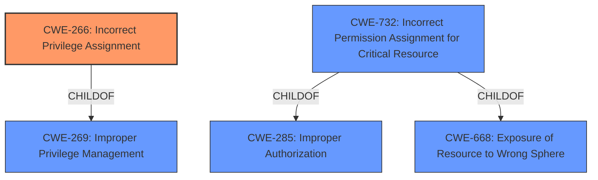

# Analysis Report for CVE-2020-18170

# Vulnerability Analysis Report: CVE-2020-18170

## Description


## Analysis (with Relationship Data)

# Summary
| CWE ID | CWE Name | Confidence | CWE Abstraction Level | CWE Vulnerability Mapping Label | CWE-Vulnerability Mapping Notes |
|---|---|---|---|---|---|
| CWE-266 | Incorrect Privilege Assignment | 0.8 | Base | Primary | Allowed |
| CWE-269 | Improper Privilege Management | 0.6 | Class | Secondary | Discouraged |
| CWE-732 | Incorrect Permission Assignment for Critical Resource | 0.5 | Class | Secondary | Allowed-with-Review |

## Evidence and Confidence

*   **Confidence Score:** 0.8
*   **Evidence Strength:** MEDIUM

## Relationship Analysis
The primary CWE selected is CWE-266 (Incorrect Privilege Assignment), which is a Base level CWE and a child of CWE-269 (Improper Privilege Management). CWE-269 is a Class level CWE. CWE-732 (Incorrect Permission Assignment for Critical Resource) is another potential Class level CWE related to permission issues, and is a child of both CWE-285 (Improper Authorization) and CWE-668 (Exposure of Resource to Wrong Sphere). The relationships show a hierarchy from broader classes of privilege/resource management down to specific assignment issues. The choice of CWE-266 reflects the specific **incorrect assignment** described in the vulnerability.



## Vulnerability Chain
The chain begins with an **incorrect assignment of privileges** (CWE-266). This leads to the ability to **escalate privileges**, which is the impact as described in the Vulnerability Description. While not explicitly stated, the change in permissions likely allows unauthorized actions to be performed, bypassing intended access controls.

## Summary of Analysis
The initial analysis focused on identifying the root cause of the privilege escalation vulnerability. The key phrase "change in permissions" suggested a problem with privilege or permission management.

The selection of CWE-266 (Incorrect Privilege Assignment) is based on the explicit statement in the vulnerability description that the issue involves a change in permissions leading to privilege escalation. The description directly mentions "attackers to escalate privileges via a change in permissions", indicating that the **incorrect privilege assignment** is the root cause.

CWE-269 (Improper Privilege Management) was considered as a broader category, but CWE-266 is more specific to the **incorrect assignment** aspect. CWE-732 (Incorrect Permission Assignment for Critical Resource) was also considered, but the description does not explicitly mention a "critical resource" being exposed, so it's less directly applicable than CWE-266.

The choice of CWE-266 is further justified by its Base level abstraction, which is preferred for root cause analysis. The mapping guidance for CWE-266 allows its use.

Relevant CWE Information:

# Enhanced Context (25 CWEs)
The following CWEs were identified as potentially relevant to this vulnerability:

## CWE-266: Incorrect Privilege Assignment
**Abstraction Level**: Base

**Description**:
A product **incorrectly assigns a privilege** to a particular actor, creating an unintended sphere of control for that actor.

### Vulnerability Description Key Phrases
- **impact:** escalate privileges
- **vector:** change in permissions
- **attacker:** attackers

## CWE-269: Improper Privilege Management
**Abstraction Level**: Class

**Description**:
The product does not properly assign, modify, track, or check privileges for an actor, creating an unintended sphere of control for that actor.

### Vulnerability Description Key Phrases
- **impact:** escalate privileges
- **vector:** change in permissions
- **attacker:** attackers

## CWE-732: Incorrect Permission Assignment for Critical Resource
**Abstraction Level**: Class

**Description**:
The product specifies permissions for a security-critical resource in a way that allows that resource to be read or modified by unintended actors.

### Vulnerability Description Key Phrases
- **impact:** escalate privileges
- **vector:** change in permissions
- **attacker:** attackers


## CWE Relationship Analysis

Current CWEs represent these abstraction levels: .


### Vulnerability Chain Analysis

**Chain starting from CWE-732:**
- 732 (Incorrect Permission Assignment for Critical Resource) - ROOT


**Chain starting from CWE-285:**
- 285 (Improper Authorization) - ROOT


### CWE Relationship Diagram

```mermaid
graph TD
    classDef primary fill:#f96,stroke:#333,stroke-width:2px
    classDef secondary fill:#69f,stroke:#333
    classDef tertiary fill:#9e9,stroke:#333
```


*Report generated on 2025-04-02 04:53:57*
