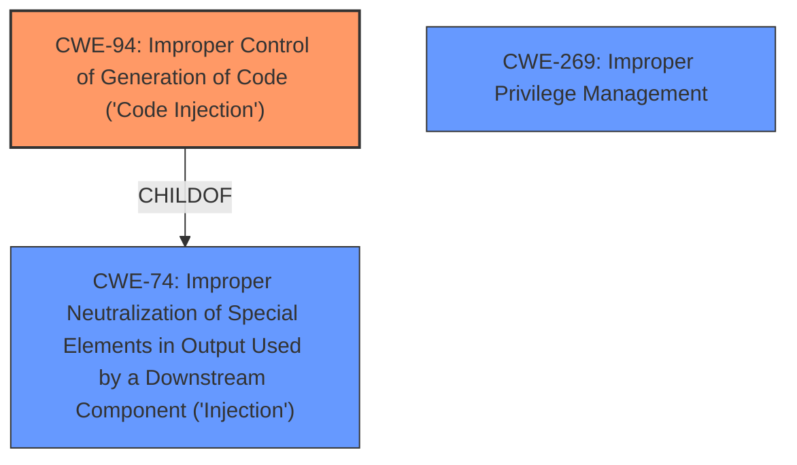

# Analysis for CVE-2020-18172

# Summary
| CWE ID | CWE Name | Confidence | CWE Abstraction Level | CWE Vulnerability Mapping Label | CWE-Vulnerability Mapping Notes |
|---|---|---|---|---|---|
| CWE-94 | Improper Control of Generation of Code ('Code Injection') | 1.0 | Base | Allowed-with-Review | Primary CWE |
| CWE-269 | Improper Privilege Management | 0.5 | Class | Discouraged | Secondary Candidate |

## Evidence and Confidence

*   **Confidence Score:** 0.75
*   **Evidence Strength:** LOW

## Relationship Analysis
The primary relationship influencing my decision is that CWE-94 is a child of CWE-74 (Improper Neutralization of Special Elements in Output Used by a Downstream Component ('Injection')), indicating a more specific form of injection. Since the vulnerability description explicitly mentions "**code injection**", CWE-94 is a more appropriate fit than its parent. CWE-269 (Improper Privilege Management) is considered because the impact is privilege escalation, however the root cause is code injection, making it a less direct fit.

## Vulnerability Chain
The vulnerability chain starts with **code injection** (CWE-94), which leads to the impact of privilege escalation. The chain is: CWE-94 -> Privilege Escalation.

## Summary of Analysis
The initial analysis identified CWE-94 as the most appropriate due to the explicit mention of "**code injection**" in the vulnerability description.

The evidence provided is relatively weak, as it only contains a brief description and lacks detailed technical information. However, the key phrase "**code injection**" strongly suggests CWE-94.

The graph relationships reinforce the choice of CWE-94 over the more general CWE-74, as it represents a specific type of injection. The decision to select CWE-94 is based primarily on the vulnerability description key phrases.

CWE-94 is chosen because it precisely matches the description of the vulnerability - "**code injection**". While the impact is privilege escalation, the root cause is the injected code, making CWE-94 the more specific and accurate classification.

Relevant CWE Information:

# Enhanced Context (25 CWEs)

## CWE-94: Improper Control of Generation of Code ('Code Injection')
**Abstraction:** Base
**Status:** Draft

### Description
The product constructs all or part of a code segment using externally-influenced input from an upstream component, but it does not neutralize or incorrectly neutralizes special elements that could modify the syntax or behavior of the intended code segment.

### Extended Description
When a product allows a user's input to contain code syntax, it might be possible for an attacker to craft the code in such a way that it will alter the intended control flow of the product. Such an alteration could lead to arbitrary code execution.

### Mapping Guidance
**Usage:** Allowed-with-Review
**Rationale:** This entry is frequently misused for vulnerabilities with a technical impact of "code execution," which does not by itself indicate a root cause weakness, since dozens of weaknesses can enable code execution.

**How the vulnerability's details match the CWE's characteristics:**
The vulnerability description states that there is a **code injection** vulnerability. This aligns directly with the CWE-94 description, which focuses on the improper control of code generation, where an attacker can inject code that alters the intended control flow.
**The security implications and potential impact:** The security implication is that an attacker can inject malicious code and execute it on the system, potentially leading to privilege escalation, as stated in the vulnerability description.
**Any parent-child relationships or chain patterns that influenced your mapping:** CWE-94 is a child of CWE-74, which is a more general "Injection" class. Choosing CWE-94 provides a more specific classification.
**Whether the weakness is primary or secondary in the vulnerability:** CWE-94 is the primary weakness, as the vulnerability is directly related to **code injection**.
**How the official MITRE mapping guidance influenced your decision:** The mapping guidance for CWE-94 suggests to review the description to ensure it's an appropriate fit. The vulnerability description explicitly states that it is a **code injection** vulnerability, which aligns with the CWE-94 description.

## CWE-269: Improper Privilege Management
**Abstraction:** Class
**Status:** Draft

### Description
The product does not properly assign, modify, track, or check privileges for an actor, creating an unintended sphere of control for that actor.

### Mapping Guidance
**Usage:** Discouraged
**Rationale:** CWE-269 is commonly misused. It can be conflated with "privilege escalation," which is a technical impact that is listed in many low-information vulnerability reports. It is not useful for trend analysis.

**How the vulnerability's details match the CWE's characteristics:**
The vulnerability leads to privilege escalation, which is related to privilege management. However, the root cause is the **code injection**, not a direct error in privilege management.
**The security implications and potential impact:** The impact of the vulnerability is privilege escalation, but the root cause is **code injection**, making CWE-269 a secondary concern.
**Any parent-child relationships or chain patterns that influenced your mapping:** CWE-269 is a class-level CWE and doesn't have a direct parent-child relationship that strongly influences the mapping.
**Whether the weakness is primary or secondary in the vulnerability:** CWE-269 is a secondary concern, as it represents the impact of the vulnerability rather than the root cause.
**How the official MITRE mapping guidance influenced your decision:** The mapping guidance for CWE-269 discourages its use when only phrases like "privilege escalation" are available, as these indicate the technical impact, not the root cause weakness.

## Other CWEs Considered But Not Used:

*   **CWE-79 (Improper Neutralization of Input During Web Page Generation ('Cross-site Scripting')) and CWE-93 (Improper Neutralization of CRLF Sequences ('CRLF Injection'))**: These CWEs are related to injection, but they are specific to web page generation and CRLF sequences, respectively. The vulnerability description doesn't indicate that this vulnerability involves web page generation or CRLF sequences, so these CWEs are not appropriate.
*   **CWE-74 (Improper Neutralization of Special Elements in Output Used by a Downstream Component ('Injection'))**: This is a more general injection category, and while it's related, CWE-94 is a more specific fit because the vulnerability is explicitly a **code injection** vulnerability.
*   **CWE-78 (Improper Neutralization of Special Elements used in an OS Command ('OS Command Injection'))**: This CWE is specific to OS command injection, which is not indicated in the vulnerability description.
*   **CWE-113 (Improper Neutralization of CRLF Sequences in HTTP Headers ('HTTP Request/Response Splitting'))**: This is a variant of CRLF injection specific to HTTP headers. Since the vulnerability doesn't specify anything about HTTP headers, this CWE is not appropriate.
*   **CWE-1336 (Improper Neutralization of Special Elements Used in a Template Engine)**: This is specific to template engine injection, which is not indicated in the vulnerability description.
*   **CWE-790 (Improper Filtering of Special Elements)**: This is a more generic filtering issue, but the **code injection** aspect makes CWE-94 a better fit.
*   **CWE-116 (Improper Encoding or Escaping of Output)**: While encoding/escaping issues can lead to injection, the primary issue is the **code injection** itself, making CWE-94 a more direct match.