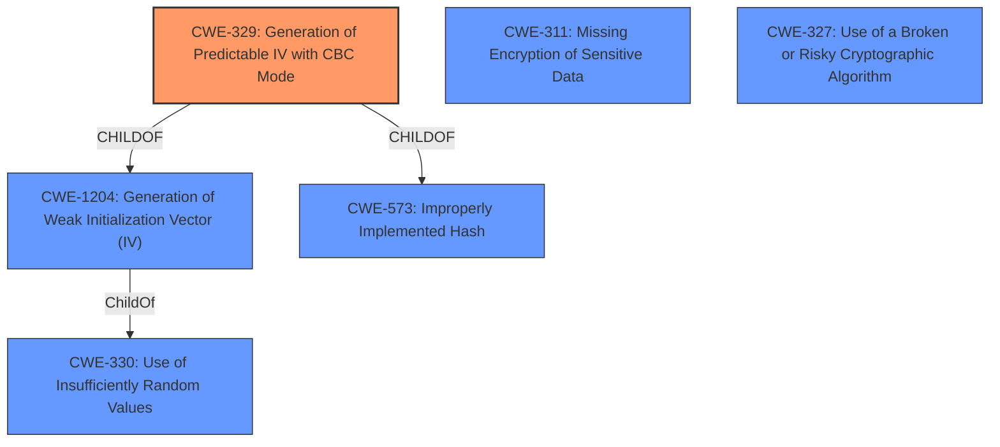

# Analysis for CVE-2020-18220

# Summary
| CWE ID | CWE Name | Confidence | CWE Abstraction Level | CWE Vulnerability Mapping Label | CWE-Vulnerability Mapping Notes |
|---|---|---|---|---|---|
| CWE-329 | Generation of Predictable IV with CBC Mode | 0.8 | Variant | Allowed | Primary CWE |
| CWE-311 | Missing Encryption of Sensitive Data | 0.6 | Class | Discouraged | Secondary Candidate |
| CWE-327 | Use of a Broken or Risky Cryptographic Algorithm | 0.5 | Class | Allowed-with-Review | Secondary Candidate |

## Evidence and Confidence

*   **Confidence Score:** 0.8
*   **Evidence Strength:** HIGH

## Relationship Analysis
The primary CWE is CWE-329, which is a variant of CWE-1204 and CWE-573, indicating a specific type of cryptographic issue. CWE-327 and CWE-311 were also considered due to the cryptographic nature of the vulnerability, but ultimately, CWE-329's specific focus on IV predictability in CBC mode aligns best with the vulnerability description. The abstraction level influenced the choice, prioritizing the more specific Variant level (CWE-329) over the broader Class levels (CWE-327, CWE-311).

## Vulnerability Chain
The vulnerability chain begins with the **weak encoding for the password**, specifically the **lack of a random salt or IV**. This leads to the **generation of a predictable IV with CBC mode**, making the encrypted passwords susceptible to dictionary attacks and ultimately leading to the **exposure of sensitive information**.

## Summary of Analysis
The initial analysis focused on identifying the root cause of the vulnerability based on the description and CVE details. The key phrase "**does not use a random salt or IV**" strongly suggests a problem with the initialization vector in the encryption process.

The primary CWE was selected based on the following:
- Direct Evidence: The vulnerability description explicitly mentions the absence of a random salt or IV, which is a defining characteristic of CWE-329.
- Relationship Analysis: CWE-329 is a Variant-level CWE, providing a more specific classification than its parent CWEs (CWE-1204 and CWE-573).
- Mapping Guidance: The Usage for CWE-329 is "Allowed," and the rationale indicates that it is at a preferred level of abstraction.

The CVE Reference Links Content Summary further supports this by stating that the application uses a static key for AES encryption.

I considered other CWEs, but rejected them for the following reasons:
- CWE-311: While missing encryption is a concern, the vulnerability specifically relates to weak encryption rather than a complete absence of encryption.
- CWE-327: Although a risky cryptographic algorithm is involved, CWE-329 more precisely captures the weakness related to predictable IV generation.

The final selection of CWE-329 is based on the strong evidence and its appropriate level of specificity, providing an accurate representation of the vulnerability.

Relevant CWE Information:

# Enhanced Context (25 CWEs)
The following CWEs were identified as potentially relevant to this vulnerability:

## CWE-1240: Use of a Cryptographic Primitive with a Risky Implementation
**Abstraction Level**: Base
**Similarity Score**: 0.82
**Source**: dense

**Description**:
To fulfill the need for a cryptographic primitive, the product implements a cryptographic algorithm using a non-standard, unproven, or disallowed/non-compliant cryptographic implementation.

**Mapping Guidance**:
- Usage: Allowed
- Rationale: This CWE entry is at the Base level of abstraction, which is a preferred level of abstraction for mapping to the root causes of vulnerabilities.

## CWE-1204: Generation of Weak Initialization Vector (IV)
**Abstraction Level**: Base
**Similarity Score**: 0.80
**Source**: dense

**Description**:
The product uses a cryptographic primitive that uses an Initialization
			Vector (IV), but the product does not generate IVs that are
			sufficiently unpredictable or unique according to the expected
			cryptographic requirements for that primitive.
			

**Mapping Guidance**:
- Usage: Allowed
- Rationale: This CWE entry is at the Base level of abstraction, which is a preferred level of abstraction for mapping to the root causes of vulnerabilities.

## CWE-1391: Use of Weak Credentials
**Abstraction Level**: Class
**Similarity Score**: 0.80
**Source**: dense

**Description**:
The product uses weak credentials (such as a default key or hard-coded password) that can be calculated, derived, reused, or guessed by an attacker.

**Mapping Guidance**:
- Usage: Allowed-with-Review
- Rationale: This CWE entry is a Class and might have Base-level children that would be more appropriate

## CWE-328: Use of Weak Hash
**Abstraction Level**: Base
**Similarity Score**: 0.79
**Source**: dense

**Description**:
The product uses an algorithm that produces a digest (output value) that does not meet security expectations for a hash function that allows an adversary to reasonably determine the original input (preimage attack), find another input that can produce the same hash (2nd preimage attack), or find multiple inputs that evaluate to the same hash (birthday attack).

**Mapping Guidance**:
- Usage: Allowed
- Rationale: This CWE entry is at the Base level of abstraction, which is a preferred level of abstraction for mapping to the root causes of vulnerabilities.

## CWE-916: Use of Password Hash With Insufficient Computational Effort
**Abstraction Level**: Base
**Similarity Score**: 0.79
**Source**: dense

**Description**:
The product generates a hash for a password, but it uses a scheme that does not provide a sufficient level of computational effort that would make password cracking attacks infeasible or expensive.

**Mapping Guidance**:
- Usage: Allowed
- Rationale: This CWE entry is at the Base level of abstraction, which is a preferred level of abstraction for mapping to the root causes of vulnerabilities.

## CWE-330: Use of Insufficiently Random Values
**Abstraction Level**: Class
**Similarity Score**: 0.78
**Source**: dense

**Description**:
The product uses insufficiently random numbers or values in a security context that depends on unpredictable numbers.

**Mapping Guidance**:
- Usage: Discouraged
- Rationale: This CWE entry is a level-1 Class (i.e., a child of a Pillar). It might have lower-level children that would be more appropriate

## CWE-331: Insufficient Entropy
**Abstraction Level**: Base
**Similarity Score**: 0.78
**Source**: dense

**Description**:
The product uses an algorithm or scheme that produces insufficient entropy, leaving patterns or clusters of values that are more likely to occur than others.

**Mapping Guidance**:
- Usage: Allowed
- Rationale: This CWE entry is at the Base level of abstraction, which is a preferred level of abstraction for mapping to the root causes of vulnerabilities.

## CWE-327: Use of a Broken or Risky Cryptographic Algorithm
**Abstraction Level**: Class
**Similarity Score**: 0.77
**Source**: dense

**Description**:
The product uses a broken or risky cryptographic algorithm or protocol.

**Mapping Guidance**:
- Usage: Allowed-with-Review
- Rationale: This CWE entry is a Class and might have Base-level children that would be more appropriate

## CWE-311: Missing Encryption of Sensitive Data
**Abstraction Level**: Class
**Similarity Score**: 0.76
**Source**: dense

**Description**:
The product does not encrypt sensitive or critical information before storage or transmission.

**Mapping Guidance**:
- Usage: Discouraged
- Rationale: CWE-311 is high-level with more precise children available. It is a level-1 Class (i.e., a child of a Pillar).

## CWE-335: Incorrect Usage of Seeds in Pseudo-Random Number Generator (PRNG)
**Abstraction Level**: Base
**Similarity Score**: