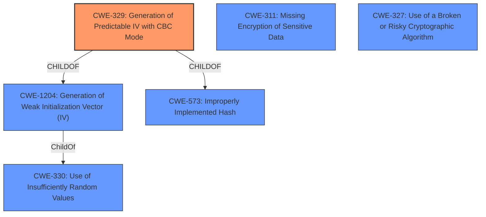

# Analysis for CVE-2020-18220

# Summary
| CWE ID | CWE Name | Confidence | CWE Abstraction Level | CWE Vulnerability Mapping Label | CWE-Vulnerability Mapping Notes |
|---|---|---|---|---|---|
| CWE-329 | Generation of Predictable IV with CBC Mode | 0.8 | Variant | Allowed | Primary CWE |
| CWE-311 | Missing Encryption of Sensitive Data | 0.6 | Class | Discouraged | Secondary Candidate |
| CWE-327 | Use of a Broken or Risky Cryptographic Algorithm | 0.5 | Class | Allowed-with-Review | Secondary Candidate |

## Evidence and Confidence

*   **Confidence Score:** 0.8
*   **Evidence Strength:** HIGH

## Relationship Analysis
The primary CWE is CWE-329, which is a variant of CWE-1204 and CWE-573, indicating a specific type of cryptographic issue. CWE-327 and CWE-311 were also considered due to the cryptographic nature of the vulnerability, but ultimately, CWE-329's specific focus on IV predictability in CBC mode aligns best with the vulnerability description. The abstraction level influenced the choice, prioritizing the more specific Variant level (CWE-329) over the broader Class levels (CWE-327, CWE-311).



## Vulnerability Chain
The vulnerability chain begins with the **weak encoding for the password**, specifically the **lack of a random salt or IV**. This leads to the **generation of a predictable IV with CBC mode**, making the encrypted passwords susceptible to dictionary attacks and ultimately leading to the **exposure of sensitive information**.

## Summary of Analysis
The initial analysis focused on identifying the root cause of the vulnerability based on the description and CVE details. The key phrase "**does not use a random salt or IV**" strongly suggests a problem with the initialization vector in the encryption process.

The primary CWE was selected based on the following:
- Direct Evidence: The vulnerability description explicitly mentions the absence of a random salt or IV, which is a defining characteristic of CWE-329.
- Relationship Analysis: CWE-329 is a Variant-level CWE, providing a more specific classification than its parent CWEs (CWE-1204 and CWE-573).
- Mapping Guidance: The Usage for CWE-329 is "Allowed," and the rationale indicates that it is at a preferred level of abstraction.

The CVE Reference Links Content Summary further supports this by stating that the application uses a static key for AES encryption.

I considered other CWEs, but rejected them for the following reasons:
- CWE-311: While missing encryption is a concern, the vulnerability specifically relates to weak encryption rather than a complete absence of encryption.
- CWE-327: Although a risky cryptographic algorithm is involved, CWE-329 more precisely captures the weakness related to predictable IV generation.

The final selection of CWE-329 is based on the strong evidence and its appropriate level of specificity, providing an accurate representation of the vulnerability.

Relevant CWE Information:

# Enhanced Context (25 CWEs)
The following CWEs were identified as potentially relevant to this vulnerability:

## CWE-1240: Use of a Cryptographic Primitive with a Risky Implementation
**Abstraction Level**: Base
**Similarity Score**: 0.82
**Source**: dense

**Description**:
To fulfill the need for a cryptographic primitive, the product implements a cryptographic algorithm using a non-standard, unproven, or disallowed/non-compliant cryptographic implementation.

**Mapping Guidance**:
- Usage: Allowed
- Rationale: This CWE entry is at the Base level of abstraction, which is a preferred level of abstraction for mapping to the root causes of vulnerabilities.

## CWE-1204: Generation of Weak Initialization Vector (IV)
**Abstraction Level**: Base
**Similarity Score**: 0.80
**Source**: dense

**Description**:
The product uses a cryptographic primitive that uses an Initialization
			Vector (IV), but the product does not generate IVs that are
			sufficiently unpredictable or unique according to the expected
			cryptographic requirements for that primitive.
			

**Mapping Guidance**:
- Usage: Allowed
- Rationale: This CWE entry is at the Base level of abstraction, which is a preferred level of abstraction for mapping to the root causes of vulnerabilities.

## CWE-1391: Use of Weak Credentials
**Abstraction Level**: Class
**Similarity Score**: 0.80
**Source**: dense

**Description**:
The product uses weak credentials (such as a default key or hard-coded password) that can be calculated, derived, reused, or guessed by an attacker.

**Mapping Guidance**:
- Usage: Allowed-with-Review
- Rationale: This CWE entry is a Class and might have Base-level children that would be more appropriate

## CWE-328: Use of Weak Hash
**Abstraction Level**: Base
**Similarity Score**: 0.79
**Source**: dense

**Description**:
The product uses an algorithm that produces a digest (output value) that does not meet security expectations for a hash function that allows an adversary to reasonably determine the original input (preimage attack), find another input that can produce the same hash (2nd preimage attack), or find multiple inputs that evaluate to the same hash (birthday attack).

**Mapping Guidance**:
- Usage: Allowed
- Rationale: This CWE entry is at the Base level of abstraction, which is a preferred level of abstraction for mapping to the root causes of vulnerabilities.

## CWE-916: Use of Password Hash With Insufficient Computational Effort
**Abstraction Level**: Base
**Similarity Score**: 0.79
**Source**: dense

**Description**:
The product generates a hash for a password, but it uses a scheme that does not provide a sufficient level of computational effort that would make password cracking attacks infeasible or expensive.

**Mapping Guidance**:
- Usage: Allowed
- Rationale: This CWE entry is at the Base level of abstraction, which is a preferred level of abstraction for mapping to the root causes of vulnerabilities.

## CWE-330: Use of Insufficiently Random Values
**Abstraction Level**: Class
**Similarity Score**: 0.78
**Source**: dense

**Description**:
The product uses insufficiently random numbers or values in a security context that depends on unpredictable numbers.

**Mapping Guidance**:
- Usage: Discouraged
- Rationale: This CWE entry is a level-1 Class (i.e., a child of a Pillar). It might have lower-level children that would be more appropriate

## CWE-331: Insufficient Entropy
**Abstraction Level**: Base
**Similarity Score**: 0.78
**Source**: dense

**Description**:
The product uses an algorithm or scheme that produces insufficient entropy, leaving patterns or clusters of values that are more likely to occur than others.

**Mapping Guidance**:
- Usage: Allowed
- Rationale: This CWE entry is at the Base level of abstraction, which is a preferred level of abstraction for mapping to the root causes of vulnerabilities.

## CWE-327: Use of a Broken or Risky Cryptographic Algorithm
**Abstraction Level**: Class
**Similarity Score**: 0.77
**Source**: dense

**Description**:
The product uses a broken or risky cryptographic algorithm or protocol.

**Mapping Guidance**:
- Usage: Allowed-with-Review
- Rationale: This CWE entry is a Class and might have Base-level children that would be more appropriate

## CWE-311: Missing Encryption of Sensitive Data
**Abstraction Level**: Class
**Similarity Score**: 0.76
**Source**: dense

**Description**:
The product does not encrypt sensitive or critical information before storage or transmission.

**Mapping Guidance**:
- Usage: Discouraged
- Rationale: CWE-311 is high-level with more precise children available. It is a level-1 Class (i.e., a child of a Pillar).

## CWE-335: Incorrect Usage of Seeds in Pseudo-Random Number Generator (PRNG)
**Abstraction Level**: Base
**Similarity Score**:

# Enhanced Query for CVE-2020-18220

## Vulnerability Description
**Weak Encoding for Password** in DoraCMS v2.1.1 and earlier allows attackers to obtain sensitive information as it **does not use a random salt or IV** for its AES-CBC encryption, causes password encrypted for users to be susceptible to dictionary attacks.

### Vulnerability Description Key Phrases
- **rootcause:** **Weak Encoding for Password**
- **weakness:** **does not use a random salt or IV**
- **impact:** obtain sensitive information
- **vector:** dictionary attacks
- **attacker:** attackers
- **product:** DoraCMS
- **version:** v2.1.1 and earlier

## CVE Reference Links Content Summary
```
{
  "Root cause of vulnerability": "The application uses a static key (`doracms_`) for AES encryption and a static key (`dora`) for MD5 operations.",
  "Weaknesses/vulnerabilities present": "Hardcoded cryptographic keys for encryption.",
  "Impact of exploitation": "An attacker can more easily conduct brute-force password guessing due to the use of static encryption keys.",
  "Attack vectors": "The vulnerability can be exploited by gaining access to the encrypted data and then using the static key to decrypt or crack the passwords.",
  "Required attacker capabilities/position": "Attacker needs access to the encrypted data or be able to intercept the encryption process."
}
```

## Retriever Results

### Top Combined Results

| Rank | CWE ID | Name | Abstraction | Usage  | Retrievers | Individual Scores |
|------|--------|------|-------------|-------|------------|-------------------|
| 1 | 193 | Off-by-one Error | Base | Allowed | alternate_terms | 0.700 |
| 2 | 359 | Exposure of Private Personal Information to an Unauthorized Actor | Base | Allowed | alternate_terms | 0.700 |
| 3 | 653 | Improper Isolation or Compartmentalization | Class | Allowed | alternate_terms | 0.700 |
| 4 | 654 | Reliance on a Single Factor in a Security Decision | Base | Allowed | sparse | 0.700 |
| 5 | 329 | Generation of Predictable IV with CBC Mode | Variant | Allowed | sparse | 0.501 |
| 6 | 261 | Weak Encoding for Password | Base | Allowed | dense | 0.666 |
| 7 | 170 | Improper Null Termination | Base | Allowed | graph | 0.002 |
| 8 | 1204 | Generation of Weak Initialization Vector (IV) | Base | Allowed | sparse | 0.320 |
| 9 | 916 | Use of Password Hash With Insufficient Computational Effort | Base | Allowed | sparse | 0.296 |
| 10 | 327 | Use of a Broken or Risky Cryptographic Algorithm | Class | Allowed-with-Review | sparse | 0.289 |


# Complete CWE Specifications


## CWE-193: Off-by-one Error
**Abstraction:** Base
**Status:** Draft

### Description
A product calculates or uses an incorrect maximum or minimum value that is 1 more, or 1 less, than the correct value.

### Extended Description
Not provided

### Alternative Terms
off-by-five: An "off-by-five" error was reported for sudo in 2002 (CVE-2002-0184), but that is more like a "length calculation" error.

### Relationships
ChildOf -> CWE-682
ChildOf -> CWE-682
CanPrecede -> CWE-617
CanPrecede -> CWE-170
CanPrecede -> CWE-119

### Mapping Guidance
**Usage:** Allowed
**Rationale:** This CWE entry is at the Base level of abstraction, which is a preferred level of abstraction for mapping to the root causes of vulnerabilities.
**Comments:** Carefully read both the name and description to ensure that this mapping is an appropriate fit. Do not try to 'force' a mapping to a lower-level Base/Variant simply to comply with this preferred level of abstraction.
**Reasons:**
- Acceptable-Use


### Additional Notes
**[Relationship]** This is not always a buffer overflow. For example, an off-by-one error could be a factor in a partial comparison, a read from the wrong memory location, an incorrect conditional, etc.


### Observed Examples
- **CVE-2003-0252:** Off-by-one error allows remote attackers to cause a denial of service and possibly execute arbitrary code via requests that do not contain newlines.
- **CVE-2001-1391:** Off-by-one vulnerability in driver allows users to modify kernel memory.
- **CVE-2002-0083:** Off-by-one error allows local users or remote malicious servers to gain privileges.


## CWE-359: Exposure of Private Personal Information to an Unauthorized Actor
**Abstraction:** Base
**Status:** Incomplete

### Description
The product does not properly prevent a person's private, personal information from being accessed by actors who either (1) are not explicitly authorized to access the information or (2) do not have the implicit consent of the person about whom the information is collected.

### Extended Description
Not provided

### Alternative Terms
Privacy violation
Privacy leak
Privacy leakage

### Relationships
ChildOf -> CWE-200

### Mapping Guidance
**Usage:** Allowed
**Rationale:** This CWE entry is at the Base level of abstraction, which is a preferred level of abstraction for mapping to the root causes of vulnerabilities.
**Comments:** Carefully read both the name and description to ensure that this mapping is an appropriate fit. Do not try to 'force' a mapping to a lower-level Base/Variant simply to comply with this preferred level of abstraction.
**Reasons:**
- Acceptable-Use


### Additional Notes
**[Maintenance]** This entry overlaps many other entries that are not organized around the kind of sensitive information that is exposed. However, because privacy is treated with such importance due to regulations and other factors, and it may be useful for weakness-finding tools to highlight capabilities that detect personal private information instead of system information, it is not clear whether - and how - this entry should be deprecated.

**[Other]** 

There are many types of sensitive information that products must protect from attackers, including system data, communications, configuration, business secrets, intellectual property, and an individual's personal (private) information. Private personal information may include a password, phone number, geographic location, personal messages, credit card number, etc. Private information is important to consider whether the person is a user of the product, or part of a data set that is processed by the product. An exposure of private information does not necessarily prevent the product from working properly, and in fact the exposure might be intended by the developer, e.g. as part of data sharing with other organizations. However, the exposure of personal private information can still be undesirable or explicitly prohibited by law or regulation.


Some types of private information include:


  - Government identifiers, such as Social Security Numbers

  - Contact information, such as home addresses and telephone numbers

  - Geographic location - where the user is (or was)

  - Employment history

  - Financial data - such as credit card numbers, salary, bank accounts, and debts

  - Pictures, video, or audio

  - Behavioral patterns - such as web surfing history, when certain activities are performed, etc.

  - Relationships (and types of relationships) with others - family, friends, contacts, etc.

  - Communications - e-mail addresses, private messages, text messages, chat logs, etc.

  - Health - medical conditions, insurance status, prescription records

  - Account passwords and other credentials

Some of this information may be characterized as PII (Personally Identifiable Information), Protected Health Information (PHI), etc. Categories of private information may overlap or vary based on the intended usage or the policies and practices of a particular industry.

Sometimes data that is not labeled as private can have a privacy implication in a different context. For example, student identification numbers are usually not considered private because there is no explicit and publicly-available mapping to an individual student's personal information. However, if a school generates identification numbers based on student social security numbers, then the identification numbers should be considered private.


## CWE-653: Improper Isolation or Compartmentalization
**Abstraction:** Class
**Status:** Draft

### Description
The product does not properly compartmentalize or isolate functionality, processes, or resources that require different privilege levels, rights, or permissions.

### Extended Description
When a weakness occurs in functionality that is accessible by lower-privileged users, then without strong boundaries, an attack might extend the scope of the damage to higher-privileged users.

### Alternative Terms
Separation of Privilege: Some people and publications use the term "Separation of Privilege" to describe this weakness, but this term has dual meanings in current usage. This node conflicts with the original definition of "Separation of Privilege" by Saltzer and Schroeder; that original definition is more closely associated with CWE-654. Because there are multiple interpretations, use of the "Separation of Privilege" term is discouraged.

### Relationships
ChildOf -> CWE-657
ChildOf -> CWE-693

### Mapping Guidance
**Usage:** Allowed
**Rationale:** This CWE entry is at the Base level of abstraction, which is a preferred level of abstraction for mapping to the root causes of vulnerabilities.
**Comments:** Carefully read both the name and description to ensure that this mapping is an appropriate fit. Do not try to 'force' a mapping to a lower-level Base/Variant simply to comply with this preferred level of abstraction.
**Reasons:**
- Acceptable-Use


### Additional Notes
**[Relationship]** There is a close association with CWE-250 (Execution with Unnecessary Privileges). CWE-653 is about providing separate components for each "privilege"; CWE-250 is about ensuring that each component has the least amount of privileges possible. In this fashion, compartmentalization becomes one mechanism for reducing privileges.

**[Terminology]** The term "Separation of Privilege" is used in several different ways in the industry, but they generally combine two closely related principles: compartmentalization (this node) and using only one factor in a security decision (CWE-654). Proper compartmentalization implicitly introduces multiple factors into a security decision, but there can be cases in which multiple factors are required for authentication or other mechanisms that do not involve compartmentalization, such as performing all required checks on a submitted certificate. It is likely that CWE-653 and CWE-654 will provoke further discussion.


### Observed Examples
- **CVE-2021-33096:** Improper isolation of shared resource in a network-on-chip leads to denial of service
- **CVE-2019-6260:** Baseboard Management Controller (BMC) device implements Advanced High-performance Bus (AHB) bridges that do not require authentication for arbitrary read and write access to the BMC's physical address space from the host, and possibly the network [REF-1138].


## CWE-654: Reliance on a Single Factor in a Security Decision
**Abstraction:** Base
**Status:** Draft

### Description
A protection mechanism relies exclusively, or to a large extent, on the evaluation of a single condition or the integrity of a single object or entity in order to make a decision about granting access to restricted resources or functionality.

### Extended Description
Not provided

### Alternative Terms
Separation of Privilege: Some people and publications use the term "Separation of Privilege" to describe this weakness, but this term has dual meanings in current usage. While this entry is closely associated with the original definition of "Separation of Privilege" by Saltzer and Schroeder, others use the same term to describe poor compartmentalization (CWE-653). Because there are multiple interpretations, use of the "Separation of Privilege" term is discouraged.

### Relationships
ChildOf -> CWE-657
ChildOf -> CWE-693

### Mapping Guidance
**Usage:** Allowed
**Rationale:** This CWE entry is at the Base level of abstraction, which is a preferred level of abstraction for mapping to the root causes of vulnerabilities.
**Comments:** Carefully read both the name and description to ensure that this mapping is an appropriate fit. Do not try to 'force' a mapping to a lower-level Base/Variant simply to comply with this preferred level of abstraction.
**Reasons:**
- Acceptable-Use


### Additional Notes
**[Maintenance]** This entry is closely associated with the term "Separation of Privilege." This term is used in several different ways in the industry, but they generally combine two closely related principles: compartmentalization (CWE-653) and using only one factor in a security decision (this entry). Proper compartmentalization implicitly introduces multiple factors into a security decision, but there can be cases in which multiple factors are required for authentication or other mechanisms that do not involve compartmentalization, such as performing all required checks on a submitted certificate. It is likely that CWE-653 and CWE-654 will provoke further discussion.


### Observed Examples
- **CVE-2022-35248:** Chat application skips validation when Central Authentication Service (CAS) is enabled, effectively removing the second factor from two-factor authentication


## CWE-329: Generation of Predictable IV with CBC Mode
**Abstraction:** Variant
**Status:** Draft

### Description
The product generates and uses a predictable initialization Vector (IV) with Cipher Block Chaining (CBC) Mode, which causes algorithms to be susceptible to dictionary attacks when they are encrypted under the same key.

### Extended Description


CBC mode eliminates a weakness of Electronic Code Book (ECB) mode by allowing identical plaintext blocks to be encrypted to different ciphertext blocks. This is possible by the XOR-ing of an IV with the initial plaintext block so that every plaintext block in the chain is XOR'd with a different value before encryption. If IVs are reused, then identical plaintexts would be encrypted to identical ciphertexts. However, even if IVs are not identical but are predictable, then they still break the security of CBC mode against Chosen Plaintext Attacks (CPA).


### Alternative Terms
None

### Relationships
ChildOf -> CWE-1204
ChildOf -> CWE-573

### Mapping Guidance
**Usage:** Allowed
**Rationale:** This CWE entry is at the Variant level of abstraction, which is a preferred level of abstraction for mapping to the root causes of vulnerabilities.
**Comments:** Carefully read both the name and description to ensure that this mapping is an appropriate fit. Do not try to 'force' a mapping to a lower-level Base/Variant simply to comply with this preferred level of abstraction.
**Reasons:**
- Acceptable-Use


### Additional Notes
**[Maintenance]** As of CWE 4.5, terminology related to randomness, entropy, and predictability can vary widely. Within the developer and other communities, "randomness" is used heavily. However, within cryptography, "entropy" is distinct, typically implied as a measurement. There are no commonly-used definitions, even within standards documents and cryptography papers. Future versions of CWE will attempt to define these terms and, if necessary, distinguish between them in ways that are appropriate for different communities but do not reduce the usability of CWE for mapping, understanding, or other scenarios.


### Observed Examples
- **CVE-2020-5408:** encryption functionality in an authentication framework uses a fixed null IV with CBC mode, allowing attackers to decrypt traffic in applications that use this functionality
- **CVE-2017-17704:** messages for a door-unlocking product use a fixed IV in CBC mode, which is the same after each restart
- **CVE-2017-11133:** application uses AES in CBC mode, but the pseudo-random secret and IV are generated using math.random, which is not cryptographically strong.


## CWE-261: Weak Encoding for Password
**Abstraction:** Base
**Status:** Incomplete

### Description
Obscuring a password with a trivial encoding does not protect the password.

### Extended Description
Password management issues occur when a password is stored in plaintext in an application's properties or configuration file. A programmer can attempt to remedy the password management problem by obscuring the password with an encoding function, such as base 64 encoding, but this effort does not adequately protect the password.

### Alternative Terms
None

### Relationships
ChildOf -> CWE-522

### Mapping Guidance
**Usage:** Allowed
**Rationale:** This CWE entry is at the Base level of abstraction, which is a preferred level of abstraction for mapping to the root causes of vulnerabilities.
**Comments:** Carefully read both the name and description to ensure that this mapping is an appropriate fit. Do not try to 'force' a mapping to a lower-level Base/Variant simply to comply with this preferred level of abstraction.
**Reasons:**
- Acceptable-Use


### Additional Notes
**[Other]** 

The "crypt" family of functions uses weak cryptographic algorithms and should be avoided. It may be present in some projects for compatibility.


## CWE-170: Improper Null Termination
**Abstraction:** Base
**Status:** Incomplete

### Description
The product does not terminate or incorrectly terminates a string or array with a null character or equivalent terminator.

### Extended Description
Null termination errors frequently occur in two different ways. An off-by-one error could cause a null to be written out of bounds, leading to an overflow. Or, a program could use a strncpy() function call incorrectly, which prevents a null terminator from being added at all. Other scenarios are possible.

### Alternative Terms
None

### Relationships
ChildOf -> CWE-707
CanPrecede -> CWE-120
CanPrecede -> CWE-126
CanAlsoBe -> CWE-147
PeerOf -> CWE-464
PeerOf -> CWE-463
ChildOf -> CWE-20

### Mapping Guidance
**Usage:** Allowed
**Rationale:** This CWE entry is at the Base level of abstraction, which is a preferred level of abstraction for mapping to the root causes of vulnerabilities.
**Comments:** Carefully read both the name and description to ensure that this mapping is an appropriate fit. Do not try to 'force' a mapping to a lower-level Base/Variant simply to comply with this preferred level of abstraction.
**Reasons:**
- Acceptable-Use


### Additional Notes
**[Relationship]** Factors: this is usually resultant from other weaknesses such as off-by-one errors, but it can be primary to boundary condition violations such as buffer overflows. In buffer overflows, it can act as an expander for assumed-immutable data.

**[Relationship]** Overlaps missing input terminator.

**[Applicable Platform]** 

Conceptually, this does not just apply to the C language; any language or representation that involves a terminator could have this type of problem.


**[Maintenance]** As currently described, this entry is more like a category than a weakness.


### Observed Examples
- **CVE-2000-0312:** Attacker does not null-terminate argv[] when invoking another program.
- **CVE-2003-0777:** Interrupted step causes resultant lack of null termination.
- **CVE-2004-1072:** Fault causes resultant lack of null termination, leading to buffer expansion.


## CWE-1204: Generation of Weak Initialization Vector (IV)
**Abstraction:** Base
**Status:** Incomplete

### Description
The product uses a cryptographic primitive that uses an Initialization
			Vector (IV), but the product does not generate IVs that are
			sufficiently unpredictable or unique according to the expected
			cryptographic requirements for that primitive.
			

### Extended Description
By design, some cryptographic primitives (such as block ciphers) require that IVs must have certain properties for the uniqueness and/or unpredictability of an IV. Primitives may vary in how important these properties are. If these properties are not maintained, e.g. by a bug in the code, then the cryptography may be weakened or broken by attacking the IVs themselves.

### Alternative Terms
None

### Relationships
ChildOf -> CWE-330

### Mapping Guidance
**Usage:** Allowed
**Rationale:** This CWE entry is at the Base level of abstraction, which is a preferred level of abstraction for mapping to the root causes of vulnerabilities.
**Comments:** Carefully read both the name and description to ensure that this mapping is an appropriate fit. Do not try to 'force' a mapping to a lower-level Base/Variant simply to comply with this preferred level of abstraction.
**Reasons:**
- Acceptable-Use


### Additional Notes
**[Maintenance]** As of CWE 4.5, terminology related to randomness, entropy, and predictability can vary widely. Within the developer and other communities, "randomness" is used heavily. However, within cryptography, "entropy" is distinct, typically implied as a measurement. There are no commonly-used definitions, even within standards documents and cryptography papers. Future versions of CWE will attempt to define these terms and, if necessary, distinguish between them in ways that are appropriate for different communities but do not reduce the usability of CWE for mapping, understanding, or other scenarios.


### Observed Examples
- **CVE-2020-1472:** ZeroLogon vulnerability - use of a static IV of all zeroes in AES-CFB8 mode
- **CVE-2011-3389:** BEAST attack in SSL 3.0 / TLS 1.0. In CBC mode, chained initialization vectors are non-random, allowing decryption of HTTPS traffic using a chosen plaintext attack.
- **CVE-2001-0161:** wireless router does not use 6 of the 24 bits for WEP encryption, making it easier for attackers to decrypt traffic


## CWE-916: Use of Password Hash With Insufficient Computational Effort
**Abstraction:** Base
**Status:** Incomplete

### Description
The product generates a hash for a password, but it uses a scheme that does not provide a sufficient level of computational effort that would make password cracking attacks infeasible or expensive.

### Extended Description


Many password storage mechanisms compute a hash and store the hash, instead of storing the original password in plaintext. In this design, authentication involves accepting an incoming password, computing its hash, and comparing it to the stored hash.


Many hash algorithms are designed to execute quickly with minimal overhead, even cryptographic hashes. However, this efficiency is a problem for password storage, because it can reduce an attacker's workload for brute-force password cracking. If an attacker can obtain the hashes through some other method (such as SQL injection on a database that stores hashes), then the attacker can store the hashes offline and use various techniques to crack the passwords by computing hashes efficiently. Without a built-in workload, modern attacks can compute large numbers of hashes, or even exhaust the entire space of all possible passwords, within a very short amount of time, using massively-parallel computing (such as cloud computing) and GPU, ASIC, or FPGA hardware. In such a scenario, an efficient hash algorithm helps the attacker.


There are several properties of a hash scheme that are relevant to its strength against an offline, massively-parallel attack:


  - The amount of CPU time required to compute the hash ("stretching")

  - The amount of memory required to compute the hash ("memory-hard" operations)

  - Including a random value, along with the password, as input to the hash computation ("salting")

  - Given a hash, there is no known way of determining an input (e.g., a password) that produces this hash value, other than by guessing possible inputs ("one-way" hashing)

  - Relative to the number of all possible hashes that can be generated by the scheme, there is a low likelihood of producing the same hash for multiple different inputs ("collision resistance")

Note that the security requirements for the product may vary depending on the environment and the value of the passwords. Different schemes might not provide all of these properties, yet may still provide sufficient security for the environment. Conversely, a solution might be very strong in preserving one property, which still being very weak for an attack against another property, or it might not be able to significantly reduce the efficiency of a massively-parallel attack.

### Alternative Terms
None

### Relationships
ChildOf -> CWE-328
ChildOf -> CWE-327

### Mapping Guidance
**Usage:** Allowed
**Rationale:** This CWE entry is at the Base level of abstraction, which is a preferred level of abstraction for mapping to the root causes of vulnerabilities.
**Comments:** Carefully read both the name and description to ensure that this mapping is an appropriate fit. Do not try to 'force' a mapping to a lower-level Base/Variant simply to comply with this preferred level of abstraction.
**Reasons:**
- Acceptable-Use


### Observed Examples
- **CVE-2008-1526:** Router does not use a salt with a hash, making it easier to crack passwords.
- **CVE-2006-1058:** Router does not use a salt with a hash, making it easier to crack passwords.
- **CVE-2008-4905:** Blogging software uses a hard-coded salt when calculating a password hash.


## CWE-327: Use of a Broken or Risky Cryptographic Algorithm
**Abstraction:** Class
**Status:** Draft

### Description
The product uses a broken or risky cryptographic algorithm or protocol.

### Extended Description


Cryptographic algorithms are the methods by which data is scrambled to prevent observation or influence by unauthorized actors. Insecure cryptography can be exploited to expose sensitive information, modify data in unexpected ways, spoof identities of other users or devices, or other impacts.


It is very difficult to produce a secure algorithm, and even high-profile algorithms by accomplished cryptographic experts have been broken. Well-known techniques exist to break or weaken various kinds of cryptography. Accordingly, there are a small number of well-understood and heavily studied algorithms that should be used by most products. Using a non-standard or known-insecure algorithm is dangerous because a determined adversary may be able to break the algorithm and compromise whatever data has been protected.


Since the state of cryptography advances so rapidly, it is common for an algorithm to be considered "unsafe" even if it was once thought to be strong. This can happen when new attacks are discovered, or if computing power increases so much that the cryptographic algorithm no longer provides the amount of protection that was originally thought.


For a number of reasons, this weakness is even more challenging to manage with hardware deployment of cryptographic algorithms as opposed to software implementation. First, if a flaw is discovered with hardware-implemented cryptography, the flaw cannot be fixed in most cases without a recall of the product, because hardware is not easily replaceable like software. Second, because the hardware product is expected to work for years, the adversary's computing power will only increase over time.


### Alternative Terms
None

### Relationships
ChildOf -> CWE-693
PeerOf -> CWE-311

### Mapping Guidance
**Usage:** Allowed-with-Review
**Rationale:** This CWE entry is a Class and might have Base-level children that would be more appropriate
**Comments:** Examine children of this entry to see if there is a better fit
**Reasons:**
- Abstraction


### Additional Notes
**[Maintenance]** Since CWE 4.4, various cryptography-related entries, including CWE-327 and CWE-1240, have been slated for extensive research, analysis, and community consultation to define consistent terminology, improve relationships, and reduce overlap or duplication. As of CWE 4.6, this work is still ongoing.

**[Maintenance]** The Taxonomy_Mappings to ISA/IEC 62443 were added in CWE 4.10, but they are still under review and might change in future CWE versions. These draft mappings were performed by members of the "Mapping CWE to 62443" subgroup of the CWE-CAPEC ICS/OT Special Interest Group (SIG), and their work is incomplete as of CWE 4.10. The mappings are included to facilitate discussion and review by the broader ICS/OT community, and they are likely to change in future CWE versions.


### Observed Examples
- **CVE-2022-30273:** SCADA-based protocol supports a legacy encryption mode that uses Tiny Encryption Algorithm (TEA) in ECB mode, which leaks patterns in messages and cannot protect integrity
- **CVE-2022-30320:** Programmable Logic Controller (PLC) uses a protocol with a cryptographically insecure hashing algorithm for passwords.
- **CVE-2008-3775:** Product uses "ROT-25" to obfuscate the password in the registry.

