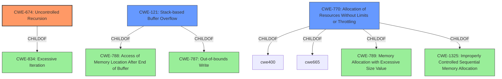

# Raw Analyzer Response for CVE-2020-18392

# Summary
| CWE ID | CWE Name | Confidence | CWE Abstraction Level | CWE Vulnerability Mapping Label | CWE-Vulnerability Mapping Notes |
|---|---|---|---|---|---|
| CWE-674 | Uncontrolled Recursion | 0.9 | Class | Allowed-with-Review | Primary CWE |
| CWE-121 | Stack-based Buffer Overflow | 0.7 | Variant | Allowed | Secondary Candidate |
| CWE-770 | Allocation of Resources Without Limits or Throttling | 0.6 | Base | Allowed | Secondary Candidate |

## Evidence and Confidence

*   **Confidence Score:** 0.8
*   **Evidence Strength:** HIGH

## Relationship Analysis
The primary CWE, CWE-674 **(Uncontrolled Recursion)**, is a Class-level CWE. While the vulnerability description clearly states a stack overflow, the root cause is the **uncontrolled recursion** within the `parse_array` function. The recursive calls without proper limits lead to excessive stack usage.

CWE-674 is related to CWE-834 (Excessive Iteration).

CWE-121 **(Stack-based Buffer Overflow)** is considered a secondary candidate as it describes the effect of the uncontrolled recursion. It is a variant of CWE-788 (Access of Memory Location After End of Buffer) and CWE-787 (Out-of-bounds Write).

CWE-770 **(Allocation of Resources Without Limits or Throttling)** is considered a secondary candidate. While uncontrolled recursion leads to excessive resource consumption, the primary issue is the recursion itself. CWE-770 is a parent of CWE-789 (Memory Allocation with Excessive Size Value) and CWE-1325 (Improperly Controlled Sequential Memory Allocation).

## Vulnerability Chain
The vulnerability chain starts with the **uncontrolled recursion** (CWE-674) in the `parse_array` function. This leads to excessive stack usage. The overflow occurs when `memcpy` is called by `mjs_mk_string` on the stack when processing strings. This results in a **stack overflow** (CWE-121) and ultimately a **Denial of Service (DoS)**.

## Summary of Analysis
The analysis indicates that the primary weakness is CWE-674 **(Uncontrolled Recursion)**. The `parse_array` function recursively calls `parse_value`, which in turn calls `parse_array` again when encountering another array. This recursive behavior, without a proper limit on nesting depth, causes excessive stack usage, eventually leading to a stack overflow and a denial of service.

The evidence supporting this classification is:
-   **Vulnerability Description Key Phrases:** "**Stack overflow**" is listed as the **weakness**.
-   **CVE Reference Links Content Summary:** "The root cause is a stack overflow triggered by deeply nested array structures during JSON parsing in the `mjs` library... The vulnerability occurs because the `parse_array` function recursively calls `parse_value`... which leads to excessive stack usage."

The graph relationships show that CWE-674 is a Class-level CWE, while CWE-121 is a more specific Variant that describes the consequence of the recursion. Therefore, CWE-674 is the best choice for the root cause. CWE-121 describes the effect of the uncontrolled recursion, so it is included as a secondary candidate. CWE-770 **(Allocation of Resources Without Limits or Throttling)** is related, but the core issue is the lack of control over the recursion depth, so it is a less direct mapping.

The selected CWEs are at the optimal level of specificity because they accurately represent the underlying cause and the resulting impact of the vulnerability, based on the available evidence.

Relevant CWE Information:

# Enhanced Context (25 CWEs)
The following CWEs were identified as potentially relevant to this vulnerability:

## CWE-1325: Improperly Controlled Sequential Memory Allocation
**Abstraction Level**: Base
**Similarity Score**: 0.77
**Source**: dense

**Description**:
The product manages a group of objects or resources and performs a separate memory allocation for each object, but it does not properly limit the total amount of memory that is consumed by all of the combined objects.

**Mapping Guidance**:
- Usage: Allowed
- Rationale: This CWE entry is at the Base level of abstraction, which is a preferred level of abstraction for mapping to the root causes of vulnerabilities.

## CWE-131: Incorrect Calculation of Buffer Size
**Abstraction Level**: Base
**Similarity Score**: 0.76
**Source**: dense

**Description**:
The product does not correctly calculate the size to be used when allocating a buffer, which could lead to a buffer overflow.

**Mapping Guidance**:
- Usage: Allowed
- Rationale: This CWE entry is at the Base level of abstraction, which is a preferred level of abstraction for mapping to the root causes of vulnerabilities.

## CWE-191: Integer Underflow (Wrap or Wraparound)
**Abstraction Level**: Base
**Similarity Score**: 0.76
**Source**: dense

**Description**:
The product subtracts one value from another, such that the result is less than the minimum allowable integer value, which produces a value that is not equal to the correct result.

**Mapping Guidance**:
- Usage: Allowed
- Rationale: This CWE entry is at the Base level of abstraction, which is a preferred level of abstraction for mapping to the root causes of vulnerabilities.

## CWE-789: Memory Allocation with Excessive Size Value
**Abstraction Level**: Variant
**Similarity Score**: 0.76
**Source**: dense

**Description**:
The product allocates memory based on an untrusted, large size value, but it does not ensure that the size is within expected limits, allowing arbitrary amounts of memory to be allocated.

**Mapping Guidance**:
- Usage: Allowed
- Rationale: This CWE entry is at the Variant level of abstraction, which is a preferred level of abstraction for mapping to the root causes of vulnerabilities.

## CWE-124: Buffer Underwrite ('Buffer Underflow')
**Abstraction Level**: Base
**Similarity Score**: 0.75
**Source**: dense

**Description**:
The product writes to a buffer using an index or pointer that references a memory location prior to the beginning of the buffer.

**Mapping Guidance**:
- Usage: Allowed
- Rationale: This CWE entry is at the Base level of abstraction, which is a preferred level of abstraction for mapping to the root causes of vulnerabilities.

## CWE-805: Buffer Access with Incorrect Length Value
**Abstraction Level**: Base
**Similarity Score**: 0.75
**Source**: dense

**Description**:
The product uses a sequential operation to read or write a buffer, but it uses an incorrect length value that causes it to access memory that is outside of the bounds of the buffer.

**Mapping Guidance**:
- Usage: Allowed
- Rationale: This CWE entry is at the Base level of abstraction, which is a preferred level of abstraction for mapping to the root causes of vulnerabilities.

## CWE-126: Buffer Over-read
**Abstraction Level**: Variant
**Similarity Score**: 0.75
**Source**: dense

**Description**:
The product reads from a buffer using buffer access mechanisms such as indexes or pointers that reference memory locations after the targeted buffer.

**Mapping Guidance**:
- Usage: Allowed
- Rationale: This CWE entry is at the Variant level of abstraction, which is a preferred level of abstraction for mapping to the