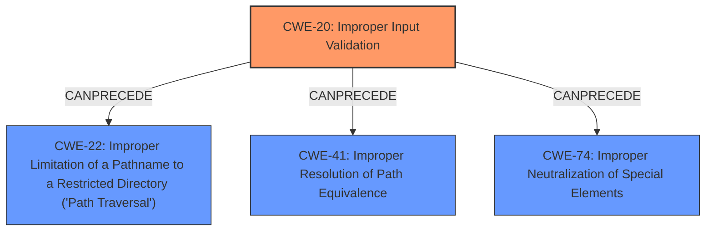

# Analysis for CVE-2020-18683

# Summary
| CWE ID | CWE Name | Confidence | CWE Abstraction Level | CWE Vulnerability Mapping Label | CWE-Vulnerability Mapping Notes |
|---|---|---|---|---|---|
| CWE-20 | Improper Input Validation | 1.0 | Class | Primary | Allowed-with-Review |

## Evidence and Confidence

*   **Confidence Score:** 1.0
*   **Evidence Strength:** HIGH

## Relationship Analysis
The primary identified CWE is CWE-20. There are a number of child CWEs for CWE-20 that could be considered, but without additional information, it's difficult to make a more specific determination. The graph shows that CWE-20 can precede CWE-22, CWE-41, and CWE-74 in potential vulnerability chains.

## Vulnerability Chain
The vulnerability chain starts with **poor input validation** (CWE-20). The specific consequences of this **poor input validation** are not detailed, so it is difficult to provide a more complete chain.

## Summary of Analysis
The vulnerability description explicitly mentions "**poor input validation**" in the `checkFlow` function of `StaticFlowEntryPusherResource.java` in Floodlight. This aligns directly with CWE-20, "Improper Input Validation".

The retriever results also listed CWE-20, further supporting this classification. While CWE-20 is a Class-level CWE and is generally discouraged, the provided information does not give enough detail to select a more specific Base-level CWE.

CWE-1284 "Improper Validation of Specified Quantity in Input" was considered because specified quantities were being validated. However, that CWE was deemed to be too specific given the lack of evidence. CWE-1288 "Improper Validation of Consistency within Input" was another good candidate, however, that CWE was also deemed too specific given the lack of evidence.

Relevant CWE Information:

# Enhanced Context (25 CWEs)

## CWE-1289: Improper Validation of Unsafe Equivalence in Input
**Abstraction Level**: Base
**Similarity Score**: 0.77
**Source**: dense

**Description**:
The product receives an input value that is used as a resource identifier or other type of reference, but it does not validate or incorrectly validates that the input is equivalent to a potentially-unsafe value.

**Mapping Guidance**:
- Usage: Allowed
- Rationale: This CWE entry is at the Base level of abstraction, which is a preferred level of abstraction for mapping to the root causes of vulnerabilities.

## CWE-407: Inefficient Algorithmic Complexity
**Abstraction Level**: Class
**Similarity Score**: 0.75
**Source**: dense

**Description**:
An algorithm in a product has an inefficient worst-case computational complexity that may be detrimental to system performance and can be triggered by an attacker, typically using crafted manipulations that ensure that the worst case is being reached.

**Mapping Guidance**:
- Usage: Allowed-with-Review
- Rationale: This CWE entry is a Class and might have Base-level children that would be more appropriate

## CWE-799: Improper Control of Interaction Frequency
**Abstraction Level**: Class
**Similarity Score**: 0.74
**Source**: dense

**Description**:
The product does not properly limit the number or frequency of interactions that it has with an actor, such as the number of incoming requests.

**Mapping Guidance**:
- Usage: Allowed-with-Review
- Rationale: This CWE entry is a Class and might have Base-level children that would be more appropriate

## CWE-668: Exposure of Resource to Wrong Sphere
**Abstraction Level**: Class
**Similarity Score**: 0.74
**Source**: dense

**Description**:
The product exposes a resource to the wrong control sphere, providing unintended actors with inappropriate access to the resource.

**Mapping Guidance**:
- Usage: Discouraged
- Rationale: CWE-668 is high-level and is often misused as a catch-all when lower-level CWE IDs might be applicable. It is sometimes used for low-information vulnerability reports [REF-1287]. It is a level-1 Class (i.e., a child of a Pillar). It is not useful for trend analysis.

## CWE-703: Improper Check or Handling of Exceptional Conditions
**Abstraction Level**: Pillar
**Similarity Score**: 0.74
**Source**: dense

**Description**:
The product does not properly anticipate or handle exceptional conditions that rarely occur during normal operation of the product.

**Mapping Guidance**:
- Usage: Discouraged
- Rationale: This CWE entry is extremely high-level, a Pillar.

## CWE-807: Reliance on Untrusted Inputs in a Security Decision
**Abstraction Level**: Base
**Similarity Score**: 0.74
**Source**: dense

**Description**:
The product uses a protection mechanism that relies on the existence or values of an input, but the input can be modified by an untrusted actor in a way that bypasses the protection mechanism.

**Mapping Guidance**:
- Usage: Allowed
- Rationale: This CWE entry is at the Base level of abstraction, which is a preferred level of abstraction for mapping to the root causes of vulnerabilities.

## CWE-606: Unchecked Input for Loop Condition
**Abstraction Level**: Base
**Similarity Score**: 0.74
**Source**: dense

**Description**:
The product does not properly check inputs that are used for loop conditions, potentially leading to a denial of service or other consequences because of excessive looping.

**Mapping Guidance**:
- Usage: Allowed
- Rationale: This CWE entry is at the Base level of abstraction, which is a preferred level of abstraction for mapping to the root causes of vulnerabilities.

## CWE-41: Improper Resolution of Path Equivalence
**Abstraction Level**: Base
**Similarity Score**: 0.74
**Source**: dense

**Description**:
The product is vulnerable to file system contents disclosure through path equivalence. Path equivalence involves the use of special characters in file and directory names. The associated manipulations are intended to generate multiple names for the same object.

**Mapping Guidance**:
- Usage: Allowed
- Rationale: This CWE entry is at the Base level of abstraction, which is a preferred level of abstraction for mapping to the root causes of vulnerabilities.

## CWE-184: Incomplete List of Disallowed Inputs
**Abstraction Level**: Base
**Similarity Score**: 0.74
**Source**: dense

**Description**:
The product implements a protection mechanism that relies on a list of inputs (or properties of inputs) that are not allowed by policy or otherwise require other action to neutralize before additional processing takes place, but the list is incomplete.

**Mapping Guidance**:
- Usage: Allowed
- Rationale: This CWE entry is at the Base level of abstraction, which is a preferred level of abstraction for mapping to the root causes of vulnerabilities.

## CWE-138: Improper Neutralization of Special Elements
**Abstraction Level**: Class
**Similarity Score**: 0.74
**Source**: dense

**Description**:
The product receives input from an upstream component, but it does not neutralize or incorrectly neutralizes special elements that could be interpreted as control elements or syntactic markers when they are sent to a downstream component.

**Mapping Guidance**:
- Usage: Discouraged
- Rationale: This CWE entry is a level-1 Class (i.e., a child of a Pillar). It might have lower-level children that would be more appropriate

## CWE-335: Incorrect Usage of Seeds in Pseudo-Random Number Generator (PRNG)
**Abstraction Level**: Base
**Similarity Score**: 6433.53
**Source**: sparse

**Description**:
The product uses a Pseudo-Random Number Generator (PRNG) but does not correctly manage seeds.

**Mapping Guidance**:
- Usage: Allowed
- Rationale: This CWE entry is at the Base level of abstraction, which is a preferred level of abstraction for mapping to the root causes of vulnerabilities.

## CWE-1284: Improper Validation of Specified Quantity in Input
**Abstraction Level**: Base
**Similarity Score**: 6296.45
**Source**: sparse

**Description**:
The product receives input that is expected to specify a quantity (such as size or length), but it does not validate or incorrectly validates that the quantity has the required properties.

**Mapping Guidance**:
- Usage: Allowed
- Rationale: This CWE entry is at the Base level of abstraction, which is a preferred level of abstraction for mapping to the root causes of

# Enhanced Query for CVE-2020-18683

## Vulnerability Description
Floodlight through 1.2 has **poor input validation** in checkFlow in StaticFlowEntryPusherResource.java because of undefined fields mishandling.

### Vulnerability Description Key Phrases
- **rootcause:** **poor input validation**
- **product:** Floodlight
- **version:** through 1.2
- **component:** checkFlow in StaticFlowEntryPusherResource.java

## CVE Reference Links Content Summary
UNRELATED

## Retriever Results

### Top Combined Results

| Rank | CWE ID | Name | Abstraction | Usage  | Retrievers | Individual Scores |
|------|--------|------|-------------|-------|------------|-------------------|
| 1 | 335 | Incorrect Usage of Seeds in Pseudo-Random Number Generator (PRNG) | Base | Allowed | sparse | 0.110 |
| 2 | 654 | Reliance on a Single Factor in a Security Decision | Base | Allowed | sparse | 0.110 |
| 3 | 1284 | Improper Validation of Specified Quantity in Input | Base | Allowed | sparse | 0.096 |
| 4 | 233 | Improper Handling of Parameters | Base | Allowed | sparse | 0.089 |
| 5 | 20 | Improper Input Validation | Class | Discouraged | sparse | 0.089 |
| 6 | 1288 | Improper Validation of Consistency within Input | Base | Allowed | dense | 0.471 |
| 7 | 770 | Allocation of Resources Without Limits or Throttling | Base | Allowed | graph | 0.002 |
| 8 | 1389 | Incorrect Parsing of Numbers with Different Radices | Base | Allowed | sparse | 0.085 |
| 9 | 478 | Missing Default Case in Multiple Condition Expression | Base | Allowed | sparse | 0.083 |
| 10 | 1333 | Inefficient Regular Expression Complexity | Base | Allowed | sparse | 0.082 |

# Complete CWE Specifications

## CWE-335: Incorrect Usage of Seeds in Pseudo-Random Number Generator (PRNG)
**Abstraction:** Base
**Status:** Draft

### Description
The product uses a Pseudo-Random Number Generator (PRNG) but does not correctly manage seeds.

### Extended Description

 PRNGs are deterministic and, while their output appears random, they cannot actually create entropy. They rely on cryptographically secure and unique seeds for entropy so proper seeding is critical to the secure operation of the PRNG.

 Management of seeds could be broken down into two main areas: 

  -  (1) protecting seeds as cryptographic material (such as a cryptographic key); 

  -  (2) whenever possible, using a uniquely generated seed from a cryptographically secure source 

 PRNGs require a seed as input to generate a stream of numbers that are functionally indistinguishable from random numbers. While the output is, in many cases, sufficient for cryptographic uses, the output of any PRNG is directly determined by the seed provided as input. If the seed can be ascertained by a third party, the entire output of the PRNG can be made known to them. As such, the seed should be kept secret and should ideally not be able to be guessed. For example, the current time may be a poor seed. Knowing the approximate time the PRNG was seeded greatly reduces the possible key space. 

 Seeds do not necessarily need to be unique, but reusing seeds may open up attacks if the seed is discovered. 

### Alternative Terms
None

### Relationships
ChildOf -> CWE-330
ChildOf -> CWE-330

### Mapping Guidance
**Usage:** Allowed
**Rationale:** This CWE entry is at the Base level of abstraction, which is a preferred level of abstraction for mapping to the root causes of vulnerabilities.
**Comments:** Carefully read both the name and description to ensure that this mapping is an appropriate fit. Do not try to 'force' a mapping to a lower-level Base/Variant simply to comply with this preferred level of abstraction.
**Reasons:**
- Acceptable-Use

### Additional Notes
**[Maintenance]** As of CWE 4.5, terminology related to randomness, entropy, and predictability can vary widely. Within the developer and other communities, "randomness" is used heavily. However, within cryptography, "entropy" is distinct, typically implied as a measurement. There are no commonly-used definitions, even within standards documents and cryptography papers. Future versions of CWE will attempt to define these terms and, if necessary, distinguish between them in ways that are appropriate for different communities but do not reduce the usability of CWE for mapping, understanding, or other scenarios.

### Observed Examples
- **CVE-2020-7010:** Cloud application on Kubernetes generates passwords using a weak random number generator based on deployment time.
- **CVE-2019-11495:** server uses erlang:now() to seed the PRNG, which results in a small search space for potential random seeds
- **CVE-2018-12520:** Product's PRNG is not seeded for the generation of session IDs

## CWE-654: Reliance on a Single Factor in a Security Decision
**Abstraction:** Base
**Status:** Draft

### Description
A protection mechanism relies exclusively, or to a large extent, on the evaluation of a single condition or the integrity of a single object or entity in order to make a decision about granting access to restricted resources or functionality.

### Extended Description
Not provided

### Alternative Terms
Separation of Privilege: Some people and publications use the term "Separation of Privilege" to describe this weakness, but this term has dual meanings in current usage. While this entry is closely associated with the original definition of "Separation of Privilege" by Saltzer and Schroeder, others use the same term to describe poor compartmentalization (CWE-653). Because there are multiple interpretations, use of the "Separation of Privilege" term is discouraged.

### Relationships
ChildOf -> CWE-657
ChildOf -> CWE-693

### Mapping Guidance
**Usage:** Allowed
**Rationale:** This CWE entry is at the Base level of abstraction, which is a preferred level of abstraction for mapping to the root causes of vulnerabilities.
**Comments:** Carefully read both the name and description to ensure that this mapping is an appropriate fit. Do not try to 'force' a mapping to a lower-level Base/Variant simply to comply with this preferred level of abstraction.
**Reasons:**
- Acceptable-Use

### Additional Notes
**[Maintenance]** This entry is closely associated with the term "Separation of Privilege." This term is used in several different ways in the industry, but they generally combine two closely related principles: compartmentalization (CWE-653) and using only one factor in a security decision (this entry). Proper compartmentalization implicitly introduces multiple factors into a security decision, but there can be cases in which multiple factors are required for authentication or other mechanisms that do not involve compartmentalization, such as performing all required checks on a submitted certificate. It is likely that CWE-653 and CWE-654 will provoke further discussion.

### Observed Examples
- **CVE-2022-35248:** Chat application skips validation when Central Authentication Service (CAS) is enabled, effectively removing the second factor from two-factor authentication

## CWE-1284: Improper Validation of Specified Quantity in Input
**Abstraction:** Base
**Status:** Incomplete

### Description
The product receives input that is expected to specify a quantity (such as size or length), but it does not validate or incorrectly validates that the quantity has the required properties.

### Extended Description

Specified quantities include size, length, frequency, price, rate, number of operations, time, and others. Code may rely on specified quantities to allocate resources, perform calculations, control iteration, etc. When the quantity is not properly validated, then attackers can specify malicious quantities to cause excessive resource allocation, trigger unexpected failures, enable buffer overflows, etc.

### Alternative Terms
None

### Relationships
ChildOf -> CWE-20
ChildOf -> CWE-20
CanPrecede -> CWE-789

### Mapping Guidance
**Usage:** Allowed
**Rationale:** This CWE entry is at the Base level of abstraction, which is a preferred level of abstraction for mapping to the root causes of vulnerabilities.
**Comments:** Carefully read both the name and description to ensure that this mapping is an appropriate fit. Do not try to 'force' a mapping to a lower-level Base/Variant simply to comply with this preferred level of abstraction.
**Reasons:**
- Acceptable-Use

### Additional Notes
**[Maintenance]** This entry is still under development and will continue to see updates and content improvements.

### Observed Examples
- **CVE-2022-21668:** Chain: Python library does not limit the resources used to process images that specify a very large number of bands (CWE-1284), leading to excessive memory consumption (CWE-789) or an integer overflow (CWE-190).
- **CVE-2008-1440:** lack of validation of length field leads to infinite loop
- **CVE-2008-2374:** lack of validation of string length fields allows memory consumption or buffer over-read

## CWE-233: Improper Handling of Parameters
**Abstraction:** Base
**Status:** Incomplete

### Description
The product does not properly handle when the expected number of parameters, fields, or arguments is not provided in input, or if those parameters are undefined.

### Extended Description
Not provided

### Alternative Terms
None

### Relationships
ChildOf -> CWE-228

### Mapping Guidance
**Usage:** Allowed
**Rationale:** This CWE entry is at the Base level of abstraction, which is a preferred level of abstraction for mapping to the root causes of vulnerabilities.
**Comments:** Carefully read both the name and description to ensure that this mapping is an appropriate fit. Do not try to 'force' a mapping to a lower-level Base/Variant simply to comply with this preferred level of abstraction.
**Reasons:**
- Acceptable-Use

## CWE-20: Improper Input Validation
**Abstraction:** Class
**Status:** Stable

### Description
The product receives input or data, but it does
        not validate or incorrectly validates that the input has the
        properties that are required to process the data safely and
        correctly.

### Extended Description

Input validation is a frequently-used technique for checking potentially dangerous inputs in order to ensure that the inputs are safe for processing within the code, or when communicating with other components. When software does not validate input properly, an attacker is able to craft the input in a form that is not expected by the rest of the application. This will lead to parts of the system receiving unintended input, which may result in altered control flow, arbitrary control of a resource, or arbitrary code execution.

Input validation is not the only technique for processing input, however. Other techniques attempt to transform potentially-dangerous input into something safe, such as filtering (CWE-790) - which attempts to remove dangerous inputs - or encoding/escaping (CWE-116), which attempts to ensure that the input is not misinterpreted when it is included in output to another component. Other techniques exist as well (see CWE-138 for more examples.)

Input validation can be applied to:

  - raw data - strings, numbers, parameters, file contents, etc.

  - metadata - information about the raw data, such as headers or size

Data can be simple or structured. Structured data can be composed of many nested layers, composed of combinations of metadata and raw data, with other simple or structured data.

Many properties of raw data or metadata may need to be validated upon entry into the code, such as:

  - specified quantities such as size, length, frequency, price, rate, number of operations, time, etc.

  - implied or derived quantities, such as the actual size of a file instead of a specified size

  - indexes, offsets, or positions into more complex data structures

  - symbolic keys or other elements into hash tables, associative arrays, etc.

  - well-formedness, i.e. syntactic correctness - compliance with expected syntax 

  - lexical token correctness - compliance with rules for what is treated as a token

  - specified or derived type - the actual type of the input (or what the input appears to be)

  - consistency - between individual data elements, between raw data and metadata, between references, etc.

  - conformance to domain-specific rules, e.g. business logic 

  - equivalence - ensuring that equivalent inputs are treated the same

  - authenticity, ownership, or other attestations about the input, e.g. a cryptographic signature to prove the source of the data

Implied or derived properties of data must often be calculated or inferred by the code itself. Errors in deriving properties may be considered a contributing factor to improper input validation. 

Note that "input validation" has very different meanings to different people, or within different classification schemes. Caution must be used when referencing this CWE entry or mapping to it. For example, some weaknesses might involve inadvertently giving control to an attacker over an input when they should not be able to provide an input at all, but sometimes this is referred to as input validation.

Finally, it is important to emphasize that the distinctions between input validation and output escaping are often blurred, and developers must be careful to understand the difference, including how input validation is not always sufficient to prevent vulnerabilities, especially when less stringent data types must be supported, such as free-form text. Consider a SQL injection scenario in which a person's last name is inserted into a query. The name "O'Reilly" would likely pass the validation step since it is a common last name in the English language. However, this valid name cannot be directly inserted into the database because it contains the "'" apostrophe character, which would need to be escaped or otherwise transformed. In this case, removing the apostrophe might reduce the risk of SQL injection, but it would produce incorrect behavior because the wrong name would be recorded.

### Alternative Terms
None

### Relationships
ChildOf -> CWE-707
PeerOf -> CWE-345
CanPrecede -> CWE-22
CanPrecede -> CWE-41
CanPrecede -> CWE-74
CanPrecede -> CWE-119
CanPrecede -> CWE-770

### Mapping Guidance
**Usage:** Discouraged
**Rationale:** CWE-20 is commonly misused in low-information vulnerability reports when lower-level CWEs could be used instead, or when more details about the vulnerability are available [REF-1287]. It is not useful for trend analysis. It is also a level-1 Class (i.e., a child of a Pillar).
**Comments:** Consider lower-level children such as Improper Use of Validation Framework (CWE-1173) or improper validation involving specific types or properties of input such as Specified Quantity (CWE-1284); Specified Index, Position, or Offset (CWE-1285); Syntactic Correctness (CWE-1286); Specified Type (CWE-1287); Consistency within Input (CWE-1288); or Unsafe Equivalence (CWE-1289).
**Reasons:**
- Frequent Misuse
**Suggested Alternatives:**
- CWE-1284: Specified Quantity
- CWE-1285: Specified Index, Position, or Offset
- CWE-1286: Syntactic Correctness
- CWE-1287: Specified Type
- CWE-1288: Consistency within Input
- CWE-1289: Unsafe Equivalence
- CWE-116: Improper Encoding or Escaping of Output

### Additional Notes
**[Relationship]** 

CWE-116 and CWE-20 have a close association because, depending on the nature of the structured message, proper input validation can indirectly prevent special characters from changing the meaning of a structured message. For example, by validating that a numeric ID field should only contain the 0-9 characters, the programmer effectively prevents injection attacks.

**[Maintenance]** As of 2020, this entry is used more often than preferred, and it is a source of frequent confusion. It is being actively modified for CWE 4.1 and subsequent versions.

**[Maintenance]** Concepts such as validation, data transformation, and neutralization are being refined, so relationships between CWE-20 and other entries such as CWE-707 may change in future versions, along with an update to the Vulnerability Theory document.

**[Maintenance]** Input validation - whether missing or incorrect - is such an essential and widespread part of secure development that it is implicit in many different weaknesses. Traditionally, problems such as buffer overflows and XSS have been classified as input validation problems by many security professionals. However, input validation is not necessarily the only protection mechanism available for avoiding such problems, and in some cases it is not even sufficient. The CWE team has begun capturing these subtleties in chains within the Research Concepts view (CWE-1000), but more work is needed.

**[Terminology]** 

The "input validation" term is extremely common, but it is used in many different ways. In some cases its usage can obscure the real underlying weakness or otherwise hide chaining and composite relationships.

Some people use "input validation" as a general term that covers many different neutralization techniques for ensuring that input is appropriate, such as filtering, canonicalization, and escaping. Others use the term in a more narrow context to simply mean "checking if an input conforms to expectations without changing it." CWE uses this more narrow interpretation.

### Observed Examples
- **CVE-2024-37032:** Large language model (LLM) management tool does not validate the format of a digest value (CWE-1287) from a private, untrusted model registry, enabling relative path traversal (CWE-23), a.k.a. Probllama
- **CVE-2022-45918:** Chain: a learning management tool debugger uses external input to locate previous session logs (CWE-73) and does not properly validate the given path (CWE-20), allowing for filesystem path traversal using "../" sequences (CWE-24)
- **CVE-2021-30860:** Chain: improper input validation (CWE-20) leads to integer overflow (CWE-190) in mobile OS, as exploited in the wild per CISA KEV.

## CWE-1288: Improper Validation of Consistency within Input
**Abstraction:** Base
**Status:** Incomplete

### Description
The product receives a complex input with multiple elements or fields that must be consistent with each other, but it does not validate or incorrectly validates that the input is actually consistent.

### Extended Description

Some input data can be structured with multiple elements or fields that must be consistent with each other, e.g. a number-of-items field that is followed by the expected number of elements. When such complex inputs are inconsistent, attackers could trigger unexpected errors, cause incorrect actions to take place, or exploit latent vulnerabilities.

### Alternative Terms
None

### Relationships
ChildOf -> CWE-20

### Mapping Guidance
**Usage:** Allowed
**Rationale:** This CWE entry is at the Base level of abstraction, which is a preferred level of abstraction for mapping to the root causes of vulnerabilities.
**Comments:** Carefully read both the name and description to ensure that this mapping is an appropriate fit. Do not try to 'force' a mapping to a lower-level Base/Variant simply to comply with this preferred level of abstraction.
**Reasons:**
- Acceptable-Use

### Additional Notes
**[Maintenance]** This entry is still under development and will continue to see updates and content improvements.

### Observed Examples
- **CVE-2018-16733:** product does not validate that the start block appears before the end block
- **CVE-2006-3790:** size field that is inconsistent with packet size leads to buffer over-read
- **CVE-2008-4114:** system crash with offset value that is inconsistent with packet size

## CWE-770: Allocation of Resources Without Limits or Throttling
**Abstraction:** Base
**Status:** Incomplete

### Description
The product allocates a reusable resource or group of resources on behalf of an actor without imposing any restrictions on the size or number of resources that can be allocated, in violation of the intended security policy for that actor.

### Extended Description

Code frequently has to work with limited resources, so programmers must be careful to ensure that resources are not consumed too quickly, or too easily. Without use of quotas, resource limits, or other protection mechanisms, it can be easy for an attacker to consume many resources by rapidly making many requests, or causing larger resources to be used than is needed. When too many resources are allocated, or if a single resource is too large, then it can prevent the code from working correctly, possibly leading to a denial of service.

### Alternative Terms
None

### Relationships
ChildOf -> CWE-400
ChildOf -> CWE-665
ChildOf -> CWE-400

### Mapping Guidance
**Usage:** Allowed
**Rationale:** This CWE entry is at the Base level of abstraction, which is a preferred level of abstraction for mapping to the root causes of vulnerabilities.
**Comments:** Carefully read both the name and description to ensure that this mapping is an appropriate fit. Do not try to 'force' a mapping to a lower-level Base/Variant simply to comply with this preferred level of abstraction.
**Reasons:**
- Acceptable-Use

### Additional Notes
**[Relationship]** This entry is different from uncontrolled resource consumption (CWE-400) in that there are other weaknesses that are related to inability to control resource consumption, such as holding on to a resource too long after use, or not correctly keeping track of active resources so that they can be managed and released when they are finished (CWE-771).

**[Theoretical]** Vulnerability theory is largely about how behaviors and resources interact. "Resource exhaustion" can be regarded as either a consequence or an attack, depending on the perspective. This entry is an attempt to reflect one of the underlying weaknesses that enable these attacks (or consequences) to take place.

### Observed Examples
- **CVE-2022-21668:** Chain: Python library does not limit the resources used to process images that specify a very large number of bands (CWE-1284), leading to excessive memory consumption (CWE-789) or an integer overflow (CWE-190).
- **CVE-2009-4017:** Language interpreter does not restrict the number of temporary files being created when handling a MIME request with a large number of parts..
- **CVE-2009-2726:** Driver does not use a maximum width when invoking sscanf style functions, causing stack consumption.

## CWE-1389: Incorrect Parsing of Numbers with Different Radices
**Abstraction:** Base
**Status:** Incomplete

### Description
The product parses numeric input assuming base 10 (decimal) values, but it does not account for inputs that use a different base number (radix).

### Extended Description

Frequently, a numeric input that begins with "0" is treated as octal, or "0x" causes it to be treated as hexadecimal, e.g. by the inet_addr() function. For example, "023" (octal) is 35 decimal, or "0x31" is 49 decimal. Other bases may be used as well. If the developer assumes decimal-only inputs, the code could produce incorrect numbers when the inputs are parsed using a different base. This can result in unexpected and/or dangerous behavior. For example, a "0127.0.0.1" IP address is parsed as octal due to the leading "0", whose numeric value would be the same as 87.0.0.1 (decimal), where the developer likely expected to use 127.0.0.1.

The consequences vary depending on the surrounding code in which this weakness occurs, but they can include bypassing network-based access control using unexpected IP addresses or netmasks, or causing apparently-symbolic identifiers to be processed as if they are numbers. In web applications, this can enable bypassing of SSRF restrictions.

### Alternative Terms
None

### Relationships
ChildOf -> CWE-704

### Mapping Guidance
**Usage:** Allowed
**Rationale:** This CWE entry is at the Base level of abstraction, which is a preferred level of abstraction for mapping to the root causes of vulnerabilities.
**Comments:** Carefully read both the name and description to ensure that this mapping is an appropriate fit. Do not try to 'force' a mapping to a lower-level Base/Variant simply to comply with this preferred level of abstraction.
**Reasons:**
- Acceptable-Use

### Observed Examples
- **CVE-2021-29662:** Chain: Use of zero-prepended IP addresses in Perl-based IP validation module can lead to an access control bypass.
- **CVE-2021-28918:** Chain: Use of zero-prepended IP addresses in a product that manages IP blocks can lead to an SSRF.
- **CVE-2021-29921:** Chain: Use of zero-prepended IP addresses in a Python standard library package can lead to an SSRF.

## CWE-478: Missing Default Case in Multiple Condition Expression
**Abstraction:** Base
**Status:** Draft

### Description
The code does not have a default case in an expression with multiple conditions, such as a switch statement.

### Extended Description
If a multiple-condition expression (such as a switch in C) omits the default case but does not consider or handle all possible values that could occur, then this might lead to complex logical errors and resultant weaknesses. Because of this, further decisions are made based on poor information, and cascading failure results. This cascading failure may result in any number of security issues, and constitutes a significant failure in the system.

### Alternative Terms
None

### Relationships
ChildOf -> CWE-1023

### Mapping Guidance
**Usage:** Allowed
**Rationale:** This CWE entry is at the Base level of abstraction, which is a preferred level of abstraction for mapping to the root causes of vulnerabilities.
**Comments:** Carefully read both the name and description to ensure that this mapping is an appropriate fit. Do not try to 'force' a mapping to a lower-level Base/Variant simply to comply with this preferred level of abstraction.
**Reasons:**
- Acceptable-Use

## CWE-1333: Inefficient Regular Expression Complexity
**Abstraction:** Base
**Status:** Draft

### Description
The product uses a regular expression with an inefficient, possibly exponential worst-case computational complexity that consumes excessive CPU cycles.

### Extended Description
Some regular expression engines have a feature called "backtracking". If the token cannot match, the engine "backtracks" to a position that may result in a different token that can match.
 Backtracking becomes a weakness if all of these conditions are met:

  - The number of possible backtracking attempts are exponential relative to the length of the input.

  - The input can fail to match the regular expression.

  - The input can be long enough.

 Attackers can create crafted inputs that intentionally cause the regular expression to use excessive backtracking in a way that causes the CPU consumption to spike. 

### Alternative Terms
ReDoS: ReDoS is an abbreviation of "Regular expression Denial of Service".
Regular Expression Denial of Service: While this term is attack-focused, this is commonly used to describe the weakness.
Catastrophic backtracking: This term is used to describe the behavior of the regular expression as a negative technical impact.

### Relationships
ChildOf -> CWE-407
ChildOf -> CWE-407

### Mapping Guidance
**Usage:** Allowed
**Rationale:** This CWE entry is at the Base level of abstraction, which is a preferred level of abstraction for mapping to the root causes of vulnerabilities.
**Comments:** Carefully read both the name and description to ensure that this mapping is an appropriate fit. Do not try to 'force' a mapping to a lower-level Base/Variant simply to comply with this preferred level of abstraction.
**Reasons:**
- Acceptable-Use

### Observed Examples
- **CVE-2020-5243:** server allows ReDOS with crafted User-Agent strings, due to overlapping capture groups that cause excessive backtracking.
- **CVE-2021-21317:** npm package for user-agent parser prone to ReDoS due to overlapping capture groups
- **CVE-2019-16215:** Markdown parser uses inefficient regex when processing a message, allowing users to cause CPU consumption and delay preventing processing of other messages.

