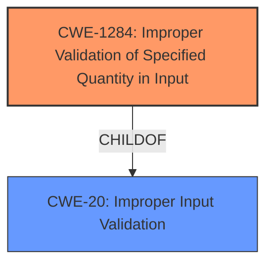

# Analysis for CVE-2020-18685

# Summary
| CWE ID | CWE Name | Confidence | CWE Abstraction Level | CWE Vulnerability Mapping Label | CWE-Vulnerability Mapping Notes |
|---|---|---|---|---|---|
| CWE-1284 | Improper Validation of Specified Quantity in Input | 0.75 | Base | Allowed | Primary CWE |
| CWE-20 | Improper Input Validation | 0.5 | Class | Allowed | Secondary Candidate |

## Evidence and Confidence

*   **Confidence Score:** 0.75
*   **Evidence Strength:** MEDIUM

## Relationship Analysis
The primary CWE is CWE-1284, which directly addresses the **improper validation** of a specified quantity in input. This aligns with the vulnerability description about **unchecked prerequisites**. CWE-1284 is a child of CWE-20, which represents a broader class of input validation issues. The relationship shows how the specific issue relates to a more general category of vulnerabilities. Choosing CWE-1284 provides more specific information.

## Vulnerability Chain
The vulnerability chain starts with the **unchecked prerequisites** in the `checkFlow` function (root cause). This **lack of validation** can lead to unexpected behavior or vulnerabilities, although the description does not specify a resulting impact.

## Summary of Analysis
The initial assessment identified that the **unchecked prerequisites** in the `checkFlow` function of Floodlight v1.2 are the root cause of the vulnerability. This is because of **poor input validation**.

The primary CWE selected is CWE-1284 (**Improper Validation of Specified Quantity in Input**), which accurately describes the vulnerability where the software fails to properly validate the quantity of input, leading to potential security issues. This is a base-level CWE, offering sufficient specificity.

CWE-20 (**Improper Input Validation**) was considered as a broader, more general classification. While it's a valid mapping, CWE-1284 provides a more precise characterization of the vulnerability, aligning well with the description of **unchecked prerequisites** relating to TCP/UDP ports or group/table IDs. This decision is based on the principle of selecting the most specific CWE that accurately represents the weakness.

The evidence is based on the vulnerability description key phrases with **unchecked prerequisites**, indicating that the root cause is **improper input validation**.

Relevant CWE Information:

# Enhanced Context (25 CWEs)
The following CWEs were identified as potentially relevant to this vulnerability:

## CWE-1289: Improper Validation of Unsafe Equivalence in Input
**Abstraction Level**: Base
**Similarity Score**: 0.77
**Source**: dense

**Description**:
The product receives an input value that is used as a resource identifier or other type of reference, but it does not validate or incorrectly validates that the input is equivalent to a potentially-unsafe value.

**Mapping Guidance**:
- Usage: Allowed
- Rationale: This CWE entry is at the Base level of abstraction, which is a preferred level of abstraction for mapping to the root causes of vulnerabilities.

## CWE-330: Use of Insufficiently Random Values
**Abstraction Level**: Class
**Similarity Score**: 0.76
**Source**: dense

**Description**:
The product uses insufficiently random numbers or values in a security context that depends on unpredictable numbers.

**Mapping Guidance**:
- Usage: Discouraged
- Rationale: This CWE entry is a level-1 Class (i.e., a child of a Pillar). It might have lower-level children that would be more appropriate

## CWE-807: Reliance on Untrusted Inputs in a Security Decision
**Abstraction Level**: Base
**Similarity Score**: 0.76
**Source**: dense

**Description**:
The product uses a protection mechanism that relies on the existence or values of an input, but the input can be modified by an untrusted actor in a way that bypasses the protection mechanism.

**Mapping Guidance**:
- Usage: Allowed
- Rationale: This CWE entry is at the Base level of abstraction, which is a preferred level of abstraction for mapping to the root causes of vulnerabilities.

## CWE-345: Insufficient Verification of Data Authenticity
**Abstraction Level**: Class
**Similarity Score**: 0.76
**Source**: dense

**Description**:
The product does not sufficiently verify the origin or authenticity of data, in a way that causes it to accept invalid data.

**Mapping Guidance**:
- Usage: Discouraged
- Rationale: This CWE entry is a level-1 Class (i.e., a child of a Pillar). It might have lower-level children that would be more appropriate

## CWE-252: Unchecked Return Value
**Abstraction Level**: Base
**Similarity Score**: 0.76
**Source**: dense

**Description**:
The product does not check the return value from a method or function, which can prevent it from detecting unexpected states and conditions.

**Mapping Guidance**:
- Usage: Allowed
- Rationale: This CWE entry is at the Base level of abstraction, which is a preferred level of abstraction for mapping to the root causes of vulnerabilities.

## CWE-754: Improper Check for Unusual or Exceptional Conditions
**Abstraction Level**: Class
**Similarity Score**: 0.75
**Source**: dense

**Description**:
The product does not check or incorrectly checks for unusual or exceptional conditions that are not expected to occur frequently during day to day operation of the product.

**Mapping Guidance**:
- Usage: Allowed-with-Review
- Rationale: This CWE entry is a Class and might have Base-level children that would be more appropriate

## CWE-138: Improper Neutralization of Special Elements
**Abstraction Level**: Class
**Similarity Score**: 0.75
**Source**: dense

**Description**:
The product receives input from an upstream component, but it does not neutralize or incorrectly neutralizes special elements that could be interpreted as control elements or syntactic markers when they are sent to a downstream component.

**Mapping Guidance**:
- Usage: Discouraged
- Rationale: This CWE entry is a level-1 Class (i.e., a child of a Pillar). It might have lower-level children that would be more appropriate

## CWE-703: Improper Check or Handling of Exceptional Conditions
**Abstraction Level**: Pillar
**Similarity Score**: 0.75
**Source**: dense

**Description**:
The product does not properly anticipate or handle exceptional conditions that rarely occur during normal operation of the product.

**Mapping Guidance**:
- Usage: Discouraged
- Rationale: This CWE entry is extremely high-level, a Pillar.

## CWE-665: Improper Initialization
**Abstraction Level**: Class
**Similarity Score**: 0.75
**Source**: dense

**Description**:
The product does not initialize or incorrectly initializes a resource, which might leave the resource in an unexpected state when it is accessed or used.

**Mapping Guidance**:
- Usage: Discouraged
- Rationale: This CWE entry is a level-1 Class (i.e., a child of a Pillar). It might have lower-level children that would be more appropriate

## CWE-667: Improper Locking
**Abstraction Level**: Class
**Similarity Score**: 0.75
**Source**: dense

**Description**:
The product does not properly acquire or release a lock on a resource, leading to unexpected resource state changes and behaviors.

**Mapping Guidance**:
- Usage: Allowed-with-Review
- Rationale: This CWE entry is a Class and might have Base-level children that would be more appropriate

## CWE-190: Integer Overflow or Wraparound
**Abstraction Level**: Base
**Similarity Score**: 5636.76
**Source**: sparse

**Description**:
The product performs a calculation that can
         produce an integer overflow or wraparound when the logic
         assumes that the resulting value will always be larger than
         the original value. This occurs when an integer value is
         incremented to a value that is too large to store in the
         associated representation. When this occurs, the value may
         become a very small or negative number.

**Mapping Guidance**:
- Usage: Allowed
- Rationale: This CWE entry is at the Base level of abstraction, which is a preferred level of abstraction for mapping to the root causes of vulnerabilities.

## CWE-252: Unchecked Return Value
**Abstraction Level**: Base
**Similarity Score**: 5579.84
**Source**: sparse

**Description**:
The product does not check the return value from a method or function, which can prevent it from detecting unexpected states and conditions.

**Mapping Guidance**:
- Usage: Allowed
- Rationale: This CWE entry is at the Base level of abstraction, which is a preferred level of abstraction for mapping to the root causes of vulnerabilities.

## CWE-1339: Insufficient Precision or Accuracy of a Real Number
**Abstraction Level**: Base

# Enhanced Query for CVE-2020-18685

## Vulnerability Description
Floodlight through 1.2 has poor input validation in checkFlow in StaticFlowEntryPusherResource.java because of **unchecked prerequisites** related to TCP or UDP ports, or group or table IDs.

### Vulnerability Description Key Phrases
- **rootcause:** **unchecked prerequisites**
- **product:** Floodlight
- **version:** through 1.2
- **component:** checkFlow in StaticFlowEntryPusherResource.java

## CVE Reference Links Content Summary
UNRELATED

## Retriever Results

### Top Combined Results

| Rank | CWE ID | Name | Abstraction | Usage  | Retrievers | Individual Scores |
|------|--------|------|-------------|-------|------------|-------------------|
| 1 | 190 | Integer Overflow or Wraparound | Base | Allowed | sparse | 0.138 |
| 2 | 606 | Unchecked Input for Loop Condition | Base | Allowed | sparse | 0.138 |
| 3 | 330 | Use of Insufficiently Random Values | Class | Discouraged | sparse | 0.137 |
| 4 | 824 | Access of Uninitialized Pointer | Base | Allowed | sparse | 0.135 |
| 5 | 917 | Improper Neutralization of Special Elements used in an Expression Language Statement ('Expression Language Injection') | Base | Allowed | sparse | 0.134 |
| 6 | 1288 | Improper Validation of Consistency within Input | Base | Allowed | dense | 0.471 |
| 7 | 1339 | Insufficient Precision or Accuracy of a Real Number | Base | Allowed | graph | 0.002 |
| 8 | 252 | Unchecked Return Value | Base | Allowed | sparse | 0.133 |
| 9 | 340 | Generation of Predictable Numbers or Identifiers | Class | Allowed-with-Review | sparse | 0.130 |
| 10 | 502 | Deserialization of Untrusted Data | Base | Allowed | sparse | 0.129 |

# Complete CWE Specifications

## CWE-190: Integer Overflow or Wraparound
**Abstraction:** Base
**Status:** Stable

### Description
The product performs a calculation that can
         produce an integer overflow or wraparound when the logic
         assumes that the resulting value will always be larger than
         the original value. This occurs when an integer value is
         incremented to a value that is too large to store in the
         associated representation. When this occurs, the value may
         become a very small or negative number.

### Extended Description
Not provided

### Alternative Terms
Overflow: The terms "overflow" and "wraparound" are used interchangeably by some people, but they can have more precise distinctions by others. See Terminology Notes.
Wraparound: The terms "overflow" and "wraparound" are used interchangeably by some people, but they can have more precise distinctions by others. See Terminology Notes.
wrap, wrap-around, wrap around: Alternate spellings of "wraparound"

### Relationships
ChildOf -> CWE-682
ChildOf -> CWE-682
ChildOf -> CWE-20
CanPrecede -> CWE-119

### Mapping Guidance
**Usage:** Allowed
**Rationale:** This CWE entry is at the Base level of abstraction, which is a preferred level of abstraction for mapping to the root causes of vulnerabilities.
**Comments:** Be careful of terminology problems with "overflow," "underflow," and "wraparound" - see Terminology Notes. Carefully read both the name and description to ensure that this mapping is an appropriate fit. Do not try to 'force' a mapping to a lower-level Base/Variant simply to comply with this preferred level of abstraction.
**Reasons:**
- Acceptable-Use
**Suggested Alternatives:**
- CWE-191: Integer Underflow (Wrap or Wraparound). Consider CWE-191 when the result is less than the minimum value that can be represented (sometimes called "underflows").

### Additional Notes
**[Relationship]** Integer overflows can be primary to buffer overflows when they cause less memory to be allocated than expected.

**[Terminology]** 

"Integer overflow" is sometimes used to cover several types of errors, including signedness errors, or buffer overflows that involve manipulation of integer data types instead of characters. Part of the confusion results from the fact that 0xffffffff is -1 in a signed context. Other confusion also arises because of the role that integer overflows have in chains.

A "wraparound" is a well-defined, standard behavior that follows specific rules for how to handle situations when the intended numeric value is too large or too small to be represented, as specified in standards such as C11.

"Overflow" is sometimes conflated with "wraparound" but typically indicates a non-standard or undefined behavior.

The "overflow" term is sometimes used to indicate cases where either the maximum or the minimum is exceeded, but others might only use "overflow" to indicate exceeding the maximum while using "underflow" for exceeding the minimum.

Some people use "overflow" to mean any value outside the representable range - whether greater than the maximum, or less than the minimum - but CWE uses "underflow" for cases in which the intended result is less than the minimum.

See [REF-1440] for additional explanation of the ambiguity of terminology.

**[Other]** While there may be circumstances in which the logic intentionally relies on wrapping - such as with modular arithmetic in timers or counters - it can have security consequences if the wrap is unexpected. This is especially the case if the integer overflow can be triggered using user-supplied inputs.

### Observed Examples
- **CVE-2021-43537:** Chain: in a web browser, an unsigned 64-bit integer is forcibly cast to a 32-bit integer (CWE-681) and potentially leading to an integer overflow (CWE-190). If an integer overflow occurs, this can cause heap memory corruption (CWE-122)
- **CVE-2022-21668:** Chain: Python library does not limit the resources used to process images that specify a very large number of bands (CWE-1284), leading to excessive memory consumption (CWE-789) or an integer overflow (CWE-190).
- **CVE-2022-0545:** Chain: 3D renderer has an integer overflow (CWE-190) leading to write-what-where condition (CWE-123) using a crafted image.

## CWE-606: Unchecked Input for Loop Condition
**Abstraction:** Base
**Status:** Draft

### Description
The product does not properly check inputs that are used for loop conditions, potentially leading to a denial of service or other consequences because of excessive looping.

### Extended Description
Not provided

### Alternative Terms
None

### Relationships
ChildOf -> CWE-1284
CanPrecede -> CWE-834

### Mapping Guidance
**Usage:** Allowed
**Rationale:** This CWE entry is at the Base level of abstraction, which is a preferred level of abstraction for mapping to the root causes of vulnerabilities.
**Comments:** Carefully read both the name and description to ensure that this mapping is an appropriate fit. Do not try to 'force' a mapping to a lower-level Base/Variant simply to comply with this preferred level of abstraction.
**Reasons:**
- Acceptable-Use

## CWE-330: Use of Insufficiently Random Values
**Abstraction:** Class
**Status:** Stable

### Description
The product uses insufficiently random numbers or values in a security context that depends on unpredictable numbers.

### Extended Description
When product generates predictable values in a context requiring unpredictability, it may be possible for an attacker to guess the next value that will be generated, and use this guess to impersonate another user or access sensitive information.

### Alternative Terms
None

### Relationships
ChildOf -> CWE-693
CanPrecede -> CWE-804

### Mapping Guidance
**Usage:** Discouraged
**Rationale:** This CWE entry is a level-1 Class (i.e., a child of a Pillar). It might have lower-level children that would be more appropriate
**Comments:** Examine children of this entry to see if there is a better fit
**Reasons:**
- Abstraction

### Additional Notes
**[Relationship]** This can be primary to many other weaknesses such as cryptographic errors, authentication errors, symlink following, information leaks, and others.

**[Maintenance]** As of CWE 4.3, CWE-330 and its descendants are being investigated by the CWE crypto team to identify gaps related to randomness and unpredictability, as well as the relationships between randomness and cryptographic primitives. This "subtree analysis" might result in the addition or deprecation of existing entries; the reorganization of relationships in some views, e.g. the research view (CWE-1000); more consistent use of terminology; and/or significant modifications to related entries.

**[Maintenance]** As of CWE 4.5, terminology related to randomness, entropy, and predictability can vary widely. Within the developer and other communities, "randomness" is used heavily. However, within cryptography, "entropy" is distinct, typically implied as a measurement. There are no commonly-used definitions, even within standards documents and cryptography papers. Future versions of CWE will attempt to define these terms and, if necessary, distinguish between them in ways that are appropriate for different communities but do not reduce the usability of CWE for mapping, understanding, or other scenarios.

### Observed Examples
- **CVE-2021-3692:** PHP framework uses mt_rand() function (Marsenne Twister) when generating tokens
- **CVE-2020-7010:** Cloud application on Kubernetes generates passwords using a weak random number generator based on deployment time.
- **CVE-2009-3278:** Crypto product uses rand() library function to generate a recovery key, making it easier to conduct brute force attacks.

## CWE-824: Access of Uninitialized Pointer
**Abstraction:** Base
**Status:** Incomplete

### Description
The product accesses or uses a pointer that has not been initialized.

### Extended Description

If the pointer contains an uninitialized value, then the value might not point to a valid memory location. This could cause the product to read from or write to unexpected memory locations, leading to a denial of service. If the uninitialized pointer is used as a function call, then arbitrary functions could be invoked. If an attacker can influence the portion of uninitialized memory that is contained in the pointer, this weakness could be leveraged to execute code or perform other attacks.

Depending on memory layout, associated memory management behaviors, and product operation, the attacker might be able to influence the contents of the uninitialized pointer, thus gaining more fine-grained control of the memory location to be accessed.

### Alternative Terms
None

### Relationships
ChildOf -> CWE-119
ChildOf -> CWE-119
ChildOf -> CWE-119
ChildOf -> CWE-119
CanPrecede -> CWE-125
CanPrecede -> CWE-787

### Mapping Guidance
**Usage:** Allowed
**Rationale:** This CWE entry is at the Base level of abstraction, which is a preferred level of abstraction for mapping to the root causes of vulnerabilities.
**Comments:** Carefully read both the name and description to ensure that this mapping is an appropriate fit. Do not try to 'force' a mapping to a lower-level Base/Variant simply to comply with this preferred level of abstraction.
**Reasons:**
- Acceptable-Use

### Additional Notes
**[Maintenance]** There are close relationships between incorrect pointer dereferences and other weaknesses related to buffer operations. There may not be sufficient community agreement regarding these relationships. Further study is needed to determine when these relationships are chains, composites, perspective/layering, or other types of relationships. As of September 2010, most of the relationships are being captured as chains.

**[Terminology]** Many weaknesses related to pointer dereferences fall under the general term of "memory corruption" or "memory safety." As of September 2010, there is no commonly-used terminology that covers the lower-level variants.

### Observed Examples
- **CVE-2024-32878:** LLM product has a free of an uninitialized pointer
- **CVE-2010-0211:** chain: unchecked return value (CWE-252) leads to free of invalid, uninitialized pointer (CWE-824).
- **CVE-2009-2768:** Pointer in structure is not initialized, leading to NULL pointer dereference (CWE-476) and system crash.

## CWE-917: Improper Neutralization of Special Elements used in an Expression Language Statement ('Expression Language Injection')
**Abstraction:** Base
**Status:** Incomplete

### Description
The product constructs all or part of an expression language (EL) statement in a framework such as a Java Server Page (JSP) using externally-influenced input from an upstream component, but it does not neutralize or incorrectly neutralizes special elements that could modify the intended EL statement before it is executed.

### Extended Description
Frameworks such as Java Server Page (JSP) allow a developer to insert executable expressions within otherwise-static content. When the developer is not aware of the executable nature of these expressions and/or does not disable them, then if an attacker can inject expressions, this could lead to code execution or other unexpected behaviors.

### Alternative Terms
EL Injection

### Relationships
ChildOf -> CWE-77
PeerOf -> CWE-1336
ChildOf -> CWE-74
ChildOf -> CWE-77
ChildOf -> CWE-77

### Mapping Guidance
**Usage:** Allowed
**Rationale:** This CWE entry is at the Base level of abstraction, which is a preferred level of abstraction for mapping to the root causes of vulnerabilities.
**Comments:** Carefully read both the name and description to ensure that this mapping is an appropriate fit. Do not try to 'force' a mapping to a lower-level Base/Variant simply to comply with this preferred level of abstraction.
**Reasons:**
- Acceptable-Use

### Additional Notes
**[Maintenance]** The interrelationships and differences between CWE-917 and CWE-1336 need to be further clarified.

**[Relationship]** In certain versions of Spring 3.0.5 and earlier, there was a vulnerability (CVE-2011-2730) in which Expression Language tags would be evaluated twice, which effectively exposed any application to EL injection. However, even for later versions, this weakness is still possible depending on configuration.

### Observed Examples
- **CVE-2021-44228:** Product does not neutralize ${xyz} style expressions, allowing remote code execution. (log4shell vulnerability in log4j)

## CWE-1288: Improper Validation of Consistency within Input
**Abstraction:** Base
**Status:** Incomplete

### Description
The product receives a complex input with multiple elements or fields that must be consistent with each other, but it does not validate or incorrectly validates that the input is actually consistent.

### Extended Description

Some input data can be structured with multiple elements or fields that must be consistent with each other, e.g. a number-of-items field that is followed by the expected number of elements. When such complex inputs are inconsistent, attackers could trigger unexpected errors, cause incorrect actions to take place, or exploit latent vulnerabilities.

### Alternative Terms
None

### Relationships
ChildOf -> CWE-20

### Mapping Guidance
**Usage:** Allowed
**Rationale:** This CWE entry is at the Base level of abstraction, which is a preferred level of abstraction for mapping to the root causes of vulnerabilities.
**Comments:** Carefully read both the name and description to ensure that this mapping is an appropriate fit. Do not try to 'force' a mapping to a lower-level Base/Variant simply to comply with this preferred level of abstraction.
**Reasons:**
- Acceptable-Use

### Additional Notes
**[Maintenance]** This entry is still under development and will continue to see updates and content improvements.

### Observed Examples
- **CVE-2018-16733:** product does not validate that the start block appears before the end block
- **CVE-2006-3790:** size field that is inconsistent with packet size leads to buffer over-read
- **CVE-2008-4114:** system crash with offset value that is inconsistent with packet size

## CWE-1339: Insufficient Precision or Accuracy of a Real Number
**Abstraction:** Base
**Status:** Draft

### Description
The product processes a real number with an implementation in which the number's representation does not preserve required accuracy and precision in its fractional part, causing an incorrect result.

### Extended Description

When a security decision or calculation requires highly precise, accurate numbers such as financial calculations or prices, then small variations in the number could be exploited by an attacker. 

There are multiple ways to store the fractional part of a real number in a computer. In all of these cases, there is a limit to the accuracy of recording a fraction. If the fraction can be represented in a fixed number of digits (binary or decimal), there might not be enough digits assigned to represent the number. In other cases the number cannot be represented in a fixed number of digits due to repeating in decimal or binary notation (e.g. 0.333333...) or due to a transcendental number such as Π or √2. Rounding of numbers can lead to situations where the computer results do not adequately match the result of sufficiently accurate math. 

### Alternative Terms
None

### Relationships
ChildOf -> CWE-682
PeerOf -> CWE-190
CanPrecede -> CWE-834
CanPrecede -> CWE-119

### Mapping Guidance
**Usage:** Allowed
**Rationale:** This CWE entry is at the Base level of abstraction, which is a preferred level of abstraction for mapping to the root causes of vulnerabilities.
**Comments:** Carefully read both the name and description to ensure that this mapping is an appropriate fit. Do not try to 'force' a mapping to a lower-level Base/Variant simply to comply with this preferred level of abstraction.
**Reasons:**
- Acceptable-Use

### Observed Examples
- **CVE-2018-16069:** Chain: series of floating-point precision errors (CWE-1339) in a web browser rendering engine causes out-of-bounds read (CWE-125), giving access to cross-origin data
- **CVE-2017-7619:** Chain: rounding error in floating-point calculations (CWE-1339) in image processor leads to infinite loop (CWE-835)
- **CVE-2021-29529:** Chain: machine-learning product can have a heap-based buffer overflow (CWE-122) when some integer-oriented bounds are calculated by using ceiling() and floor() on floating point values (CWE-1339)

## CWE-252: Unchecked Return Value
**Abstraction:** Base
**Status:** Draft

### Description
The product does not check the return value from a method or function, which can prevent it from detecting unexpected states and conditions.

### Extended Description
Two common programmer assumptions are "this function call can never fail" and "it doesn't matter if this function call fails". If an attacker can force the function to fail or otherwise return a value that is not expected, then the subsequent program logic could lead to a vulnerability, because the product is not in a state that the programmer assumes. For example, if the program calls a function to drop privileges but does not check the return code to ensure that privileges were successfully dropped, then the program will continue to operate with the higher privileges.

### Alternative Terms
None

### Relationships
ChildOf -> CWE-754
ChildOf -> CWE-754
CanPrecede -> CWE-476

### Mapping Guidance
**Usage:** Allowed
**Rationale:** This CWE entry is at the Base level of abstraction, which is a preferred level of abstraction for mapping to the root causes of vulnerabilities.
**Comments:** Carefully read both the name and description to ensure that this mapping is an appropriate fit. Do not try to 'force' a mapping to a lower-level Base/Variant simply to comply with this preferred level of abstraction.
**Reasons:**
- Acceptable-Use

### Observed Examples
- **CVE-2020-17533:** Chain: unchecked return value (CWE-252) of some functions for policy enforcement leads to authorization bypass (CWE-862)
- **CVE-2020-6078:** Chain: The return value of a function returning a pointer is not checked for success (CWE-252) resulting in the later use of an uninitialized variable (CWE-456) and a null pointer dereference (CWE-476)
- **CVE-2019-15900:** Chain: sscanf() call is used to check if a username and group exists, but the return value of sscanf() call is not checked (CWE-252), causing an uninitialized variable to be checked (CWE-457), returning success to allow authorization bypass for executing a privileged (CWE-863).

## CWE-340: Generation of Predictable Numbers or Identifiers
**Abstraction:** Class
**Status:** Incomplete

### Description
The product uses a scheme that generates numbers or identifiers that are more predictable than required.

### Extended Description
Not provided

### Alternative Terms
None

### Relationships
ChildOf -> CWE-330
CanPrecede -> CWE-384

### Mapping Guidance
**Usage:** Allowed-with-Review
**Rationale:** This CWE entry is a Class and might have Base-level children that would be more appropriate
**Comments:** Examine children of this entry to see if there is a better fit
**Reasons:**
- Abstraction

### Additional Notes
**[Maintenance]** As of CWE 4.5, terminology related to randomness, entropy, and predictability can vary widely. Within the developer and other communities, "randomness" is used heavily. However, within cryptography, "entropy" is distinct, typically implied as a measurement. There are no commonly-used definitions, even within standards documents and cryptography papers. Future versions of CWE will attempt to define these terms and, if necessary, distinguish between them in ways that are appropriate for different communities but do not reduce the usability of CWE for mapping, understanding, or other scenarios.

### Observed Examples
- **CVE-2022-29330:** Product for administering PBX systems uses predictable identifiers and timestamps for filenames (CWE-340) which allows attackers to access files via direct request (CWE-425).
- **CVE-2001-1141:** PRNG allows attackers to use the output of small PRNG requests to determine the internal state information, which could be used by attackers to predict future pseudo-random numbers.
- **CVE-1999-0074:** Listening TCP ports are sequentially allocated, allowing spoofing attacks.

## CWE-502: Deserialization of Untrusted Data
**Abstraction:** Base
**Status:** Draft

### Description
The product deserializes untrusted data without sufficiently ensuring that the resulting data will be valid.

### Extended Description
Not provided

### Alternative Terms
Marshaling, Unmarshaling: Marshaling and unmarshaling are effectively synonyms for serialization and deserialization, respectively.
Pickling, Unpickling: In Python, the "pickle" functionality is used to perform serialization and deserialization.
PHP Object Injection: Some PHP application researchers use this term when attacking unsafe use of the unserialize() function; but it is also used for CWE-915.

### Relationships
ChildOf -> CWE-913
ChildOf -> CWE-913
PeerOf -> CWE-915

### Mapping Guidance
**Usage:** Allowed
**Rationale:** This CWE entry is at the Base level of abstraction, which is a preferred level of abstraction for mapping to the root causes of vulnerabilities.
**Comments:** Carefully read both the name and description to ensure that this mapping is an appropriate fit. Do not try to 'force' a mapping to a lower-level Base/Variant simply to comply with this preferred level of abstraction.
**Reasons:**
- Acceptable-Use

### Additional Notes
**[Maintenance]** The relationships between CWE-502 and CWE-915 need further exploration. CWE-915 is more narrowly scoped to object modification, and is not necessarily used for deserialization.

### Observed Examples
- **CVE-2019-12799:** chain: bypass of untrusted deserialization issue (CWE-502) by using an assumed-trusted class (CWE-183)
- **CVE-2015-8103:** Deserialization issue in commonly-used Java library allows remote execution.
- **CVE-2015-4852:** Deserialization issue in commonly-used Java library allows remote execution.

