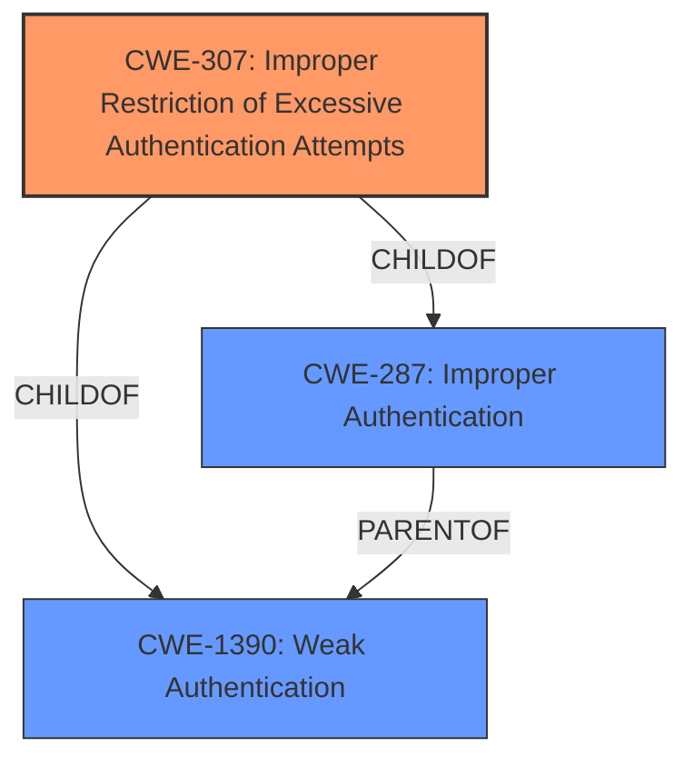

# Analysis for CVE-2020-18698

# Summary
| CWE ID  | CWE Name                                                         | Confidence | CWE Abstraction Level | CWE Vulnerability Mapping Label | CWE-Vulnerability Mapping Notes |
| :-------- | :--------------------------------------------------------------- | :--------- | :---------------------- | :------------------------------ | :------------------------------ |
| CWE-307   | Improper Restriction of Excessive Authentication Attempts        | 1.0        | Base                    | Primary                         | Allowed                       |
| CWE-287   | Improper Authentication                                          | 0.7        | Class                   | Secondary                       | Discouraged                     |
| CWE-1390  | Weak Authentication                                            | 0.7        | Class                   | Secondary                       | Allowed-with-Review           |

## Evidence and Confidence

*   **Confidence Score:** 0.9
*   **Evidence Strength:** HIGH

## Relationship Analysis
The primary CWE selected is CWE-307, which is a Base level CWE. This CWE is a child of both CWE-287 and CWE-1390, which are higher-level Class CWEs. While CWE-287 is a parent of CWE-1390, both represent authentication issues at a higher level, making CWE-307 a more specific and appropriate selection based on the provided evidence.



## Vulnerability Chain
The vulnerability chain starts with the **Improper Authentication** (**root cause**) which leads to the ability to launch brute force login attempts (**impact**). Specifically, the **lack of** rate limiting on login attempts and the **absence of** verification codes enables attackers to perform brute-force attacks.

## Summary of Analysis
Initially, the description indicates "**Improper Authentication**" as the root cause. However, the CVE Reference Links Content Summary provides more details: "The login functionality...does not implement rate limiting or verification codes, allowing for brute-force attacks." This suggests that the core issue is the **improper restriction of excessive authentication attempts**, specifically through **missing** rate limiting and **absence of** verification codes.

Based on this more detailed information, CWE-307 is the most appropriate choice. It directly addresses the **lack of** measures to prevent multiple failed authentication attempts. The retriever results also list CWE-307 as the top candidate.

CWE-287 and CWE-1390 were considered but deemed less specific. While they relate to authentication, they don't pinpoint the exact weakness of **improper restriction of excessive attempts**. Therefore, mapping to CWE-307 provides a more accurate and granular representation of the vulnerability.

The selection of CWE-307 is also supported by its "Base" abstraction level, which is preferred for root cause analysis, and its "Allowed" usage according to MITRE mapping guidance.

Relevant CWE Information:

# Enhanced Context (25 CWEs)

## CWE-204: Observable Response Discrepancy
**Abstraction Level**: Base
**Similarity Score**: 0.77
**Source**: dense

**Description**:
The product provides different responses to incoming requests in a way that reveals internal state information to an unauthorized actor outside of the intended control sphere.

**Mapping Guidance**:
- Usage: Allowed
- Rationale: This CWE entry is at the Base level of abstraction, which is a preferred level of abstraction for mapping to the root causes of vulnerabilities.

*This CWE was not selected because the vulnerability is not about different responses revealing internal state information. It's about the lack of protection against brute force attempts.*

## CWE-807: Reliance on Untrusted Inputs in a Security Decision
**Abstraction Level**: Base
**Similarity Score**: 0.77
**Source**: dense

**Description**:
The product uses a protection mechanism that relies on the existence or values of an input, but the input can be modified by an untrusted actor in a way that bypasses the protection mechanism.

**Mapping Guidance**:
- Usage: Allowed
- Rationale: This CWE entry is at the Base level of abstraction, which is a preferred level of abstraction for mapping to the root causes of vulnerabilities.

*This CWE was not selected because the vulnerability is not about relying on untrusted inputs for security decisions. It's about the absence of rate limiting and verification codes.*

## CWE-303: Incorrect Implementation of Authentication Algorithm
**Abstraction Level**: Base
**Similarity Score**: 0.77
**Source**: dense

**Description**:
The requirements for the product dictate the use of an established authentication algorithm, but the implementation of the algorithm is incorrect.

**Mapping Guidance**:
- Usage: Allowed
- Rationale: This CWE entry is at the Base level of abstraction, which is a preferred level of abstraction for mapping to the root causes of vulnerabilities.

*This CWE was not selected because the vulnerability is not about an incorrect implementation of an authentication algorithm. It's about the lack of protection against brute force attempts.*

## CWE-1391: Use of Weak Credentials
**Abstraction Level**: Class
**Similarity Score**: 0.77
**Source**: dense

**Description**:
The product uses weak credentials (such as a default key or hard-coded password) that can be calculated, derived, reused, or guessed by an attacker.

**Mapping Guidance**:
- Usage: Allowed-with-Review
- Rationale: This CWE entry is a Class and might have Base-level children that would be more appropriate

*This CWE was not selected because the vulnerability is not specifically about the use of weak credentials. It's about the lack of protection against brute force attempts, which could be used against even strong credentials.*

## CWE-1390: Weak Authentication
**Abstraction Level**: Class
**Similarity Score**: 0.77
**Source**: dense

**Description**:
The product uses an authentication mechanism to restrict access to specific users or identities, but the mechanism does not sufficiently prove that the claimed identity is correct.

**Mapping Guidance**:
- Usage: Allowed-with-Review
- Rationale: This CWE entry is a Class and might have Base-level children that would be more appropriate

*This CWE was considered as a secondary CWE. While related to authentication, it is a higher level and less specific compared to CWE-307.*

## CWE-208: Observable Timing Discrepancy
**Abstraction Level**: Base
**Similarity Score**: 0.76
**Source**: dense

**Description**:
Two separate operations in a product require different amounts of time to complete, in a way that is observable to an actor and reveals security-relevant information about the state of the product, such as whether a particular operation was successful or not.

**Mapping Guidance**:
- Usage: Allowed
- Rationale: This CWE entry is at the Base level of abstraction, which is a preferred level of abstraction for mapping to the root causes of vulnerabilities.

*This CWE was not selected because the vulnerability is not about timing discrepancies revealing information. It's about the lack of protection against brute force attempts.*

## CWE-74: Improper Neutralization of Special Elements in Output Used by a Downstream Component ('Injection')
**Abstraction Level**: Class
**Similarity Score**: 0.76
**Source**: dense

**Description**:
The product constructs all or part of a command, data structure, or record using externally-influenced input from an upstream component, but it does not neutralize or incorrectly neutralizes special elements that could modify how it is parsed or interpreted when it is sent to a downstream component.

**Mapping Guidance**:
- Usage: Discouraged
- Rationale: CWE-74 is high-level and often misused when lower-level weaknesses are more appropriate.

*This CWE was not selected because the vulnerability is not about injection. It's about the lack of protection against brute force attempts.*

## CWE-209: Generation of Error Message Containing Sensitive Information
**Abstraction Level**: Base
**Similarity Score**: 0.76
**Source**: dense

**Description**:
The product generates an error message that includes sensitive information about its environment, users, or associated data.

**Mapping Guidance**:
- Usage: Allowed
- Rationale: This CWE entry is at the Base level of abstraction, which is a preferred level of abstraction for mapping to the root causes of vulnerabilities.

*This CWE was not selected because the vulnerability is not about generating error messages containing sensitive information. It's about the lack of protection against brute force attempts.*

## CWE-1289: Improper Validation of Unsafe Equivalence in Input
**Abstraction Level**: Base
**Similarity Score**: 0.76
**Source**: dense

**Description**:
The product receives an input value that is used as

# Enhanced Query for CVE-2020-18698

## Vulnerability Description
**Improper Authentication** in Lin-CMS-Flask v0.1.1 allows remote attackers to launch brute force login attempts without restriction via the login function in the component app/api/cms/user.py.

### Vulnerability Description Key Phrases
- **rootcause:** **Improper Authentication**
- **impact:** launch brute force login attempts
- **attacker:** remote attackers
- **product:** Lin-CMS-Flask
- **version:** v0.1.1
- **component:** app/api/cms/user.py

## CVE Reference Links Content Summary
```
{
  "vulnerability_details": {
    "root_cause": "The login functionality in `app/api/cms/user.py` at line 43 within the `login()` function does not implement rate limiting or verification codes, allowing for brute-force attacks.",
    "weaknesses": [
      "Missing rate limiting on login attempts",
      "Absence of verification codes or CAPTCHA"
    ],
    "impact": "An attacker can perform a brute-force attack to guess usernames and passwords, potentially gaining unauthorized access to user accounts.",
     "attack_vectors": [
      "Sending repeated login requests with different credentials."
     ],
    "required_capabilities": "The attacker needs to be able to send HTTP requests to the login endpoint of the application. No special access is required."
  }
}
```

## Retriever Results

### Top Combined Results

| Rank | CWE ID | Name | Abstraction | Usage  | Retrievers | Individual Scores |
|------|--------|------|-------------|-------|------------|-------------------|
| 1 | 307 | Improper Restriction of Excessive Authentication Attempts | Base | Allowed | sparse | 0.300 |
| 2 | 613 | Insufficient Session Expiration | Base | Allowed | sparse | 0.184 |
| 3 | 208 | Observable Timing Discrepancy | Base | Allowed | sparse | 0.163 |
| 4 | 90 | Improper Neutralization of Special Elements used in an LDAP Query ('LDAP Injection') | Base | Allowed | sparse | 0.161 |
| 5 | 89 | Improper Neutralization of Special Elements used in an SQL Command ('SQL Injection') | Base | Allowed | sparse | 0.161 |
| 6 | 352 | Cross-Site Request Forgery (CSRF) | Compound | Allowed | dense | 0.518 |
| 7 | 385 | Covert Timing Channel | Base | Allowed | graph | 0.002 |
| 8 | 287 | Improper Authentication | Class | Discouraged | sparse | 0.160 |
| 9 | 1390 | Weak Authentication | Class | Allowed-with-Review | sparse | 0.156 |
| 10 | 209 | Generation of Error Message Containing Sensitive Information | Base | Allowed | sparse | 0.153 |


# Complete CWE Specifications


## CWE-307: Improper Restriction of Excessive Authentication Attempts
**Abstraction:** Base
**Status:** Draft

### Description
The product does not implement sufficient measures to prevent multiple failed authentication attempts within a short time frame.

### Extended Description
Not provided

### Alternative Terms
None

### Relationships
ChildOf -> CWE-1390
ChildOf -> CWE-287
ChildOf -> CWE-799

### Mapping Guidance
**Usage:** Allowed
**Rationale:** This CWE entry is at the Base level of abstraction, which is a preferred level of abstraction for mapping to the root causes of vulnerabilities.
**Comments:** Carefully read both the name and description to ensure that this mapping is an appropriate fit. Do not try to 'force' a mapping to a lower-level Base/Variant simply to comply with this preferred level of abstraction.
**Reasons:**
- Acceptable-Use


### Observed Examples
- **CVE-2019-0039:** the REST API for a network OS has a high limit for number of connections, allowing brute force password guessing
- **CVE-1999-1152:** Product does not disconnect or timeout after multiple failed logins.
- **CVE-2001-1291:** Product does not disconnect or timeout after multiple failed logins.


## CWE-613: Insufficient Session Expiration
**Abstraction:** Base
**Status:** Incomplete

### Description
According to WASC, "Insufficient Session Expiration is when a web site permits an attacker to reuse old session credentials or session IDs for authorization."

### Extended Description
Not provided

### Alternative Terms
None

### Relationships
ChildOf -> CWE-672
ChildOf -> CWE-672
CanPrecede -> CWE-287

### Mapping Guidance
**Usage:** Allowed
**Rationale:** This CWE entry is at the Base level of abstraction, which is a preferred level of abstraction for mapping to the root causes of vulnerabilities.
**Comments:** Carefully read both the name and description to ensure that this mapping is an appropriate fit. Do not try to 'force' a mapping to a lower-level Base/Variant simply to comply with this preferred level of abstraction.
**Reasons:**
- Acceptable-Use


### Additional Notes
**[Other]** The lack of proper session expiration may improve the likely success of certain attacks. For example, an attacker may intercept a session ID, possibly via a network sniffer or Cross-site Scripting attack. Although short session expiration times do not help if a stolen token is immediately used, they will protect against ongoing replaying of the session ID. In another scenario, a user might access a web site from a shared computer (such as at a library, Internet cafe, or open work environment). Insufficient Session Expiration could allow an attacker to use the browser's back button to access web pages previously accessed by the victim.


## CWE-208: Observable Timing Discrepancy
**Abstraction:** Base
**Status:** Incomplete

### Description
Two separate operations in a product require different amounts of time to complete, in a way that is observable to an actor and reveals security-relevant information about the state of the product, such as whether a particular operation was successful or not.

### Extended Description
In security-relevant contexts, even small variations in timing can be exploited by attackers to indirectly infer certain details about the product's internal operations. For example, in some cryptographic algorithms, attackers can use timing differences to infer certain properties about a private key, making the key easier to guess. Timing discrepancies effectively form a timing side channel.

### Alternative Terms
None

### Relationships
ChildOf -> CWE-203
CanPrecede -> CWE-385
CanPrecede -> CWE-327

### Mapping Guidance
**Usage:** Allowed
**Rationale:** This CWE entry is at the Base level of abstraction, which is a preferred level of abstraction for mapping to the root causes of vulnerabilities.
**Comments:** Carefully read both the name and description to ensure that this mapping is an appropriate fit. Do not try to 'force' a mapping to a lower-level Base/Variant simply to comply with this preferred level of abstraction.
**Reasons:**
- Acceptable-Use


### Additional Notes
**[Relationship]** Often primary in cryptographic applications and algorithms.

**[Maintenance]** CWE 4.16 removed a demonstrative example for a hardware module because it was inaccurate and unable to be adapted. The CWE team is developing an alternative.


### Observed Examples
- **CVE-2019-10071:** Java-oriented framework compares HMAC signatures using String.equals() instead of a constant-time algorithm, causing timing discrepancies
- **CVE-2019-10482:** Smartphone OS uses comparison functions that are not in constant time, allowing side channels
- **CVE-2014-0984:** Password-checking function in router terminates validation of a password entry when it encounters the first incorrect character, which allows remote attackers to obtain passwords via a brute-force attack that relies on timing differences in responses to incorrect password guesses, aka a timing side-channel attack.


## CWE-90: Improper Neutralization of Special Elements used in an LDAP Query ('LDAP Injection')
**Abstraction:** Base
**Status:** Draft

### Description
The product constructs all or part of an LDAP query using externally-influenced input from an upstream component, but it does not neutralize or incorrectly neutralizes special elements that could modify the intended LDAP query when it is sent to a downstream component.

### Extended Description
Not provided

### Alternative Terms
None

### Relationships
ChildOf -> CWE-943

### Mapping Guidance
**Usage:** Allowed
**Rationale:** This CWE entry is at the Base level of abstraction, which is a preferred level of abstraction for mapping to the root causes of vulnerabilities.
**Comments:** Carefully read both the name and description to ensure that this mapping is an appropriate fit. Do not try to 'force' a mapping to a lower-level Base/Variant simply to comply with this preferred level of abstraction.
**Reasons:**
- Acceptable-Use


### Additional Notes
**[Relationship]** Factors: resultant to special character mismanagement, MAID, or denylist/allowlist problems. Can be primary to authentication and verification errors.


### Observed Examples
- **CVE-2021-41232:** Chain: authentication routine in Go-based agile development product does not escape user name (CWE-116), allowing LDAP injection (CWE-90)
- **CVE-2005-2301:** Server does not properly escape LDAP queries, which allows remote attackers to cause a DoS and possibly conduct an LDAP injection attack.


## CWE-89: Improper Neutralization of Special Elements used in an SQL Command ('SQL Injection')
**Abstraction:** Base
**Status:** Stable

### Description
The product constructs all or part of an SQL command using externally-influenced input from an upstream component, but it does not neutralize or incorrectly neutralizes special elements that could modify the intended SQL command when it is sent to a downstream component. Without sufficient removal or quoting of SQL syntax in user-controllable inputs, the generated SQL query can cause those inputs to be interpreted as SQL instead of ordinary user data.

### Extended Description
Not provided

### Alternative Terms
SQL injection: a common attack-oriented phrase
SQLi: a common abbreviation for "SQL injection"

### Relationships
ChildOf -> CWE-943
ChildOf -> CWE-74

### Mapping Guidance
**Usage:** Allowed
**Rationale:** This CWE entry is at the Base level of abstraction, which is a preferred level of abstraction for mapping to the root causes of vulnerabilities.
**Comments:** Carefully read both the name and description to ensure that this mapping is an appropriate fit. Do not try to 'force' a mapping to a lower-level Base/Variant simply to comply with this preferred level of abstraction.
**Reasons:**
- Acceptable-Use


### Additional Notes
**[Relationship]** SQL injection can be resultant from special character mismanagement, MAID, or denylist/allowlist problems. It can be primary to authentication errors.


### Observed Examples
- **CVE-2023-32530:** SQL injection in security product dashboard using crafted certificate fields
- **CVE-2021-42258:** SQL injection in time and billing software, as exploited in the wild per CISA KEV.
- **CVE-2021-27101:** SQL injection in file-transfer system via a crafted Host header, as exploited in the wild per CISA KEV.


## CWE-352: Cross-Site Request Forgery (CSRF)
**Abstraction:** Compound
**Status:** Stable

### Description
The web application does not, or can not, sufficiently verify whether a well-formed, valid, consistent request was intentionally provided by the user who submitted the request.

### Extended Description
When a web server is designed to receive a request from a client without any mechanism for verifying that it was intentionally sent, then it might be possible for an attacker to trick a client into making an unintentional request to the web server which will be treated as an authentic request. This can be done via a URL, image load, XMLHttpRequest, etc. and can result in exposure of data or unintended code execution.

### Alternative Terms
Session Riding
Cross Site Reference Forgery
XSRF

### Relationships
ChildOf -> CWE-345
ChildOf -> CWE-345
Requires -> CWE-346
Requires -> CWE-441
Requires -> CWE-642
Requires -> CWE-613

### Mapping Guidance
**Usage:** Allowed
**Rationale:** This is a well-known Composite of multiple weaknesses that must all occur simultaneously, although it is attack-oriented in nature.
**Comments:** While attack-oriented composites are supported in CWE, they have not been a focus of research. There is a chance that future research or CWE scope clarifications will change or deprecate them. Perform root-cause analysis to determine if other weaknesses allow CSRF attacks to occur, and map to those weaknesses. For example, predictable CSRF tokens might allow bypass of CSRF protection mechanisms; if this occurs, they might be better characterized as randomness/predictability weaknesses.
**Reasons:**
- Other


### Additional Notes
**[Relationship]** 

There can be a close relationship between XSS and CSRF (CWE-352). An attacker might use CSRF in order to trick the victim into submitting requests to the server in which the requests contain an XSS payload. A well-known example of this was the Samy worm on MySpace [REF-956]. The worm used XSS to insert malicious HTML sequences into a user's profile and add the attacker as a MySpace friend. MySpace friends of that victim would then execute the payload to modify their own profiles, causing the worm to propagate exponentially. Since the victims did not intentionally insert the malicious script themselves, CSRF was a root cause.


**[Theoretical]** 

The CSRF topology is multi-channel:


  - Attacker (as outsider) to intermediary (as user). The interaction point is either an external or internal channel.

  - Intermediary (as user) to server (as victim). The activation point is an internal channel.


### Observed Examples
- **CVE-2004-1703:** Add user accounts via a URL in an img tag
- **CVE-2004-1995:** Add user accounts via a URL in an img tag
- **CVE-2004-1967:** Arbitrary code execution by specifying the code in a crafted img tag or URL


## CWE-385: Covert Timing Channel
**Abstraction:** Base
**Status:** Incomplete

### Description
Covert timing channels convey information by modulating some aspect of system behavior over time, so that the program receiving the information can observe system behavior and infer protected information.

### Extended Description


In some instances, knowing when data is transmitted between parties can provide a malicious user with privileged information. Also, externally monitoring the timing of operations can potentially reveal sensitive data. For example, a cryptographic operation can expose its internal state if the time it takes to perform the operation varies, based on the state.


Covert channels are frequently classified as either storage or timing channels. Some examples of covert timing channels are the system's paging rate, the time a certain transaction requires to execute, and the time it takes to gain access to a shared bus.


### Alternative Terms
None

### Relationships
ChildOf -> CWE-514

### Mapping Guidance
**Usage:** Allowed
**Rationale:** This CWE entry is at the Base level of abstraction, which is a preferred level of abstraction for mapping to the root causes of vulnerabilities.
**Comments:** Carefully read both the name and description to ensure that this mapping is an appropriate fit. Do not try to 'force' a mapping to a lower-level Base/Variant simply to comply with this preferred level of abstraction.
**Reasons:**
- Acceptable-Use


### Additional Notes
**[Maintenance]** As of CWE 4.9, members of the CWE Hardware SIG are working to improve CWE's coverage of transient execution weaknesses, which include issues related to Spectre, Meltdown, and other attacks that create or exploit covert channels. As a result of that work, this entry might change in CWE 4.10.


## CWE-287: Improper Authentication
**Abstraction:** Class
**Status:** Draft

### Description
When an actor claims to have a given identity, the product does not prove or insufficiently proves that the claim is correct.

### Extended Description
Not provided

### Alternative Terms
authentification: An alternate term is "authentification", which appears to be most commonly used by people from non-English-speaking countries.
AuthN: "AuthN" is typically used as an abbreviation of "authentication" within the web application security community. It is also distinct from "AuthZ," which is an abbreviation of "authorization." The use of "Auth" as an abbreviation is discouraged, since it could be used for either authentication or authorization.
AuthC: "AuthC" is used as an abbreviation of "authentication," but it appears to used less frequently than "AuthN."

### Relationships
ChildOf -> CWE-284
ChildOf -> CWE-284

### Mapping Guidance
**Usage:** Discouraged
**Rationale:** This CWE entry might be misused when lower-level CWE entries are likely to be applicable. It is a level-1 Class (i.e., a child of a Pillar).
**Comments:** Consider children or descendants, beginning with CWE-1390: Weak Authentication or CWE-306: Missing Authentication for Critical Function.
**Reasons:**
- Frequent Misuse
**Suggested Alternatives:**
- CWE-1390: Weak Authentication
- CWE-306: Missing Authentication for Critical Function


### Additional Notes
**[Relationship]** This can be resultant from SQL injection vulnerabilities and other issues.

**[Maintenance]** The Taxonomy_Mappings to ISA/IEC 62443 were added in CWE 4.10, but they are still under review and might change in future CWE versions. These draft mappings were performed by members of the "Mapping CWE to 62443" subgroup of the CWE-CAPEC ICS/OT Special Interest Group (SIG), and their work is incomplete as of CWE 4.10. The mappings are included to facilitate discussion and review by the broader ICS/OT community, and they are likely to change in future CWE versions.


### Observed Examples
- **CVE-2022-35248:** Chat application skips validation when Central Authentication Service (CAS) is enabled, effectively removing the second factor from two-factor authentication
- **CVE-2022-36436:** Python-based authentication proxy does not enforce password authentication during the initial handshake, allowing the client to bypass authentication by specifying a 'None' authentication type.
- **CVE-2022-30034:** Chain: Web UI for a Python RPC framework does not use regex anchors to validate user login emails (CWE-777), potentially allowing bypass of OAuth (CWE-1390).


## CWE-1390: Weak Authentication
**Abstraction:** Class
**Status:** Incomplete

### Description
The product uses an authentication mechanism to restrict access to specific users or identities, but the mechanism does not sufficiently prove that the claimed identity is correct.

### Extended Description


Attackers may be able to bypass weak authentication faster and/or with less effort than expected.


### Alternative Terms
None

### Relationships
ChildOf -> CWE-287

### Mapping Guidance
**Usage:** Allowed-with-Review
**Rationale:** This CWE entry is a Class and might have Base-level children that would be more appropriate
**Comments:** Examine children of this entry to see if there is a better fit
**Reasons:**
- Abstraction


### Observed Examples
- **CVE-2022-30034:** Chain: Web UI for a Python RPC framework does not use regex anchors to validate user login emails (CWE-777), potentially allowing bypass of OAuth (CWE-1390).
- **CVE-2022-35248:** Chat application skips validation when Central Authentication Service (CAS) is enabled, effectively removing the second factor from two-factor authentication
- **CVE-2021-3116:** Chain: Python-based HTTP Proxy server uses the wrong boolean operators (CWE-480) causing an incorrect comparison (CWE-697) that identifies an authN failure if all three conditions are met instead of only one, allowing bypass of the proxy authentication (CWE-1390)


## CWE-209: Generation of Error Message Containing Sensitive Information
**Abstraction:** Base
**Status:** Draft

### Description
The product generates an error message that includes sensitive information about its environment, users, or associated data.

### Extended Description


The sensitive information may be valuable information on its own (such as a password), or it may be useful for launching other, more serious attacks. The error message may be created in different ways:


  - self-generated: the source code explicitly constructs the error message and delivers it

  - externally-generated: the external environment, such as a language interpreter, handles the error and constructs its own message, whose contents are not under direct control by the programmer

An attacker may use the contents of error messages to help launch another, more focused attack. For example, an attempt to exploit a path traversal weakness (CWE-22) might yield the full pathname of the installed application. In turn, this could be used to select the proper number of ".." sequences to navigate to the targeted file. An attack using SQL injection (CWE-89) might not initially succeed, but an error message could reveal the malformed query, which would expose query logic and possibly even passwords or other sensitive information used within the query.

### Alternative Terms
None

### Relationships
ChildOf -> CWE-200
ChildOf -> CWE-200
ChildOf -> CWE-755

### Mapping Guidance
**Usage:** Allowed
**Rationale:** This CWE entry is at the Base level of abstraction, which is a preferred level of abstraction for mapping to the root causes of vulnerabilities.
**Comments:** Carefully read both the name and description to ensure that this mapping is an appropriate fit. Do not try to 'force' a mapping to a lower-level Base/Variant simply to comply with this preferred level of abstraction.
**Reasons:**
- Acceptable-Use


### Observed Examples
- **CVE-2008-2049:** POP3 server reveals a password in an error message after multiple APOP commands are sent. Might be resultant from another weakness.
- **CVE-2007-5172:** Program reveals password in error message if attacker can trigger certain database errors.
- **CVE-2008-4638:** Composite: application running with high privileges (CWE-250) allows user to specify a restricted file to process, which generates a parsing error that leaks the contents of the file (CWE-209).

