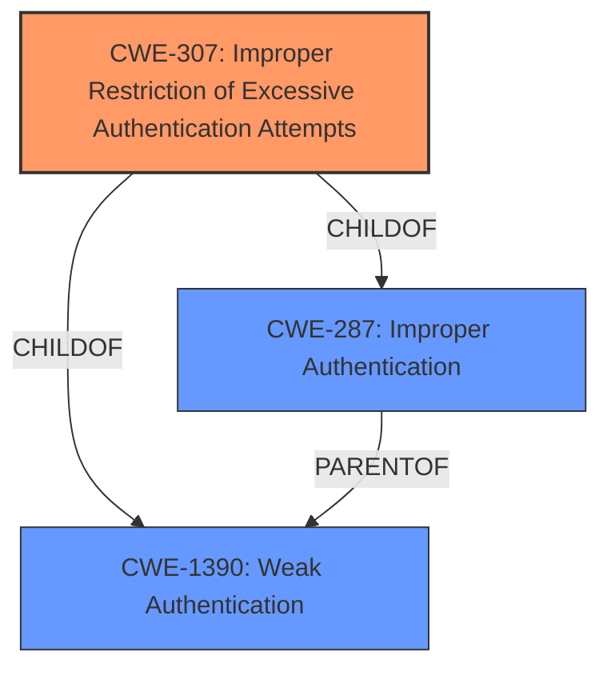

# Analysis Report for CVE-2020-18698

# Vulnerability Analysis Report: CVE-2020-18698

## Description


## Analysis (with Relationship Data)

# Summary
| CWE ID  | CWE Name                                                         | Confidence | CWE Abstraction Level | CWE Vulnerability Mapping Label | CWE-Vulnerability Mapping Notes |
| :-------- | :--------------------------------------------------------------- | :--------- | :---------------------- | :------------------------------ | :------------------------------ |
| CWE-307   | Improper Restriction of Excessive Authentication Attempts        | 1.0        | Base                    | Primary                         | Allowed                       |
| CWE-287   | Improper Authentication                                          | 0.7        | Class                   | Secondary                       | Discouraged                     |
| CWE-1390  | Weak Authentication                                            | 0.7        | Class                   | Secondary                       | Allowed-with-Review           |

## Evidence and Confidence

*   **Confidence Score:** 0.9
*   **Evidence Strength:** HIGH

## Relationship Analysis
The primary CWE selected is CWE-307, which is a Base level CWE. This CWE is a child of both CWE-287 and CWE-1390, which are higher-level Class CWEs. While CWE-287 is a parent of CWE-1390, both represent authentication issues at a higher level, making CWE-307 a more specific and appropriate selection based on the provided evidence.



## Vulnerability Chain
The vulnerability chain starts with the **Improper Authentication** (**root cause**) which leads to the ability to launch brute force login attempts (**impact**). Specifically, the **lack of** rate limiting on login attempts and the **absence of** verification codes enables attackers to perform brute-force attacks.

## Summary of Analysis
Initially, the description indicates "**Improper Authentication**" as the root cause. However, the CVE Reference Links Content Summary provides more details: "The login functionality...does not implement rate limiting or verification codes, allowing for brute-force attacks." This suggests that the core issue is the **improper restriction of excessive authentication attempts**, specifically through **missing** rate limiting and **absence of** verification codes.

Based on this more detailed information, CWE-307 is the most appropriate choice. It directly addresses the **lack of** measures to prevent multiple failed authentication attempts. The retriever results also list CWE-307 as the top candidate.

CWE-287 and CWE-1390 were considered but deemed less specific. While they relate to authentication, they don't pinpoint the exact weakness of **improper restriction of excessive attempts**. Therefore, mapping to CWE-307 provides a more accurate and granular representation of the vulnerability.

The selection of CWE-307 is also supported by its "Base" abstraction level, which is preferred for root cause analysis, and its "Allowed" usage according to MITRE mapping guidance.

Relevant CWE Information:

# Enhanced Context (25 CWEs)

## CWE-204: Observable Response Discrepancy
**Abstraction Level**: Base
**Similarity Score**: 0.77
**Source**: dense

**Description**:
The product provides different responses to incoming requests in a way that reveals internal state information to an unauthorized actor outside of the intended control sphere.

**Mapping Guidance**:
- Usage: Allowed
- Rationale: This CWE entry is at the Base level of abstraction, which is a preferred level of abstraction for mapping to the root causes of vulnerabilities.

*This CWE was not selected because the vulnerability is not about different responses revealing internal state information. It's about the lack of protection against brute force attempts.*

## CWE-807: Reliance on Untrusted Inputs in a Security Decision
**Abstraction Level**: Base
**Similarity Score**: 0.77
**Source**: dense

**Description**:
The product uses a protection mechanism that relies on the existence or values of an input, but the input can be modified by an untrusted actor in a way that bypasses the protection mechanism.

**Mapping Guidance**:
- Usage: Allowed
- Rationale: This CWE entry is at the Base level of abstraction, which is a preferred level of abstraction for mapping to the root causes of vulnerabilities.

*This CWE was not selected because the vulnerability is not about relying on untrusted inputs for security decisions. It's about the absence of rate limiting and verification codes.*

## CWE-303: Incorrect Implementation of Authentication Algorithm
**Abstraction Level**: Base
**Similarity Score**: 0.77
**Source**: dense

**Description**:
The requirements for the product dictate the use of an established authentication algorithm, but the implementation of the algorithm is incorrect.

**Mapping Guidance**:
- Usage: Allowed
- Rationale: This CWE entry is at the Base level of abstraction, which is a preferred level of abstraction for mapping to the root causes of vulnerabilities.

*This CWE was not selected because the vulnerability is not about an incorrect implementation of an authentication algorithm. It's about the lack of protection against brute force attempts.*

## CWE-1391: Use of Weak Credentials
**Abstraction Level**: Class
**Similarity Score**: 0.77
**Source**: dense

**Description**:
The product uses weak credentials (such as a default key or hard-coded password) that can be calculated, derived, reused, or guessed by an attacker.

**Mapping Guidance**:
- Usage: Allowed-with-Review
- Rationale: This CWE entry is a Class and might have Base-level children that would be more appropriate

*This CWE was not selected because the vulnerability is not specifically about the use of weak credentials. It's about the lack of protection against brute force attempts, which could be used against even strong credentials.*

## CWE-1390: Weak Authentication
**Abstraction Level**: Class
**Similarity Score**: 0.77
**Source**: dense

**Description**:
The product uses an authentication mechanism to restrict access to specific users or identities, but the mechanism does not sufficiently prove that the claimed identity is correct.

**Mapping Guidance**:
- Usage: Allowed-with-Review
- Rationale: This CWE entry is a Class and might have Base-level children that would be more appropriate

*This CWE was considered as a secondary CWE. While related to authentication, it is a higher level and less specific compared to CWE-307.*

## CWE-208: Observable Timing Discrepancy
**Abstraction Level**: Base
**Similarity Score**: 0.76
**Source**: dense

**Description**:
Two separate operations in a product require different amounts of time to complete, in a way that is observable to an actor and reveals security-relevant information about the state of the product, such as whether a particular operation was successful or not.

**Mapping Guidance**:
- Usage: Allowed
- Rationale: This CWE entry is at the Base level of abstraction, which is a preferred level of abstraction for mapping to the root causes of vulnerabilities.

*This CWE was not selected because the vulnerability is not about timing discrepancies revealing information. It's about the lack of protection against brute force attempts.*

## CWE-74: Improper Neutralization of Special Elements in Output Used by a Downstream Component ('Injection')
**Abstraction Level**: Class
**Similarity Score**: 0.76
**Source**: dense

**Description**:
The product constructs all or part of a command, data structure, or record using externally-influenced input from an upstream component, but it does not neutralize or incorrectly neutralizes special elements that could modify how it is parsed or interpreted when it is sent to a downstream component.

**Mapping Guidance**:
- Usage: Discouraged
- Rationale: CWE-74 is high-level and often misused when lower-level weaknesses are more appropriate.

*This CWE was not selected because the vulnerability is not about injection. It's about the lack of protection against brute force attempts.*

## CWE-209: Generation of Error Message Containing Sensitive Information
**Abstraction Level**: Base
**Similarity Score**: 0.76
**Source**: dense

**Description**:
The product generates an error message that includes sensitive information about its environment, users, or associated data.

**Mapping Guidance**:
- Usage: Allowed
- Rationale: This CWE entry is at the Base level of abstraction, which is a preferred level of abstraction for mapping to the root causes of vulnerabilities.

*This CWE was not selected because the vulnerability is not about generating error messages containing sensitive information. It's about the lack of protection against brute force attempts.*

## CWE-1289: Improper Validation of Unsafe Equivalence in Input
**Abstraction Level**: Base
**Similarity Score**: 0.76
**Source**: dense

**Description**:
The product receives an input value that is used as


## CWE Relationship Analysis

Current CWEs represent these abstraction levels: .


### Vulnerability Chain Analysis

**Chain starting from CWE-303:**
- 303 (Incorrect Implementation of Authentication Algorithm) - ROOT


**Chain starting from CWE-807:**
- 807 (Reliance on Untrusted Inputs in a Security Decision) - ROOT


### CWE Relationship Diagram

```mermaid
graph TD
    classDef primary fill:#f96,stroke:#333,stroke-width:2px
    classDef secondary fill:#69f,stroke:#333
    classDef tertiary fill:#9e9,stroke:#333
```


*Report generated on 2025-04-02 09:48:12*
