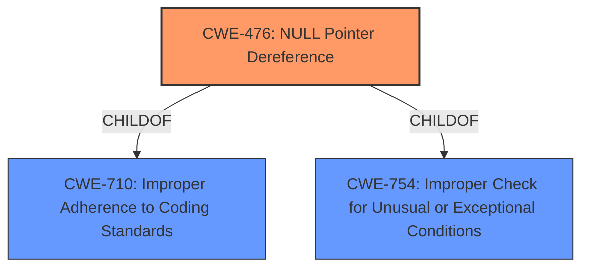

# Raw Analyzer Response for CVE-2020-18730

# Summary
| CWE ID  | CWE Name                       | Confidence | CWE Abstraction Level | CWE Vulnerability Mapping Label | CWE-Vulnerability Mapping Notes |
|---------|--------------------------------|------------|-----------------------|---------------------------------|---------------------------------|
| CWE-476 | NULL Pointer Dereference       | 1          | Base                  | Primary                           | Allowed                         |

## Evidence and Confidence

*   **Confidence Score:** 1
*   **Evidence Strength:** HIGH

## Relationship Analysis
The primary relationship that influenced the selection was the direct match of the vulnerability description to the characteristics of CWE-476 (**CWE-476: NULL Pointer Dereference**). The vulnerability description clearly states a segmentation violation due to a null pointer dereference, which aligns perfectly with CWE-476. While other CWEs like CWE-119 (**CWE-119: Improper Restriction of Operations within the Bounds of a Memory Buffer**) and CWE-787 (**CWE-787: Out-of-bounds Write**) were considered, the evidence directly points to a null pointer dereference as the root cause, making CWE-476 the most appropriate choice.

## Vulnerability Chain
The vulnerability chain is straightforward: a crafted input leads to a null pointer dereference, resulting in a denial-of-service.

## Summary of Analysis
The initial assessment, supported by the provided evidence, strongly suggests that the root cause of the vulnerability is a null pointer dereference. The "CVE Reference Links Content Summary" explicitly states that the root cause is a "segmentation fault (SEGV) due to a null pointer dereference," and the AddressSanitizer report confirms this.

The graph relationships show that CWE-476 is a child of CWE-710 (**CWE-710: Improper Adherence to Coding Standards**) and CWE-754 (**CWE-754: Improper Check for Unusual or Exceptional Conditions**), indicating that the null pointer dereference could be a result of not adhering to coding standards or not properly checking for exceptional conditions. However, the direct evidence points to the null pointer dereference itself as the primary weakness.

The selected CWE, CWE-476, is at the optimal level of specificity because it directly describes the root cause of the vulnerability as identified in the "CVE Reference Links Content Summary".

# Relevant CWE Information:

## CWE-476: NULL Pointer Dereference
**Abstraction:** Base
**Status:** Stable

### Description
The product dereferences a pointer that it expects to be valid but is NULL.

### Extended Description
Not provided

### Alternative Terms
NPD: Common abbreviation for Null Pointer Dereference
null deref: Common abbreviation for Null Pointer Dereference
NPE: Common abbreviation for Null Pointer Exception
nil pointer dereference: used for access of nil in Go programs

### Relationships
ChildOf -> CWE-710
ChildOf -> CWE-754

### Mapping Guidance
**Usage:** Allowed
**Rationale:** This CWE entry is at the Base level of abstraction, which is a preferred level of abstraction for mapping to the root causes of vulnerabilities.
**Comments:** Carefully read both the name and description to ensure that this mapping is an appropriate fit. Do not try to 'force' a mapping to a lower-level Base/Variant simply to comply with this preferred level of abstraction.
**Reasons:**
- Acceptable-Use

### Observed Examples
- **CVE-2005-3274:** race condition causes a table to be corrupted if a timer activates while it is being modified, leading to resultant NULL dereference; also involves locking.
- **CVE-2002-1912:** large number of packets leads to NULL dereference
- **CVE-2005-0772:** packet with invalid error status value triggers NULL dereference