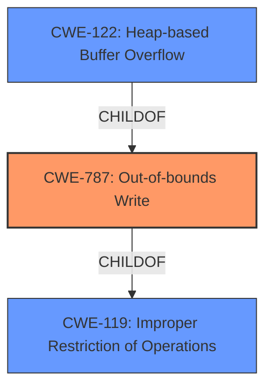

# Analysis for CVE-2020-18735

# Summary
| CWE ID | CWE Name | Confidence | CWE Abstraction Level | CWE Vulnerability Mapping Label | CWE-Vulnerability Mapping Notes |
|---|---|---|---|---|---|
| CWE-787 | Out-of-bounds Write | 0.9 | Base | Allowed | Primary CWE |
| CWE-122 | Heap-based Buffer Overflow | 0.8 | Variant | Allowed | Secondary Candidate |
| CWE-119 | Improper Restriction of Operations within the Bounds of a Memory Buffer | 0.6 | Class | Discouraged | Secondary Candidate |

## Evidence and Confidence

*   **Confidence Score:** 0.9
*   **Evidence Strength:** HIGH

## Relationship Analysis
The primary weakness, CWE-787, is a base-level CWE that describes writing data outside the intended buffer. CWE-122, a variant of CWE-787, specifies that the buffer is allocated on the heap. CWE-119 is a more general class-level CWE that encompasses any improper restriction of operations within the bounds of a memory buffer, including out-of-bounds writes. The relationship between these CWEs is hierarchical, with CWE-787 being a child of CWE-119, and CWE-122 being a child of CWE-787, offering increasing levels of specificity. Choosing CWE-787 as the primary weakness provides a balance between specificity and accuracy, while CWE-122 further specifies the location of the buffer.

## Vulnerability Chain
The vulnerability chain starts with the **heap buffer overflow**, which leads to an out-of-bounds write condition, ultimately causing a crash.

## Summary of Analysis
The initial analysis identified a **heap buffer overflow** in the Eclipse IOT Cyclone DDS Project. The evidence from the "CVE Reference Links Content Summary" confirms this, stating: "The vulnerability is a **heap-buffer-overflow** that occurs during a `memcpy` operation inside `dds_stream_reuse_string`."

The primary CWE selected is CWE-787 (Out-of-bounds Write). This selection is based on the vulnerability description and the CVE reference, which explicitly mentions a **heap buffer overflow**. CWE-787 accurately describes the root cause of the vulnerability, which is writing data beyond the allocated buffer. The "CVE Reference Links Content Summary" supports this by stating the vulnerability occurs during a `memcpy` operation, which is writing outside the bounds of the buffer.

CWE-122 (Heap-based Buffer Overflow) was considered and included as a secondary candidate because it specifies that the buffer is allocated on the heap, aligning with the "heap buffer overflow" description.

CWE-119 (Improper Restriction of Operations within the Bounds of a Memory Buffer) was considered but it is a high level *Class* weakness and the guidance discourages its use when a more specific weakness is known. I have included it as a secondary candidate.

CWE-190, CWE-191, CWE-131, CWE-197, CWE-681, CWE-805, CWE-126, CWE-125, CWE-680, CWE-1339, CWE-170, CWE-195, CWE-1284, CWE-123, CWE-463, CWE-120, and CWE-128 were not selected because they did not directly align with the provided evidence of a **heap buffer overflow** leading to an out-of-bounds write. These CWEs describe related but distinct weaknesses, such as integer overflows, incorrect buffer size calculations, or numeric truncation errors, none of which are explicitly mentioned in the vulnerability description.

The final selection of CWE-787 as the primary weakness, supplemented by CWE-122, provides the optimal level of specificity, accurately representing the vulnerability as a **heap buffer overflow** leading to an out-of-bounds write.

Relevant CWE Information:

# Enhanced Context (25 CWEs)
The following CWEs were identified as potentially relevant to this vulnerability:

## CWE-191: Integer Underflow (Wrap or Wraparound)
**Abstraction Level**: Base
**Similarity Score**: 0.81
**Source**: dense

**Description**:
The product subtracts one value from another, such that the result is less than the minimum allowable integer value, which produces a value that is not equal to the correct result.

**Mapping Guidance**:
- Usage: Allowed
- Rationale: This CWE entry is at the Base level of abstraction, which is a preferred level of abstraction for mapping to the root causes of vulnerabilities.

## CWE-197: Numeric Truncation Error
**Abstraction Level**: Base
**Similarity Score**: 0.81
**Source**: dense

**Description**:
Truncation errors occur when a primitive is cast to a primitive of a smaller size and data is lost in the conversion.

**Mapping Guidance**:
- Usage: Allowed
- Rationale: This CWE entry is at the Base level of abstraction, which is a preferred level of abstraction for mapping to the root causes of vulnerabilities.

## CWE-131: Incorrect Calculation of Buffer Size
**Abstraction Level**: Base
**Similarity Score**: 0.79
**Source**: dense

**Description**:
The product does not correctly calculate the size to be used when allocating a buffer, which could lead to a buffer overflow.

**Mapping Guidance**:
- Usage: Allowed
- Rationale: This CWE entry is at the Base level of abstraction, which is a preferred level of abstraction for mapping to the root causes of vulnerabilities.

## CWE-681: Incorrect Conversion between Numeric Types
**Abstraction Level**: Base
**Similarity Score**: 0.78
**Source**: dense

**Description**:
When converting from one data type to another, such as long to integer, data can be omitted or translated in a way that produces unexpected values. If the resulting values are used in a sensitive context, then dangerous behaviors may occur.

**Mapping Guidance**:
- Usage: Allowed
- Rationale: This CWE entry is at the Base level of abstraction, which is a preferred level of abstraction for mapping to the root causes of vulnerabilities.

## CWE-190: Integer Overflow or Wraparound
**Abstraction Level**: Base
**Similarity Score**: 0.77
**Source**: dense

**Description**:
The product performs a calculation that can
         produce an integer overflow or wraparound when the logic
         assumes that the resulting value will always be larger than
         the original value. This occurs when an integer value is
         incremented to a value that is too large to store in the
         associated representation. When this occurs, the value may
         become a very small or negative number.

**Mapping Guidance**:
- Usage: Allowed
- Rationale: This CWE entry is at the Base level of abstraction, which is a preferred level of abstraction for mapping to the root causes of vulnerabilities.

## CWE-124: Buffer Underwrite ('Buffer Underflow')
**Abstraction Level**: Base
**Similarity Score**: 0.76
**Source**: dense

**Description**:
The product writes to a buffer using an index or pointer that references a memory location prior to the beginning of the buffer.

**Mapping Guidance**:
- Usage: Allowed
- Rationale: This CWE entry is at the Base level of abstraction, which is a preferred level of abstraction for mapping to the root causes of vulnerabilities.

## CWE-805: Buffer Access with Incorrect Length Value
**Abstraction Level**: Base
**Similarity Score**: 0.76
**Source**: dense

**Description**:
The product uses a sequential operation to read or write a buffer, but it uses an incorrect length value that causes it to access memory that is outside of the bounds of the buffer.

**Mapping Guidance**:
- Usage: Allowed
- Rationale: This CWE entry is at the Base level of abstraction, which is a preferred level of abstraction for mapping to the root causes of vulnerabilities.

## CWE-126: Buffer Over-read
**Abstraction Level**: Variant
**Similarity Score**: 0.76
**Source**: dense

**Description**:
The product reads from a buffer using buffer access mechanisms such as indexes or pointers that reference memory locations after the targeted buffer.

**Mapping Guidance**:
- Usage: Allowed
- Rationale: This CWE entry is at the Variant level of abstraction, which is a preferred level of abstraction for mapping to the root causes of vulnerabilities.

## CWE-680: Integer Overflow to Buffer Overflow
**Abstraction Level**: Compound
**Similarity Score**: 0.76
**Source**: dense