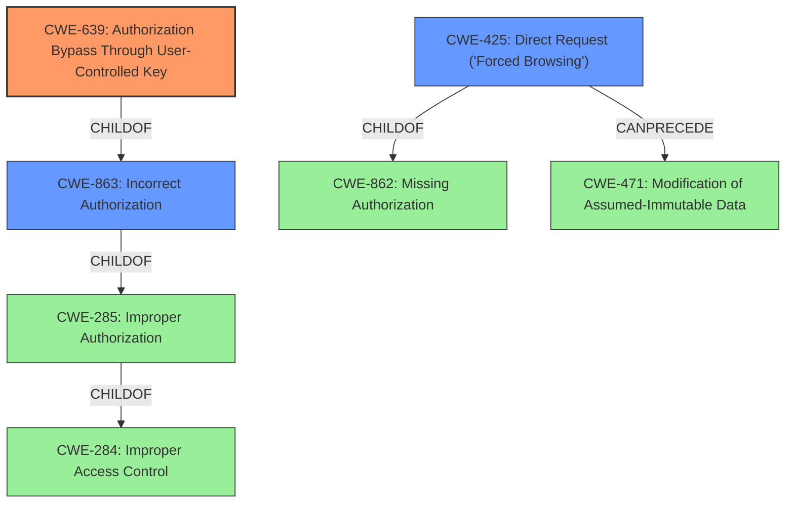

# Analysis Report for CVE-2020-18741

# Vulnerability Analysis Report: CVE-2020-18741

## Description


## Analysis (with Relationship Data)

# Summary
| CWE ID  | CWE Name                                                                         | Confidence | CWE Abstraction Level | CWE Vulnerability Mapping Label | CWE-Vulnerability Mapping Notes |
| :-------- | :------------------------------------------------------------------------------- | :--------- | :-------------------- | :------------------------------ | :------------------------------ |
| CWE-639   | Authorization Bypass Through User-Controlled Key                                | 0.9        | Base                  | Primary                       | Allowed                         |
| CWE-425   | Direct Request ('Forced Browsing')                                             | 0.7        | Base                  | Secondary                       | Allowed                         |
| CWE-863   | Incorrect Authorization                                                        | 0.6        | Class                 | Secondary                       | Allowed-with-Review             |

## Evidence and Confidence

*   **Confidence Score:** 0.8
*   **Evidence Strength:** HIGH

## Relationship Analysis
The primary CWE is CWE-639, which is a child of CWE-863 (Incorrect Authorization). CWE-863 is a child of CWE-285 (Improper Authorization), which is a child of CWE-284 (Improper Access Control).
CWE-425 (Direct Request) is related to CWE-862 (Missing Authorization) and can precede CWE-471 (Modification of Assumed-Immutable Data). This hierarchy shows a progression from general access control issues to specific authorization bypass and data modification vulnerabilities. Selecting CWE-639 provides the most specific representation of the vulnerability.



## Vulnerability Chain
The vulnerability chain starts with the **Improper Authorization** that allows remote attackers to modify the description of any users photo.
1.  **Improper Authorization**: The root cause is the lack of proper authorization checks, allowing unauthorized modification of photo descriptions.
2.  **User-Controlled Key**: The `photoid` parameter is used without proper validation, enabling attackers to modify other users' photos.
3.  **Data Tampering**: The impact is the modification of photo descriptions, leading to potential misinformation or defacement.

## Summary of Analysis
The initial assessment pointed towards **Improper Authorization**, but further analysis revealed that the vulnerability is specifically an **Authorization Bypass Through User-Controlled Key** (CWE-639). The application fails to validate if the logged-in user owns the photo before allowing modification, which aligns directly with CWE-639.

The evidence from the "CVE Reference Links Content Summary" section supports this conclusion:
*   "The vulnerability stems from a lack of proper access control and authorization checks when handling requests to modify photo descriptions."
*   "Specifically, the application uses the `photoid` parameter from a show page to update the image description, but fails to verify if the logged-in user actually owns that image before proceeding with the update."

CWE-639 is a Base level CWE, providing a more specific description of the vulnerability than the Class level CWE-863 (Incorrect Authorization) or the Pillar level CWE-284 (Improper Access Control). While CWE-425 is a good match, it is not the best fit as the user must be authenticated to perform the attack.

The final selection of CWE-639 is based on the detailed analysis of the vulnerability description, supporting evidence, and the hierarchical relationships between CWEs. This provides the most accurate and specific representation of the weakness.

Relevant CWE Information:

# Enhanced Context (25 CWEs)
The following CWEs were identified as potentially relevant to this vulnerability:

## CWE-807: Reliance on Untrusted Inputs in a Security Decision
**Abstraction Level**: Base
**Similarity Score**: 0.75
**Source**: dense

**Description**:
The product uses a protection mechanism that relies on the existence or values of an input, but the input can be modified by an untrusted actor in a way that bypasses the protection mechanism.

**Mapping Guidance**:
- Usage: Allowed
- Rationale: This CWE entry is at the Base level of abstraction, which is a preferred level of abstraction for mapping to the root causes of vulnerabilities.

## CWE-639: Authorization Bypass Through User-Controlled Key
**Abstraction Level**: Base
**Similarity Score**: 0.75
**Source**: dense

**Description**:
The system's authorization functionality does not prevent one user from gaining access to another user's data or record by modifying the key value identifying the data.

**Mapping Guidance**:
- Usage: Allowed
- Rationale: This CWE entry is at the Base level of abstraction, which is a preferred level of abstraction for mapping to the root causes of vulnerabilities.

## CWE-472: External Control of Assumed-Immutable Web Parameter
**Abstraction Level**: Base
**Similarity Score**: 0.74
**Source**: dense

**Description**:
The web application does not sufficiently verify inputs that are assumed to be immutable but are actually externally controllable, such as hidden form fields.

**Mapping Guidance**:
- Usage: Allowed
- Rationale: This CWE entry is at the Base level of abstraction, which is a preferred level of abstraction for mapping to the root causes of vulnerabilities.

## CWE-302: Authentication Bypass by Assumed-Immutable Data
**Abstraction Level**: Base
**Similarity Score**: 0.74
**Source**: dense

**Description**:
The authentication scheme or implementation uses key data elements that are assumed to be immutable, but can be controlled or modified by the attacker.

**Mapping Guidance**:
- Usage: Allowed
- Rationale: This CWE entry is at the Base level of abstraction, which is a preferred level of abstraction for mapping to the root causes of vulnerabilities.

## CWE-1220: Insufficient Granularity of Access Control
**Abstraction Level**: Base
**Similarity Score**: 0.73
**Source**: dense

**Description**:
The product implements access controls via a policy or other feature with the intention to disable or restrict accesses (reads and/or writes) to assets in a system from untrusted agents. However, implemented access controls lack required granularity, which renders the control policy too broad because it allows accesses from unauthorized agents to the security-sensitive assets.

**Mapping Guidance**:
- Usage: Allowed
- Rationale: This CWE entry is at the Base level of abstraction, which is a preferred level of abstraction for mapping to the root causes of vulnerabilities.

## CWE-1390: Weak Authentication
**Abstraction Level**: Class
**Similarity Score**: 0.73
**Source**: dense

**Description**:
The product uses an authentication mechanism to restrict access to specific users or identities, but the mechanism does not sufficiently prove that the claimed identity is correct.

**Mapping Guidance**:
- Usage: Allowed-with-Review
- Rationale: This CWE entry is a Class and might have Base-level children that would be more appropriate

## CWE-1289: Improper Validation of Unsafe Equivalence in Input
**Abstraction Level**: Base
**Similarity Score**: 0.73
**Source**: dense

**Description**:
The product receives an input value that is used as a resource identifier or other type of reference, but it does not validate or incorrectly validates that the input is equivalent to a potentially-unsafe value.

**Mapping Guidance**:
- Usage: Allowed
- Rationale: This CWE entry is at the Base level of abstraction, which is a preferred level of abstraction for mapping to the root causes of vulnerabilities.

## CWE-274: Improper Handling of Insufficient Privileges
**Abstraction Level**: Base
**Similarity Score**: 0.73
**Source**: dense

**Description**:
The product does not handle or incorrectly handles when it has insufficient privileges to perform an operation, leading to resultant weaknesses.

**Mapping Guidance**:
- Usage: Discouraged
- Rationale: This CWE entry could be deprecated in a future version of CWE.

## CWE-915: Improperly Controlled Modification of Dynamically-Determined Object Attributes
**Abstraction


## CWE Relationship Analysis

Current CWEs represent these abstraction levels: .


### Vulnerability Chain Analysis

**Chain starting from CWE-862:**
- 862 (Missing Authorization) - ROOT


**Chain starting from CWE-284:**
- 284 (Improper Access Control) - ROOT


### CWE Relationship Diagram

```mermaid
graph TD
    classDef primary fill:#f96,stroke:#333,stroke-width:2px
    classDef secondary fill:#69f,stroke:#333
    classDef tertiary fill:#9e9,stroke:#333
```


*Report generated on 2025-04-02 01:45:34*
