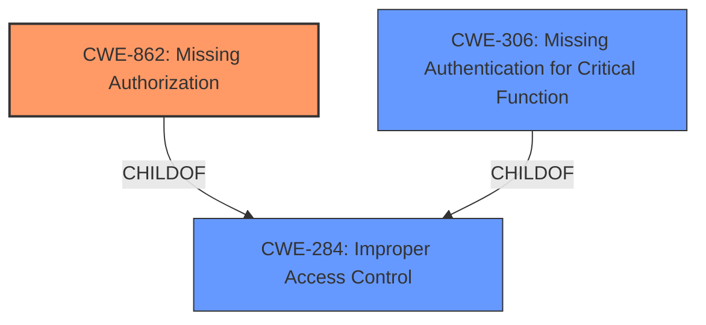

# Analysis for CVE-2020-18753

# Summary
| CWE ID    | CWE Name                                         | Confidence | CWE Abstraction Level | CWE Vulnerability Mapping Label | CWE-Vulnerability Mapping Notes |
| --------- | ------------------------------------------------ | ---------- | ----------------------- | ------------------------------- | ------------------------------- |
| CWE-862   | Missing Authorization                            | 0.9        | Base                    | Primary                         | Allowed                       |
| CWE-306   | Missing Authentication for Critical Function    | 0.8        | Base                    | Secondary                       | Allowed                       |
| CWE-284   | Improper Access Control                          | 0.6        | Pillar                  | Secondary                       | Discouraged                   |

## Evidence and Confidence

*   **Confidence Score:** 0.9
*   **Evidence Strength:** HIGH

## Relationship Analysis
The primary weakness is the **lack of authorization** (CWE-862), which is a specific form of **improper access control** (CWE-284). Since there is no authentication mechanism in place to begin with, **missing authentication** (CWE-306) becomes a critical related issue.

## Vulnerability Chain
The vulnerability chain starts with the **lack of authorization** and **lack of authentication**, enabling attackers to send crafted packets and gain control of the PLC.

## Summary of Analysis
Based on the provided evidence, the primary weakness is the **lack of authorization** in the DCCE MAC1100 PLC's communication protocol. The PLC uses the EPA protocol on port 11000 without proper authorization mechanisms, allowing attackers to control the PLC by sending specifically crafted network packets. This directly corresponds to CWE-862 "Missing Authorization". The vulnerability also lacks authentication, which when coupled with missing authorization, makes it easy to control the PLC by sending crafted UDP packets. CWE-284 is too high level and does not accurately describe the root cause.

Relevant CWE Information:

# Enhanced Context (25 CWEs)

## CWE-345: Insufficient Verification of Data Authenticity
**Abstraction Level**: Class
**Similarity Score**: 0.76
**Source**: dense

**Description**:
The product does not sufficiently verify the origin or authenticity of data, in a way that causes it to accept invalid data.

**Mapping Guidance**:
- Usage: Discouraged
- Rationale: This CWE entry is a level-1 Class (i.e., a child of a Pillar). It might have lower-level children that would be more appropriate

*This CWE is not the best fit because it focuses on data authenticity verification, while the core issue is the absence of authorization.*

## CWE-807: Reliance on Untrusted Inputs in a Security Decision
**Abstraction Level**: Base
**Similarity Score**: 0.76
**Source**: dense

**Description**:
The product uses a protection mechanism that relies on the existence or values of an input, but the input can be modified by an untrusted actor in a way that bypasses the protection mechanism.

**Mapping Guidance**:
- Usage: Allowed
- Rationale: This CWE entry is at the Base level of abstraction, which is a preferred level of abstraction for mapping to the root causes of vulnerabilities.

*This CWE could be a fit, but the lack of authorization is more fundamental than how inputs are handled in security decisions.*

## CWE-657: Violation of Secure Design Principles
**Abstraction Level**: Class
**Similarity Score**: 0.75
**Source**: dense

**Description**:
The product violates well-established principles for secure design.

**Mapping Guidance**:
- Usage: Discouraged
- Rationale: This CWE entry is a level-1 Class (i.e., a child of a Pillar). It might have lower-level children that would be more appropriate

*This is too general.*

## CWE-274: Improper Handling of Insufficient Privileges
**Abstraction Level**: Base
**Similarity Score**: 0.75
**Source**: dense

**Description**:
The product does not handle or incorrectly handles when it has insufficient privileges to perform an operation, leading to resultant weaknesses.

**Mapping Guidance**:
- Usage: Discouraged
- Rationale: This CWE entry could be deprecated in a future version of CWE.

*This is not the best fit, as there are no privileges being managed in the first place.*

## CWE-303: Incorrect Implementation of Authentication Algorithm
**Abstraction Level**: Base
**Similarity Score**: 0.75
**Source**: dense

**Description**:
The requirements for the product dictate the use of an established authentication algorithm, but the implementation of the algorithm is incorrect.

**Mapping Guidance**:
- Usage: Allowed
- Rationale: This CWE entry is at the Base level of abstraction, which is a preferred level of abstraction for mapping to the root causes of vulnerabilities.

*There isn't authentication in the first place.*

## CWE-280: Improper Handling of Insufficient Permissions or Privileges
**Abstraction Level**: Base
**Similarity Score**: 0.75
**Source**: dense

**Description**:
The product does not handle or incorrectly handles when it has insufficient privileges to access resources or functionality as specified by their permissions. This may cause it to follow unexpected code paths that may leave the product in an invalid state.

**Mapping Guidance**:
- Usage: Allowed
- Rationale: This CWE entry is at the Base level of abstraction, which is a preferred level of abstraction for mapping to the root causes of vulnerabilities.

*There isn't a permission system in the first place.*

## CWE-1289: Improper Validation of Unsafe Equivalence in Input
**Abstraction Level**: Base
**Similarity Score**: 0.74
**Source**: dense

**Description**:
The product receives an input value that is used as a resource identifier or other type of reference, but it does not validate or incorrectly validates that the input is equivalent to a potentially-unsafe value.

**Mapping Guidance**:
- Usage: Allowed
- Rationale: This CWE entry is at the Base level of abstraction, which is a preferred level of abstraction for mapping to the root causes of vulnerabilities.

*This is not the best fit because it describes input validation issues.*

## CWE-1391: Use of Weak Credentials
**Abstraction Level**: Class
**Similarity Score**: 0.74
**Source**: dense

**Description**:
The product uses weak credentials (such as a default key or hard-coded password) that can be calculated, derived, reused, or guessed by an attacker.

**Mapping Guidance**:
- Usage: Allowed-with-Review
- Rationale: This CWE entry is a Class and might have Base-level children that would be more appropriate

*There are no credentials at all.*

## CWE-668: Exposure of Resource to Wrong Sphere
**Abstraction Level**: Class
**Similarity Score**: 0.74
**Source**: dense

**Description**:
The product exposes a resource to the wrong control sphere, providing unintended actors with inappropriate access to the resource.

**Mapping Guidance**:
- Usage: Discouraged
- Rationale: CWE-668 is high-level and is often misused as a catch-all when lower-level CWE IDs might be applicable. It is sometimes used for low-information vulnerability reports [REF-1287]. It is a level-1 Class (i.e., a child of a Pillar). It is not useful for trend analysis.

*This is too high-level.*

## CWE-693: Protection Mechanism Failure
**Abstraction Level**: Pillar
**Similarity Score**: 0.74
**Source**: dense

**Description**:
The product does not use or incorrectly uses a protection mechanism that provides sufficient defense against directed attacks against the product.

**Mapping Guidance**:
- Usage: Discouraged
- Rationale: This CWE entry is extremely high-level, a Pillar.

*This is too high-level.*

## CWE-367: Time-of-check Time-of-use (TOCTOU) Race Condition
**Abstraction Level**: Base
**Similarity Score**: 4994.79
**Source**: sparse

**Description**:
The product checks the state of a resource before using that resource, but the resource's state can change between the check and the use in a way that invalidates the results of the check. This can cause the product to perform invalid actions when the resource is in an unexpected state.

**Mapping Guidance**:
- Usage: Allowed
- Rationale: This CWE entry is at the Base level of abstraction, which is a preferred level of abstraction for mapping to the root causes of vulnerabilities.

*This doesn't apply to this scenario.*

# Enhanced Query for CVE-2020-18753

## Vulnerability Description
An issue in Dut Computer Control Engineering Co.s PLC MAC1100 allows attackers to gain access to the system and escalate privileges via a crafted packet.

### Vulnerability Description Key Phrases
- **impact:** gain access to the system and escalate privileges
- **vector:** crafted packet
- **attacker:** attackers
- **product:** Dut Computer Control Engineering Co. PLC MAC1100

## CVE Reference Links Content Summary
- **Root cause of vulnerability:** The DCCE MAC1100 PLC uses the EPA protocol on port 11000 for communication. It lacks proper authorization mechanisms, allowing attackers to control the PLC by sending specifically crafted network packets.
- **Weaknesses/vulnerabilities present:**  Lack of authorization/authentication, reliance on insecure protocol.
- **Impact of exploitation:** An attacker can remotely control the PLC, including starting and stopping the PLC's CPU. This could disrupt the normal operation of the industrial processes controlled by the PLC.
- **Attack vectors:** Sending crafted UDP packets via the network to port 11000.
- **Required attacker capabilities/position:** The attacker needs network access to the PLC and the ability to send UDP packets.

## Retriever Results

### Top Combined Results

| Rank | CWE ID | Name | Abstraction | Usage  | Retrievers | Individual Scores |
|------|--------|------|-------------|-------|------------|-------------------|
| 1 | 284 | Improper Access Control | Pillar | Discouraged | sparse | 0.044 |
| 2 | 798 | Use of Hard-coded Credentials | Base | Allowed | sparse | 0.044 |
| 3 | 269 | Improper Privilege Management | Class | Discouraged | sparse | 0.044 |
| 4 | 367 | Time-of-check Time-of-use (TOCTOU) Race Condition | Base | Allowed | sparse | 0.043 |
| 5 | 276 | Incorrect Default Permissions | Base | Allowed | sparse | 0.043 |
| 6 | 671 | Lack of Administrator Control over Security | Class | Allowed-with-Review | dense | 0.582 |
| 7 | 609 | Double-Checked Locking | Base | Allowed | graph | 0.002 |
| 8 | 94 | Improper Control of Generation of Code ('Code Injection') | Base | Allowed-with-Review | sparse | 0.043 |
| 9 | 288 | Authentication Bypass Using an Alternate Path or Channel | Base | Allowed | sparse | 0.043 |
| 10 | 347 | Improper Verification of Cryptographic Signature | Base | Allowed | sparse | 0.043 |

# Complete CWE Specifications

## CWE-284: Improper Access Control
**Abstraction:** Pillar
**Status:** Incomplete

### Description
The product does not restrict or incorrectly restricts access to a resource from an unauthorized actor.

### Extended Description

Access control involves the use of several protection mechanisms such as:

  - Authentication (proving the identity of an actor)

  - Authorization (ensuring that a given actor can access a resource), and

  - Accountability (tracking of activities that were performed)

When any mechanism is not applied or otherwise fails, attackers can compromise the security of the product by gaining privileges, reading sensitive information, executing commands, evading detection, etc.

There are two distinct behaviors that can introduce access control weaknesses:

  - Specification: incorrect privileges, permissions, ownership, etc. are explicitly specified for either the user or the resource (for example, setting a password file to be world-writable, or giving administrator capabilities to a guest user). This action could be performed by the program or the administrator.

  - Enforcement: the mechanism contains errors that prevent it from properly enforcing the specified access control requirements (e.g., allowing the user to specify their own privileges, or allowing a syntactically-incorrect ACL to produce insecure settings). This problem occurs within the program itself, in that it does not actually enforce the intended security policy that the administrator specifies.

### Alternative Terms
Authorization: The terms "access control" and "authorization" are often used interchangeably, although many people have distinct definitions. The CWE usage of "access control" is intended as a general term for the various mechanisms that restrict which users can access which resources, and "authorization" is more narrowly defined. It is unlikely that there will be community consensus on the use of these terms.

### Relationships
None

### Mapping Guidance
**Usage:** Discouraged
**Rationale:** CWE-284 is extremely high-level, a Pillar. Its name, "Improper Access Control," is often misused in low-information vulnerability reports [REF-1287] or by active use of the OWASP Top Ten, such as "A01:2021-Broken Access Control". It is not useful for trend analysis.
**Comments:** Consider using descendants of CWE-284 that are more specific to the kind of access control involved, such as those involving authorization (Missing Authorization (CWE-862), Incorrect Authorization (CWE-863), Incorrect Permission Assignment for Critical Resource (CWE-732), etc.); authentication (Missing Authentication (CWE-306) or Weak Authentication (CWE-1390)); Incorrect User Management (CWE-286); Improper Restriction of Communication Channel to Intended Endpoints (CWE-923); etc.
**Reasons:**
- Frequent Misuse
- Abstraction
**Suggested Alternatives:**
- CWE-862: Missing Authorization
- CWE-863: Incorrect Authorization
- CWE-732: Incorrect Permission Assignment for Critical Resource
- CWE-306: Missing Authentication
- CWE-1390: Weak Authentication
- CWE-923: Improper Restriction of Communication Channel to Intended Endpoints

### Additional Notes
**[Maintenance]** 

This entry needs more work. Possible sub-categories include:

  - Trusted group includes undesired entities (partially covered by CWE-286)

  - Group can perform undesired actions

  - ACL parse error does not fail closed

### Observed Examples
- **CVE-2022-24985:** A form hosting website only checks the session authentication status for a single form, making it possible to bypass authentication when there are multiple forms
- **CVE-2022-29238:** Access-control setting in web-based document collaboration tool is not properly implemented by the code, which prevents listing hidden directories but does not prevent direct requests to files in those directories.
- **CVE-2022-23607:** Python-based HTTP library did not scope cookies to a particular domain such that "supercookies" could be sent to any domain on redirect

## CWE-798: Use of Hard-coded Credentials
**Abstraction:** Base
**Status:** Draft

### Description
The product contains hard-coded credentials, such as a password or cryptographic key.

### Extended Description

There are two main variations:

  - Inbound: the product contains an authentication mechanism that checks the input credentials against a hard-coded set of credentials. In this variant, a default administration account is created, and a simple password is hard-coded into the product and associated with that account. This hard-coded password is the same for each installation of the product, and it usually cannot be changed or disabled by system administrators without manually modifying the program, or otherwise patching the product. It can also be difficult for the administrator to detect.

  - Outbound: the product connects to another system or component, and it contains hard-coded credentials for connecting to that component. This variant applies to front-end systems that authenticate with a back-end service. The back-end service may require a fixed password that can be easily discovered. The programmer may simply hard-code those back-end credentials into the front-end product.

### Alternative Terms
None

### Relationships
ChildOf -> CWE-1391
ChildOf -> CWE-287
ChildOf -> CWE-344
ChildOf -> CWE-671
PeerOf -> CWE-257

### Mapping Guidance
**Usage:** Allowed
**Rationale:** This CWE entry is at the Base level of abstraction, which is a preferred level of abstraction for mapping to the root causes of vulnerabilities.
**Comments:** Carefully read both the name and description to ensure that this mapping is an appropriate fit. Do not try to 'force' a mapping to a lower-level Base/Variant simply to comply with this preferred level of abstraction.
**Reasons:**
- Acceptable-Use

### Additional Notes
**[Maintenance]** The Taxonomy_Mappings to ISA/IEC 62443 were added in CWE 4.10, but they are still under review and might change in future CWE versions. These draft mappings were performed by members of the "Mapping CWE to 62443" subgroup of the CWE-CAPEC ICS/OT Special Interest Group (SIG), and their work is incomplete as of CWE 4.10. The mappings are included to facilitate discussion and review by the broader ICS/OT community, and they are likely to change in future CWE versions.

### Observed Examples
- **CVE-2022-29953:** Condition Monitor firmware has a maintenance interface with hard-coded credentials
- **CVE-2022-29960:** Engineering Workstation uses hard-coded cryptographic keys that could allow for unathorized filesystem access and privilege escalation
- **CVE-2022-29964:** Distributed Control System (DCS) has hard-coded passwords for local shell access

## CWE-269: Improper Privilege Management
**Abstraction:** Class
**Status:** Draft

### Description
The product does not properly assign, modify, track, or check privileges for an actor, creating an unintended sphere of control for that actor.

### Extended Description
Not provided

### Alternative Terms
None

### Relationships
ChildOf -> CWE-284

### Mapping Guidance
**Usage:** Discouraged
**Rationale:** CWE-269 is commonly misused. It can be conflated with "privilege escalation," which is a technical impact that is listed in many low-information vulnerability reports [REF-1287]. It is not useful for trend analysis.
**Comments:** If an error or mistake allows privilege escalation, then use the CWE ID for that mistake. Avoid using CWE-269 when only phrases such as "privilege escalation" or "gain privileges" are available, as these indicate technical impact of the vulnerability - not the root cause weakness. If the root cause seems to be directly related to privileges, then examine the children of CWE-269 for additional hints, such as Execution with Unnecessary Privileges (CWE-250) or Incorrect Privilege Assignment (CWE-266).
**Reasons:**
- Frequent Misuse

### Additional Notes
**[Maintenance]** The relationships between privileges, permissions, and actors (e.g. users and groups) need further refinement within the Research view. One complication is that these concepts apply to two different pillars, related to control of resources (CWE-664) and protection mechanism failures (CWE-693).

### Observed Examples
- **CVE-2001-1555:** Terminal privileges are not reset when a user logs out.
- **CVE-2001-1514:** Does not properly pass security context to child processes in certain cases, allows privilege escalation.
- **CVE-2001-0128:** Does not properly compute roles.

## CWE-367: Time-of-check Time-of-use (TOCTOU) Race Condition
**Abstraction:** Base
**Status:** Incomplete

### Description
The product checks the state of a resource before using that resource, but the resource's state can change between the check and the use in a way that invalidates the results of the check. This can cause the product to perform invalid actions when the resource is in an unexpected state.

### Extended Description
This weakness can be security-relevant when an attacker can influence the state of the resource between check and use. This can happen with shared resources such as files, memory, or even variables in multithreaded programs.

### Alternative Terms
TOCTTOU: The TOCTTOU acronym expands to "Time Of Check To Time Of Use".
TOCCTOU: The TOCCTOU acronym is most likely a typo of TOCTTOU, but it has been used in some influential documents, so the typo is repeated fairly frequently.

### Relationships
ChildOf -> CWE-362
ChildOf -> CWE-362

### Mapping Guidance
**Usage:** Allowed
**Rationale:** This CWE entry is at the Base level of abstraction, which is a preferred level of abstraction for mapping to the root causes of vulnerabilities.
**Comments:** Carefully read both the name and description to ensure that this mapping is an appropriate fit. Do not try to 'force' a mapping to a lower-level Base/Variant simply to comply with this preferred level of abstraction.
**Reasons:**
- Acceptable-Use

### Additional Notes
**[Relationship]** TOCTOU issues do not always involve symlinks, and not every symlink issue is a TOCTOU problem.

**[Research Gap]** Non-symlink TOCTOU issues are not reported frequently, but they are likely to occur in code that attempts to be secure.

### Observed Examples
- **CVE-2015-1743:** TOCTOU in sandbox process allows installation of untrusted browser add-ons by replacing a file after it has been verified, but before it is executed
- **CVE-2003-0813:** A multi-threaded race condition allows remote attackers to cause a denial of service (crash or reboot) by causing two threads to process the same RPC request, which causes one thread to use memory after it has been freed.
- **CVE-2004-0594:** PHP flaw allows remote attackers to execute arbitrary code by aborting execution before the initialization of key data structures is complete.

## CWE-276: Incorrect Default Permissions
**Abstraction:** Base
**Status:** Draft

### Description
During installation, installed file permissions are set to allow anyone to modify those files.

### Extended Description
Not provided

### Alternative Terms
None

### Relationships
ChildOf -> CWE-732
ChildOf -> CWE-732

### Mapping Guidance
**Usage:** Allowed
**Rationale:** This CWE entry is at the Base level of abstraction, which is a preferred level of abstraction for mapping to the root causes of vulnerabilities.
**Comments:** Carefully read both the name and description to ensure that this mapping is an appropriate fit. Do not try to 'force' a mapping to a lower-level Base/Variant simply to comply with this preferred level of abstraction.
**Reasons:**
- Acceptable-Use

### Observed Examples
- **CVE-2005-1941:** Executables installed world-writable.
- **CVE-2002-1713:** Home directories installed world-readable.
- **CVE-2001-1550:** World-writable log files allow information loss; world-readable file has cleartext passwords.

## CWE-671: Lack of Administrator Control over Security
**Abstraction:** Class
**Status:** Draft

### Description
The product uses security features in a way that prevents the product's administrator from tailoring security settings to reflect the environment in which the product is being used. This introduces resultant weaknesses or prevents it from operating at a level of security that is desired by the administrator.

### Extended Description
If the product's administrator does not have the ability to manage security-related decisions at all times, then protecting the product from outside threats - including the product's developer - can become impossible. For example, a hard-coded account name and password cannot be changed by the administrator, thus exposing that product to attacks that the administrator can not prevent.

### Alternative Terms
None

### Relationships
ChildOf -> CWE-657

### Mapping Guidance
**Usage:** Allowed-with-Review
**Rationale:** This CWE entry is a Class and might have Base-level children that would be more appropriate
**Comments:** Examine children of this entry to see if there is a better fit
**Reasons:**
- Abstraction

### Observed Examples
- **CVE-2022-29953:** Condition Monitor firmware has a maintenance interface with hard-coded credentials
- **CVE-2000-0127:** GUI configuration tool does not enable a security option when a checkbox is selected, although that option is honored when manually set in the configuration file.

## CWE-609: Double-Checked Locking
**Abstraction:** Base
**Status:** Draft

### Description
The product uses double-checked locking to access a resource without the overhead of explicit synchronization, but the locking is insufficient.

### Extended Description
Double-checked locking refers to the situation where a programmer checks to see if a resource has been initialized, grabs a lock, checks again to see if the resource has been initialized, and then performs the initialization if it has not occurred yet. This should not be done, as it is not guaranteed to work in all languages and on all architectures. In summary, other threads may not be operating inside the synchronous block and are not guaranteed to see the operations execute in the same order as they would appear inside the synchronous block.

### Alternative Terms
None

### Relationships
ChildOf -> CWE-667
CanPrecede -> CWE-367

### Mapping Guidance
**Usage:** Allowed
**Rationale:** This CWE entry is at the Base level of abstraction, which is a preferred level of abstraction for mapping to the root causes of vulnerabilities.
**Comments:** Carefully read both the name and description to ensure that this mapping is an appropriate fit. Do not try to 'force' a mapping to a lower-level Base/Variant simply to comply with this preferred level of abstraction.
**Reasons:**
- Acceptable-Use

## CWE-94: Improper Control of Generation of Code ('Code Injection')
**Abstraction:** Base
**Status:** Draft

### Description
The product constructs all or part of a code segment using externally-influenced input from an upstream component, but it does not neutralize or incorrectly neutralizes special elements that could modify the syntax or behavior of the intended code segment.

### Extended Description

When a product allows a user's input to contain code syntax, it might be possible for an attacker to craft the code in such a way that it will alter the intended control flow of the product. Such an alteration could lead to arbitrary code execution.

Injection problems encompass a wide variety of issues -- all mitigated in very different ways. For this reason, the most effective way to discuss these weaknesses is to note the distinct features which classify them as injection weaknesses. The most important issue to note is that all injection problems share one thing in common -- i.e., they allow for the injection of control plane data into the user-controlled data plane. This means that the execution of the process may be altered by sending code in through legitimate data channels, using no other mechanism. While buffer overflows, and many other flaws, involve the use of some further issue to gain execution, injection problems need only for the data to be parsed. The most classic instantiations of this category of weakness are SQL injection and format string vulnerabilities.

### Alternative Terms
None

### Relationships
ChildOf -> CWE-74
ChildOf -> CWE-74
ChildOf -> CWE-913

### Mapping Guidance
**Usage:** Allowed-with-Review
**Rationale:** This entry is frequently misused for vulnerabilities with a technical impact of "code execution," which does not by itself indicate a root cause weakness, since dozens of weaknesses can enable code execution.
**Comments:** This weakness only applies when the product's functionality intentionally constructs all or part of a code segment. It could be that executing code could be the result of other weaknesses that do not involve the construction of code segments.
**Reasons:**
- Frequent Misuse
- Frequent Misinterpretation

### Observed Examples
- **CVE-2023-29374:** Math component in an LLM framework translates user input into a Python expression that is input into the Python exec() method, allowing code execution - one variant of a "prompt injection" attack.
- **CVE-2024-5565:** Python-based library uses an LLM prompt containing user input to dynamically generate code that is then fed as input into the Python exec() method, allowing code execution - one variant of a "prompt injection" attack.
- **CVE-2024-4181:** Framework for LLM applications allows eval injection via a crafted response from a hosting provider.

## CWE-288: Authentication Bypass Using an Alternate Path or Channel
**Abstraction:** Base
**Status:** Incomplete

### Description
The product requires authentication, but the product has an alternate path or channel that does not require authentication.

### Extended Description
Not provided

### Alternative Terms
None

### Relationships
ChildOf -> CWE-306
ChildOf -> CWE-284
PeerOf -> CWE-420

### Mapping Guidance
**Usage:** Allowed
**Rationale:** This CWE entry is at the Base level of abstraction, which is a preferred level of abstraction for mapping to the root causes of vulnerabilities.
**Comments:** Carefully read both the name and description to ensure that this mapping is an appropriate fit. Do not try to 'force' a mapping to a lower-level Base/Variant simply to comply with this preferred level of abstraction.
**Reasons:**
- Acceptable-Use

### Additional Notes
**[Relationship]** overlaps Unprotected Alternate Channel

### Observed Examples
- **CVE-2000-1179:** Router allows remote attackers to read system logs without authentication by directly connecting to the login screen and typing certain control characters.
- **CVE-1999-1454:** Attackers with physical access to the machine may bypass the password prompt by pressing the ESC (Escape) key.
- **CVE-1999-1077:** OS allows local attackers to bypass the password protection of idled sessions via the programmer's switch or CMD-PWR keyboard sequence, which brings up a debugger that the attacker can use to disable the lock.

## CWE-347: Improper Verification of Cryptographic Signature
**Abstraction:** Base
**Status:** Draft

### Description
The product does not verify, or incorrectly verifies, the cryptographic signature for data.

### Extended Description
Not provided

### Alternative Terms
None

### Relationships
ChildOf -> CWE-345
ChildOf -> CWE-345

### Mapping Guidance
**Usage:** Allowed
**Rationale:** This CWE entry is at the Base level of abstraction, which is a preferred level of abstraction for mapping to the root causes of vulnerabilities.
**Comments:** Carefully read both the name and description to ensure that this mapping is an appropriate fit. Do not try to 'force' a mapping to a lower-level Base/Variant simply to comply with this preferred level of abstraction.
**Reasons:**
- Acceptable-Use

### Observed Examples
- **CVE-2002-1796:** Does not properly verify signatures for "trusted" entities.
- **CVE-2005-2181:** Insufficient verification allows spoofing.
- **CVE-2005-2182:** Insufficient verification allows spoofing.

