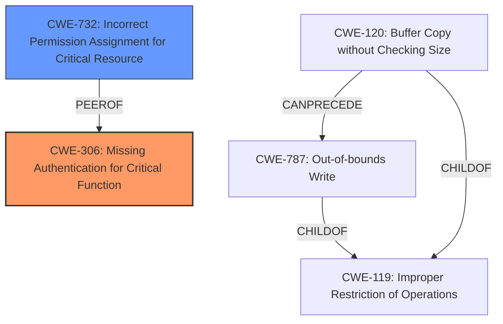

# Raw Analyzer Response for CVE-2020-18758

# Summary
| CWE ID | CWE Name | Confidence | CWE Abstraction Level | CWE Vulnerability Mapping Label | CWE-Vulnerability Mapping Notes |
|---|---|---|---|---|---|
| CWE-306 | Missing Authentication for Critical Function | 1.0 | Base | Primary | Allowed |
| CWE-732 | Incorrect Permission Assignment for Critical Resource | 0.7 | Base | Secondary | Allowed |

## Evidence and Confidence

*   **Confidence Score:** 0.9
*   **Evidence Strength:** HIGH

## Relationship Analysis
The primary relationship that influenced the CWE selection was the parent-child relationship. CWE-306 **Missing Authentication for Critical Function** is a base CWE and accurately reflects the root cause of the vulnerability. Although code execution is possible, the lack of authentication is the primary **weakness** being exploited.

## Vulnerability Chain
The vulnerability chain starts with the **missing authentication**, which allows an attacker to upload arbitrary code. This leads to remote code execution and potential loss of availability and integrity.

## Summary of Analysis
Initially, the analysis considered CWE-94 **Improper Control of Generation of Code ('Code Injection')**, due to the ability to execute arbitrary code. However, the root cause is not the improper generation of code, but rather the **lack of authentication** that allows the code to be uploaded in the first place. Therefore, CWE-306 **Missing Authentication for Critical Function** is the more appropriate choice. The secondary weakness is CWE-732 **Incorrect Permission Assignment for Critical Resource**, as the lack of authentication allows anyone to overwrite the control code, which should be a protected resource. This assessment is heavily based on the following evidence from the provided text:

*   "The vulnerability lies in the **lack of proper authentication** or authorization, allowing an attacker to upload arbitrary control code to the PLC."
*   "The PLC allows remote upload of control code without any validation, allowing attackers to overwrite the original code."
*   "There is no apparent authentication mechanism, allowing anyone to upload code to the PLC."

The selected CWEs are at the optimal level of specificity as they directly address the root cause and a significant contributing factor to the vulnerability.

Relevant CWE Information:

# Enhanced Context (25 CWEs)
The following CWEs were identified as potentially relevant to this vulnerability:

## CWE-807: Reliance on Untrusted Inputs in a Security Decision
**Abstraction Level**: Base
**Similarity Score**: 0.79
**Source**: dense

**Description**:
The product uses a protection mechanism that relies on the existence or values of an input, but the input can be modified by an untrusted actor in a way that bypasses the protection mechanism.

**Mapping Guidance**:
- Usage: Allowed
- Rationale: This CWE entry is at the Base level of abstraction, which is a preferred level of abstraction for mapping to the root causes of vulnerabilities.

## CWE-306: Missing Authentication for Critical Function
**Abstraction Level**: Base

### Description
The product performs a critical function without first authenticating the user.

### Extended Description
If an attacker can directly access a critical function without any authentication, then the attacker can perform unauthorized actions. If the function is critical, then the attacker might be able to gain complete control of the system, bypass security checks, modify data, or cause a denial-of-service.

### Alternative Terms
No Authentication
Missing Authentication
Unauthenticated Access to Critical Function

### Relationships
ParentOf -> CWE-863
ParentOf -> CWE-862

## CWE-732: Incorrect Permission Assignment for Critical Resource
**Abstraction Level**: Base

### Description
The product grants access to resources or privileges that are not required for defined tasks, which could be used to perform unintended actions.

### Extended Description
The product grants overly broad access to resources or privileges. This is typically caused by not following the principle of least privilege.

### Relationships
PeerOf -> CWE-306

**CWE-306: Missing Authentication for Critical Function:** This is the primary CWE because the vulnerability stems directly from the **lack of authentication**, which allows unauthorized uploading of arbitrary code. The description of CWE-306 perfectly aligns with the vulnerability description: "The product performs a critical function without first authenticating the user." The impact of this vulnerability (remote code execution) is also consistent with the potential impact described in CWE-306: "If the function is critical, then the attacker might be able to gain complete control of the system, bypass security checks, modify data, or cause a denial-of-service."

**CWE-732: Incorrect Permission Assignment for Critical Resource:** This is a secondary CWE. The ability to upload arbitrary code to the PLC implies that the control code is a critical resource, and the permissions are incorrectly assigned, allowing anyone to overwrite it. The relationship PeerOf -> CWE-306 suggests that these two CWEs can often occur together, reinforcing this mapping.

I considered the other CWEs in the Retriever Results, but they were not as directly relevant as CWE-306:

*   CWE-130 **Improper Handling of Length Parameter Inconsistency**: While this might be a contributing factor in some code injection scenarios, it's not the primary root cause here.
*   CWE-29 **Path Traversal: '\..\filename'**: This is not applicable as the vulnerability does not involve path traversal.
*   CWE-347 **Improper Verification of Cryptographic Signature**: This is not applicable as the vulnerability does not involve cryptographic signatures.
*   CWE-94 **Improper Control of Generation of Code ('Code Injection')**: While code execution is the impact, the root cause is missing authentication, not improper code generation.
*   CWE-341 **Predictable from Observable State**: This is not applicable as the vulnerability does not rely on predictability.
*   CWE-782 **Exposed IOCTL with Insufficient Access Control**: This is not applicable as the vulnerability does not involve IOCTLs.
*   CWE-184 **Incomplete List of Disallowed Inputs**: This is not applicable as the vulnerability does not involve a denylist.
*   CWE-798 **Use of Hard-coded Credentials**: This is not applicable as the vulnerability does not involve hardcoded credentials.
*   CWE-426 **Untrusted Search Path**: This is not applicable as the vulnerability does not involve search paths.
*   CWE-288 **Authentication Bypass Using an Alternate Path or Channel**: This is not as directly relevant as CWE-306, as the issue is not an alternate path but a complete lack of authentication for the critical function.