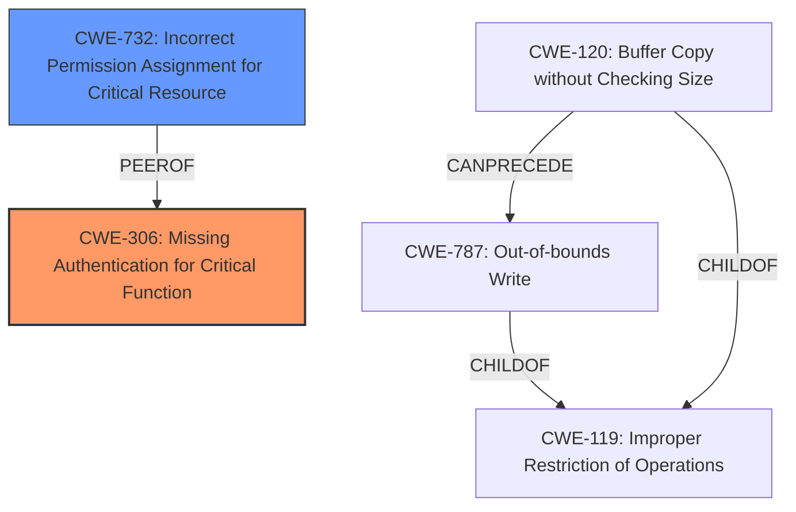

# Analysis for CVE-2020-18758

# Summary
| CWE ID | CWE Name | Confidence | CWE Abstraction Level | CWE Vulnerability Mapping Label | CWE-Vulnerability Mapping Notes |
|---|---|---|---|---|---|
| CWE-306 | Missing Authentication for Critical Function | 1.0 | Base | Primary | Allowed |
| CWE-732 | Incorrect Permission Assignment for Critical Resource | 0.7 | Base | Secondary | Allowed |

## Evidence and Confidence

*   **Confidence Score:** 0.9
*   **Evidence Strength:** HIGH

## Relationship Analysis
The primary relationship that influenced the CWE selection was the parent-child relationship. CWE-306 **Missing Authentication for Critical Function** is a base CWE and accurately reflects the root cause of the vulnerability. Although code execution is possible, the lack of authentication is the primary **weakness** being exploited.

## Vulnerability Chain
The vulnerability chain starts with the **missing authentication**, which allows an attacker to upload arbitrary code. This leads to remote code execution and potential loss of availability and integrity.

## Summary of Analysis
Initially, the analysis considered CWE-94 **Improper Control of Generation of Code ('Code Injection')**, due to the ability to execute arbitrary code. However, the root cause is not the improper generation of code, but rather the **lack of authentication** that allows the code to be uploaded in the first place. Therefore, CWE-306 **Missing Authentication for Critical Function** is the more appropriate choice. The secondary weakness is CWE-732 **Incorrect Permission Assignment for Critical Resource**, as the lack of authentication allows anyone to overwrite the control code, which should be a protected resource. This assessment is heavily based on the following evidence from the provided text:

*   "The vulnerability lies in the **lack of proper authentication** or authorization, allowing an attacker to upload arbitrary control code to the PLC."
*   "The PLC allows remote upload of control code without any validation, allowing attackers to overwrite the original code."
*   "There is no apparent authentication mechanism, allowing anyone to upload code to the PLC."

The selected CWEs are at the optimal level of specificity as they directly address the root cause and a significant contributing factor to the vulnerability.

Relevant CWE Information:

# Enhanced Context (25 CWEs)
The following CWEs were identified as potentially relevant to this vulnerability:

## CWE-807: Reliance on Untrusted Inputs in a Security Decision
**Abstraction Level**: Base
**Similarity Score**: 0.79
**Source**: dense

**Description**:
The product uses a protection mechanism that relies on the existence or values of an input, but the input can be modified by an untrusted actor in a way that bypasses the protection mechanism.

**Mapping Guidance**:
- Usage: Allowed
- Rationale: This CWE entry is at the Base level of abstraction, which is a preferred level of abstraction for mapping to the root causes of vulnerabilities.

## CWE-306: Missing Authentication for Critical Function
**Abstraction Level**: Base

### Description
The product performs a critical function without first authenticating the user.

### Extended Description
If an attacker can directly access a critical function without any authentication, then the attacker can perform unauthorized actions. If the function is critical, then the attacker might be able to gain complete control of the system, bypass security checks, modify data, or cause a denial-of-service.

### Alternative Terms
No Authentication
Missing Authentication
Unauthenticated Access to Critical Function

### Relationships
ParentOf -> CWE-863
ParentOf -> CWE-862

## CWE-732: Incorrect Permission Assignment for Critical Resource
**Abstraction Level**: Base

### Description
The product grants access to resources or privileges that are not required for defined tasks, which could be used to perform unintended actions.

### Extended Description
The product grants overly broad access to resources or privileges. This is typically caused by not following the principle of least privilege.

### Relationships
PeerOf -> CWE-306

**CWE-306: Missing Authentication for Critical Function:** This is the primary CWE because the vulnerability stems directly from the **lack of authentication**, which allows unauthorized uploading of arbitrary code. The description of CWE-306 perfectly aligns with the vulnerability description: "The product performs a critical function without first authenticating the user." The impact of this vulnerability (remote code execution) is also consistent with the potential impact described in CWE-306: "If the function is critical, then the attacker might be able to gain complete control of the system, bypass security checks, modify data, or cause a denial-of-service."

**CWE-732: Incorrect Permission Assignment for Critical Resource:** This is a secondary CWE. The ability to upload arbitrary code to the PLC implies that the control code is a critical resource, and the permissions are incorrectly assigned, allowing anyone to overwrite it. The relationship PeerOf -> CWE-306 suggests that these two CWEs can often occur together, reinforcing this mapping.

I considered the other CWEs in the Retriever Results, but they were not as directly relevant as CWE-306:

*   CWE-130 **Improper Handling of Length Parameter Inconsistency**: While this might be a contributing factor in some code injection scenarios, it's not the primary root cause here.
*   CWE-29 **Path Traversal: '\..\filename'**: This is not applicable as the vulnerability does not involve path traversal.
*   CWE-347 **Improper Verification of Cryptographic Signature**: This is not applicable as the vulnerability does not involve cryptographic signatures.
*   CWE-94 **Improper Control of Generation of Code ('Code Injection')**: While code execution is the impact, the root cause is missing authentication, not improper code generation.
*   CWE-341 **Predictable from Observable State**: This is not applicable as the vulnerability does not rely on predictability.
*   CWE-782 **Exposed IOCTL with Insufficient Access Control**: This is not applicable as the vulnerability does not involve IOCTLs.
*   CWE-184 **Incomplete List of Disallowed Inputs**: This is not applicable as the vulnerability does not involve a denylist.
*   CWE-798 **Use of Hard-coded Credentials**: This is not applicable as the vulnerability does not involve hardcoded credentials.
*   CWE-426 **Untrusted Search Path**: This is not applicable as the vulnerability does not involve search paths.
*   CWE-288 **Authentication Bypass Using an Alternate Path or Channel**: This is not as directly relevant as CWE-306, as the issue is not an alternate path but a complete lack of authentication for the critical function.

# Enhanced Query for CVE-2020-18758

## Vulnerability Description
An issue in Dut Computer Control Engineering Co.s PLC MAC1100 allows attackers to execute arbitrary code.

### Vulnerability Description Key Phrases
- **impact:** execute arbitrary code
- **attacker:** attackers
- **product:** Dut Computer Control Engineering Co. PLC MAC1100

## CVE Reference Links Content Summary
Based on the provided content, here's an analysis of the vulnerability:

**Root Cause:**
The DCCE MAC1100 PLC uses the EPA protocol on port 11000 for communication. The vulnerability lies in the lack of proper authentication or authorization, allowing an attacker to upload arbitrary control code to the PLC.

**Weaknesses/Vulnerabilities:**
- **Insecure Direct Object Reference:** The PLC allows remote upload of control code without any validation, allowing attackers to overwrite the original code.
- **Missing Authentication/Authorization:** There is no apparent authentication mechanism, allowing anyone to upload code to the PLC.

**Impact of Exploitation:**
- **Loss of Availability:** Overwriting the original control code can disrupt the normal operation of the PLC, leading to system downtime and potentially impacting industrial processes.
- **Loss of Integrity:** Attackers can inject malicious code, leading to unintended and potentially harmful behavior of the PLC and connected industrial equipment.
- **Remote Code Execution:** Attackers can upload and execute arbitrary PLC code, granting them control over the device.

**Attack Vectors:**
- **Network Access:** Attackers can exploit this vulnerability by sending specially crafted packets to the PLC over the network on port 11000.
- **Remote Exploitation:** The vulnerability can be exploited remotely if the PLC is accessible over a network.

**Required Attacker Capabilities/Position:**
- **Network Connectivity:** The attacker needs network connectivity to the target PLC on port 11000.
- **EPA Protocol Knowledge:** The attacker needs to understand the EPA protocol to craft the malicious control code for uploading.

**Additional Notes:**

The provided content includes a Python proof-of-concept (PoC) script that demonstrates how to exploit the vulnerability. This PoC sends a series of hardcoded payloads to overwrite the control code of the PLC, confirming the vulnerability. The PoC code also shows the specific byte sequences used to communicate and upload the malicious code to the PLC.

## Retriever Results

### Top Combined Results

| Rank | CWE ID | Name | Abstraction | Usage  | Retrievers | Individual Scores |
|------|--------|------|-------------|-------|------------|-------------------|
| 1 | 130 | Improper Handling of Length Parameter Inconsistency | Base | Allowed | sparse | 0.025 |
| 2 | 29 | Path Traversal: '\..\filename' | Variant | Allowed | sparse | 0.025 |
| 3 | 347 | Improper Verification of Cryptographic Signature | Base | Allowed | sparse | 0.024 |
| 4 | 94 | Improper Control of Generation of Code ('Code Injection') | Base | Allowed-with-Review | sparse | 0.024 |
| 5 | 341 | Predictable from Observable State | Base | Allowed | sparse | 0.022 |
| 6 | 782 | Exposed IOCTL with Insufficient Access Control | Variant | Allowed | dense | 0.578 |
| 7 | 184 | Incomplete List of Disallowed Inputs | Base | Allowed | graph | 0.002 |
| 8 | 798 | Use of Hard-coded Credentials | Base | Allowed | sparse | 0.022 |
| 9 | 426 | Untrusted Search Path | Base | Allowed | sparse | 0.022 |
| 10 | 288 | Authentication Bypass Using an Alternate Path or Channel | Base | Allowed | sparse | 0.022 |

# Complete CWE Specifications

## CWE-130: Improper Handling of Length Parameter Inconsistency
**Abstraction:** Base
**Status:** Incomplete

### Description
The product parses a formatted message or structure, but it does not handle or incorrectly handles a length field that is inconsistent with the actual length of the associated data.

### Extended Description
If an attacker can manipulate the length parameter associated with an input such that it is inconsistent with the actual length of the input, this can be leveraged to cause the target application to behave in unexpected, and possibly, malicious ways. One of the possible motives for doing so is to pass in arbitrarily large input to the application. Another possible motivation is the modification of application state by including invalid data for subsequent properties of the application. Such weaknesses commonly lead to attacks such as buffer overflows and execution of arbitrary code.

### Alternative Terms
length manipulation
length tampering

### Relationships
ChildOf -> CWE-240
ChildOf -> CWE-119
ChildOf -> CWE-119
CanPrecede -> CWE-805

### Mapping Guidance
**Usage:** Allowed
**Rationale:** This CWE entry is at the Base level of abstraction, which is a preferred level of abstraction for mapping to the root causes of vulnerabilities.
**Comments:** Carefully read both the name and description to ensure that this mapping is an appropriate fit. Do not try to 'force' a mapping to a lower-level Base/Variant simply to comply with this preferred level of abstraction.
**Reasons:**
- Acceptable-Use

### Additional Notes
**[Relationship]** This probably overlaps other categories including zero-length issues.

### Observed Examples
- **CVE-2014-0160:** Chain: "Heartbleed" bug receives an inconsistent length parameter (CWE-130) enabling an out-of-bounds read (CWE-126), returning memory that could include private cryptographic keys and other sensitive data.
- **CVE-2009-2299:** Web application firewall consumes excessive memory when an HTTP request contains a large Content-Length value but no POST data.
- **CVE-2001-0825:** Buffer overflow in internal string handling routine allows remote attackers to execute arbitrary commands via a length argument of zero or less, which disables the length check.

## CWE-29: Path Traversal: '\..\filename'
**Abstraction:** Variant
**Status:** Incomplete

### Description
The product uses external input to construct a pathname that should be within a restricted directory, but it does not properly neutralize '\..\filename' (leading backslash dot dot) sequences that can resolve to a location that is outside of that directory.

### Extended Description

This allows attackers to traverse the file system to access files or directories that are outside of the restricted directory.

This is similar to CWE-25, except using "\" instead of "/". Sometimes a program checks for "..\" at the beginning of the input, so a "\..\" can bypass that check. It is also useful for bypassing path traversal protection schemes that only assume that the "/" separator is valid.

### Alternative Terms
None

### Relationships
ChildOf -> CWE-23

### Mapping Guidance
**Usage:** Allowed
**Rationale:** This CWE entry is at the Variant level of abstraction, which is a preferred level of abstraction for mapping to the root causes of vulnerabilities.
**Comments:** Carefully read both the name and description to ensure that this mapping is an appropriate fit. Do not try to 'force' a mapping to a lower-level Base/Variant simply to comply with this preferred level of abstraction.
**Reasons:**
- Acceptable-Use

### Observed Examples
- **CVE-2002-1987:** Protection mechanism checks for "/.." but doesn't account for Windows-specific "\.." allowing read of arbitrary files.
- **CVE-2005-2142:** Directory traversal vulnerability in FTP server allows remote authenticated attackers to list arbitrary directories via a "\.." sequence in an LS command.

## CWE-347: Improper Verification of Cryptographic Signature
**Abstraction:** Base
**Status:** Draft

### Description
The product does not verify, or incorrectly verifies, the cryptographic signature for data.

### Extended Description
Not provided

### Alternative Terms
None

### Relationships
ChildOf -> CWE-345
ChildOf -> CWE-345

### Mapping Guidance
**Usage:** Allowed
**Rationale:** This CWE entry is at the Base level of abstraction, which is a preferred level of abstraction for mapping to the root causes of vulnerabilities.
**Comments:** Carefully read both the name and description to ensure that this mapping is an appropriate fit. Do not try to 'force' a mapping to a lower-level Base/Variant simply to comply with this preferred level of abstraction.
**Reasons:**
- Acceptable-Use

### Observed Examples
- **CVE-2002-1796:** Does not properly verify signatures for "trusted" entities.
- **CVE-2005-2181:** Insufficient verification allows spoofing.
- **CVE-2005-2182:** Insufficient verification allows spoofing.

## CWE-94: Improper Control of Generation of Code ('Code Injection')
**Abstraction:** Base
**Status:** Draft

### Description
The product constructs all or part of a code segment using externally-influenced input from an upstream component, but it does not neutralize or incorrectly neutralizes special elements that could modify the syntax or behavior of the intended code segment.

### Extended Description

When a product allows a user's input to contain code syntax, it might be possible for an attacker to craft the code in such a way that it will alter the intended control flow of the product. Such an alteration could lead to arbitrary code execution.

Injection problems encompass a wide variety of issues -- all mitigated in very different ways. For this reason, the most effective way to discuss these weaknesses is to note the distinct features which classify them as injection weaknesses. The most important issue to note is that all injection problems share one thing in common -- i.e., they allow for the injection of control plane data into the user-controlled data plane. This means that the execution of the process may be altered by sending code in through legitimate data channels, using no other mechanism. While buffer overflows, and many other flaws, involve the use of some further issue to gain execution, injection problems need only for the data to be parsed. The most classic instantiations of this category of weakness are SQL injection and format string vulnerabilities.

### Alternative Terms
None

### Relationships
ChildOf -> CWE-74
ChildOf -> CWE-74
ChildOf -> CWE-913

### Mapping Guidance
**Usage:** Allowed-with-Review
**Rationale:** This entry is frequently misused for vulnerabilities with a technical impact of "code execution," which does not by itself indicate a root cause weakness, since dozens of weaknesses can enable code execution.
**Comments:** This weakness only applies when the product's functionality intentionally constructs all or part of a code segment. It could be that executing code could be the result of other weaknesses that do not involve the construction of code segments.
**Reasons:**
- Frequent Misuse
- Frequent Misinterpretation

### Observed Examples
- **CVE-2023-29374:** Math component in an LLM framework translates user input into a Python expression that is input into the Python exec() method, allowing code execution - one variant of a "prompt injection" attack.
- **CVE-2024-5565:** Python-based library uses an LLM prompt containing user input to dynamically generate code that is then fed as input into the Python exec() method, allowing code execution - one variant of a "prompt injection" attack.
- **CVE-2024-4181:** Framework for LLM applications allows eval injection via a crafted response from a hosting provider.

## CWE-341: Predictable from Observable State
**Abstraction:** Base
**Status:** Draft

### Description
A number or object is predictable based on observations that the attacker can make about the state of the system or network, such as time, process ID, etc.

### Extended Description
Not provided

### Alternative Terms
None

### Relationships
ChildOf -> CWE-340

### Mapping Guidance
**Usage:** Allowed
**Rationale:** This CWE entry is at the Base level of abstraction, which is a preferred level of abstraction for mapping to the root causes of vulnerabilities.
**Comments:** Carefully read both the name and description to ensure that this mapping is an appropriate fit. Do not try to 'force' a mapping to a lower-level Base/Variant simply to comply with this preferred level of abstraction.
**Reasons:**
- Acceptable-Use

### Additional Notes
**[Maintenance]** As of CWE 4.5, terminology related to randomness, entropy, and predictability can vary widely. Within the developer and other communities, "randomness" is used heavily. However, within cryptography, "entropy" is distinct, typically implied as a measurement. There are no commonly-used definitions, even within standards documents and cryptography papers. Future versions of CWE will attempt to define these terms and, if necessary, distinguish between them in ways that are appropriate for different communities but do not reduce the usability of CWE for mapping, understanding, or other scenarios.

### Observed Examples
- **CVE-2002-0389:** Mail server stores private mail messages with predictable filenames in a world-executable directory, which allows local users to read private mailing list archives.
- **CVE-2001-1141:** PRNG allows attackers to use the output of small PRNG requests to determine the internal state information, which could be used by attackers to predict future pseudo-random numbers.
- **CVE-2000-0335:** DNS resolver library uses predictable IDs, which allows a local attacker to spoof DNS query results.

## CWE-782: Exposed IOCTL with Insufficient Access Control
**Abstraction:** Variant
**Status:** Draft

### Description
The product implements an IOCTL with functionality that should be restricted, but it does not properly enforce access control for the IOCTL.

### Extended Description

When an IOCTL contains privileged functionality and is exposed unnecessarily, attackers may be able to access this functionality by invoking the IOCTL. Even if the functionality is benign, if the programmer has assumed that the IOCTL would only be accessed by a trusted process, there may be little or no validation of the incoming data, exposing weaknesses that would never be reachable if the attacker cannot call the IOCTL directly.

The implementations of IOCTLs will differ between operating system types and versions, so the methods of attack and prevention may vary widely.

### Alternative Terms
None

### Relationships
ChildOf -> CWE-749
CanPrecede -> CWE-781

### Mapping Guidance
**Usage:** Allowed
**Rationale:** This CWE entry is at the Variant level of abstraction, which is a preferred level of abstraction for mapping to the root causes of vulnerabilities.
**Comments:** Carefully read both the name and description to ensure that this mapping is an appropriate fit. Do not try to 'force' a mapping to a lower-level Base/Variant simply to comply with this preferred level of abstraction.
**Reasons:**
- Acceptable-Use

### Additional Notes
**[Relationship]** This can be primary to many other weaknesses when the programmer assumes that the IOCTL can only be accessed by trusted parties. For example, a program or driver might not validate incoming addresses in METHOD_NEITHER IOCTLs in Windows environments (CWE-781), which could allow buffer overflow and similar attacks to take place, even when the attacker never should have been able to access the IOCTL at all.

**[Applicable Platform]** 

Because IOCTL functionality is typically performing low-level actions and closely interacts with the operating system, this weakness may only appear in code that is written in low-level languages.

### Observed Examples
- **CVE-2009-2208:** Operating system does not enforce permissions on an IOCTL that can be used to modify network settings.
- **CVE-2008-3831:** Device driver does not restrict ioctl calls to its direct rendering manager.
- **CVE-2008-3525:** ioctl does not check for a required capability before processing certain requests.

## CWE-184: Incomplete List of Disallowed Inputs
**Abstraction:** Base
**Status:** Draft

### Description
The product implements a protection mechanism that relies on a list of inputs (or properties of inputs) that are not allowed by policy or otherwise require other action to neutralize before additional processing takes place, but the list is incomplete.

### Extended Description
Not provided

### Alternative Terms
Denylist / Deny List: This is used by CWE and CAPEC instead of other commonly-used terms. Its counterpart is allowlist.
Blocklist / Block List: This is often used by security tools such as firewalls, email or web gateways, proxies, etc.
Blacklist / Black List: This term is frequently used, but usage has been declining as organizations have started to adopt other terms.

### Relationships
ChildOf -> CWE-693
ChildOf -> CWE-1023
CanPrecede -> CWE-79
CanPrecede -> CWE-78
CanPrecede -> CWE-434
CanPrecede -> CWE-98

### Mapping Guidance
**Usage:** Allowed
**Rationale:** This CWE entry is at the Base level of abstraction, which is a preferred level of abstraction for mapping to the root causes of vulnerabilities.
**Comments:** Carefully read both the name and description to ensure that this mapping is an appropriate fit. Do not try to 'force' a mapping to a lower-level Base/Variant simply to comply with this preferred level of abstraction.
**Reasons:**
- Acceptable-Use

### Additional Notes
**[Relationship]** 

Multiple interpretation errors can indirectly introduce inputs that should be disallowed. For example, a list of dangerous shell metacharacters might not include a metacharacter that only has meaning in one particular shell, not all of them; or a check for XSS manipulations might ignore an unusual construct that is supported by one web browser, but not others.

### Observed Examples
- **CVE-2024-4315:** Chain: API for text generation using Large Language Models (LLMs) does not include the "\" Windows folder separator in its denylist (CWE-184) when attempting to prevent Local File Inclusion via path traversal (CWE-22), allowing deletion of arbitrary files on Windows systems.
- **CVE-2008-2309:** product uses a denylist to identify potentially dangerous content, allowing attacker to bypass a warning
- **CVE-2005-2782:** PHP remote file inclusion in web application that filters "http" and "https" URLs, but not "ftp".

## CWE-798: Use of Hard-coded Credentials
**Abstraction:** Base
**Status:** Draft

### Description
The product contains hard-coded credentials, such as a password or cryptographic key.

### Extended Description

There are two main variations:

  - Inbound: the product contains an authentication mechanism that checks the input credentials against a hard-coded set of credentials. In this variant, a default administration account is created, and a simple password is hard-coded into the product and associated with that account. This hard-coded password is the same for each installation of the product, and it usually cannot be changed or disabled by system administrators without manually modifying the program, or otherwise patching the product. It can also be difficult for the administrator to detect.

  - Outbound: the product connects to another system or component, and it contains hard-coded credentials for connecting to that component. This variant applies to front-end systems that authenticate with a back-end service. The back-end service may require a fixed password that can be easily discovered. The programmer may simply hard-code those back-end credentials into the front-end product.

### Alternative Terms
None

### Relationships
ChildOf -> CWE-1391
ChildOf -> CWE-287
ChildOf -> CWE-344
ChildOf -> CWE-671
PeerOf -> CWE-257

### Mapping Guidance
**Usage:** Allowed
**Rationale:** This CWE entry is at the Base level of abstraction, which is a preferred level of abstraction for mapping to the root causes of vulnerabilities.
**Comments:** Carefully read both the name and description to ensure that this mapping is an appropriate fit. Do not try to 'force' a mapping to a lower-level Base/Variant simply to comply with this preferred level of abstraction.
**Reasons:**
- Acceptable-Use

### Additional Notes
**[Maintenance]** The Taxonomy_Mappings to ISA/IEC 62443 were added in CWE 4.10, but they are still under review and might change in future CWE versions. These draft mappings were performed by members of the "Mapping CWE to 62443" subgroup of the CWE-CAPEC ICS/OT Special Interest Group (SIG), and their work is incomplete as of CWE 4.10. The mappings are included to facilitate discussion and review by the broader ICS/OT community, and they are likely to change in future CWE versions.

### Observed Examples
- **CVE-2022-29953:** Condition Monitor firmware has a maintenance interface with hard-coded credentials
- **CVE-2022-29960:** Engineering Workstation uses hard-coded cryptographic keys that could allow for unathorized filesystem access and privilege escalation
- **CVE-2022-29964:** Distributed Control System (DCS) has hard-coded passwords for local shell access

## CWE-426: Untrusted Search Path
**Abstraction:** Base
**Status:** Stable

### Description
The product searches for critical resources using an externally-supplied search path that can point to resources that are not under the product's direct control.

### Extended Description

This might allow attackers to execute their own programs, access unauthorized data files, or modify configuration in unexpected ways. If the product uses a search path to locate critical resources such as programs, then an attacker could modify that search path to point to a malicious program, which the targeted product would then execute. The problem extends to any type of critical resource that the product trusts.

Some of the most common variants of untrusted search path are:

  - In various UNIX and Linux-based systems, the PATH environment variable may be consulted to locate executable programs, and LD_PRELOAD may be used to locate a separate library.

  - In various Microsoft-based systems, the PATH environment variable is consulted to locate a DLL, if the DLL is not found in other paths that appear earlier in the search order.

### Alternative Terms
Untrusted Path

### Relationships
ChildOf -> CWE-642
ChildOf -> CWE-668
ChildOf -> CWE-673
PeerOf -> CWE-427
PeerOf -> CWE-428

### Mapping Guidance
**Usage:** Allowed
**Rationale:** This CWE entry is at the Base level of abstraction, which is a preferred level of abstraction for mapping to the root causes of vulnerabilities.
**Comments:** Carefully read both the name and description to ensure that this mapping is an appropriate fit. Do not try to 'force' a mapping to a lower-level Base/Variant simply to comply with this preferred level of abstraction.
**Reasons:**
- Acceptable-Use

### Observed Examples
- **CVE-1999-1120:** Application relies on its PATH environment variable to find and execute program.
- **CVE-2008-1810:** Database application relies on its PATH environment variable to find and execute program.
- **CVE-2007-2027:** Chain: untrusted search path enabling resultant format string by loading malicious internationalization messages.

## CWE-288: Authentication Bypass Using an Alternate Path or Channel
**Abstraction:** Base
**Status:** Incomplete

### Description
The product requires authentication, but the product has an alternate path or channel that does not require authentication.

### Extended Description
Not provided

### Alternative Terms
None

### Relationships
ChildOf -> CWE-306
ChildOf -> CWE-284
PeerOf -> CWE-420

### Mapping Guidance
**Usage:** Allowed
**Rationale:** This CWE entry is at the Base level of abstraction, which is a preferred level of abstraction for mapping to the root causes of vulnerabilities.
**Comments:** Carefully read both the name and description to ensure that this mapping is an appropriate fit. Do not try to 'force' a mapping to a lower-level Base/Variant simply to comply with this preferred level of abstraction.
**Reasons:**
- Acceptable-Use

### Additional Notes
**[Relationship]** overlaps Unprotected Alternate Channel

### Observed Examples
- **CVE-2000-1179:** Router allows remote attackers to read system logs without authentication by directly connecting to the login screen and typing certain control characters.
- **CVE-1999-1454:** Attackers with physical access to the machine may bypass the password prompt by pressing the ESC (Escape) key.
- **CVE-1999-1077:** OS allows local attackers to bypass the password protection of idled sessions via the programmer's switch or CMD-PWR keyboard sequence, which brings up a debugger that the attacker can use to disable the lock.

