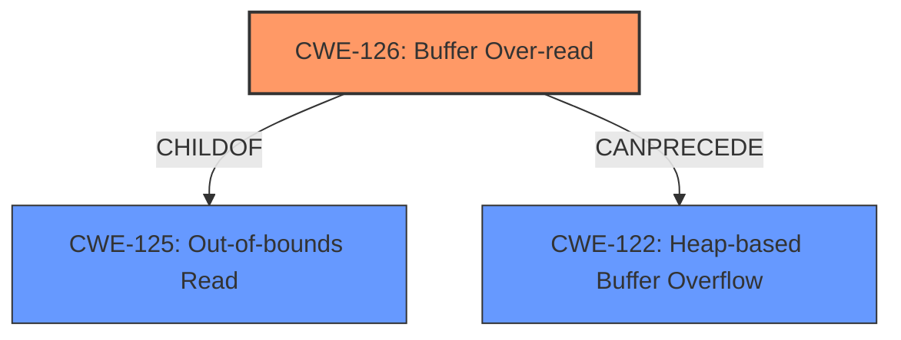

# Analysis for CVE-2020-18775

# Summary
| CWE ID | CWE Name | Confidence | CWE Abstraction Level | CWE Vulnerability Mapping Label | CWE-Vulnerability Mapping Notes |
|---|---|---|---|---|---|
| CWE-126 | Buffer Over-read | 1.0 | Variant | Allowed | Primary CWE |
| CWE-125 | Out-of-bounds Read | 0.7 | Base | Allowed | Secondary Candidate |
| CWE-122 | Heap-based Buffer Overflow | 0.6 | Variant | Allowed | Secondary Candidate |

## Evidence and Confidence

*   **Confidence Score:** 0.9
*   **Evidence Strength:** HIGH

## Relationship Analysis
The primary CWE selected is CWE-126 (Buffer Over-read), which is a variant of CWE-125 (Out-of-bounds Read). CWE-126 is more specific because it explicitly involves reading past the end of the buffer. CWE-122 (Heap-based Buffer Overflow) is related as a potential consequence of out-of-bounds reads, especially when heap memory is involved. The relationship between these CWEs helps to refine the classification from a general out-of-bounds read to a more precise buffer over-read.

## Vulnerability Chain
The vulnerability chain starts with the **heap-based buffer over-read** (**WEAKNESS**), leading to a denial-of-service (**IMPACT**) due to a crafted file (**VECTOR**). The chain here is direct: the over-read is the root cause, and the denial of service is the immediate impact.

## Summary of Analysis
The initial assessment pointed towards CWE-125 (Out-of-bounds Read), driven by the "heap-based buffer over-read" description. However, after reviewing the definitions and relationships, CWE-126 (Buffer Over-read) was selected as the primary CWE because it more precisely captures the nature of the vulnerability, which involves reading *past* the end of the buffer. The vulnerability description explicitly states that the **heap-based buffer over-read** occurs in `vc1_decode_b_mb_intfi in vc1_block.c`.

CWE-126 is a variant of CWE-125, providing a more specific classification. The "Retriever Results" also list CWE-126 with a high score, supporting this choice.

*   **CWE-126 (Buffer Over-read):** This is the primary CWE because the vulnerability description specifically mentions a "heap-based buffer over-read." CWE-126 directly addresses the scenario where a program reads past the end of an allocated buffer. The description of CWE-126, "The product reads from a buffer using buffer access mechanisms such as indexes or pointers that reference memory locations after the targeted buffer," aligns perfectly with the vulnerability description.

*   **CWE-125 (Out-of-bounds Read):** This is considered as a secondary CWE since CWE-126 is a child of CWE-125 and provides a more precise description of the vulnerability.

*   **CWE-122 (Heap-based Buffer Overflow):** While the vulnerability is heap-based, the primary issue is an over-read, not an overflow. An overflow involves writing data beyond the buffer's boundaries, whereas this vulnerability involves reading beyond the boundaries. Therefore, CWE-122 is less appropriate but relevant due to the heap context.

The selected CWEs are at the optimal level of specificity, with CWE-126 being a variant that accurately describes the vulnerability, and CWE-125 providing a broader context.

Relevant CWE Information:

# Enhanced Context (25 CWEs)
The following CWEs were identified as potentially relevant to this vulnerability:

## CWE-805: Buffer Access with Incorrect Length Value
**Abstraction Level**: Base
**Similarity Score**: 0.80
**Source**: dense

**Description**:
The product uses a sequential operation to read or write a buffer, but it uses an incorrect length value that causes it to access memory that is outside of the bounds of the buffer.

**Mapping Guidance**:
- Usage: Allowed
- Rationale: This CWE entry is at the Base level of abstraction, which is a preferred level of abstraction for mapping to the root causes of vulnerabilities.

## CWE-130: Improper Handling of Length Parameter Inconsistency
**Abstraction Level**: Base
**Similarity Score**: 0.80
**Source**: dense

**Description**:
The product parses a formatted message or structure, but it does not handle or incorrectly handles a length field that is inconsistent with the actual length of the associated data.

**Mapping Guidance**:
- Usage: Allowed
- Rationale: This CWE entry is at the Base level of abstraction, which is a preferred level of abstraction for mapping to the root causes of vulnerabilities.

## CWE-191: Integer Underflow (Wrap or Wraparound)
**Abstraction Level**: Base
**Similarity Score**: 0.79
**Source**: dense

**Description**:
The product subtracts one value from another, such that the result is less than the minimum allowable integer value, which produces a value that is not equal to the correct result.

**Mapping Guidance**:
- Usage: Allowed
- Rationale: This CWE entry is at the Base level of abstraction, which is a preferred level of abstraction for mapping to the root causes of vulnerabilities.

## CWE-131: Incorrect Calculation of Buffer Size
**Abstraction Level**: Base
**Similarity Score**: 0.79
**Source**: dense

**Description**:
The product does not correctly calculate the size to be used when allocating a buffer, which could lead to a buffer overflow.

**Mapping Guidance**:
- Usage: Allowed
- Rationale: This CWE entry is at the Base level of abstraction, which is a preferred level of abstraction for mapping to the root causes of vulnerabilities.

## CWE-126: Buffer Over-read
**Abstraction Level**: Variant
**Similarity Score**: 0.77
**Source**: dense

**Description**:
The product reads from a buffer using buffer access mechanisms such as indexes or pointers that reference memory locations after the targeted buffer.

**Mapping Guidance**:
- Usage: Allowed
- Rationale: This CWE entry is at the Variant level of abstraction, which is a preferred level of abstraction for mapping to the root causes of vulnerabilities.

## CWE-197: Numeric Truncation Error
**Abstraction Level**: Base
**Similarity Score**: 0.77
**Source**: dense

**Description**:
Truncation errors occur when a primitive is cast to a primitive of a smaller size and data is lost in the conversion.

**Mapping Guidance**:
- Usage: Allowed
- Rationale: This CWE entry is at the Base level of abstraction, which is a preferred level of abstraction for mapping to the root causes of vulnerabilities.

## CWE-125: Out-of-bounds Read
**Abstraction Level**: Base
**Similarity Score**: 0.77
**Source**: dense

**Description**:
The product reads data past the end, or before the beginning, of the intended buffer.

**Mapping Guidance**:
- Usage: Allowed
- Rationale: This CWE entry is at the Base level of abstraction, which is a preferred level of abstraction for mapping to the root causes of vulnerabilities.

## CWE-124: Buffer Underwrite ('Buffer Underflow')
**Abstraction Level**: Base
**Similarity Score**: 0.77
**Source**: dense

**Description**:
The product writes to a buffer using an index or pointer that references a memory location prior to the beginning of the buffer.

**Mapping Guidance**:
- Usage: Allowed
- Rationale: This CWE entry is at the Base level of abstraction, which is a preferred level of abstraction for mapping to the root causes of vulnerabilities.

## CWE-193: Off-by-one Error
**Abstraction Level**: Base
**Similarity Score**: 0.77
**Source**: dense

**Description**:
A product calculates or uses an incorrect maximum or minimum value that is 1 more, or 1 less, than the correct value.

**Mapping Guidance**:
- Usage: Allowed
- Rationale: This CWE entry is at the Base level of abstraction, which is a preferred level of abstraction for mapping to the root causes of vulnerabilities.

## CWE-681: Incorrect Conversion between Numeric Types
**Abstraction Level**: Base
**Similarity Score**: 0.76
**Source**: dense

**Description**:
When converting from one data type to another, such as long to integer, data can be omitted or translated in a way that produces unexpected values. If the resulting values are used in