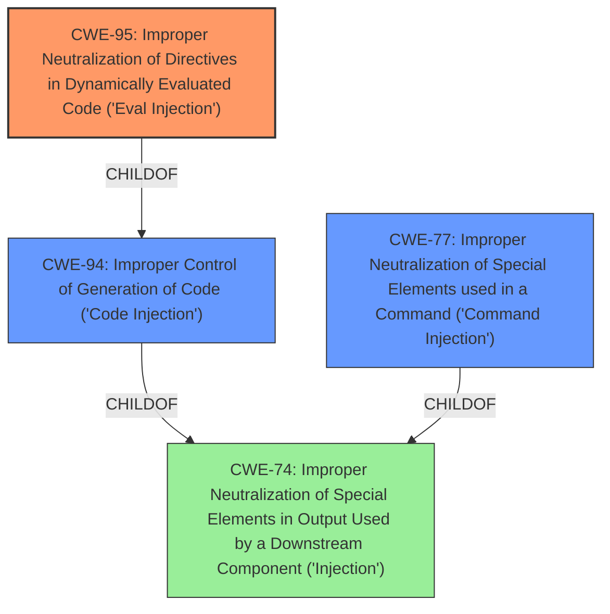

# Raw Analyzer Response for CVE-2020-18885

# Summary
| CWE ID | CWE Name | Confidence | CWE Abstraction Level | CWE Vulnerability Mapping Label | CWE-Vulnerability Mapping Notes |
|---|---|---|---|---|---|
| CWE-95 | Improper Neutralization of Directives in Dynamically Evaluated Code ('Eval Injection') | 0.8 | Variant | Allowed | Primary CWE. The application **fails to neutralize** input, allowing an attacker to inject code that is then dynamically evaluated.|
| CWE-94 | Improper Control of Generation of Code ('Code Injection') | 0.6 | Base | Allowed-with-Review | Secondary CWE. The application constructs a code segment using externally-influenced input but **does not neutralize** special elements. |
| CWE-77 | Improper Neutralization of Special Elements used in a Command ('Command Injection') | 0.5 | Class | Allowed-with-Review | Secondary CWE. The application **fails to neutralize** special elements in a command.|

## Evidence and Confidence

*   **Confidence Score:** 0.7
*   **Evidence Strength:** HIGH

## Relationship Analysis
The primary CWE is CWE-95, a **Variant** of CWE-94 which is a **Base** CWE. CWE-94 is a child of CWE-74. CWE-77 is a **Class** that is a child of CWE-74. The relationship analysis shows that the vulnerability is primarily related to code injection, with CWE-95 being the most specific variant due to dynamic evaluation. The relationships between CWEs guided the selection towards the most specific and relevant classification.

## Vulnerability Chain
The vulnerability chain starts with the **lack of input sanitization**, leading to **code injection**, and resulting in **arbitrary PHP code execution**.

## Summary of Analysis
Initially, the description indicated a general **Command Injection** vulnerability. However, after reviewing the "CVE Reference Links Content Summary," it became clear that the application allows an authenticated administrator to inject arbitrary PHP code. The vulnerability occurs due to the **lack of input sanitization** in the 'watermark text' and 'text color' input fields, leading to arbitrary PHP code execution. Given this, CWE-95 is the most appropriate mapping because it specifically addresses the scenario where code is dynamically evaluated.

The evidence from "CVE Reference Links Content Summary" clearly points to code injection via the 'watermark text' and 'text color' fields: "The application allows an authenticated administrator to inject arbitrary PHP code via the watermark settings, specifically in the 'watermark text' and 'text color' input fields." This directly supports the selection of CWE-95, as it involves the injection of code that is then dynamically evaluated.

The relationships in the graph influenced the final selection by clarifying the hierarchy and specificity of the CWEs. While CWE-77 (Command Injection) was considered, the evidence suggested a broader code injection issue.

The selected CWEs are at the optimal level of specificity because they accurately reflect the root cause and mechanism of the vulnerability. CWE-95 is a **Variant** that directly describes the **improper neutralization** in dynamically evaluated code.

Relevant CWE Information:

# Enhanced Context (25 CWEs)
The following CWEs were identified as potentially relevant to this vulnerability:

## CWE-74: Improper Neutralization of Special Elements in Output Used by a Downstream Component ('Injection')
**Abstraction Level**: Class
**Similarity Score**: 0.76
**Source**: dense

**Description**:
The product constructs all or part of a command, data structure, or record using externally-influenced input from an upstream component, but it does not neutralize or incorrectly neutralizes special elements that could modify how it is parsed or interpreted when it is sent to a downstream component.

**Mapping Guidance**:
- Usage: Discouraged
- Rationale: CWE-74 is high-level and often misused when lower-level weaknesses are more appropriate.

## CWE-943: Improper Neutralization of Special Elements in Data Query Logic
**Abstraction Level**: Class
**Similarity Score**: 0.75
**Source**: dense

**Description**:
The product generates a query intended to access or manipulate data in a data store such as a database, but it does not neutralize or incorrectly neutralizes special elements that can modify the intended logic of the query.

**Mapping Guidance**:
- Usage: Allowed-with-Review
- Rationale: This CWE entry is a Class and might have Base-level children that would be more appropriate

## CWE-917: Improper Neutralization of Special Elements used in an Expression Language Statement ('Expression Language Injection')
**Abstraction Level**: Base
**Similarity Score**: 0.75
**Source**: dense

**Description**:
The product constructs all or part of an expression language (EL) statement in a framework such as a Java Server Page (JSP) using externally-influenced input from an upstream component, but it does not neutralize or incorrectly neutralizes special elements that could modify the intended EL statement before it is executed.

**Mapping Guidance**:
- Usage: Allowed
- Rationale: This CWE entry is at the Base level of abstraction, which is a preferred level of abstraction for mapping to the root causes of vulnerabilities.

## CWE-80: Improper Neutralization of Script-Related HTML Tags in a Web Page (Basic XSS)
**Abstraction Level**: Variant
**Similarity Score**: 0.75
**Source**: dense

**Description**:
The product receives input from an upstream component, but it does not neutralize or incorrectly neutralizes special characters such as "<", ">", and "&" that could be interpreted as web-scripting elements when they are sent to a downstream component that processes web pages.

**Mapping Guidance**:
- Usage: Allowed
- Rationale: This CWE entry is at the Variant level of abstraction, which is a preferred level of abstraction for mapping to the root causes of vulnerabilities.

## CWE-1236: Improper Neutralization of Formula Elements in a CSV File
**Abstraction Level**: Base
**Similarity Score**: 0.73
**Source**: dense

**Description**:
The product saves user-provided information into a Comma-Separated Value (CSV) file, but it does not neutralize or incorrectly neutralizes special elements that could be interpreted as a command when the file is opened by a spreadsheet product.

**Mapping Guidance**:
- Usage: Allowed
- Rationale: This CWE entry is at the Base level of abstraction, which is a preferred level of abstraction for mapping to the root causes of vulnerabilities.

## CWE-1336: Improper Neutralization of Special Elements Used in a Template Engine
**Abstraction Level**: Base
**Similarity Score**: 0.73
**Source**: dense

**Description**:
The product uses a template engine to insert or process externally-influenced input, but it does not neutralize or incorrectly neutralizes special elements or syntax that can be interpreted as template expressions or other code directives when processed by the engine.

**Mapping Guidance**:
- Usage: Allowed
- Rationale: This CWE entry is at the Base level of abstraction, which is a preferred level of abstraction for mapping to the root causes of vulnerabilities.

## CWE-184: Incomplete List of Disallowed Inputs
**Abstraction Level**: Base
**Similarity Score**: 0.73
**Source**: dense

**Description**:
The product implements a protection mechanism that relies on a list of inputs (or properties of inputs) that are not allowed by policy or otherwise require other action to neutralize before additional processing takes place, but the list is incomplete.

**Mapping Guidance**:
- Usage: Allowed
- Rationale: This CWE entry is at the Base level of abstraction, which is a preferred level of abstraction for mapping to the root causes of vulnerabilities.

## CWE-73: External Control of File Name or Path
**Abstraction Level**: Base
**Similarity Score**: 0.72
**Source**: dense

**Description**:
The product allows user input to control or influence paths or file names that are used in filesystem operations.

**Mapping Guidance**:
- Usage: Allowed
- Rationale: This CWE entry is at the Base level of abstraction, which is a preferred level of abstraction for mapping to the root causes of vulnerabilities.

## CWE-96: Improper Neutralization of Directives in Statically Saved Code ('Static Code Injection')
**Abstraction Level**: Base
**Similarity Score**: 0.72
**Source**: dense

**Description**:
The product receives input from an