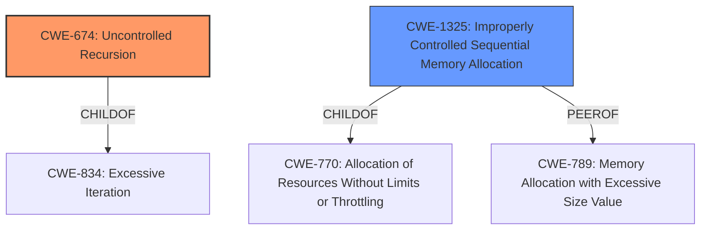

# Analysis for CVE-2020-18898

# Summary
| CWE ID | CWE Name | Confidence | CWE Abstraction Level | CWE Vulnerability Mapping Label | CWE-Vulnerability Mapping Notes |
|---|---|---|---|---|---|
| CWE-674 | Uncontrolled Recursion | 0.9 | Class | Primary | Allowed-with-Review |
| CWE-1325 | Improperly Controlled Sequential Memory Allocation | 0.8 | Base | Secondary | Allowed |

## Evidence and Confidence

*   **Confidence Score:** 0.85
*   **Evidence Strength:** HIGH

## Relationship Analysis
The primary CWE is CWE-674 (Uncontrolled Recursion), which is a Class-level CWE. A more specific Base-level CWE that can be considered is CWE-1325 (Improperly Controlled Sequential Memory Allocation). CWE-674 is a child of CWE-834 (Excessive Iteration). CWE-1325 is a child of CWE-770 (Allocation of Resources Without Limits or Throttling). CWE-1325 is a PeerOf CWE-789 (Memory Allocation with Excessive Size Value). These relationships help contextualize the vulnerability within broader categories of resource management and algorithmic efficiency.

## Vulnerability Chain
The vulnerability chain starts with the **uncontrolled recursion** (CWE-674) in the `printIFDStructure` function, leading to excessive memory allocation on the stack (CWE-1325), and ultimately resulting in **stack exhaustion**, which causes a denial-of-service (DoS).

## Summary of Analysis
The initial analysis identified the root cause as **stack exhaustion** due to **uncontrolled recursion**. The primary CWE selected is CWE-674 (Uncontrolled Recursion), which directly addresses the recursive nature of the vulnerability.

Supporting evidence is:

*   "**stack exhaustion** issue in the printIFDStructure function"
*   "The vulnerability is due to **uncontrolled recursion** within the `Exiv2::Image::printIFDStructure` function."
*   "The function calls itself recursively, leading to **stack exhaustion** when processing crafted image files."

CWE-1325 (Improperly Controlled Sequential Memory Allocation) is included as a secondary CWE because the uncontrolled recursion leads to excessive memory allocation on the stack. This is supported by the description of CWE-1325, which states: "The product manages a group of objects or resources and performs a separate memory allocation for each object, but it does not properly limit the total amount of memory that is consumed by all of the combined objects." The alternative term "Stack Exhaustion" is also listed for CWE-1325.

CWE-789 (Memory Allocation with Excessive Size Value) was considered because it is also related to stack exhaustion, but it focuses more on the size of individual allocations rather than the number of allocations due to recursion.

CWE-770 (Allocation of Resources Without Limits or Throttling) was considered but is less specific than CWE-1325, which directly relates to memory allocation.

CWE-400 (Uncontrolled Resource Consumption) was deemed too general, as the vulnerability is more specifically related to recursion and memory allocation.

The selected CWEs are at the optimal level of specificity. CWE-674 directly addresses the uncontrolled recursion, and CWE-1325 captures the resulting memory allocation issue.
Relevant CWE Information:

# Enhanced Context (25 CWEs)
The following CWEs were identified as potentially relevant to this vulnerability:

## CWE-1325: Improperly Controlled Sequential Memory Allocation
**Abstraction Level**: Base
**Similarity Score**: 0.78
**Source**: dense

**Description**:
The product manages a group of objects or resources and performs a separate memory allocation for each object, but it does not properly limit the total amount of memory that is consumed by all of the combined objects.

**Mapping Guidance**:
- Usage: Allowed
- Rationale: This CWE entry is at the Base level of abstraction, which is a preferred level of abstraction for mapping to the root causes of vulnerabilities.

## CWE-789: Memory Allocation with Excessive Size Value
**Abstraction Level**: Variant
**Similarity Score**: 0.77
**Source**: dense

**Description**:
The product allocates memory based on an untrusted, large size value, but it does not ensure that the size is within expected limits, allowing arbitrary amounts of memory to be allocated.

**Mapping Guidance**:
- Usage: Allowed
- Rationale: This CWE entry is at the Variant level of abstraction, which is a preferred level of abstraction for mapping to the root causes of vulnerabilities.

## CWE-131: Incorrect Calculation of Buffer Size
**Abstraction Level**: Base
**Similarity Score**: 0.76
**Source**: dense

**Description**:
The product does not correctly calculate the size to be used when allocating a buffer, which could lead to a buffer overflow.

**Mapping Guidance**:
- Usage: Allowed
- Rationale: This CWE entry is at the Base level of abstraction, which is a preferred level of abstraction for mapping to the root causes of vulnerabilities.

## CWE-404: Improper Resource Shutdown or Release
**Abstraction Level**: Class
**Similarity Score**: 0.76
**Source**: dense

**Description**:
The product does not release or incorrectly releases a resource before it is made available for re-use.

**Mapping Guidance**:
- Usage: Allowed-with-Review
- Rationale: This CWE entry is a Class and might have Base-level children that would be more appropriate

## CWE-226: Sensitive Information in Resource Not Removed Before Reuse
**Abstraction Level**: Base
**Similarity Score**: 0.76
**Source**: dense

**Description**:
The product releases a resource such as memory or a file so that it can be made available for reuse, but it does not clear or "zeroize" the information contained in the resource before the product performs a critical state transition or makes the resource available for reuse by other entities.

**Mapping Guidance**:
- Usage: Allowed
- Rationale: This CWE entry is at the Base level of abstraction, which is a preferred level of abstraction for mapping to the root causes of vulnerabilities.

## CWE-805: Buffer Access with Incorrect Length Value
**Abstraction Level**: Base
**Similarity Score**: 0.76
**Source**: dense

**Description**:
The product uses a sequential operation to read or write a buffer, but it uses an incorrect length value that causes it to access memory that is outside of the bounds of the buffer.

**Mapping Guidance**:
- Usage: Allowed
- Rationale: This CWE entry is at the Base level of abstraction, which is a preferred level of abstraction for mapping to the root causes of vulnerabilities.

## CWE-191: Integer Underflow (Wrap or Wraparound)
**Abstraction Level**: Base
**Similarity Score**: 0.76
**Source**: dense

**Description**:
The product subtracts one value from another, such that the result is less than the minimum allowable integer value, which produces a value that is not equal to the correct result.

**Mapping Guidance**:
- Usage: Allowed
- Rationale: This CWE entry is at the Base level of abstraction, which is a preferred level of abstraction for mapping to the root causes of vulnerabilities.

## CWE-130: Improper Handling of Length Parameter Inconsistency
**Abstraction Level**: Base
**Similarity Score**: 0.75
**Source**: dense

**Description**:
The product parses a formatted message or structure, but it does not handle or incorrectly handles a length field that is inconsistent with the actual length of the associated data.

**Mapping Guidance**:
- Usage: Allowed
- Rationale: This CWE entry is at the Base level of abstraction, which is a preferred level of abstraction for mapping to the root causes of vulnerabilities.

## CWE-126: Buffer Over-read
**Abstraction Level**: Variant
**Similarity Score**: 0.75
**Source**: dense

**Description**:
The product reads from a buffer using buffer access mechanisms such as indexes or pointers that reference memory locations after the targeted buffer.

**Mapping Guidance**:
- Usage: Allowed
- Rationale: This CWE entry is at the Variant level of abstraction, which is a preferred level of abstraction for mapping to the root causes of vulnerabilities.

## CWE-405: Asymmetric Resource Consumption (Amplification)
**Abstraction Level**: Class
**Similarity Score