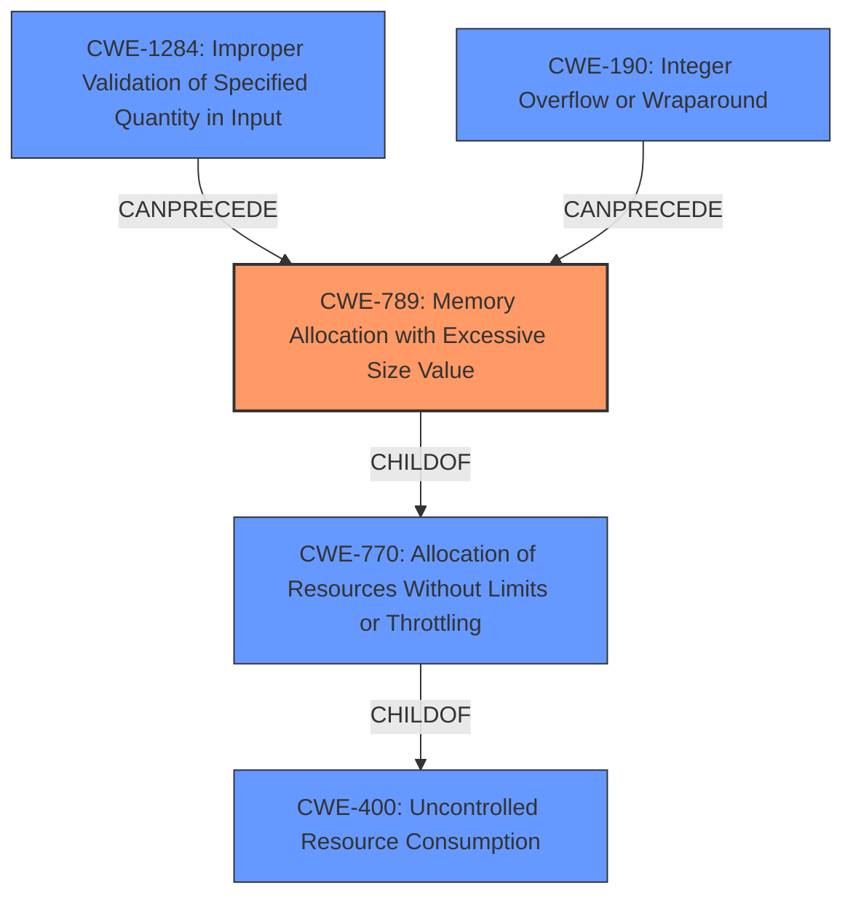

# Enhanced Analysis for CVE-2020-18899

# Summary
| CWE ID | CWE Name | Confidence | CWE Abstraction Level | CWE Vulnerability Mapping Label | CWE-Vulnerability Mapping Notes |
|---|---|---|---|---|---|
| CWE-789 | Memory Allocation with Excessive Size Value | 0.9 | Variant | Allowed | Primary CWE |
| CWE-190 | Integer Overflow or Wraparound | 0.7 | Base | Allowed | Secondary Candidate |
| CWE-770 | Allocation of Resources Without Limits or Throttling | 0.6 | Base | Allowed | Secondary Candidate |
| CWE-1284 | Improper Validation of Specified Quantity in Input | 0.6 | Base | Allowed | Secondary Candidate |

## Evidence and Confidence

*   **Confidence Score:** 0.8
*   **Evidence Strength:** HIGH

## Relationship Analysis
The primary CWE, CWE-789 (**CWE-789: Memory Allocation with Excessive Size Value**), is a Variant of CWE-770 (**CWE-770: Allocation of Resources Without Limits or Throttling**), indicating a more specific case of resource allocation issues. CWE-770 is a child of CWE-400 (**CWE-400: Uncontrolled Resource Consumption**), which is a more general class of resource consumption vulnerabilities. CWE-789 can be preceded by CWE-1284 (**CWE-1284: Improper Validation of Specified Quantity in Input**) and integer overflows CWE-190 (**CWE-190: Integer Overflow or Wraparound**), indicating a potential chain of vulnerabilities. The choice of CWE-789 is made due to the vulnerability description specifying an untrusted size value leading to excessive memory allocation.



## Vulnerability Chain
The vulnerability chain starts with a crafted input, which can lead to an integer overflow during the calculation of the buffer size. This, in turn, results in an **uncontrolled memory allocation** due to the **lack of proper bounds checking** and **missing input sanitization**, eventually leading to a denial of service (DoS) due to excessive memory allocation.
  - Crafted Input -> Integer Overflow (CWE-190) -> **Uncontrolled Memory Allocation** (CWE-789) -> Denial of Service

## Summary of Analysis
The initial assessment identified the vulnerability as an **uncontrolled memory allocation**, which aligns with CWE-789 (**CWE-789: Memory Allocation with Excessive Size Value**). The CVE Reference Links Content Summary provides strong evidence supporting this classification, mentioning the root cause as an integer overflow in the buffer size calculation and weaknesses including **uncontrolled memory allocation** and **lack of proper bounds checking**.

The graph relationships highlight the connection between CWE-789 and its parent CWE-770 (**CWE-770: Allocation of Resources Without Limits or Throttling**), as well as the potential chain of vulnerabilities involving CWE-190 (**CWE-190: Integer Overflow or Wraparound**) and CWE-1284 (**CWE-1284: Improper Validation of Specified Quantity in Input**).

CWE-789 is selected as the primary CWE because it is a Variant-level CWE that precisely describes the vulnerability: allocating memory based on an untrusted, large size value without ensuring it is within expected limits. This leads to excessive memory allocation.

CWE-190 (**CWE-190: Integer Overflow or Wraparound**) was considered as a secondary CWE because the "CVE Reference Links Content Summary" mentions "Integer overflow in the calculation of the buffer size."

CWE-770 (**CWE-770: Allocation of Resources Without Limits or Throttling**) was considered as a secondary CWE because it relates to the allocation of resources without limits, leading to potential resource exhaustion. However, CWE-789 is a more specific variant of this general issue.

CWE-1284 (**CWE-1284: Improper Validation of Specified Quantity in Input**) was considered as a secondary CWE because the "CVE Reference Links Content Summary" mentions "missing input sanitization."

CWE-400 (**CWE-400: Uncontrolled Resource Consumption**) was not chosen because it is a Class-level CWE and is less specific than CWE-770 and CWE-789. Additionally, its usage is discouraged.

CWE-674 (**CWE-674: Uncontrolled Recursion**) was not chosen because there is no evidence of recursion in the vulnerability description.

CWE-126 (**CWE-126: Buffer Over-read**) and CWE-120 (**CWE-120: Buffer Copy without Checking Size of Input ('Classic Buffer Overflow')**) were not chosen because the vulnerability involves allocation of memory, not reading from or writing to a buffer.

CWE-772 (**CWE-772: Missing Release of Resource after Effective Lifetime**) was not chosen because the vulnerability is about the initial allocation, not the release, of resources.


## CWE Relationship Analysis

Current CWEs represent these abstraction levels: .


### Vulnerability Chain Analysis

**Chain starting from CWE-674:**
- 674 (Uncontrolled Recursion) - ROOT


**Chain starting from CWE-120:**
- 120 (Buffer Copy without Checking Size of Input ('Classic Buffer Overflow')) - ROOT


### CWE Relationship Diagram

```mermaid
graph TD
    classDef primary fill:#f96,stroke:#333,stroke-width:2px
    classDef secondary fill:#69f,stroke:#333
    classDef tertiary fill:#9e9,stroke:#333
```