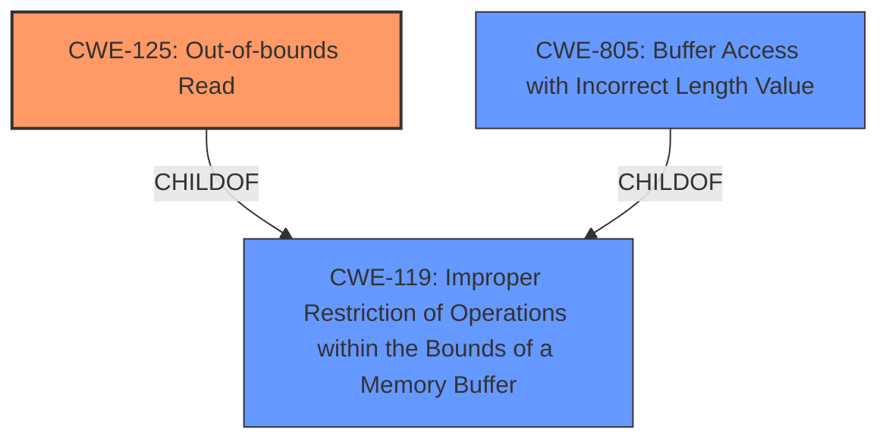

# Raw Analyzer Response for CVE-2020-18900

# Summary
| CWE ID    | CWE Name                                                                   | Confidence | CWE Abstraction Level | CWE Vulnerability Mapping Label | CWE-Vulnerability Mapping Notes |
| :--------- | :------------------------------------------------------------------------- | :--------- | :---------------------- | :------------------------------ | :------------------------------ |
| CWE-125     | Out-of-bounds Read                                                         | 0.9        | Base                    | Primary                         | Allowed                         |
| CWE-805     | Buffer Access with Incorrect Length Value                                  | 0.7        | Base                    | Secondary                       | Allowed                         |

## Evidence and Confidence

*   **Confidence Score:** 0.8
*   **Evidence Strength:** HIGH

## Relationship Analysis
The primary relationship that influenced the CWE selection was the parent-child relationship between CWE-119 (Improper Restriction of Operations within the Bounds of a Memory Buffer) and CWE-125 (Out-of-bounds Read). While CWE-119 is a broader category, the vulnerability description and CVE details specifically mention an out-of-bounds read, making CWE-125 a more precise and relevant classification.

The relationship between CWE-190 (Integer Overflow or Wraparound) and CWE-119 was also considered, as integer overflows can sometimes lead to buffer overflows. However, the evidence does not indicate an integer overflow as the root cause in this case.

Additionally, the relationship between CWE-120 (Buffer Copy without Checking Size of Input) and CWE-119 was reviewed, but the vulnerability is not related to buffer copying operations, but rather an out-of-bounds read.

## Vulnerability Chain
The vulnerability chain starts with the **incorrect** logic in the `libexe_io_handle_read_coff_optional_header` function, leading to an out-of-bounds read.

`Incorrect Logic` --> `Out-of-bounds Read (CWE-125)` --> `Potential Crash (DoS)`

The description mentions a **heap-based buffer overflow**, but the CVE reference clarifies that it is an out-of-bounds read.

## Summary of Analysis
The initial vulnerability description mentions a **heap-based buffer overflow**, but the CVE reference links content summary clarifies that the root cause is an out-of-bounds read in the `libexe_io_handle_read_coff_optional_header` function. The function attempts to read 1 or 2 bytes beyond the allocated buffer. This is a crucial distinction because a buffer overflow implies a write operation, while an out-of-bounds read involves reading memory outside the allocated buffer.

The primary CWE selected is CWE-125 (Out-of-bounds Read), with a confidence of 0.9. This is because the evidence from the CVE reference clearly indicates that the vulnerability involves reading data past the end of the intended buffer. The CVE reference states: "The vulnerability is caused by an out-of-bounds read in the `libexe_io_handle_read_coff_optional_header` function of `libexe`. The function attempts to read 1 or 2 bytes beyond the allocated buffer."

CWE-805 (Buffer Access with Incorrect Length Value) was also considered, as it relates to using an incorrect length value when accessing a buffer. The description states that the function "attempts to read 1 or 2 bytes beyond the allocated buffer." This could be caused by an incorrect length. This is added as a secondary CWE with a confidence of 0.7.

CWE-119 (Improper Restriction of Operations within the Bounds of a Memory Buffer) was considered but not selected as the primary CWE because it is a broader category. While the vulnerability falls under this category, CWE-125 provides a more specific and accurate representation of the weakness.

CWE-122 (Heap-based Buffer Overflow) was considered because the initial vulnerability description mentions it. However, the CVE reference clarifies that the vulnerability is an out-of-bounds read, not a buffer overflow. Therefore, CWE-122 is not selected.

The final decision is based on the evidence from the CVE reference, which clearly indicates an out-of-bounds read as the root cause of the vulnerability, making CWE-125 the most appropriate classification.

Relevant CWE Information:
INSERT