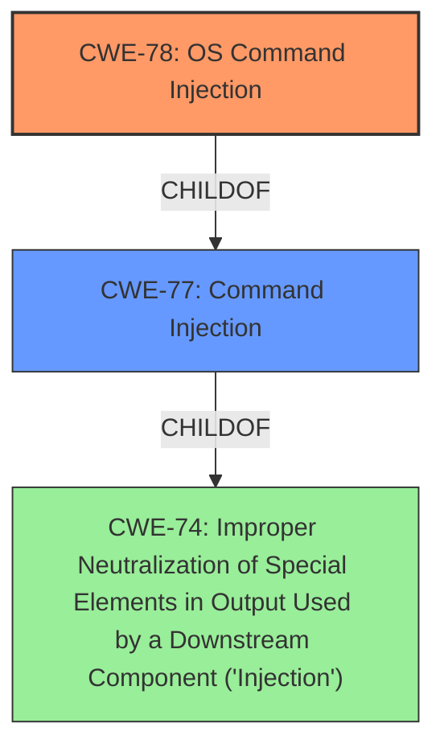

# Raw Analyzer Response for CVE-2020-19001

# Summary
| CWE ID | CWE Name | Confidence | CWE Abstraction Level | CWE Vulnerability Mapping Label | CWE-Vulnerability Mapping Notes |
|---|---|---|---|---|---|
| CWE-78 | Improper Neutralization of Special Elements used in an OS Command ('OS Command Injection') | 1.0 | Base | Allowed | Primary CWE |
| CWE-77 | Improper Neutralization of Special Elements used in a Command ('Command Injection') | 0.5 | Class | Allowed-with-Review | Secondary Candidate |

## Evidence and Confidence

*   **Confidence Score:** 1.0
*   **Evidence Strength:** HIGH

## Relationship Analysis
The primary relationship that influenced the decision was the parent-child relationship between CWE-77 (Class) and CWE-78 (Base). Given the specific context of OS command injection, the more specific CWE-78 was selected. CWE-77 is considered as an alternative if the command injection does not involve OS commands.

## Vulnerability Chain
The vulnerability chain starts with the **improper neutralization** of special elements within the configuration file, leading to OS command injection and ultimately allowing remote attackers to execute arbitrary system commands.

## Summary of Analysis
Initially, CWE-77 was considered due to the general description of **Command Injection**. However, the description specifically mentions "execute arbitrary system commands", which aligns perfectly with CWE-78, **Improper Neutralization of Special Elements used in an OS Command ('OS Command Injection')**. The CVE Reference Links Content Summary confirms the root cause and attack vector involving the execution of arbitrary commands via a malicious configuration file. The choice of CWE-78 is further supported by its Base level of abstraction, which is preferred for root cause analysis.

Relevant CWE Information:

# Enhanced Context (25 CWEs)

## CWE-77: Improper Neutralization of Special Elements used in a Command ('Command Injection')
**Abstraction Level**: Class
**Similarity Score**: 1.00
**Source**: Retriever Results

**Description**:
The product constructs all or part of a command using externally-influenced input from an upstream component, but it does not neutralize or incorrectly neutralizes special elements that could modify the intended command when it is sent to a downstream component.

**Mapping Guidance**:
- Usage: Allowed-with-Review
- Rationale: CWE-77 is often misused when OS command injection (CWE-78) was intended instead [REF-1287]. If the weakness involves a command language besides OS shell invocation, then CWE-77 could be used.

**Justification:**
CWE-77 is a more general case of command injection. Since the vulnerability description specifies "arbitrary system commands", it's more accurately described by the more specific CWE-78. CWE-77 is only considered because **Command Injection** is in the title of the Vulnerability Description.

## CWE-78: Improper Neutralization of Special Elements used in an OS Command ('OS Command Injection')
**Abstraction Level**: Base
**Similarity Score**: 0.70
**Source**: Retriever Results

**Description**:
The product constructs all or part of an OS command using externally-influenced input from an upstream component, but it does not neutralize or incorrectly neutralizes special elements that could modify the intended OS command when it is sent to a downstream component.

**Mapping Guidance**:
- Usage: Allowed
- Rationale: This CWE entry is at the Base level of abstraction, which is a preferred level of abstraction for mapping to the root causes of vulnerabilities.

**Justification:**
The vulnerability description clearly states that remote attackers can "execute arbitrary system commands". This aligns directly with the definition of CWE-78. The root cause, as identified in the CVE Reference Links Content Summary, is the unsafe deserialization of YAML configuration files, which allows for the injection and execution of arbitrary code.

## CWE-88: Improper Neutralization of Argument Delimiters in a Command ('Argument Injection')
**Abstraction Level**: Base
**Similarity Score**: 0.164
**Source**: Retriever Results

**Description**:
The product constructs a string for a command to be executed by a separate component in another control sphere, but it does not properly delimit the intended arguments, options, or switches within that command string.

**Mapping Guidance**:
- Usage: Allowed
- Rationale: This CWE entry is at the Base level of abstraction, which is a preferred level of abstraction for mapping to the root causes of vulnerabilities.

**Justification:**
While argument injection could potentially play a role in exploiting the command injection vulnerability, the primary weakness lies in the **improper neutralization** of special elements that allow for the execution of arbitrary system commands. Therefore, CWE-88 is not the primary CWE.

## CWE-93: Improper Neutralization of CRLF Sequences ('CRLF Injection')
**Abstraction Level**: Base
**Similarity Score**: 0.153
**Source**: Retriever Results

**Description**:
The product uses CRLF (carriage return line feeds) as a special element, e.g. to separate lines or records, but it does not neutralize or incorrectly neutralizes CRLF sequences from inputs.

**Mapping Guidance**:
- Usage: Allowed
- Rationale: This CWE entry is at the Base level of abstraction, which is a preferred level of abstraction for mapping to the root causes of vulnerabilities.

**Justification:**
CRLF injection is not directly relevant to the described vulnerability. The root cause is the **improper neutralization** of special elements in the configuration file, leading to command execution, not the **improper handling** of CRLF sequences.

## CWE-94: Improper Control of Generation of Code ('Code Injection')
**Abstraction Level**: Base
**Similarity Score**: 0.148
**Source**: Retriever Results

**Description**:
The product constructs all or part of a code segment using externally-influenced input from an upstream component, but it does not neutralize or incorrectly neutralizes special elements that could modify the syntax or behavior of the intended code segment.

**Mapping Guidance**:
- Usage: Allowed-with-Review
- Rationale: This entry is frequently misused for vulnerabilities with a technical impact of "code execution," which does not by itself indicate a root cause weakness, since dozens of weaknesses can enable code execution.

**Justification:**
While code execution is the result of the vulnerability, the root cause is the **improper neutralization** of special elements in the configuration file, which allows for the execution of arbitrary system commands. The vulnerability is more about the exploitation of command structures than code generation itself.

## CWE-96: Improper Neutralization of Directives in Statically Saved Code ('Static Code Injection')
**Abstraction Level**: Base
**Similarity Score**: 0.516
**Source**: Retriever Results

**Description**:
The product receives input from an upstream component, but it does not neutralize or incorrectly neutralizes code syntax before inserting the input into an executable resource, such as a library, configuration file, or template.

**Mapping Guidance**:
- Usage: Allowed
- Rationale: This CWE entry is at the Base level of abstraction, which is a preferred level of abstraction for mapping to the root causes of vulnerabilities.

**Justification:**
This is a good description of the **weakness**. The yaml file is a statically saved code. The attacker injects code into that static file. This is similar to the chosen CWE-78. The similarity score is not high enough to call this a primary weakness.

## CWE-117: Improper Output Neutralization for Logs
**Abstraction Level**: Base
**Similarity Score**: 0.002
**Source**: Retriever Results

**Description**:
The product does not neutralize or incorrectly neutralizes output that is written to logs.

**Mapping Guidance**:
- Usage: Allowed
- Rationale: This CWE entry is at the Base level of abstraction, which is a preferred level of abstraction for mapping to the root causes of vulnerabilities.

**Justification:**
This CWE is not relevant to the vulnerability as described. The issue is about command execution, not about **improper handling** of log data.

## CWE-790: Improper Filtering of Special Elements
**Abstraction Level**: Class
**Similarity Score**: 0.145
**Source**: Retriever Results

**Description**:
The product receives data from an upstream component, but does not filter or incorrectly filters special elements before sending it to a downstream component.

**Mapping Guidance**:
- Usage: Allowed-with-Review
- Rationale: This CWE entry is a Class and might have Base-level children that would be more appropriate

**Justification:**
This CWE is too generic. The specific issue is related to command injection, so a more specific CWE is preferred.

## CWE-1336: Improper