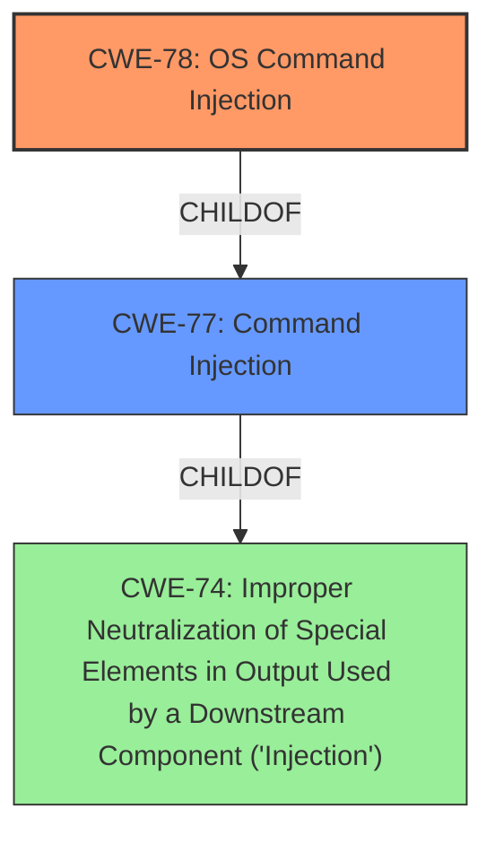

# Analysis for CVE-2020-19001

# Summary
| CWE ID | CWE Name | Confidence | CWE Abstraction Level | CWE Vulnerability Mapping Label | CWE-Vulnerability Mapping Notes |
|---|---|---|---|---|---|
| CWE-78 | Improper Neutralization of Special Elements used in an OS Command ('OS Command Injection') | 1.0 | Base | Allowed | Primary CWE |
| CWE-77 | Improper Neutralization of Special Elements used in a Command ('Command Injection') | 0.5 | Class | Allowed-with-Review | Secondary Candidate |

## Evidence and Confidence

*   **Confidence Score:** 1.0
*   **Evidence Strength:** HIGH

## Relationship Analysis
The primary relationship that influenced the decision was the parent-child relationship between CWE-77 (Class) and CWE-78 (Base). Given the specific context of OS command injection, the more specific CWE-78 was selected. CWE-77 is considered as an alternative if the command injection does not involve OS commands.

## Vulnerability Chain
The vulnerability chain starts with the **improper neutralization** of special elements within the configuration file, leading to OS command injection and ultimately allowing remote attackers to execute arbitrary system commands.

## Summary of Analysis
Initially, CWE-77 was considered due to the general description of **Command Injection**. However, the description specifically mentions "execute arbitrary system commands", which aligns perfectly with CWE-78, **Improper Neutralization of Special Elements used in an OS Command ('OS Command Injection')**. The CVE Reference Links Content Summary confirms the root cause and attack vector involving the execution of arbitrary commands via a malicious configuration file. The choice of CWE-78 is further supported by its Base level of abstraction, which is preferred for root cause analysis.

Relevant CWE Information:

# Enhanced Context (25 CWEs)

## CWE-77: Improper Neutralization of Special Elements used in a Command ('Command Injection')
**Abstraction Level**: Class
**Similarity Score**: 1.00
**Source**: Retriever Results

**Description**:
The product constructs all or part of a command using externally-influenced input from an upstream component, but it does not neutralize or incorrectly neutralizes special elements that could modify the intended command when it is sent to a downstream component.

**Mapping Guidance**:
- Usage: Allowed-with-Review
- Rationale: CWE-77 is often misused when OS command injection (CWE-78) was intended instead [REF-1287]. If the weakness involves a command language besides OS shell invocation, then CWE-77 could be used.

**Justification:**
CWE-77 is a more general case of command injection. Since the vulnerability description specifies "arbitrary system commands", it's more accurately described by the more specific CWE-78. CWE-77 is only considered because **Command Injection** is in the title of the Vulnerability Description.

## CWE-78: Improper Neutralization of Special Elements used in an OS Command ('OS Command Injection')
**Abstraction Level**: Base
**Similarity Score**: 0.70
**Source**: Retriever Results

**Description**:
The product constructs all or part of an OS command using externally-influenced input from an upstream component, but it does not neutralize or incorrectly neutralizes special elements that could modify the intended OS command when it is sent to a downstream component.

**Mapping Guidance**:
- Usage: Allowed
- Rationale: This CWE entry is at the Base level of abstraction, which is a preferred level of abstraction for mapping to the root causes of vulnerabilities.

**Justification:**
The vulnerability description clearly states that remote attackers can "execute arbitrary system commands". This aligns directly with the definition of CWE-78. The root cause, as identified in the CVE Reference Links Content Summary, is the unsafe deserialization of YAML configuration files, which allows for the injection and execution of arbitrary code.

## CWE-88: Improper Neutralization of Argument Delimiters in a Command ('Argument Injection')
**Abstraction Level**: Base
**Similarity Score**: 0.164
**Source**: Retriever Results

**Description**:
The product constructs a string for a command to be executed by a separate component in another control sphere, but it does not properly delimit the intended arguments, options, or switches within that command string.

**Mapping Guidance**:
- Usage: Allowed
- Rationale: This CWE entry is at the Base level of abstraction, which is a preferred level of abstraction for mapping to the root causes of vulnerabilities.

**Justification:**
While argument injection could potentially play a role in exploiting the command injection vulnerability, the primary weakness lies in the **improper neutralization** of special elements that allow for the execution of arbitrary system commands. Therefore, CWE-88 is not the primary CWE.

## CWE-93: Improper Neutralization of CRLF Sequences ('CRLF Injection')
**Abstraction Level**: Base
**Similarity Score**: 0.153
**Source**: Retriever Results

**Description**:
The product uses CRLF (carriage return line feeds) as a special element, e.g. to separate lines or records, but it does not neutralize or incorrectly neutralizes CRLF sequences from inputs.

**Mapping Guidance**:
- Usage: Allowed
- Rationale: This CWE entry is at the Base level of abstraction, which is a preferred level of abstraction for mapping to the root causes of vulnerabilities.

**Justification:**
CRLF injection is not directly relevant to the described vulnerability. The root cause is the **improper neutralization** of special elements in the configuration file, leading to command execution, not the **improper handling** of CRLF sequences.

## CWE-94: Improper Control of Generation of Code ('Code Injection')
**Abstraction Level**: Base
**Similarity Score**: 0.148
**Source**: Retriever Results

**Description**:
The product constructs all or part of a code segment using externally-influenced input from an upstream component, but it does not neutralize or incorrectly neutralizes special elements that could modify the syntax or behavior of the intended code segment.

**Mapping Guidance**:
- Usage: Allowed-with-Review
- Rationale: This entry is frequently misused for vulnerabilities with a technical impact of "code execution," which does not by itself indicate a root cause weakness, since dozens of weaknesses can enable code execution.

**Justification:**
While code execution is the result of the vulnerability, the root cause is the **improper neutralization** of special elements in the configuration file, which allows for the execution of arbitrary system commands. The vulnerability is more about the exploitation of command structures than code generation itself.

## CWE-96: Improper Neutralization of Directives in Statically Saved Code ('Static Code Injection')
**Abstraction Level**: Base
**Similarity Score**: 0.516
**Source**: Retriever Results

**Description**:
The product receives input from an upstream component, but it does not neutralize or incorrectly neutralizes code syntax before inserting the input into an executable resource, such as a library, configuration file, or template.

**Mapping Guidance**:
- Usage: Allowed
- Rationale: This CWE entry is at the Base level of abstraction, which is a preferred level of abstraction for mapping to the root causes of vulnerabilities.

**Justification:**
This is a good description of the **weakness**. The yaml file is a statically saved code. The attacker injects code into that static file. This is similar to the chosen CWE-78. The similarity score is not high enough to call this a primary weakness.

## CWE-117: Improper Output Neutralization for Logs
**Abstraction Level**: Base
**Similarity Score**: 0.002
**Source**: Retriever Results

**Description**:
The product does not neutralize or incorrectly neutralizes output that is written to logs.

**Mapping Guidance**:
- Usage: Allowed
- Rationale: This CWE entry is at the Base level of abstraction, which is a preferred level of abstraction for mapping to the root causes of vulnerabilities.

**Justification:**
This CWE is not relevant to the vulnerability as described. The issue is about command execution, not about **improper handling** of log data.

## CWE-790: Improper Filtering of Special Elements
**Abstraction Level**: Class
**Similarity Score**: 0.145
**Source**: Retriever Results

**Description**:
The product receives data from an upstream component, but does not filter or incorrectly filters special elements before sending it to a downstream component.

**Mapping Guidance**:
- Usage: Allowed-with-Review
- Rationale: This CWE entry is a Class and might have Base-level children that would be more appropriate

**Justification:**
This CWE is too generic. The specific issue is related to command injection, so a more specific CWE is preferred.

## CWE-1336: Improper

# Enhanced Query for CVE-2020-19001

## Vulnerability Description
**Command Injection** in Simiki v1.6.2.1 and prior allows remote attackers to execute arbitrary system commands via line 64 of the component simiki/blob/master/simiki/config.py.

### Vulnerability Description Key Phrases
- **weakness:** **Command Injection**
- **impact:** execute arbitrary system commands
- **attacker:** remote attackers
- **product:** Simiki
- **version:** v1.6.2.1 and prior
- **component:** simiki/config.py

## CVE Reference Links Content Summary
The provided content describes two vulnerabilities in Simiki <= v1.6.2.1: a Cross-Site Scripting (XSS) vulnerability and a Remote Code Execution (RCE) vulnerability.

**1. XSS Vulnerability**
*   **Root Cause:** The Jinja2 templating engine's `autoescape` setting is set to `False` by default. This allows for the injection of arbitrary HTML, including malicious JavaScript code, into generated pages.
*   **Weakness:** Improper output sanitization/encoding when rendering user-provided content.
*   **Impact:** An attacker can inject malicious JavaScript code into generated pages that will execute when a user visits the site. This could lead to session hijacking, phishing attacks, or other client-side attacks.
*   **Attack Vector:** By injecting malicious script within user-provided content when creating a new page or category through `simiki.cli`.
*   **Required Capabilities:** The attacker needs to have the ability to provide user input used within template rendering.

**2. RCE Vulnerability**
*   **Root Cause:** Use of `yaml.load()` instead of `yaml.safe_load()` when loading configuration file. `yaml.load()` is unsafe and allows for arbitrary object instantiation, enabling code execution.
*   **Weakness:** Unsafe deserialization of YAML configuration files.
*   **Impact:** An attacker can execute arbitrary code on the server when simiki loads a malicious `_config.yml` file, taking control of the server.
*   **Attack Vector:** By providing a malicious configuration file `_config.yml` containing code that will be executed.
*   **Required Capabilities:** The attacker needs to be able to replace or modify the application configuration file `_config.yml`.

The content provides detailed information about the vulnerabilities with code examples and links to the relevant parts of the source code where the issues are located.

## Retriever Results

### Top Combined Results

| Rank | CWE ID | Name | Abstraction | Usage  | Retrievers | Individual Scores |
|------|--------|------|-------------|-------|------------|-------------------|
| 1 | 77 | Improper Neutralization of Special Elements used in a Command ('Command Injection') | Class | Allowed-with-Review | alternate_terms | 1.000 |
| 2 | 78 | Improper Neutralization of Special Elements used in an OS Command ('OS Command Injection') | Base | Allowed | alternate_terms | 0.700 |
| 3 | 88 | Improper Neutralization of Argument Delimiters in a Command ('Argument Injection') | Base | Allowed | sparse | 0.164 |
| 4 | 93 | Improper Neutralization of CRLF Sequences ('CRLF Injection') | Base | Allowed | sparse | 0.153 |
| 5 | 94 | Improper Control of Generation of Code ('Code Injection') | Base | Allowed-with-Review | sparse | 0.148 |
| 6 | 96 | Improper Neutralization of Directives in Statically Saved Code ('Static Code Injection') | Base | Allowed | dense | 0.516 |
| 7 | 117 | Improper Output Neutralization for Logs | Base | Allowed | graph | 0.002 |
| 8 | 790 | Improper Filtering of Special Elements | Class | Allowed-with-Review | sparse | 0.145 |
| 9 | 1336 | Improper Neutralization of Special Elements Used in a Template Engine | Base | Allowed | sparse | 0.144 |
| 10 | 138 | Improper Neutralization of Special Elements | Class | Discouraged | sparse | 0.143 |

# Complete CWE Specifications

## CWE-77: Improper Neutralization of Special Elements used in a Command ('Command Injection')
**Abstraction:** Class
**Status:** Draft

### Description
The product constructs all or part of a command using externally-influenced input from an upstream component, but it does not neutralize or incorrectly neutralizes special elements that could modify the intended command when it is sent to a downstream component.

### Extended Description

Many protocols and products have their own custom command language. While OS or shell command strings are frequently discovered and targeted, developers may not realize that these other command languages might also be vulnerable to attacks.

### Alternative Terms
Command injection: an attack-oriented phrase for this weakness. Note: often used when "OS command injection" (CWE-78) was intended.

### Relationships
ChildOf -> CWE-74
ChildOf -> CWE-74

### Mapping Guidance
**Usage:** Allowed-with-Review
**Rationale:** CWE-77 is often misused when OS command injection (CWE-78) was intended instead [REF-1287].
**Comments:** Ensure that the analysis focuses on the root-cause error that allows the execution of commands, as there are many weaknesses that can lead to this consequence. See Terminology Notes. If the weakness involves a command language besides OS shell invocation, then CWE-77 could be used.
**Reasons:**
- Frequent Misuse
**Suggested Alternatives:**
- CWE-78: OS Command Injection

### Additional Notes
**[Terminology]** 

The "command injection" phrase carries different meanings, either as an attack or as a technical impact. The most common usage of "command injection" refers to the more-accurate OS command injection (CWE-78), but there are many command languages.

In vulnerability-focused analysis, the phrase may refer to any situation in which the adversary can execute commands of their own choosing, i.e., the focus is on the risk and/or technical impact of exploitation. Many proof-of-concept exploits focus on the ability to execute commands and may emphasize "command injection." However, there are dozens of weaknesses that can allow execution of commands. That is, the ability to execute commands could be resultant from another weakness.

To some, "command injection" can include cases in which the functionality intentionally allows the user to specify an entire command, which is then executed. In this case, the root cause weakness might be related to missing or incorrect authorization, since an adversary should not be able to specify arbitrary commands, but some users or admins are allowed.

CWE-77 and its descendants are specifically focused on behaviors in which the product is intentionally building a command to execute, and the adversary can inject separators into the command or otherwise change the command being executed.

**[Other]** 

Command injection is a common problem with wrapper programs.

### Observed Examples
- **CVE-2022-1509:** injection of sed script syntax ("sed injection")
- **CVE-2024-5184:** API service using a large generative AI model allows direct prompt injection to leak hard-coded system prompts or execute other prompts.
- **CVE-2020-11698:** anti-spam product allows injection of SNMP commands into confiuration file

## CWE-78: Improper Neutralization of Special Elements used in an OS Command ('OS Command Injection')
**Abstraction:** Base
**Status:** Stable

### Description
The product constructs all or part of an OS command using externally-influenced input from an upstream component, but it does not neutralize or incorrectly neutralizes special elements that could modify the intended OS command when it is sent to a downstream component.

### Extended Description

This weakness can lead to a vulnerability in environments in which the attacker does not have direct access to the operating system, such as in web applications. Alternately, if the weakness occurs in a privileged program, it could allow the attacker to specify commands that normally would not be accessible, or to call alternate commands with privileges that the attacker does not have. The problem is exacerbated if the compromised process does not follow the principle of least privilege, because the attacker-controlled commands may run with special system privileges that increases the amount of damage.

There are at least two subtypes of OS command injection:

  - The application intends to execute a single, fixed program that is under its own control. It intends to use externally-supplied inputs as arguments to that program. For example, the program might use system("nslookup [HOSTNAME]") to run nslookup and allow the user to supply a HOSTNAME, which is used as an argument. Attackers cannot prevent nslookup from executing. However, if the program does not remove command separators from the HOSTNAME argument, attackers could place the separators into the arguments, which allows them to execute their own program after nslookup has finished executing.

  - The application accepts an input that it uses to fully select which program to run, as well as which commands to use. The application simply redirects this entire command to the operating system. For example, the program might use "exec([COMMAND])" to execute the [COMMAND] that was supplied by the user. If the COMMAND is under attacker control, then the attacker can execute arbitrary commands or programs. If the command is being executed using functions like exec() and CreateProcess(), the attacker might not be able to combine multiple commands together in the same line.

From a weakness standpoint, these variants represent distinct programmer errors. In the first variant, the programmer clearly intends that input from untrusted parties will be part of the arguments in the command to be executed. In the second variant, the programmer does not intend for the command to be accessible to any untrusted party, but the programmer probably has not accounted for alternate ways in which malicious attackers can provide input.

### Alternative Terms
Shell injection
Shell metacharacters
OS Command Injection

### Relationships
ChildOf -> CWE-77
ChildOf -> CWE-74
ChildOf -> CWE-77
ChildOf -> CWE-77
CanAlsoBe -> CWE-88

### Mapping Guidance
**Usage:** Allowed
**Rationale:** This CWE entry is at the Base level of abstraction, which is a preferred level of abstraction for mapping to the root causes of vulnerabilities.
**Comments:** Carefully read both the name and description to ensure that this mapping is an appropriate fit. Do not try to 'force' a mapping to a lower-level Base/Variant simply to comply with this preferred level of abstraction.
**Reasons:**
- Acceptable-Use

### Additional Notes
**[Terminology]** The "OS command injection" phrase carries different meanings to different people. For some people, it only refers to cases in which the attacker injects command separators into arguments for an application-controlled program that is being invoked. For some people, it refers to any type of attack that can allow the attacker to execute OS commands of their own choosing. This usage could include untrusted search path weaknesses (CWE-426) that cause the application to find and execute an attacker-controlled program. Further complicating the issue is the case when argument injection (CWE-88) allows alternate command-line switches or options to be inserted into the command line, such as an "-exec" switch whose purpose may be to execute the subsequent argument as a command (this -exec switch exists in the UNIX "find" command, for example). In this latter case, however, CWE-88 could be regarded as the primary weakness in a chain with CWE-78.

**[Research Gap]** More investigation is needed into the distinction between the OS command injection variants, including the role with argument injection (CWE-88). Equivalent distinctions may exist in other injection-related problems such as SQL injection.

### Observed Examples
- **CVE-2020-10987:** OS command injection in Wi-Fi router, as exploited in the wild per CISA KEV.
- **CVE-2020-10221:** Template functionality in network configuration management tool allows OS command injection, as exploited in the wild per CISA KEV.
- **CVE-2020-9054:** Chain: improper input validation (CWE-20) in username parameter, leading to OS command injection (CWE-78), as exploited in the wild per CISA KEV.

## CWE-88: Improper Neutralization of Argument Delimiters in a Command ('Argument Injection')
**Abstraction:** Base
**Status:** Draft

### Description
The product constructs a string for a command to be executed by a separate component
in another control sphere, but it does not properly delimit the
intended arguments, options, or switches within that command string.

### Extended Description

When creating commands using interpolation into a string, developers may assume that only the arguments/options that they specify will be processed. This assumption may be even stronger when the programmer has encoded the command in a way that prevents separate commands from being provided maliciously, e.g. in the case of shell metacharacters. When constructing the command, the developer may use whitespace or other delimiters that are required to separate arguments when the command. However, if an attacker can provide an untrusted input that contains argument-separating delimiters, then the resulting command will have more arguments than intended by the developer. The attacker may then be able to change the behavior of the command. Depending on the functionality supported by the extraneous arguments, this may have security-relevant consequences.

### Alternative Terms
None

### Relationships
ChildOf -> CWE-77
ChildOf -> CWE-74
ChildOf -> CWE-77
ChildOf -> CWE-77

### Mapping Guidance
**Usage:** Allowed
**Rationale:** This CWE entry is at the Base level of abstraction, which is a preferred level of abstraction for mapping to the root causes of vulnerabilities.
**Comments:** Carefully read both the name and description to ensure that this mapping is an appropriate fit. Do not try to 'force' a mapping to a lower-level Base/Variant simply to comply with this preferred level of abstraction.
**Reasons:**
- Acceptable-Use

### Additional Notes
**[Relationship]** At one layer of abstraction, this can overlap other weaknesses that have whitespace problems, e.g. injection of javascript into attributes of HTML tags.

### Observed Examples
- **CVE-2022-36069:** Python-based dependency management tool avoids OS command injection when generating Git commands but allows injection of optional arguments with input beginning with a dash (CWE-88), potentially allowing for code execution.
- **CVE-1999-0113:** Canonical Example - "-froot" argument is passed on to another program, where the "-f" causes execution as user "root"
- **CVE-2001-0150:** Web browser executes Telnet sessions using command line arguments that are specified by the web site, which could allow remote attackers to execute arbitrary commands.

## CWE-93: Improper Neutralization of CRLF Sequences ('CRLF Injection')
**Abstraction:** Base
**Status:** Draft

### Description
The product uses CRLF (carriage return line feeds) as a special element, e.g. to separate lines or records, but it does not neutralize or incorrectly neutralizes CRLF sequences from inputs.

### Extended Description
Not provided

### Alternative Terms
None

### Relationships
ChildOf -> CWE-74
CanPrecede -> CWE-117

### Mapping Guidance
**Usage:** Allowed
**Rationale:** This CWE entry is at the Base level of abstraction, which is a preferred level of abstraction for mapping to the root causes of vulnerabilities.
**Comments:** Carefully read both the name and description to ensure that this mapping is an appropriate fit. Do not try to 'force' a mapping to a lower-level Base/Variant simply to comply with this preferred level of abstraction.
**Reasons:**
- Acceptable-Use

### Observed Examples
- **CVE-2002-1771:** CRLF injection enables spam proxy (add mail headers) using email address or name.
- **CVE-2002-1783:** CRLF injection in API function arguments modify headers for outgoing requests.
- **CVE-2004-1513:** Spoofed entries in web server log file via carriage returns

## CWE-94: Improper Control of Generation of Code ('Code Injection')
**Abstraction:** Base
**Status:** Draft

### Description
The product constructs all or part of a code segment using externally-influenced input from an upstream component, but it does not neutralize or incorrectly neutralizes special elements that could modify the syntax or behavior of the intended code segment.

### Extended Description

When a product allows a user's input to contain code syntax, it might be possible for an attacker to craft the code in such a way that it will alter the intended control flow of the product. Such an alteration could lead to arbitrary code execution.

Injection problems encompass a wide variety of issues -- all mitigated in very different ways. For this reason, the most effective way to discuss these weaknesses is to note the distinct features which classify them as injection weaknesses. The most important issue to note is that all injection problems share one thing in common -- i.e., they allow for the injection of control plane data into the user-controlled data plane. This means that the execution of the process may be altered by sending code in through legitimate data channels, using no other mechanism. While buffer overflows, and many other flaws, involve the use of some further issue to gain execution, injection problems need only for the data to be parsed. The most classic instantiations of this category of weakness are SQL injection and format string vulnerabilities.

### Alternative Terms
None

### Relationships
ChildOf -> CWE-74
ChildOf -> CWE-74
ChildOf -> CWE-913

### Mapping Guidance
**Usage:** Allowed-with-Review
**Rationale:** This entry is frequently misused for vulnerabilities with a technical impact of "code execution," which does not by itself indicate a root cause weakness, since dozens of weaknesses can enable code execution.
**Comments:** This weakness only applies when the product's functionality intentionally constructs all or part of a code segment. It could be that executing code could be the result of other weaknesses that do not involve the construction of code segments.
**Reasons:**
- Frequent Misuse
- Frequent Misinterpretation

### Observed Examples
- **CVE-2023-29374:** Math component in an LLM framework translates user input into a Python expression that is input into the Python exec() method, allowing code execution - one variant of a "prompt injection" attack.
- **CVE-2024-5565:** Python-based library uses an LLM prompt containing user input to dynamically generate code that is then fed as input into the Python exec() method, allowing code execution - one variant of a "prompt injection" attack.
- **CVE-2024-4181:** Framework for LLM applications allows eval injection via a crafted response from a hosting provider.

## CWE-96: Improper Neutralization of Directives in Statically Saved Code ('Static Code Injection')
**Abstraction:** Base
**Status:** Draft

### Description
The product receives input from an upstream component, but it does not neutralize or incorrectly neutralizes code syntax before inserting the input into an executable resource, such as a library, configuration file, or template.

### Extended Description
Not provided

### Alternative Terms
None

### Relationships
ChildOf -> CWE-94

### Mapping Guidance
**Usage:** Allowed
**Rationale:** This CWE entry is at the Base level of abstraction, which is a preferred level of abstraction for mapping to the root causes of vulnerabilities.
**Comments:** Carefully read both the name and description to ensure that this mapping is an appropriate fit. Do not try to 'force' a mapping to a lower-level Base/Variant simply to comply with this preferred level of abstraction.
**Reasons:**
- Acceptable-Use

### Additional Notes
**[Relationship]** "HTML injection" (see CWE-79: XSS) could be thought of as an example of this, but the code is injected and executed on the client side, not the server side. Server-Side Includes (SSI) are an example of direct static code injection.

### Observed Examples
- **CVE-2002-0495:** Perl code directly injected into CGI library file from parameters to another CGI program.
- **CVE-2005-1876:** Direct PHP code injection into supporting template file.
- **CVE-2005-1894:** Direct code injection into PHP script that can be accessed by attacker.

## CWE-117: Improper Output Neutralization for Logs
**Abstraction:** Base
**Status:** Draft

### Description
The product does not neutralize or incorrectly neutralizes output that is written to logs.

### Extended Description

This can allow an attacker to forge log entries or inject malicious content into logs.

Log forging vulnerabilities occur when:

  1. Data enters an application from an untrusted source.

  1. The data is written to an application or system log file.

### Alternative Terms
None

### Relationships
ChildOf -> CWE-116
ChildOf -> CWE-20

### Mapping Guidance
**Usage:** Allowed
**Rationale:** This CWE entry is at the Base level of abstraction, which is a preferred level of abstraction for mapping to the root causes of vulnerabilities.
**Comments:** Carefully read both the name and description to ensure that this mapping is an appropriate fit. Do not try to 'force' a mapping to a lower-level Base/Variant simply to comply with this preferred level of abstraction.
**Reasons:**
- Acceptable-Use

### Observed Examples
- **CVE-2006-4624:** Chain: inject fake log entries with fake timestamps using CRLF injection

## CWE-790: Improper Filtering of Special Elements
**Abstraction:** Class
**Status:** Incomplete

### Description
The product receives data from an upstream component, but does not filter or incorrectly filters special elements before sending it to a downstream component.

### Extended Description
Not provided

### Alternative Terms
None

### Relationships
ChildOf -> CWE-138

### Mapping Guidance
**Usage:** Allowed-with-Review
**Rationale:** This CWE entry is a Class and might have Base-level children that would be more appropriate
**Comments:** Examine children of this entry to see if there is a better fit
**Reasons:**
- Abstraction

## CWE-1336: Improper Neutralization of Special Elements Used in a Template Engine
**Abstraction:** Base
**Status:** Incomplete

### Description
The product uses a template engine to insert or process externally-influenced input, but it does not neutralize or incorrectly neutralizes special elements or syntax that can be interpreted as template expressions or other code directives when processed by the engine.

### Extended Description

Many web applications use template engines that allow developers to insert externally-influenced values into free text or messages in order to generate a full web page, document, message, etc. Such engines include Twig, Jinja2, Pug, Java Server Pages, FreeMarker, Velocity, ColdFusion, Smarty, and many others - including PHP itself. Some CMS (Content Management Systems) also use templates.

Template engines often have their own custom command or expression language. If an attacker can influence input into a template before it is processed, then the attacker can invoke arbitrary expressions, i.e. perform injection attacks. For example, in some template languages, an attacker could inject the expression "{{7*7}}" and determine if the output returns "49" instead. The syntax varies depending on the language.

In some cases, XSS-style attacks can work, which can obscure the root cause if the developer does not closely investigate the root cause of the error.

Template engines can be used on the server or client, so both "sides" could be affected by injection. The mechanisms of attack or the affected technologies might be different, but the mistake is fundamentally the same.

### Alternative Terms
Server-Side Template Injection / SSTI: This term is used for injection into template engines being used by a server.
Client-Side Template Injection / CSTI: This term is used for injection into template engines being used by a client.

### Relationships
ChildOf -> CWE-94

### Mapping Guidance
**Usage:** Allowed
**Rationale:** This CWE entry is at the Base level of abstraction, which is a preferred level of abstraction for mapping to the root causes of vulnerabilities.
**Comments:** Carefully read both the name and description to ensure that this mapping is an appropriate fit. Do not try to 'force' a mapping to a lower-level Base/Variant simply to comply with this preferred level of abstraction.
**Reasons:**
- Acceptable-Use

### Additional Notes
**[Relationship]** Since expression languages are often used in templating languages, there may be some overlap with CWE-917 (Expression Language Injection). XSS (CWE-79) is also co-located with template injection.

**[Maintenance]** The interrelationships and differences between CWE-917 and CWE-1336 need to be further clarified.

### Observed Examples
- **CVE-2024-34359:** Chain: Python bindings for LLM library do not use a sandboxed environment when parsing a template and constructing a prompt, allowing jinja2 Server Side Template Injection and code execution - one variant of a "prompt injection" attack.
- **CVE-2017-16783:** server-side template injection in content management server
- **CVE-2020-9437:** authentication / identity management product has client-side template injection

## CWE-138: Improper Neutralization of Special Elements
**Abstraction:** Class
**Status:** Draft

### Description
The product receives input from an upstream component, but it does not neutralize or incorrectly neutralizes special elements that could be interpreted as control elements or syntactic markers when they are sent to a downstream component.

### Extended Description
Most languages and protocols have their own special elements such as characters and reserved words. These special elements can carry control implications. If product does not prevent external control or influence over the inclusion of such special elements, the control flow of the program may be altered from what was intended. For example, both Unix and Windows interpret the symbol < ("less than") as meaning "read input from a file".

### Alternative Terms
None

### Relationships
ChildOf -> CWE-707

### Mapping Guidance
**Usage:** Discouraged
**Rationale:** This CWE entry is a level-1 Class (i.e., a child of a Pillar). It might have lower-level children that would be more appropriate
**Comments:** Examine children of this entry to see if there is a better fit
**Reasons:**
- Abstraction

### Additional Notes
**[Relationship]** This weakness can be related to interpretation conflicts or interaction errors in intermediaries (such as proxies or application firewalls) when the intermediary's model of an endpoint does not account for protocol-specific special elements.

**[Relationship]** See this entry's children for different types of special elements that have been observed at one point or another. However, it can be difficult to find suitable CVE examples. In an attempt to be complete, CWE includes some types that do not have any associated observed example.

**[Research Gap]** This weakness is probably under-studied for proprietary or custom formats. It is likely that these issues are fairly common in applications that use their own custom format for configuration files, logs, meta-data, messaging, etc. They would only be found by accident or with a focused effort based on an understanding of the format.

### Observed Examples
- **CVE-2001-0677:** Read arbitrary files from mail client by providing a special MIME header that is internally used to store pathnames for attachments.
- **CVE-2000-0703:** Setuid program does not cleanse special escape sequence before sending data to a mail program, causing the mail program to process those sequences.
- **CVE-2003-0020:** Multi-channel issue. Terminal escape sequences not filtered from log files.

