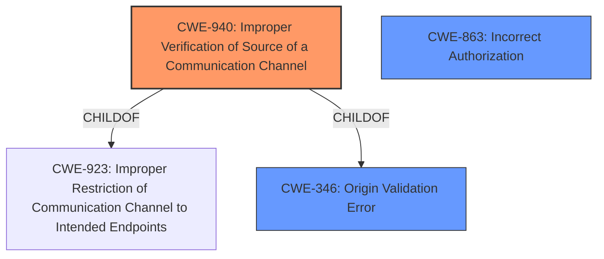

# Enhanced Analysis for CVE-2020-19003

# Summary
| CWE ID  | CWE Name                                                                                                | Confidence | CWE Abstraction Level | CWE Vulnerability Mapping Label | CWE-Vulnerability Mapping Notes |
| :-------- | :-------------------------------------------------------------------------------------------------------- | :--------- | :---------------------- | :------------------------------ | :------------------------------ |
| CWE-940  | Improper Verification of Source of a Communication Channel                                                | 0.95       | Base                    | Primary                         | Allowed                       |
| CWE-346 | Origin Validation Error | 0.75       | Class                    | Secondary                         | Allowed-with-Review                       |
| CWE-863 | Incorrect Authorization | 0.65       | Class                    | Secondary                         | Allowed-with-Review                       |

## Evidence and Confidence

*   **Confidence Score:** 0.85
*   **Evidence Strength:** HIGH

## Relationship Analysis
The primary CWE is CWE-940, which is a base-level CWE and a child of CWE-923 and CWE-346. CWE-346 is a class-level CWE and parent of CWE-940. The relationship highlights the progression from a general origin validation problem (CWE-346) to the specific case of improper verification in a communication channel (CWE-940). CWE-863 is included as the bypass leads to incorrect authorization since the connection is allowed, but should not be.



## Vulnerability Chain
The vulnerability chain starts with the **incorrect** handling of "localhost" by Gate One, leading to a bypass of the origin whitelist. This bypass results in unauthorized access to the Gate One server, granting access to terminal functionality and remote code execution.
  - **Root Cause:** **Incorrect** handling of "localhost" during origin validation.
  - **Weakness:** Bypass of origin whitelist due to string comparison instead of proper IP resolution.
  - **Impact:** Unauthorized access, potential data breach, system compromise.

## Summary of Analysis
The initial analysis considered the retriever results and the vulnerability description. The final conclusion is that CWE-940 is the most appropriate because it directly addresses the **improper verification of the source of a communication channel.** The evidence for this is that Gate One fails to correctly resolve "localhost" to its IP address, leading to a bypass of the `origins` whitelist.

The selection of CWE-940 is based on the "CVE Reference Links Content Summary" section, which indicates that the **vulnerability stems from the way Gate One verifies the origin of incoming connections.** This is further supported by the fact that Gate One recognizes "localhost" as a string instead of resolving it to an IP address. This evidence directly aligns with the description of CWE-940, which states that "the product establishes a communication channel...but it does not properly verify that the request is coming from the expected origin."

CWE-346, a parent of CWE-940, was considered but deemed less specific. While the vulnerability does involve an origin validation error, CWE-940 captures the specific context of a communication channel being established from an unexpected origin. CWE-863 was considered because the successful bypass leads to incorrect authorization, allowing access when it should be denied.

The selected CWEs are at the optimal level of specificity because they directly describe the **root cause** and the immediate consequence of the vulnerability. CWE-940 accurately represents the technical flaw in the origin validation process, and CWE-863 highlights the resulting authorization bypass.

Relevant CWE Information:

# Enhanced Context (25 CWEs)
The following CWEs were identified as potentially relevant to this vulnerability:

## CWE-184: Incomplete List of Disallowed Inputs
**Abstraction Level**: Base
**Similarity Score**: 0.80
**Source**: dense

**Description**:
The product implements a protection mechanism that relies on a list of inputs (or properties of inputs) that are not allowed by policy or otherwise require other action to neutralize before additional processing takes place, but the list is incomplete.

**Mapping Guidance**:
- Usage: Allowed
- Rationale: This CWE entry is at the Base level of abstraction, which is a preferred level of abstraction for mapping to the root causes of vulnerabilities.

## CWE-183: Permissive List of Allowed Inputs
**Abstraction Level**: Base
**Similarity Score**: 0.80
**Source**: dense

**Description**:
The product implements a protection mechanism that relies on a list of inputs (or properties of inputs) that are explicitly allowed by policy because the inputs are assumed to be safe, but the list is too permissive - that is, it allows an input that is unsafe, leading to resultant weaknesses.

**Mapping Guidance**:
- Usage: Allowed
- Rationale: This CWE entry is at the Base level of abstraction, which is a preferred level of abstraction for mapping to the root causes of vulnerabilities.

## CWE-1289: Improper Validation of Unsafe Equivalence in Input
**Abstraction Level**: Base
**Similarity Score**: 0.79
**Source**: dense

**Description**:
The product receives an input value that is used as a resource identifier or other type of reference, but it does not validate or incorrectly validates that the input is equivalent to a potentially-unsafe value.

**Mapping Guidance**:
- Usage: Allowed
- Rationale: This CWE entry is at the Base level of abstraction, which is a preferred level of abstraction for mapping to the root causes of vulnerabilities.

## CWE-807: Reliance on Untrusted Inputs in a Security Decision
**Abstraction Level**: Base
**Similarity Score**: 0.79
**Source**: dense

**Description**:
The product uses a protection mechanism that relies on the existence or values of an input, but the input can be modified by an untrusted actor in a way that bypasses the protection mechanism.

**Mapping Guidance**:
- Usage: Allowed
- Rationale: This CWE entry is at the Base level of abstraction, which is a preferred level of abstraction for mapping to the root causes of vulnerabilities.

## CWE-41: Improper Resolution of Path Equivalence
**Abstraction Level**: Base
**Similarity Score**: 0.76
**Source**: dense

**Description**:
The product is vulnerable to file system contents disclosure through path equivalence. Path equivalence involves the use of special characters in file and directory names. The associated manipulations are intended to generate multiple names for the same object.

**Mapping Guidance**:
- Usage: Allowed
- Rationale: This CWE entry is at the Base level of abstraction, which is a preferred level of abstraction for mapping to the root causes of vulnerabilities.

## CWE-303: Incorrect Implementation of Authentication Algorithm
**Abstraction Level**: Base
**Similarity Score**: 0.76
**Source**: dense

**Description**:
The requirements for the product dictate the use of an established authentication algorithm, but the implementation of the algorithm is incorrect.

**Mapping Guidance**:
- Usage: Allowed
- Rationale: This CWE entry is at the Base level of abstraction, which is a preferred level of abstraction for mapping to the root causes of vulnerabilities.

## CWE-345: Insufficient Verification of Data Authenticity
**Abstraction Level**: Class
**Similarity Score**: 0.76
**Source**: dense

**Description**:
The product does not sufficiently verify the origin or authenticity of data, in a way that causes it to accept invalid data.

**Mapping Guidance**:
- Usage: Discouraged
- Rationale: This CWE entry is a level-1 Class (i.e., a child of a Pillar). It might have lower-level children that would be more appropriate

## CWE-1390: Weak Authentication
**Abstraction Level**: Class
**Similarity Score**: 0.76
**Source**: dense

**Description**:
The product uses an authentication mechanism to restrict access to specific users or identities, but the mechanism does not sufficiently prove that the claimed identity is correct.

**Mapping Guidance**:
- Usage: Allowed-with-Review
- Rationale: This CWE entry is a Class and might have Base-level children that would be more appropriate

## CWE-668: Exposure of Resource to Wrong Sphere
**Abstraction Level**: Class
**Similarity Score**: 0.76
**Source**: dense

**Description**:
The product exposes a resource to the wrong control sphere, providing unintended actors with inappropriate access to the resource.

**Mapping Guidance**:
- Usage: Discouraged
- Rationale: CWE-668 is high-level and is often misused as a catch-all when lower-level CWE IDs might be


## CWE Relationship Analysis

Current CWEs represent these abstraction levels: .


### Vulnerability Chain Analysis

**Chain starting from CWE-303:**
- 303 (Incorrect Implementation of Authentication Algorithm) - ROOT


**Chain starting from CWE-940:**
- 940 (Improper Verification of Source of a Communication Channel) - ROOT


### CWE Relationship Diagram

```mermaid
graph TD
    classDef primary fill:#f96,stroke:#333,stroke-width:2px
    classDef secondary fill:#69f,stroke:#333
    classDef tertiary fill:#9e9,stroke:#333
```