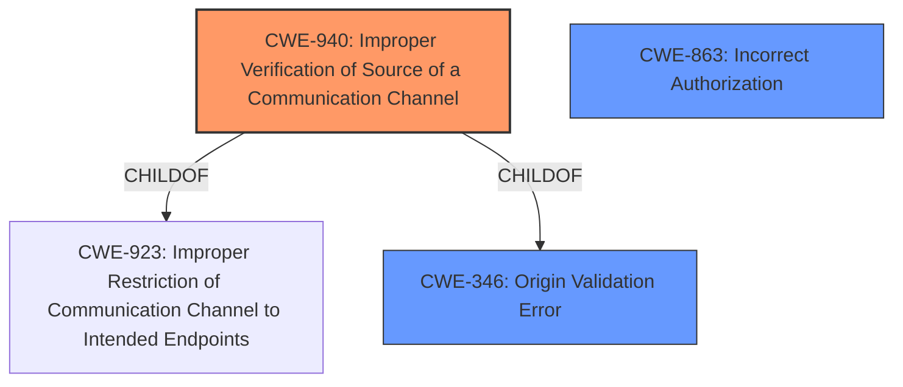

# Analysis for CVE-2020-19003

# Summary
| CWE ID  | CWE Name                                                                                                | Confidence | CWE Abstraction Level | CWE Vulnerability Mapping Label | CWE-Vulnerability Mapping Notes |
| :-------- | :-------------------------------------------------------------------------------------------------------- | :--------- | :---------------------- | :------------------------------ | :------------------------------ |
| CWE-940  | Improper Verification of Source of a Communication Channel                                                | 0.95       | Base                    | Primary                         | Allowed                       |
| CWE-346 | Origin Validation Error | 0.75       | Class                    | Secondary                         | Allowed-with-Review                       |
| CWE-863 | Incorrect Authorization | 0.65       | Class                    | Secondary                         | Allowed-with-Review                       |

## Evidence and Confidence

*   **Confidence Score:** 0.85
*   **Evidence Strength:** HIGH

## Relationship Analysis
The primary CWE is CWE-940, which is a base-level CWE and a child of CWE-923 and CWE-346. CWE-346 is a class-level CWE and parent of CWE-940. The relationship highlights the progression from a general origin validation problem (CWE-346) to the specific case of improper verification in a communication channel (CWE-940). CWE-863 is included as the bypass leads to incorrect authorization since the connection is allowed, but should not be.

## Vulnerability Chain
The vulnerability chain starts with the **incorrect** handling of "localhost" by Gate One, leading to a bypass of the origin whitelist. This bypass results in unauthorized access to the Gate One server, granting access to terminal functionality and remote code execution.
  - **Root Cause:** **Incorrect** handling of "localhost" during origin validation.
  - **Weakness:** Bypass of origin whitelist due to string comparison instead of proper IP resolution.
  - **Impact:** Unauthorized access, potential data breach, system compromise.

## Summary of Analysis
The initial analysis considered the retriever results and the vulnerability description. The final conclusion is that CWE-940 is the most appropriate because it directly addresses the **improper verification of the source of a communication channel.** The evidence for this is that Gate One fails to correctly resolve "localhost" to its IP address, leading to a bypass of the `origins` whitelist.

The selection of CWE-940 is based on the "CVE Reference Links Content Summary" section, which indicates that the **vulnerability stems from the way Gate One verifies the origin of incoming connections.** This is further supported by the fact that Gate One recognizes "localhost" as a string instead of resolving it to an IP address. This evidence directly aligns with the description of CWE-940, which states that "the product establishes a communication channel...but it does not properly verify that the request is coming from the expected origin."

CWE-346, a parent of CWE-940, was considered but deemed less specific. While the vulnerability does involve an origin validation error, CWE-940 captures the specific context of a communication channel being established from an unexpected origin. CWE-863 was considered because the successful bypass leads to incorrect authorization, allowing access when it should be denied.

The selected CWEs are at the optimal level of specificity because they directly describe the **root cause** and the immediate consequence of the vulnerability. CWE-940 accurately represents the technical flaw in the origin validation process, and CWE-863 highlights the resulting authorization bypass.

Relevant CWE Information:

# Enhanced Context (25 CWEs)
The following CWEs were identified as potentially relevant to this vulnerability:

## CWE-184: Incomplete List of Disallowed Inputs
**Abstraction Level**: Base
**Similarity Score**: 0.80
**Source**: dense

**Description**:
The product implements a protection mechanism that relies on a list of inputs (or properties of inputs) that are not allowed by policy or otherwise require other action to neutralize before additional processing takes place, but the list is incomplete.

**Mapping Guidance**:
- Usage: Allowed
- Rationale: This CWE entry is at the Base level of abstraction, which is a preferred level of abstraction for mapping to the root causes of vulnerabilities.

## CWE-183: Permissive List of Allowed Inputs
**Abstraction Level**: Base
**Similarity Score**: 0.80
**Source**: dense

**Description**:
The product implements a protection mechanism that relies on a list of inputs (or properties of inputs) that are explicitly allowed by policy because the inputs are assumed to be safe, but the list is too permissive - that is, it allows an input that is unsafe, leading to resultant weaknesses.

**Mapping Guidance**:
- Usage: Allowed
- Rationale: This CWE entry is at the Base level of abstraction, which is a preferred level of abstraction for mapping to the root causes of vulnerabilities.

## CWE-1289: Improper Validation of Unsafe Equivalence in Input
**Abstraction Level**: Base
**Similarity Score**: 0.79
**Source**: dense

**Description**:
The product receives an input value that is used as a resource identifier or other type of reference, but it does not validate or incorrectly validates that the input is equivalent to a potentially-unsafe value.

**Mapping Guidance**:
- Usage: Allowed
- Rationale: This CWE entry is at the Base level of abstraction, which is a preferred level of abstraction for mapping to the root causes of vulnerabilities.

## CWE-807: Reliance on Untrusted Inputs in a Security Decision
**Abstraction Level**: Base
**Similarity Score**: 0.79
**Source**: dense

**Description**:
The product uses a protection mechanism that relies on the existence or values of an input, but the input can be modified by an untrusted actor in a way that bypasses the protection mechanism.

**Mapping Guidance**:
- Usage: Allowed
- Rationale: This CWE entry is at the Base level of abstraction, which is a preferred level of abstraction for mapping to the root causes of vulnerabilities.

## CWE-41: Improper Resolution of Path Equivalence
**Abstraction Level**: Base
**Similarity Score**: 0.76
**Source**: dense

**Description**:
The product is vulnerable to file system contents disclosure through path equivalence. Path equivalence involves the use of special characters in file and directory names. The associated manipulations are intended to generate multiple names for the same object.

**Mapping Guidance**:
- Usage: Allowed
- Rationale: This CWE entry is at the Base level of abstraction, which is a preferred level of abstraction for mapping to the root causes of vulnerabilities.

## CWE-303: Incorrect Implementation of Authentication Algorithm
**Abstraction Level**: Base
**Similarity Score**: 0.76
**Source**: dense

**Description**:
The requirements for the product dictate the use of an established authentication algorithm, but the implementation of the algorithm is incorrect.

**Mapping Guidance**:
- Usage: Allowed
- Rationale: This CWE entry is at the Base level of abstraction, which is a preferred level of abstraction for mapping to the root causes of vulnerabilities.

## CWE-345: Insufficient Verification of Data Authenticity
**Abstraction Level**: Class
**Similarity Score**: 0.76
**Source**: dense

**Description**:
The product does not sufficiently verify the origin or authenticity of data, in a way that causes it to accept invalid data.

**Mapping Guidance**:
- Usage: Discouraged
- Rationale: This CWE entry is a level-1 Class (i.e., a child of a Pillar). It might have lower-level children that would be more appropriate

## CWE-1390: Weak Authentication
**Abstraction Level**: Class
**Similarity Score**: 0.76
**Source**: dense

**Description**:
The product uses an authentication mechanism to restrict access to specific users or identities, but the mechanism does not sufficiently prove that the claimed identity is correct.

**Mapping Guidance**:
- Usage: Allowed-with-Review
- Rationale: This CWE entry is a Class and might have Base-level children that would be more appropriate

## CWE-668: Exposure of Resource to Wrong Sphere
**Abstraction Level**: Class
**Similarity Score**: 0.76
**Source**: dense

**Description**:
The product exposes a resource to the wrong control sphere, providing unintended actors with inappropriate access to the resource.

**Mapping Guidance**:
- Usage: Discouraged
- Rationale: CWE-668 is high-level and is often misused as a catch-all when lower-level CWE IDs might be

# Enhanced Query for CVE-2020-19003

## Vulnerability Description
An issue in Gate One 1.2.0 allows attackers to bypass to the verification check done by the origins list and connect to Gate One instances used by hosts not on the origins list.

### Vulnerability Description Key Phrases
- **impact:** bypass to the verification check done by the origins list and connect to Gate One instances used by hosts not on the origins list
- **attacker:** attackers
- **product:** Gate One
- **version:** 1.2.0

## CVE Reference Links Content Summary
Based on the provided content, here's an analysis of the vulnerability:

**Root Cause:**

The vulnerability stems from the way Gate One verifies the origin of incoming connections when using API authentication. Specifically, when a client connects from "localhost", Gate One recognizes it as the string "localhost" instead of resolving it to the actual IP address of the connecting host. This allows an attacker to bypass the configured whitelist of allowed origins.

**Weaknesses/Vulnerabilities:**

*   **Inadequate Origin Validation:** The primary weakness is that Gate One's origin validation mechanism does not correctly resolve "localhost" to its corresponding IP address during authentication checks.
*   **Reliance on String Matching:** The origin check appears to rely on a simple string comparison against the whitelist, rather than proper hostname resolution and IP address verification.
*   **Bypass of "origins" Whitelist:** The vulnerability allows an attacker to circumvent the `origins` whitelist, a security feature designed to restrict which hosts can connect to the Gate One server.

**Impact of Exploitation:**

*   **Unauthorized Access:** An attacker, whose IP is not included in the `origins` whitelist, can gain access to the Gate One server. This grants access to the terminal functionality and remote code execution.
*   **Potential Data Breach:** Depending on the attacker's actions, this access could lead to data breaches, malware installation, system compromise or other malicious activities.
*   **Compromise of Target Machine:** The attacker can remotely interact with the target system through the terminal, allowing them to carry out malicious activities.

**Attack Vectors:**

*   **Network Access:** The attacker needs network access to the Gate One server.
*   **Web Browser:** The attack is carried out by loading a malicious HTML page that connects to the Gate One service.
*   **Exploiting "localhost" as Origin:** The attacker needs to host a page on their machine and connect to Gate One using “localhost” as the origin. The specific mechanism exploits the vulnerability by utilizing localhost to connect to the Gate One instance, thus bypassing the whitelist.

**Required Attacker Capabilities/Position:**

*   **Network Connectivity:** The attacker must be able to reach the Gate One server over the network.
*   **Hosting HTTP server:** The attacker must be able to host an HTTP server on the attacker machine to serve the malicious HTML.
*   **API Keys:** The attacker needs valid Gate One API keys to successfully authenticate and connect to the server.

**Summary of Attack Steps:**
1. The attacker sets up an HTTP server on their machine (Attacker Host A) to host a malicious HTML file `gateone.html`.
2. This HTML file uses JavaScript to connect to the target Gate One server using “localhost” as the origin.
3.  The Gate One server incorrectly identifies the connection origin as "localhost," bypassing the origin whitelist.
4.  After a successful bypass of the origin whitelist, the attacker is able to gain access to the Gate One server.
5. The attacker can interact with the Gate One service, gaining access to a terminal on the target machine.

This detailed analysis provides a clearer picture of the vulnerability beyond the basic description, highlighting the specific attack vector and required conditions for exploitation.

## Retriever Results

### Top Combined Results

| Rank | CWE ID | Name | Abstraction | Usage  | Retrievers | Individual Scores |
|------|--------|------|-------------|-------|------------|-------------------|
| 1 | 290 | Authentication Bypass by Spoofing | Base | Allowed | sparse | 0.100 |
| 2 | 347 | Improper Verification of Cryptographic Signature | Base | Allowed | sparse | 0.065 |
| 3 | 863 | Incorrect Authorization | Class | Allowed-with-Review | sparse | 0.065 |
| 4 | 345 | Insufficient Verification of Data Authenticity | Class | Discouraged | sparse | 0.065 |
| 5 | 346 | Origin Validation Error | Class | Allowed-with-Review | sparse | 0.065 |
| 6 | 940 | Improper Verification of Source of a Communication Channel | Base | Allowed | dense | 0.520 |
| 7 | 352 | Cross-Site Request Forgery (CSRF) | Compound | Allowed | graph | 0.002 |
| 8 | 287 | Improper Authentication | Class | Discouraged | sparse | 0.064 |
| 9 | 306 | Missing Authentication for Critical Function | Base | Allowed | sparse | 0.063 |
| 10 | 184 | Incomplete List of Disallowed Inputs | Base | Allowed | sparse | 0.063 |

# Complete CWE Specifications

## CWE-290: Authentication Bypass by Spoofing
**Abstraction:** Base
**Status:** Incomplete

### Description
This attack-focused weakness is caused by incorrectly implemented authentication schemes that are subject to spoofing attacks.

### Extended Description
Not provided

### Alternative Terms
None

### Relationships
ChildOf -> CWE-1390
ChildOf -> CWE-287

### Mapping Guidance
**Usage:** Allowed
**Rationale:** This CWE entry is at the Base level of abstraction, which is a preferred level of abstraction for mapping to the root causes of vulnerabilities.
**Comments:** Carefully read both the name and description to ensure that this mapping is an appropriate fit. Do not try to 'force' a mapping to a lower-level Base/Variant simply to comply with this preferred level of abstraction.
**Reasons:**
- Acceptable-Use

### Additional Notes
**[Relationship]** This can be resultant from insufficient verification.

### Observed Examples
- **CVE-2022-30319:** S-bus functionality in a home automation product performs access control using an IP allowlist, which can be bypassed by a forged IP address.
- **CVE-2009-1048:** VOIP product allows authentication bypass using 127.0.0.1 in the Host header.

## CWE-347: Improper Verification of Cryptographic Signature
**Abstraction:** Base
**Status:** Draft

### Description
The product does not verify, or incorrectly verifies, the cryptographic signature for data.

### Extended Description
Not provided

### Alternative Terms
None

### Relationships
ChildOf -> CWE-345
ChildOf -> CWE-345

### Mapping Guidance
**Usage:** Allowed
**Rationale:** This CWE entry is at the Base level of abstraction, which is a preferred level of abstraction for mapping to the root causes of vulnerabilities.
**Comments:** Carefully read both the name and description to ensure that this mapping is an appropriate fit. Do not try to 'force' a mapping to a lower-level Base/Variant simply to comply with this preferred level of abstraction.
**Reasons:**
- Acceptable-Use

### Observed Examples
- **CVE-2002-1796:** Does not properly verify signatures for "trusted" entities.
- **CVE-2005-2181:** Insufficient verification allows spoofing.
- **CVE-2005-2182:** Insufficient verification allows spoofing.

## CWE-863: Incorrect Authorization
**Abstraction:** Class
**Status:** Incomplete

### Description
The product performs an authorization check when an actor attempts to access a resource or perform an action, but it does not correctly perform the check.

### Extended Description
Not provided

### Alternative Terms
AuthZ: "AuthZ" is typically used as an abbreviation of "authorization" within the web application security community. It is distinct from "AuthN" (or, sometimes, "AuthC") which is an abbreviation of "authentication." The use of "Auth" as an abbreviation is discouraged, since it could be used for either authentication or authorization.

### Relationships
ChildOf -> CWE-285
ChildOf -> CWE-284

### Mapping Guidance
**Usage:** Allowed-with-Review
**Rationale:** This CWE entry is a Class and might have Base-level children that would be more appropriate
**Comments:** Examine children of this entry to see if there is a better fit
**Reasons:**
- Abstraction

### Additional Notes
**[Terminology]** 

Assuming a user with a given identity, authorization is the process of determining whether that user can access a given resource, based on the user's privileges and any permissions or other access-control specifications that apply to the resource.

### Observed Examples
- **CVE-2021-39155:** Chain: A microservice integration and management platform compares the hostname in the HTTP Host header in a case-sensitive way (CWE-178, CWE-1289), allowing bypass of the authorization policy (CWE-863) using a hostname with mixed case or other variations.
- **CVE-2019-15900:** Chain: sscanf() call is used to check if a username and group exists, but the return value of sscanf() call is not checked (CWE-252), causing an uninitialized variable to be checked (CWE-457), returning success to allow authorization bypass for executing a privileged (CWE-863).
- **CVE-2009-2213:** Gateway uses default "Allow" configuration for its authorization settings.

## CWE-345: Insufficient Verification of Data Authenticity
**Abstraction:** Class
**Status:** Draft

### Description
The product does not sufficiently verify the origin or authenticity of data, in a way that causes it to accept invalid data.

### Extended Description
Not provided

### Alternative Terms
None

### Relationships
ChildOf -> CWE-693

### Mapping Guidance
**Usage:** Discouraged
**Rationale:** This CWE entry is a level-1 Class (i.e., a child of a Pillar). It might have lower-level children that would be more appropriate
**Comments:** Examine children of this entry to see if there is a better fit
**Reasons:**
- Abstraction

### Additional Notes
**[Relationship]** "origin validation" could fall under this.

**[Maintenance]** The specific ways in which the origin is not properly identified should be laid out as separate weaknesses. In some sense, this is more like a category.

### Observed Examples
- **CVE-2022-30260:** Distributed Control System (DCS) does not sign firmware images and only relies on insecure checksums for integrity checks
- **CVE-2022-30267:** Distributed Control System (DCS) does not sign firmware images and only relies on insecure checksums for integrity checks
- **CVE-2022-30272:** Remote Terminal Unit (RTU) does not use signatures for firmware images and relies on insecure checksums

## CWE-346: Origin Validation Error
**Abstraction:** Class
**Status:** Draft

### Description
The product does not properly verify that the source of data or communication is valid.

### Extended Description
Not provided

### Alternative Terms
None

### Relationships
ChildOf -> CWE-345
ChildOf -> CWE-345
ChildOf -> CWE-284

### Mapping Guidance
**Usage:** Allowed-with-Review
**Rationale:** This CWE entry is a Class and might have Base-level children that would be more appropriate
**Comments:** Examine children of this entry to see if there is a better fit
**Reasons:**
- Abstraction

### Additional Notes
**[Maintenance]** This entry has some significant overlap with other CWE entries and may need some clarification. See terminology notes.

**[Terminology]** The "Origin Validation Error" term was originally used in a 1995 thesis [REF-324]. Although not formally defined, an issue is considered to be an origin validation error if either (1) "an object [accepts] input from an unauthorized subject," or (2) "the system [fails] to properly or completely authenticate a subject." A later section says that an origin validation error can occur when the system (1) "does not properly authenticate a user or process" or (2) "does not properly authenticate the shared data or libraries." The only example provided in the thesis (covered by OSVDB:57615) involves a setuid program running command-line arguments without dropping privileges. So, this definition (and its examples in the thesis) effectively cover other weaknesses such as CWE-287 (Improper Authentication), CWE-285 (Improper Authorization), and CWE-250 (Execution with Unnecessary Privileges). There appears to be little usage of this term today, except in the SecurityFocus vulnerability database, where the term is used for a variety of issues, including web-browser problems that allow violation of the Same Origin Policy and improper validation of the source of an incoming message.

### Observed Examples
- **CVE-2000-1218:** DNS server can accept DNS updates from hosts that it did not query, leading to cache poisoning
- **CVE-2005-0877:** DNS server can accept DNS updates from hosts that it did not query, leading to cache poisoning
- **CVE-2001-1452:** DNS server caches glue records received from non-delegated name servers

## CWE-940: Improper Verification of Source of a Communication Channel
**Abstraction:** Base
**Status:** Incomplete

### Description
The product establishes a communication channel to handle an incoming request that has been initiated by an actor, but it does not properly verify that the request is coming from the expected origin.

### Extended Description
When an attacker can successfully establish a communication channel from an untrusted origin, the attacker may be able to gain privileges and access unexpected functionality.

### Alternative Terms
None

### Relationships
ChildOf -> CWE-923
ChildOf -> CWE-346

### Mapping Guidance
**Usage:** Allowed
**Rationale:** This CWE entry is at the Base level of abstraction, which is a preferred level of abstraction for mapping to the root causes of vulnerabilities.
**Comments:** Carefully read both the name and description to ensure that this mapping is an appropriate fit. Do not try to 'force' a mapping to a lower-level Base/Variant simply to comply with this preferred level of abstraction.
**Reasons:**
- Acceptable-Use

### Additional Notes
**[Relationship]** While many access control issues involve authenticating the user, this weakness is more about authenticating the actual source of the communication channel itself; there might not be any "user" in such cases.

### Observed Examples
- **CVE-2000-1218:** DNS server can accept DNS updates from hosts that it did not query, leading to cache poisoning
- **CVE-2005-0877:** DNS server can accept DNS updates from hosts that it did not query, leading to cache poisoning
- **CVE-2001-1452:** DNS server caches glue records received from non-delegated name servers

## CWE-352: Cross-Site Request Forgery (CSRF)
**Abstraction:** Compound
**Status:** Stable

### Description
The web application does not, or can not, sufficiently verify whether a well-formed, valid, consistent request was intentionally provided by the user who submitted the request.

### Extended Description
When a web server is designed to receive a request from a client without any mechanism for verifying that it was intentionally sent, then it might be possible for an attacker to trick a client into making an unintentional request to the web server which will be treated as an authentic request. This can be done via a URL, image load, XMLHttpRequest, etc. and can result in exposure of data or unintended code execution.

### Alternative Terms
Session Riding
Cross Site Reference Forgery
XSRF

### Relationships
ChildOf -> CWE-345
ChildOf -> CWE-345
Requires -> CWE-346
Requires -> CWE-441
Requires -> CWE-642
Requires -> CWE-613

### Mapping Guidance
**Usage:** Allowed
**Rationale:** This is a well-known Composite of multiple weaknesses that must all occur simultaneously, although it is attack-oriented in nature.
**Comments:** While attack-oriented composites are supported in CWE, they have not been a focus of research. There is a chance that future research or CWE scope clarifications will change or deprecate them. Perform root-cause analysis to determine if other weaknesses allow CSRF attacks to occur, and map to those weaknesses. For example, predictable CSRF tokens might allow bypass of CSRF protection mechanisms; if this occurs, they might be better characterized as randomness/predictability weaknesses.
**Reasons:**
- Other

### Additional Notes
**[Relationship]** 

There can be a close relationship between XSS and CSRF (CWE-352). An attacker might use CSRF in order to trick the victim into submitting requests to the server in which the requests contain an XSS payload. A well-known example of this was the Samy worm on MySpace [REF-956]. The worm used XSS to insert malicious HTML sequences into a user's profile and add the attacker as a MySpace friend. MySpace friends of that victim would then execute the payload to modify their own profiles, causing the worm to propagate exponentially. Since the victims did not intentionally insert the malicious script themselves, CSRF was a root cause.

**[Theoretical]** 

The CSRF topology is multi-channel:

  - Attacker (as outsider) to intermediary (as user). The interaction point is either an external or internal channel.

  - Intermediary (as user) to server (as victim). The activation point is an internal channel.

### Observed Examples
- **CVE-2004-1703:** Add user accounts via a URL in an img tag
- **CVE-2004-1995:** Add user accounts via a URL in an img tag
- **CVE-2004-1967:** Arbitrary code execution by specifying the code in a crafted img tag or URL

## CWE-287: Improper Authentication
**Abstraction:** Class
**Status:** Draft

### Description
When an actor claims to have a given identity, the product does not prove or insufficiently proves that the claim is correct.

### Extended Description
Not provided

### Alternative Terms
authentification: An alternate term is "authentification", which appears to be most commonly used by people from non-English-speaking countries.
AuthN: "AuthN" is typically used as an abbreviation of "authentication" within the web application security community. It is also distinct from "AuthZ," which is an abbreviation of "authorization." The use of "Auth" as an abbreviation is discouraged, since it could be used for either authentication or authorization.
AuthC: "AuthC" is used as an abbreviation of "authentication," but it appears to used less frequently than "AuthN."

### Relationships
ChildOf -> CWE-284
ChildOf -> CWE-284

### Mapping Guidance
**Usage:** Discouraged
**Rationale:** This CWE entry might be misused when lower-level CWE entries are likely to be applicable. It is a level-1 Class (i.e., a child of a Pillar).
**Comments:** Consider children or descendants, beginning with CWE-1390: Weak Authentication or CWE-306: Missing Authentication for Critical Function.
**Reasons:**
- Frequent Misuse
**Suggested Alternatives:**
- CWE-1390: Weak Authentication
- CWE-306: Missing Authentication for Critical Function

### Additional Notes
**[Relationship]** This can be resultant from SQL injection vulnerabilities and other issues.

**[Maintenance]** The Taxonomy_Mappings to ISA/IEC 62443 were added in CWE 4.10, but they are still under review and might change in future CWE versions. These draft mappings were performed by members of the "Mapping CWE to 62443" subgroup of the CWE-CAPEC ICS/OT Special Interest Group (SIG), and their work is incomplete as of CWE 4.10. The mappings are included to facilitate discussion and review by the broader ICS/OT community, and they are likely to change in future CWE versions.

### Observed Examples
- **CVE-2022-35248:** Chat application skips validation when Central Authentication Service (CAS) is enabled, effectively removing the second factor from two-factor authentication
- **CVE-2022-36436:** Python-based authentication proxy does not enforce password authentication during the initial handshake, allowing the client to bypass authentication by specifying a 'None' authentication type.
- **CVE-2022-30034:** Chain: Web UI for a Python RPC framework does not use regex anchors to validate user login emails (CWE-777), potentially allowing bypass of OAuth (CWE-1390).

## CWE-306: Missing Authentication for Critical Function
**Abstraction:** Base
**Status:** Draft

### Description
The product does not perform any authentication for functionality that requires a provable user identity or consumes a significant amount of resources.

### Extended Description
Not provided

### Alternative Terms
None

### Relationships
ChildOf -> CWE-287
ChildOf -> CWE-287

### Mapping Guidance
**Usage:** Allowed
**Rationale:** This CWE entry is at the Base level of abstraction, which is a preferred level of abstraction for mapping to the root causes of vulnerabilities.
**Comments:** Carefully read both the name and description to ensure that this mapping is an appropriate fit. Do not try to 'force' a mapping to a lower-level Base/Variant simply to comply with this preferred level of abstraction.
**Reasons:**
- Acceptable-Use

### Observed Examples
- **CVE-2022-31260:** Chain: a digital asset management program has an undisclosed backdoor in the legacy version of a PHP script (CWE-912) that could allow an unauthenticated user to export metadata (CWE-306)
- **CVE-2022-29951:** TCP-based protocol in Programmable Logic Controller (PLC) has no authentication.
- **CVE-2022-29952:** Condition Monitor firmware uses a protocol that does not require authentication.

## CWE-184: Incomplete List of Disallowed Inputs
**Abstraction:** Base
**Status:** Draft

### Description
The product implements a protection mechanism that relies on a list of inputs (or properties of inputs) that are not allowed by policy or otherwise require other action to neutralize before additional processing takes place, but the list is incomplete.

### Extended Description
Not provided

### Alternative Terms
Denylist / Deny List: This is used by CWE and CAPEC instead of other commonly-used terms. Its counterpart is allowlist.
Blocklist / Block List: This is often used by security tools such as firewalls, email or web gateways, proxies, etc.
Blacklist / Black List: This term is frequently used, but usage has been declining as organizations have started to adopt other terms.

### Relationships
ChildOf -> CWE-693
ChildOf -> CWE-1023
CanPrecede -> CWE-79
CanPrecede -> CWE-78
CanPrecede -> CWE-434
CanPrecede -> CWE-98

### Mapping Guidance
**Usage:** Allowed
**Rationale:** This CWE entry is at the Base level of abstraction, which is a preferred level of abstraction for mapping to the root causes of vulnerabilities.
**Comments:** Carefully read both the name and description to ensure that this mapping is an appropriate fit. Do not try to 'force' a mapping to a lower-level Base/Variant simply to comply with this preferred level of abstraction.
**Reasons:**
- Acceptable-Use

### Additional Notes
**[Relationship]** 

Multiple interpretation errors can indirectly introduce inputs that should be disallowed. For example, a list of dangerous shell metacharacters might not include a metacharacter that only has meaning in one particular shell, not all of them; or a check for XSS manipulations might ignore an unusual construct that is supported by one web browser, but not others.

### Observed Examples
- **CVE-2024-4315:** Chain: API for text generation using Large Language Models (LLMs) does not include the "\" Windows folder separator in its denylist (CWE-184) when attempting to prevent Local File Inclusion via path traversal (CWE-22), allowing deletion of arbitrary files on Windows systems.
- **CVE-2008-2309:** product uses a denylist to identify potentially dangerous content, allowing attacker to bypass a warning
- **CVE-2005-2782:** PHP remote file inclusion in web application that filters "http" and "https" URLs, but not "ftp".

