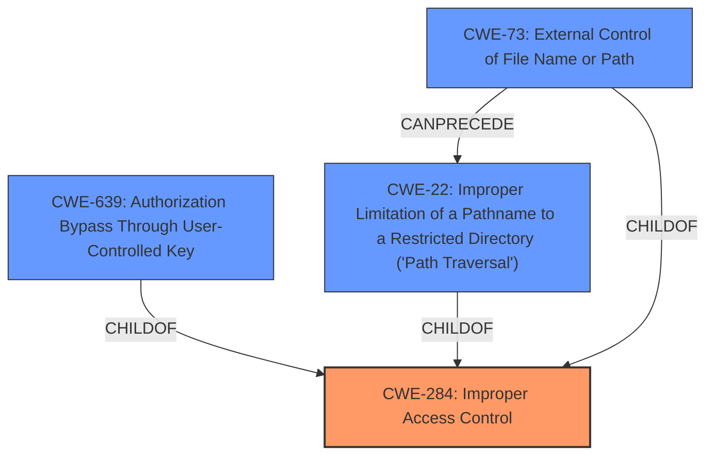

# Analysis for CVE-2020-19146

# Summary

| CWE ID | CWE Name | Confidence | CWE Abstraction Level | CWE Vulnerability Mapping Label | CWE-Vulnerability Mapping Notes |
|---|---|---|---|---|---|
| CWE-284 | Improper Access Control | 0.75 | Pillar | Discouraged | The primary weakness identified is **Improper Access Control**, however, CWE-284 is a Pillar and should be avoided. |
| CWE-639 | Authorization Bypass Through User-Controlled Key | 0.65 | Base | Allowed | Secondary Candidate, as the attacker modifies the key value identifying the template path. |
| CWE-22 | Improper Limitation of a Pathname to a Restricted Directory ('Path Traversal') | 0.55 | Base | Allowed | Secondary Candidate, as the attacker specifies arbitrary file paths. |
| CWE-73 | External Control of File Name or Path | 0.50 | Base | Allowed | Secondary Candidate, as the application does not filter user-controlled input when modifying template paths. |

## Evidence and Confidence

*   **Confidence Score:** 0.70
*   **Evidence Strength:** MEDIUM

## Relationship Analysis

The primary weakness, **Improper Access Control**, is too abstract. Therefore, I considered CWEs that are more specific. The attacker modifies a template path (a key) to bypass authorization, aligning with CWE-639. The ability to specify arbitrary file paths also suggests CWE-22. The application's failure to filter user-controlled input in file operations aligns with CWE-73. The relationships between these CWEs involve hierarchical structures and potential chains, such as external control leading to path traversal, but the provided information does not fully support these chains.

## Vulnerability Chain

The vulnerability chain starts with **Improper Access Control**, leading to arbitrary file read.
  - Root Cause: **Improper Access Control** allows modification of template paths.
  - Weakness: Lack of input validation on template paths.
  - Impact: Arbitrary file read.
The chain demonstrates how a high-level access control issue leads to more specific file-related vulnerabilities.

## Summary of Analysis

Initially, the vulnerability description points to **Improper Access Control**. However, CWE-284 is a high-level Pillar, making it less useful for specific vulnerability analysis. The evidence from "CVE Reference Links Content Summary" highlights that the application does not filter user-controlled input, allowing modification of template paths, which leads to arbitrary file reads.

The graph relationships show that CWE-639, CWE-22, and CWE-73 are more specific and potentially related to the high-level CWE-284. I considered CWE-639 because the attacker modifies the key value identifying the template path. CWE-22 was considered because the attacker specifies arbitrary file paths. CWE-73 was considered because the application does not filter user-controlled input when modifying template paths.

The evidence supports these more specific CWEs, but it's not definitive. Therefore, I will assign CWE-284 as a Primary CWE as it is the stated weakness, but it should be avoided in favor of more specific CWEs. The other CWEs are listed as secondary candidates. My confidence is moderate due to the ambiguity in the description.

Relevant CWE Information:
-   **CWE-284 (Improper Access Control)**: Initially identified as a primary weakness, the description aligns with the **Improper Access Control** in the Jfinal CMS. However, CWE-284 is a Pillar and should be avoided.
-   **CWE-639 (Authorization Bypass Through User-Controlled Key)**: The attacker modifies the template path (a key) to bypass authorization, aligning with CWE-639.
-   **CWE-22 (Improper Limitation of a Pathname to a Restricted Directory)**: The attacker specifies arbitrary file paths, which leads to arbitrary file read.
-   **CWE-73 (External Control of File Name or Path)**: The application's failure to filter user-controlled input in file operations.