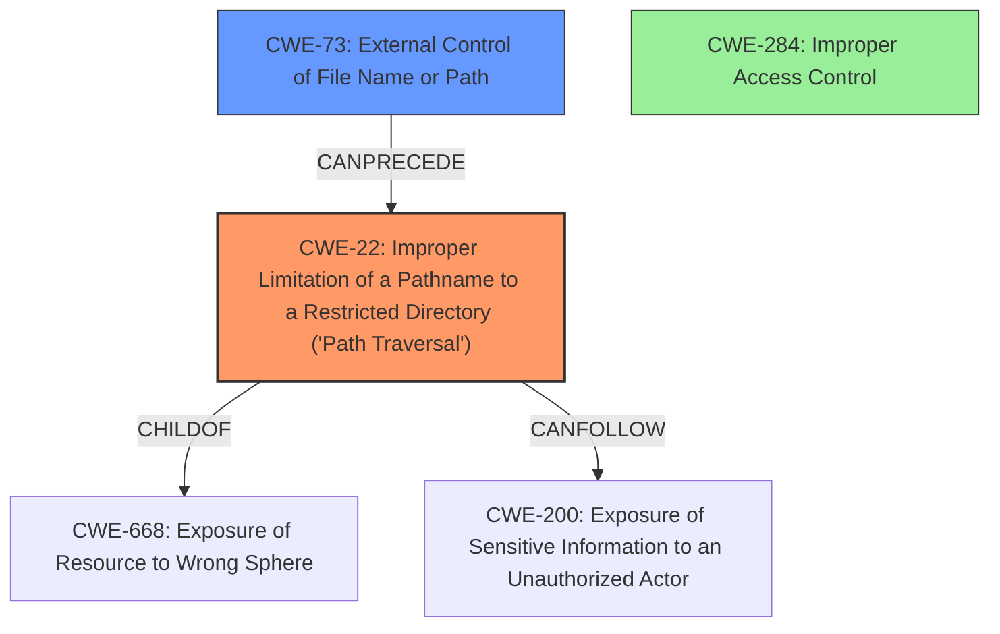

# Enhanced Analysis for CVE-2020-19147

# Summary
| CWE ID | CWE Name | Confidence | CWE Abstraction Level | CWE Vulnerability Mapping Label | CWE-Vulnerability Mapping Notes |
|---|---|---|---|---|---|
| CWE-22 | Improper Limitation of a Pathname to a Restricted Directory ('Path Traversal') | 1.0 | Base | Allowed | Primary CWE - This directly reflects the vulnerability described. |
| CWE-73 | External Control of File Name or Path | 0.8 | Base | Allowed | Secondary CWE - The path parameter is user-controlled, which is a key aspect of path traversal vulnerabilities. |
| CWE-284 | Improper Access Control | 0.6 | Pillar | Discouraged | Secondary CWE - While the root cause is path traversal, the vulnerability ultimately leads to unauthorized access to sensitive information. Consider descendants of CWE-284 for more specific access control issues.|

## Evidence and Confidence

*   **Confidence Score:** 0.9
*   **Evidence Strength:** HIGH

## Relationship Analysis
The primary weakness is CWE-22 [CWE-22: Improper Limitation of a Pathname to a Restricted Directory ('Path Traversal')], which is a base-level CWE. The user-controlled input that influences the file path (CWE-73 [CWE-73: External Control of File Name or Path]) precedes the path traversal vulnerability. While **Improper Access Control** (CWE-284) is mentioned in the description, it is a high-level pillar and less descriptive of the root cause than CWE-22.



## Vulnerability Chain
The vulnerability chain starts with the **external control** of the file path (CWE-73 [CWE-73: External Control of File Name or Path]) and leads to the **improper limitation** of that path, resulting in path traversal (CWE-22 [CWE-22: Improper Limitation of a Pathname to a Restricted Directory ('Path Traversal')]). The impact is the **exposure of sensitive information** (CWE-200 [CWE-200: Exposure of Sensitive Information to an Unauthorized Actor]).

## Summary of Analysis
The initial assessment focused on the **Improper Access Control** aspect from the "Vulnerability Description Key Phrases". However, after analyzing the CVE Reference Links Content Summary, the root cause is clearly related to the **lack of input validation on the user-supplied path**, allowing directory traversal.

The primary CWE is CWE-22 [CWE-22: Improper Limitation of a Pathname to a Restricted Directory ('Path Traversal')], because the vulnerability description and the CVE reference summary clearly show that the application **does not properly neutralize special elements within the pathname** that can cause the pathname to resolve to a location that is outside of the restricted directory. This is supported by the evidence: "The `getFolder()` method in `FileManager.java` does not properly sanitize or validate the user-supplied 'path' parameter, which is used to construct file paths."

CWE-73 [CWE-73: External Control of File Name or Path] is a secondary CWE because the vulnerability is triggered by the user's ability to control the 'path' parameter.

CWE-284 [CWE-284: Improper Access Control] is a tertiary consideration, but less descriptive of the root cause, which is the path traversal itself, not the broader access control context. It is a high-level pillar and the mapping guidance discourages its use.

The chosen CWEs are at the optimal level of specificity because they directly address the root cause of the vulnerability (CWE-22 [CWE-22: Improper Limitation of a Pathname to a Restricted Directory ('Path Traversal')]) and the condition that enables it (CWE-73 [CWE-73: External Control of File Name or Path]).

Relevant CWE Information:
*   **CWE-22 [CWE-22: Improper Limitation of a Pathname to a Restricted Directory ('Path Traversal')]**: This CWE is the most accurate representation of the vulnerability, aligning with the directory traversal flaw caused by missing input validation.
*   **CWE-73 [CWE-73: External Control of File Name or Path]**: This CWE accurately reflects the external control of the file path, which is a prerequisite for the path traversal vulnerability.
*   **CWE-284 [CWE-284: Improper Access Control]**: This CWE is too high-level. While access control is relevant, the root cause is the path traversal.

CWEs Considered but Not Used:

*   **CWE-29 [CWE-29: Path Traversal: '\..\filename']**: This is a more specific variant of path traversal using backslashes, which isn't explicitly mentioned in the description, so it's not the best fit.
*   **CWE-434 [CWE-434: Unrestricted Upload of File with Dangerous Type]**: This CWE is related to file uploads, which is not the case in this vulnerability.
*   **CWE-425 [CWE-425: Direct Request ('Forced Browsing')]**: While forced browsing could be a factor in exploiting the path traversal, it's not the primary weakness.
*   **CWE-200 [CWE-200: Exposure of Sensitive Information to an Unauthorized Actor]**: This describes the impact of the vulnerability, not the root cause.
*   **CWE-94 [CWE-94: Improper Control of Generation of Code ('Code Injection')]**: This is not related to code injection.


## CWE Relationship Analysis

Current CWEs represent these abstraction levels: .


### Vulnerability Chain Analysis

**Chain starting from CWE-284:**
- 284 (Improper Access Control) - ROOT


**Chain starting from CWE-73:**
- 73 (External Control of File Name or Path) - ROOT


### CWE Relationship Diagram

```mermaid
graph TD
    classDef primary fill:#f96,stroke:#333,stroke-width:2px
    classDef secondary fill:#69f,stroke:#333
    classDef tertiary fill:#9e9,stroke:#333
```