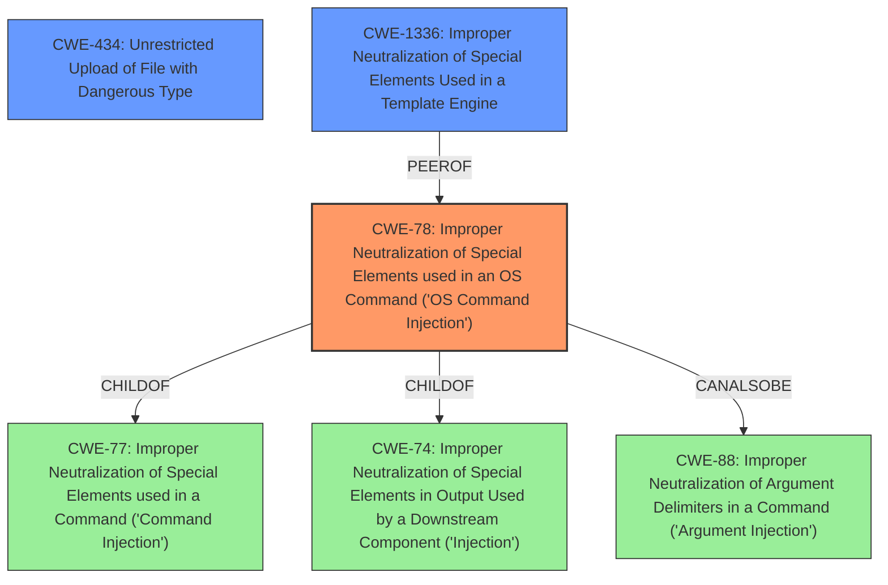

# Enhanced Analysis for CVE-2020-19151

# Summary

| CWE ID | CWE Name | Confidence | CWE Abstraction Level | CWE Vulnerability Mapping Label | CWE-Vulnerability Mapping Notes |
|---|---|---|---|---|---|
| CWE-78 | Improper Neutralization of Special Elements used in an OS Command ('OS Command Injection') | 1.0 | Base | Allowed | Primary CWE |
| CWE-434 | Unrestricted Upload of File with Dangerous Type | 0.8 | Base | Allowed | Secondary Candidate |
| CWE-1336 | Improper Neutralization of Special Elements Used in a Template Engine | 0.7 | Base | Allowed | Secondary Candidate |

## Evidence and Confidence

*   **Confidence Score:** 0.9
*   **Evidence Strength:** HIGH

## Relationship Analysis

The primary CWE is CWE-78, which is a base-level CWE. It is a child of CWE-77 (Improper Neutralization of Special Elements used in a Command) and CWE-74 (Improper Neutralization of Special Elements in Output Used by a Downstream Component ('Injection')). CWE-78 can also be related to CWE-88 (Improper Neutralization of Argument Delimiters in a Command ('Argument Injection')).

CWE-434 (Unrestricted Upload of File with Dangerous Type) represents a secondary aspect of the vulnerability, where a malicious file is uploaded without proper type restrictions.

CWE-1336 (Improper Neutralization of Special Elements Used in a Template Engine) is related since the **command injection** is due to the template engine calling Java methods.



## Vulnerability Chain

The vulnerability chain starts with uploading a malicious HTML template file (CWE-434), leading to **command injection** (CWE-78) because the template engine (CWE-1336) doesn't properly restrict Java method calls and allows the execution of arbitrary code.

## Summary of Analysis

The initial analysis identified **command injection** as the primary issue, which aligns with CWE-78. The ability to upload a malicious file is a contributing factor, making CWE-434 a secondary concern. The template engine failing to restrict java method calls is also a contributing factor, making CWE-1336 a secondary concern.

The evidence supports the selection of CWE-78 as the primary CWE. The "CVE Reference Links Content Summary" states, "The primary vulnerability is remote code execution (RCE) due to the **lack of sufficient restrictions on Java method calls** within the template engine. Specifically, the ability to use reflection allows bypassing the intended security measures."

The graph relationships help clarify the connections between different weaknesses. CWE-78 is the direct result of the **improper neutralization** of elements in an OS command.

The selected CWEs are at the optimal level of specificity, with CWE-78 being a Base-level CWE and directly addressing the **command injection** vulnerability.

**CWE-77:** Improper Neutralization of Special Elements used in a Command ('Command Injection') was considered, but CWE-78 is more specific because the **command injection** is at the OS level.
**CWE-22:** Improper Limitation of a Pathname to a Restricted Directory ('Path Traversal') was not selected because there is no evidence of path traversal in the description.
**CWE-94:** Improper Control of Generation of Code ('Code Injection') was not selected because while arbitrary code is executed, the root cause is not in the generation of code but in the **improper neutralization** of special elements in a command.
**CWE-434:** Unrestricted Upload of File with Dangerous Type was considered since a malicious file is uploaded.
**CWE-1336:** Improper Neutralization of Special Elements Used in a Template Engine was considered since the template engine can call Java methods.

Relevant CWE Information:

# Enhanced Context (25 CWEs)

## CWE-78: Improper Neutralization of Special Elements used in an OS Command ('OS Command Injection')

**Explanation:** The vulnerability description clearly states that remote attackers can execute arbitrary code by uploading a malicious HTML template file. The "CVE Reference Links Content Summary" indicates that the template engine, Beetl, can directly call Java methods, and these calls can be used to execute commands. This matches the description of CWE-78, where externally-influenced input is used to construct an OS command without proper neutralization of special elements.

**Security Implications:** This vulnerability allows attackers to execute arbitrary code on the server, potentially leading to complete system compromise.

**Relationships:** CWE-78 is a Base-level CWE and is a child of CWE-77.

**Mapping Guidance:** The usage is ALLOWED.

## CWE-434: Unrestricted Upload of File with Dangerous Type

**Explanation:** The vulnerability is triggered by uploading a malicious HTML template file. This aligns with CWE-434, which describes the unrestricted upload of a file with a dangerous type.

**Security Implications:** An attacker can upload a file containing malicious code that, when processed by the server, can lead to code execution.

**Relationships:** CWE-434 is a base level CWE.

**Mapping Guidance:** The usage is ALLOWED.

## CWE-1336: Improper Neutralization of Special Elements Used in a Template Engine

**Explanation:** The "CVE Reference Links Content Summary" highlights that the vulnerability stems from the template engine's ability to call Java methods directly without sufficient restrictions. This aligns with CWE-1336, which addresses the improper neutralization of special elements used in a template engine.

**Security Implications:** Allows attackers to inject arbitrary expressions or code directives through the template engine.

**Relationships:** CWE-1336 is a base level CWE and is a child of CWE-94.

**Mapping Guidance:** The usage is ALLOWED.


## CWE Relationship Analysis

Current CWEs represent these abstraction levels: .


### Vulnerability Chain Analysis

**Chain starting from CWE-1336:**
- 1336 (Improper Neutralization of Special Elements Used in a Template Engine) - ROOT


**Chain starting from CWE-88:**
- 88 (Improper Neutralization of Argument Delimiters in a Command ('Argument Injection')) - ROOT


### CWE Relationship Diagram

```mermaid
graph TD
    classDef primary fill:#f96,stroke:#333,stroke-width:2px
    classDef secondary fill:#69f,stroke:#333
    classDef tertiary fill:#9e9,stroke:#333
```