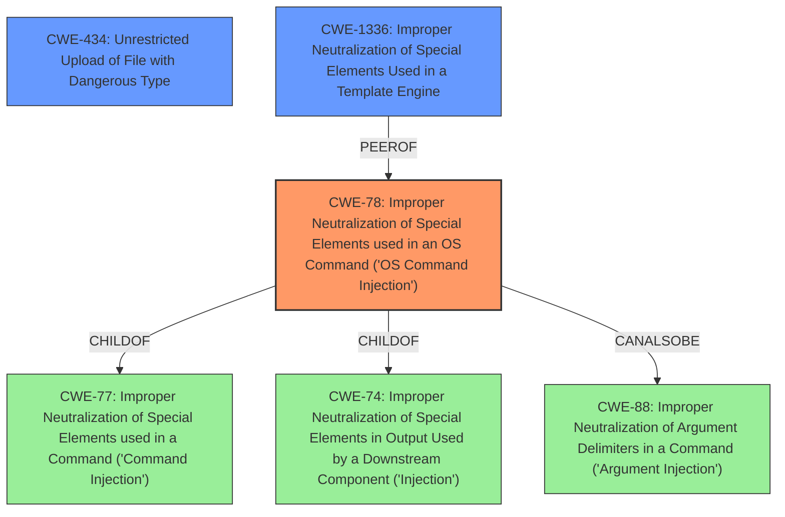

# Analysis for CVE-2020-19151

# Summary

| CWE ID | CWE Name | Confidence | CWE Abstraction Level | CWE Vulnerability Mapping Label | CWE-Vulnerability Mapping Notes |
|---|---|---|---|---|---|
| CWE-78 | Improper Neutralization of Special Elements used in an OS Command ('OS Command Injection') | 1.0 | Base | Allowed | Primary CWE |
| CWE-434 | Unrestricted Upload of File with Dangerous Type | 0.8 | Base | Allowed | Secondary Candidate |
| CWE-1336 | Improper Neutralization of Special Elements Used in a Template Engine | 0.7 | Base | Allowed | Secondary Candidate |

## Evidence and Confidence

*   **Confidence Score:** 0.9
*   **Evidence Strength:** HIGH

## Relationship Analysis

The primary CWE is CWE-78, which is a base-level CWE. It is a child of CWE-77 (Improper Neutralization of Special Elements used in a Command) and CWE-74 (Improper Neutralization of Special Elements in Output Used by a Downstream Component ('Injection')). CWE-78 can also be related to CWE-88 (Improper Neutralization of Argument Delimiters in a Command ('Argument Injection')).

CWE-434 (Unrestricted Upload of File with Dangerous Type) represents a secondary aspect of the vulnerability, where a malicious file is uploaded without proper type restrictions.

CWE-1336 (Improper Neutralization of Special Elements Used in a Template Engine) is related since the **command injection** is due to the template engine calling Java methods.



## Vulnerability Chain

The vulnerability chain starts with uploading a malicious HTML template file (CWE-434), leading to **command injection** (CWE-78) because the template engine (CWE-1336) doesn't properly restrict Java method calls and allows the execution of arbitrary code.

## Summary of Analysis

The initial analysis identified **command injection** as the primary issue, which aligns with CWE-78. The ability to upload a malicious file is a contributing factor, making CWE-434 a secondary concern. The template engine failing to restrict java method calls is also a contributing factor, making CWE-1336 a secondary concern.

The evidence supports the selection of CWE-78 as the primary CWE. The "CVE Reference Links Content Summary" states, "The primary vulnerability is remote code execution (RCE) due to the **lack of sufficient restrictions on Java method calls** within the template engine. Specifically, the ability to use reflection allows bypassing the intended security measures."

The graph relationships help clarify the connections between different weaknesses. CWE-78 is the direct result of the **improper neutralization** of elements in an OS command.

The selected CWEs are at the optimal level of specificity, with CWE-78 being a Base-level CWE and directly addressing the **command injection** vulnerability.

**CWE-77:** Improper Neutralization of Special Elements used in a Command ('Command Injection') was considered, but CWE-78 is more specific because the **command injection** is at the OS level.
**CWE-22:** Improper Limitation of a Pathname to a Restricted Directory ('Path Traversal') was not selected because there is no evidence of path traversal in the description.
**CWE-94:** Improper Control of Generation of Code ('Code Injection') was not selected because while arbitrary code is executed, the root cause is not in the generation of code but in the **improper neutralization** of special elements in a command.
**CWE-434:** Unrestricted Upload of File with Dangerous Type was considered since a malicious file is uploaded.
**CWE-1336:** Improper Neutralization of Special Elements Used in a Template Engine was considered since the template engine can call Java methods.

Relevant CWE Information:

# Enhanced Context (25 CWEs)

## CWE-78: Improper Neutralization of Special Elements used in an OS Command ('OS Command Injection')

**Explanation:** The vulnerability description clearly states that remote attackers can execute arbitrary code by uploading a malicious HTML template file. The "CVE Reference Links Content Summary" indicates that the template engine, Beetl, can directly call Java methods, and these calls can be used to execute commands. This matches the description of CWE-78, where externally-influenced input is used to construct an OS command without proper neutralization of special elements.

**Security Implications:** This vulnerability allows attackers to execute arbitrary code on the server, potentially leading to complete system compromise.

**Relationships:** CWE-78 is a Base-level CWE and is a child of CWE-77.

**Mapping Guidance:** The usage is ALLOWED.

## CWE-434: Unrestricted Upload of File with Dangerous Type

**Explanation:** The vulnerability is triggered by uploading a malicious HTML template file. This aligns with CWE-434, which describes the unrestricted upload of a file with a dangerous type.

**Security Implications:** An attacker can upload a file containing malicious code that, when processed by the server, can lead to code execution.

**Relationships:** CWE-434 is a base level CWE.

**Mapping Guidance:** The usage is ALLOWED.

## CWE-1336: Improper Neutralization of Special Elements Used in a Template Engine

**Explanation:** The "CVE Reference Links Content Summary" highlights that the vulnerability stems from the template engine's ability to call Java methods directly without sufficient restrictions. This aligns with CWE-1336, which addresses the improper neutralization of special elements used in a template engine.

**Security Implications:** Allows attackers to inject arbitrary expressions or code directives through the template engine.

**Relationships:** CWE-1336 is a base level CWE and is a child of CWE-94.

**Mapping Guidance:** The usage is ALLOWED.

# Enhanced Query for CVE-2020-19151

## Vulnerability Description
**Command Injection** in Jfinal CMS v4.7.1 and earlier allows remote attackers to execute arbitrary code by uploading a malicious HTML template file via the component jfinal_cms/admin/filemanager/list.

### Vulnerability Description Key Phrases
- **weakness:** **Command Injection**
- **impact:** execute arbitrary code
- **vector:** uploading malicious HTML template file
- **attacker:** remote attackers
- **product:** Jfinal CMS
- **version:** v4.7.1 and earlier
- **component:** jfinal_cms/admin/filemanager/list

## CVE Reference Links Content Summary
```
{
  "Root cause of vulnerability": "The vulnerability lies in the fact that the template engine, Beetl, can directly call Java methods. While there are some restrictions, they can be bypassed using Java reflection.",
  "Weaknesses/vulnerabilities present": "The primary vulnerability is remote code execution (RCE) due to the lack of sufficient restrictions on Java method calls within the template engine. Specifically, the ability to use reflection allows bypassing the intended security measures.",
  "Impact of exploitation": "Successful exploitation allows an attacker to execute arbitrary code on the server. In this specific example, the exploit executes the 'calc' command, which would open the calculator application, but it could be any command.",
  "Attack vectors": "The attack vector involves modifying a template file within the Jfinal CMS's backend template management. The attacker inserts malicious code into a template which is then rendered and executed when accessed by a user.",
  "Required attacker capabilities/position": "The attacker needs to be authenticated to the Jfinal CMS backend and have access to the template management functionality."
}
```

## Retriever Results

### Top Combined Results

| Rank | CWE ID | Name | Abstraction | Usage  | Retrievers | Individual Scores |
|------|--------|------|-------------|-------|------------|-------------------|
| 1 | 77 | Improper Neutralization of Special Elements used in a Command ('Command Injection') | Class | Allowed-with-Review | alternate_terms | 1.000 |
| 2 | 78 | Improper Neutralization of Special Elements used in an OS Command ('OS Command Injection') | Base | Allowed | alternate_terms | 0.700 |
| 3 | 29 | Path Traversal: '\..\filename' | Variant | Allowed | sparse | 0.203 |
| 4 | 1336 | Improper Neutralization of Special Elements Used in a Template Engine | Base | Allowed | sparse | 0.195 |
| 5 | 96 | Improper Neutralization of Directives in Statically Saved Code ('Static Code Injection') | Base | Allowed | sparse | 0.187 |
| 6 | 434 | Unrestricted Upload of File with Dangerous Type | Base | Allowed | dense | 0.551 |
| 7 | 183 | Permissive List of Allowed Inputs | Base | Allowed | graph | 0.002 |
| 8 | 94 | Improper Control of Generation of Code ('Code Injection') | Base | Allowed-with-Review | sparse | 0.179 |
| 9 | 22 | Improper Limitation of a Pathname to a Restricted Directory ('Path Traversal') | Base | Allowed | sparse | 0.179 |
| 10 | 73 | External Control of File Name or Path | Base | Allowed | sparse | 0.178 |


# Complete CWE Specifications


## CWE-77: Improper Neutralization of Special Elements used in a Command ('Command Injection')
**Abstraction:** Class
**Status:** Draft

### Description
The product constructs all or part of a command using externally-influenced input from an upstream component, but it does not neutralize or incorrectly neutralizes special elements that could modify the intended command when it is sent to a downstream component.

### Extended Description


Many protocols and products have their own custom command language. While OS or shell command strings are frequently discovered and targeted, developers may not realize that these other command languages might also be vulnerable to attacks.


### Alternative Terms
Command injection: an attack-oriented phrase for this weakness. Note: often used when "OS command injection" (CWE-78) was intended.

### Relationships
ChildOf -> CWE-74
ChildOf -> CWE-74

### Mapping Guidance
**Usage:** Allowed-with-Review
**Rationale:** CWE-77 is often misused when OS command injection (CWE-78) was intended instead [REF-1287].
**Comments:** Ensure that the analysis focuses on the root-cause error that allows the execution of commands, as there are many weaknesses that can lead to this consequence. See Terminology Notes. If the weakness involves a command language besides OS shell invocation, then CWE-77 could be used.
**Reasons:**
- Frequent Misuse
**Suggested Alternatives:**
- CWE-78: OS Command Injection


### Additional Notes
**[Terminology]** 

The "command injection" phrase carries different meanings, either as an attack or as a technical impact. The most common usage of "command injection" refers to the more-accurate OS command injection (CWE-78), but there are many command languages.


In vulnerability-focused analysis, the phrase may refer to any situation in which the adversary can execute commands of their own choosing, i.e., the focus is on the risk and/or technical impact of exploitation. Many proof-of-concept exploits focus on the ability to execute commands and may emphasize "command injection." However, there are dozens of weaknesses that can allow execution of commands. That is, the ability to execute commands could be resultant from another weakness.


To some, "command injection" can include cases in which the functionality intentionally allows the user to specify an entire command, which is then executed. In this case, the root cause weakness might be related to missing or incorrect authorization, since an adversary should not be able to specify arbitrary commands, but some users or admins are allowed.


CWE-77 and its descendants are specifically focused on behaviors in which the product is intentionally building a command to execute, and the adversary can inject separators into the command or otherwise change the command being executed.


**[Other]** 

Command injection is a common problem with wrapper programs.


### Observed Examples
- **CVE-2022-1509:** injection of sed script syntax ("sed injection")
- **CVE-2024-5184:** API service using a large generative AI model allows direct prompt injection to leak hard-coded system prompts or execute other prompts.
- **CVE-2020-11698:** anti-spam product allows injection of SNMP commands into confiuration file


## CWE-78: Improper Neutralization of Special Elements used in an OS Command ('OS Command Injection')
**Abstraction:** Base
**Status:** Stable

### Description
The product constructs all or part of an OS command using externally-influenced input from an upstream component, but it does not neutralize or incorrectly neutralizes special elements that could modify the intended OS command when it is sent to a downstream component.

### Extended Description


This weakness can lead to a vulnerability in environments in which the attacker does not have direct access to the operating system, such as in web applications. Alternately, if the weakness occurs in a privileged program, it could allow the attacker to specify commands that normally would not be accessible, or to call alternate commands with privileges that the attacker does not have. The problem is exacerbated if the compromised process does not follow the principle of least privilege, because the attacker-controlled commands may run with special system privileges that increases the amount of damage.


There are at least two subtypes of OS command injection:


  - The application intends to execute a single, fixed program that is under its own control. It intends to use externally-supplied inputs as arguments to that program. For example, the program might use system("nslookup [HOSTNAME]") to run nslookup and allow the user to supply a HOSTNAME, which is used as an argument. Attackers cannot prevent nslookup from executing. However, if the program does not remove command separators from the HOSTNAME argument, attackers could place the separators into the arguments, which allows them to execute their own program after nslookup has finished executing.

  - The application accepts an input that it uses to fully select which program to run, as well as which commands to use. The application simply redirects this entire command to the operating system. For example, the program might use "exec([COMMAND])" to execute the [COMMAND] that was supplied by the user. If the COMMAND is under attacker control, then the attacker can execute arbitrary commands or programs. If the command is being executed using functions like exec() and CreateProcess(), the attacker might not be able to combine multiple commands together in the same line.

From a weakness standpoint, these variants represent distinct programmer errors. In the first variant, the programmer clearly intends that input from untrusted parties will be part of the arguments in the command to be executed. In the second variant, the programmer does not intend for the command to be accessible to any untrusted party, but the programmer probably has not accounted for alternate ways in which malicious attackers can provide input.

### Alternative Terms
Shell injection
Shell metacharacters
OS Command Injection

### Relationships
ChildOf -> CWE-77
ChildOf -> CWE-74
ChildOf -> CWE-77
ChildOf -> CWE-77
CanAlsoBe -> CWE-88

### Mapping Guidance
**Usage:** Allowed
**Rationale:** This CWE entry is at the Base level of abstraction, which is a preferred level of abstraction for mapping to the root causes of vulnerabilities.
**Comments:** Carefully read both the name and description to ensure that this mapping is an appropriate fit. Do not try to 'force' a mapping to a lower-level Base/Variant simply to comply with this preferred level of abstraction.
**Reasons:**
- Acceptable-Use


### Additional Notes
**[Terminology]** The "OS command injection" phrase carries different meanings to different people. For some people, it only refers to cases in which the attacker injects command separators into arguments for an application-controlled program that is being invoked. For some people, it refers to any type of attack that can allow the attacker to execute OS commands of their own choosing. This usage could include untrusted search path weaknesses (CWE-426) that cause the application to find and execute an attacker-controlled program. Further complicating the issue is the case when argument injection (CWE-88) allows alternate command-line switches or options to be inserted into the command line, such as an "-exec" switch whose purpose may be to execute the subsequent argument as a command (this -exec switch exists in the UNIX "find" command, for example). In this latter case, however, CWE-88 could be regarded as the primary weakness in a chain with CWE-78.

**[Research Gap]** More investigation is needed into the distinction between the OS command injection variants, including the role with argument injection (CWE-88). Equivalent distinctions may exist in other injection-related problems such as SQL injection.


### Observed Examples
- **CVE-2020-10987:** OS command injection in Wi-Fi router, as exploited in the wild per CISA KEV.
- **CVE-2020-10221:** Template functionality in network configuration management tool allows OS command injection, as exploited in the wild per CISA KEV.
- **CVE-2020-9054:** Chain: improper input validation (CWE-20) in username parameter, leading to OS command injection (CWE-78), as exploited in the wild per CISA KEV.


## CWE-29: Path Traversal: '\..\filename'
**Abstraction:** Variant
**Status:** Incomplete

### Description
The product uses external input to construct a pathname that should be within a restricted directory, but it does not properly neutralize '\..\filename' (leading backslash dot dot) sequences that can resolve to a location that is outside of that directory.

### Extended Description


This allows attackers to traverse the file system to access files or directories that are outside of the restricted directory.


This is similar to CWE-25, except using "\" instead of "/". Sometimes a program checks for "..\" at the beginning of the input, so a "\..\" can bypass that check. It is also useful for bypassing path traversal protection schemes that only assume that the "/" separator is valid.


### Alternative Terms
None

### Relationships
ChildOf -> CWE-23

### Mapping Guidance
**Usage:** Allowed
**Rationale:** This CWE entry is at the Variant level of abstraction, which is a preferred level of abstraction for mapping to the root causes of vulnerabilities.
**Comments:** Carefully read both the name and description to ensure that this mapping is an appropriate fit. Do not try to 'force' a mapping to a lower-level Base/Variant simply to comply with this preferred level of abstraction.
**Reasons:**
- Acceptable-Use


### Observed Examples
- **CVE-2002-1987:** Protection mechanism checks for "/.." but doesn't account for Windows-specific "\.." allowing read of arbitrary files.
- **CVE-2005-2142:** Directory traversal vulnerability in FTP server allows remote authenticated attackers to list arbitrary directories via a "\.." sequence in an LS command.


## CWE-1336: Improper Neutralization of Special Elements Used in a Template Engine
**Abstraction:** Base
**Status:** Incomplete

### Description
The product uses a template engine to insert or process externally-influenced input, but it does not neutralize or incorrectly neutralizes special elements or syntax that can be interpreted as template expressions or other code directives when processed by the engine.

### Extended Description


Many web applications use template engines that allow developers to insert externally-influenced values into free text or messages in order to generate a full web page, document, message, etc. Such engines include Twig, Jinja2, Pug, Java Server Pages, FreeMarker, Velocity, ColdFusion, Smarty, and many others - including PHP itself. Some CMS (Content Management Systems) also use templates.


Template engines often have their own custom command or expression language. If an attacker can influence input into a template before it is processed, then the attacker can invoke arbitrary expressions, i.e. perform injection attacks. For example, in some template languages, an attacker could inject the expression "{{7*7}}" and determine if the output returns "49" instead. The syntax varies depending on the language.


In some cases, XSS-style attacks can work, which can obscure the root cause if the developer does not closely investigate the root cause of the error.


Template engines can be used on the server or client, so both "sides" could be affected by injection. The mechanisms of attack or the affected technologies might be different, but the mistake is fundamentally the same.


### Alternative Terms
Server-Side Template Injection / SSTI: This term is used for injection into template engines being used by a server.
Client-Side Template Injection / CSTI: This term is used for injection into template engines being used by a client.

### Relationships
ChildOf -> CWE-94

### Mapping Guidance
**Usage:** Allowed
**Rationale:** This CWE entry is at the Base level of abstraction, which is a preferred level of abstraction for mapping to the root causes of vulnerabilities.
**Comments:** Carefully read both the name and description to ensure that this mapping is an appropriate fit. Do not try to 'force' a mapping to a lower-level Base/Variant simply to comply with this preferred level of abstraction.
**Reasons:**
- Acceptable-Use


### Additional Notes
**[Relationship]** Since expression languages are often used in templating languages, there may be some overlap with CWE-917 (Expression Language Injection). XSS (CWE-79) is also co-located with template injection.

**[Maintenance]** The interrelationships and differences between CWE-917 and CWE-1336 need to be further clarified.


### Observed Examples
- **CVE-2024-34359:** Chain: Python bindings for LLM library do not use a sandboxed environment when parsing a template and constructing a prompt, allowing jinja2 Server Side Template Injection and code execution - one variant of a "prompt injection" attack.
- **CVE-2017-16783:** server-side template injection in content management server
- **CVE-2020-9437:** authentication / identity management product has client-side template injection


## CWE-96: Improper Neutralization of Directives in Statically Saved Code ('Static Code Injection')
**Abstraction:** Base
**Status:** Draft

### Description
The product receives input from an upstream component, but it does not neutralize or incorrectly neutralizes code syntax before inserting the input into an executable resource, such as a library, configuration file, or template.

### Extended Description
Not provided

### Alternative Terms
None

### Relationships
ChildOf -> CWE-94

### Mapping Guidance
**Usage:** Allowed
**Rationale:** This CWE entry is at the Base level of abstraction, which is a preferred level of abstraction for mapping to the root causes of vulnerabilities.
**Comments:** Carefully read both the name and description to ensure that this mapping is an appropriate fit. Do not try to 'force' a mapping to a lower-level Base/Variant simply to comply with this preferred level of abstraction.
**Reasons:**
- Acceptable-Use


### Additional Notes
**[Relationship]** "HTML injection" (see CWE-79: XSS) could be thought of as an example of this, but the code is injected and executed on the client side, not the server side. Server-Side Includes (SSI) are an example of direct static code injection.


### Observed Examples
- **CVE-2002-0495:** Perl code directly injected into CGI library file from parameters to another CGI program.
- **CVE-2005-1876:** Direct PHP code injection into supporting template file.
- **CVE-2005-1894:** Direct code injection into PHP script that can be accessed by attacker.


## CWE-434: Unrestricted Upload of File with Dangerous Type
**Abstraction:** Base
**Status:** Draft

### Description
The product allows the upload or transfer of dangerous file types that are automatically processed within its environment.

### Extended Description
Not provided

### Alternative Terms
Unrestricted File Upload: Used in vulnerability databases and elsewhere, but it is insufficiently precise. The phrase could be interpreted as the lack of restrictions on the size or number of uploaded files, which is a resource consumption issue.

### Relationships
ChildOf -> CWE-669
ChildOf -> CWE-669
PeerOf -> CWE-351
PeerOf -> CWE-436
PeerOf -> CWE-430

### Mapping Guidance
**Usage:** Allowed
**Rationale:** This CWE entry is at the Base level of abstraction, which is a preferred level of abstraction for mapping to the root causes of vulnerabilities.
**Comments:** Carefully read both the name and description to ensure that this mapping is an appropriate fit. Do not try to 'force' a mapping to a lower-level Base/Variant simply to comply with this preferred level of abstraction.
**Reasons:**
- Acceptable-Use


### Additional Notes
**[Relationship]** 

This can have a chaining relationship with incomplete denylist / permissive allowlist errors when the product tries, but fails, to properly limit which types of files are allowed (CWE-183, CWE-184).


This can also overlap multiple interpretation errors for intermediaries, e.g. anti-virus products that do not remove or quarantine attachments with certain file extensions that can be processed by client systems.


### Observed Examples
- **CVE-2023-5227:** PHP-based FAQ management app does not check the MIME type for uploaded images
- **CVE-2001-0901:** Web-based mail product stores ".shtml" attachments that could contain SSI
- **CVE-2002-1841:** PHP upload does not restrict file types


## CWE-183: Permissive List of Allowed Inputs
**Abstraction:** Base
**Status:** Draft

### Description
The product implements a protection mechanism that relies on a list of inputs (or properties of inputs) that are explicitly allowed by policy because the inputs are assumed to be safe, but the list is too permissive - that is, it allows an input that is unsafe, leading to resultant weaknesses.

### Extended Description
Not provided

### Alternative Terms
Allowlist / Allow List: This is used by CWE and CAPEC instead of other commonly-used terms. Its counterpart is denylist.
Safelist / Safe List: This is often used by security tools such as firewalls, email or web gateways, proxies, etc.
Whitelist / White List: This term is frequently used, but usage has been declining as organizations have started to adopt other terms.

### Relationships
ChildOf -> CWE-697
CanPrecede -> CWE-434

### Mapping Guidance
**Usage:** Allowed
**Rationale:** This CWE entry is at the Base level of abstraction, which is a preferred level of abstraction for mapping to the root causes of vulnerabilities.
**Comments:** Carefully read both the name and description to ensure that this mapping is an appropriate fit. Do not try to 'force' a mapping to a lower-level Base/Variant simply to comply with this preferred level of abstraction.
**Reasons:**
- Acceptable-Use


### Observed Examples
- **CVE-2019-12799:** chain: bypass of untrusted deserialization issue (CWE-502) by using an assumed-trusted class (CWE-183)
- **CVE-2019-10458:** sandbox bypass using a method that is on an allowlist
- **CVE-2017-1000095:** sandbox bypass using unsafe methods that are on an allowlist


## CWE-94: Improper Control of Generation of Code ('Code Injection')
**Abstraction:** Base
**Status:** Draft

### Description
The product constructs all or part of a code segment using externally-influenced input from an upstream component, but it does not neutralize or incorrectly neutralizes special elements that could modify the syntax or behavior of the intended code segment.

### Extended Description


When a product allows a user's input to contain code syntax, it might be possible for an attacker to craft the code in such a way that it will alter the intended control flow of the product. Such an alteration could lead to arbitrary code execution.


Injection problems encompass a wide variety of issues -- all mitigated in very different ways. For this reason, the most effective way to discuss these weaknesses is to note the distinct features which classify them as injection weaknesses. The most important issue to note is that all injection problems share one thing in common -- i.e., they allow for the injection of control plane data into the user-controlled data plane. This means that the execution of the process may be altered by sending code in through legitimate data channels, using no other mechanism. While buffer overflows, and many other flaws, involve the use of some further issue to gain execution, injection problems need only for the data to be parsed. The most classic instantiations of this category of weakness are SQL injection and format string vulnerabilities.


### Alternative Terms
None

### Relationships
ChildOf -> CWE-74
ChildOf -> CWE-74
ChildOf -> CWE-913

### Mapping Guidance
**Usage:** Allowed-with-Review
**Rationale:** This entry is frequently misused for vulnerabilities with a technical impact of "code execution," which does not by itself indicate a root cause weakness, since dozens of weaknesses can enable code execution.
**Comments:** This weakness only applies when the product's functionality intentionally constructs all or part of a code segment. It could be that executing code could be the result of other weaknesses that do not involve the construction of code segments.
**Reasons:**
- Frequent Misuse
- Frequent Misinterpretation


### Observed Examples
- **CVE-2023-29374:** Math component in an LLM framework translates user input into a Python expression that is input into the Python exec() method, allowing code execution - one variant of a "prompt injection" attack.
- **CVE-2024-5565:** Python-based library uses an LLM prompt containing user input to dynamically generate code that is then fed as input into the Python exec() method, allowing code execution - one variant of a "prompt injection" attack.
- **CVE-2024-4181:** Framework for LLM applications allows eval injection via a crafted response from a hosting provider.


## CWE-22: Improper Limitation of a Pathname to a Restricted Directory ('Path Traversal')
**Abstraction:** Base
**Status:** Stable

### Description
The product uses external input to construct a pathname that is intended to identify a file or directory that is located underneath a restricted parent directory, but the product does not properly neutralize special elements within the pathname that can cause the pathname to resolve to a location that is outside of the restricted directory.

### Extended Description


Many file operations are intended to take place within a restricted directory. By using special elements such as ".." and "/" separators, attackers can escape outside of the restricted location to access files or directories that are elsewhere on the system. One of the most common special elements is the "../" sequence, which in most modern operating systems is interpreted as the parent directory of the current location. This is referred to as relative path traversal. Path traversal also covers the use of absolute pathnames such as "/usr/local/bin" to access unexpected files. This is referred to as absolute path traversal.


### Alternative Terms
Directory traversal
Path traversal: "Path traversal" is preferred over "directory traversal," but both terms are attack-focused.

### Relationships
ChildOf -> CWE-706
ChildOf -> CWE-706
ChildOf -> CWE-668

### Mapping Guidance
**Usage:** Allowed
**Rationale:** This CWE entry is at the Base level of abstraction, which is a preferred level of abstraction for mapping to the root causes of vulnerabilities.
**Comments:** Carefully read both the name and description to ensure that this mapping is an appropriate fit. Do not try to 'force' a mapping to a lower-level Base/Variant simply to comply with this preferred level of abstraction.
**Reasons:**
- Acceptable-Use


### Additional Notes
**[Other]** In many programming languages, the injection of a null byte (the 0 or NUL) may allow an attacker to truncate a generated filename to apply to a wider range of files. For example, the product may add ".txt" to any pathname, thus limiting the attacker to text files, but a null injection may effectively remove this restriction.

**[Relationship]** Pathname equivalence can be regarded as a type of canonicalization error.

**[Relationship]** Some pathname equivalence issues are not directly related to directory traversal, rather are used to bypass security-relevant checks for whether a file/directory can be accessed by the attacker (e.g. a trailing "/" on a filename could bypass access rules that don't expect a trailing /, causing a server to provide the file when it normally would not).

**[Terminology]** 

Like other weaknesses, terminology is often based on the types of manipulations used, instead of the underlying weaknesses. Some people use "directory traversal" only to refer to the injection of ".." and equivalent sequences whose specific meaning is to traverse directories.


Other variants like "absolute pathname" and "drive letter" have the *effect* of directory traversal, but some people may not call it such, since it doesn't involve ".." or equivalent.


**[Research Gap]** Many variants of path traversal attacks are probably under-studied with respect to root cause. CWE-790 and CWE-182 begin to cover part of this gap.

**[Research Gap]** 

Incomplete diagnosis or reporting of vulnerabilities can make it difficult to know which variant is affected. For example, a researcher might say that "..\" is vulnerable, but not test "../" which may also be vulnerable.


Any combination of directory separators ("/", "\", etc.) and numbers of "." (e.g. "....") can produce unique variants; for example, the "//../" variant is not listed (CVE-2004-0325). See this entry's children and lower-level descendants.


### Observed Examples
- **CVE-2024-37032:** Large language model (LLM) management tool does not validate the format of a digest value (CWE-1287) from a private, untrusted model registry, enabling relative path traversal (CWE-23), a.k.a. Probllama
- **CVE-2024-4315:** Chain: API for text generation using Large Language Models (LLMs) does not include the "\" Windows folder separator in its denylist (CWE-184) when attempting to prevent Local File Inclusion via path traversal (CWE-22), allowing deletion of arbitrary files on Windows systems.
- **CVE-2022-45918:** Chain: a learning management tool debugger uses external input to locate previous session logs (CWE-73) and does not properly validate the given path (CWE-20), allowing for filesystem path traversal using "../" sequences (CWE-24)


## CWE-73: External Control of File Name or Path
**Abstraction:** Base
**Status:** Draft

### Description
The product allows user input to control or influence paths or file names that are used in filesystem operations.

### Extended Description


This could allow an attacker to access or modify system files or other files that are critical to the application.


Path manipulation errors occur when the following two conditions are met:

```
		1. An attacker can specify a path used in an operation on the filesystem.
		2. By specifying the resource, the attacker gains a capability that would not otherwise be permitted.
```
For example, the program may give the attacker the ability to overwrite the specified file or run with a configuration controlled by the attacker.

### Alternative Terms
None

### Relationships
ChildOf -> CWE-642
ChildOf -> CWE-610
ChildOf -> CWE-20
CanPrecede -> CWE-22
CanPrecede -> CWE-41
CanPrecede -> CWE-98
CanPrecede -> CWE-434
CanPrecede -> CWE-59

### Mapping Guidance
**Usage:** Allowed
**Rationale:** This CWE entry is at the Base level of abstraction, which is a preferred level of abstraction for mapping to the root causes of vulnerabilities.
**Comments:** Carefully read both the name and description to ensure that this mapping is an appropriate fit. Do not try to 'force' a mapping to a lower-level Base/Variant simply to comply with this preferred level of abstraction.
**Reasons:**
- Acceptable-Use


### Additional Notes
**[Maintenance]** CWE-114 is a Class, but it is listed a child of CWE-73 in view 1000. This suggests some abstraction problems that should be resolved in future versions.

**[Relationship]** 

The external control of filenames can be the primary link in chains with other file-related weaknesses, as seen in the CanPrecede relationships. This is because software systems use files for many different purposes: to execute programs, load code libraries, to store application data, to store configuration settings, record temporary data, act as signals or semaphores to other processes, etc.


However, those weaknesses do not always require external control. For example, link-following weaknesses (CWE-59) often involve pathnames that are not controllable by the attacker at all.


The external control can be resultant from other issues. For example, in PHP applications, the register_globals setting can allow an attacker to modify variables that the programmer thought were immutable, enabling file inclusion (CWE-98) and path traversal (CWE-22). Operating with excessive privileges (CWE-250) might allow an attacker to specify an input filename that is not directly readable by the attacker, but is accessible to the privileged program. A buffer overflow (CWE-119) might give an attacker control over nearby memory locations that are related to pathnames, but were not directly modifiable by the attacker.


### Observed Examples
- **CVE-2022-45918:** Chain: a learning management tool debugger uses external input to locate previous session logs (CWE-73) and does not properly validate the given path (CWE-20), allowing for filesystem path traversal using "../" sequences (CWE-24)
- **CVE-2008-5748:** Chain: external control of values for user's desired language and theme enables path traversal.
- **CVE-2008-5764:** Chain: external control of user's target language enables remote file inclusion.

