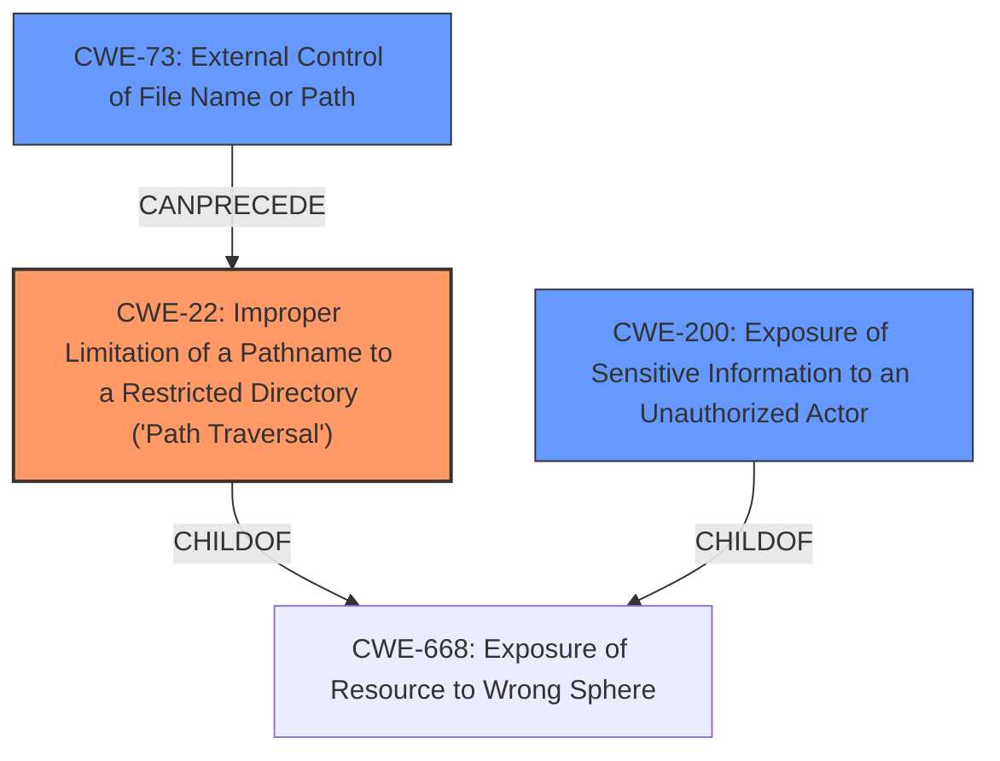

# Analysis for CVE-2020-19154

# Summary
| CWE ID | CWE Name | Confidence | CWE Abstraction Level | CWE Vulnerability Mapping Label | CWE-Vulnerability Mapping Notes |
|---|---|---|---|---|---|
| CWE-22 | Improper Limitation of a Pathname to a Restricted Directory ('Path Traversal') | 0.8 | Base | Allowed | Primary CWE. The **improper access control** allows a remote attacker to read arbitrary files due to **lack of path sanitization**. |
| CWE-73 | External Control of File Name or Path | 0.7 | Base | Allowed | Secondary CWE. The path is passed by the user in the background template management office. |
| CWE-200 | Exposure of Sensitive Information to an Unauthorized Actor | 0.6 | Class | Discouraged | Secondary CWE. The impact of the vulnerability is that an attacker can read arbitrary files on the server and obtain sensitive information. |

## Evidence and Confidence

*   **Confidence Score:** 0.7
*   **Evidence Strength:** HIGH

## Relationship Analysis
The primary CWE is CWE-22, which describes path traversal vulnerabilities. CWE-73 is included because the path is user-controlled and is a prerequisite for CWE-22. CWE-200 is included because the impact of the vulnerability is the exposure of sensitive information, but it is discouraged as a root cause.

## Vulnerability Chain
The vulnerability chain starts with **external control** of the file path (CWE-73), which leads to **improper limitation of pathname** (CWE-22), ultimately resulting in **exposure of sensitive information** (CWE-200).

## Summary of Analysis
The initial assessment focused on the **improper access control** aspect of the vulnerability. However, analyzing the description and the CVE reference summary reveals that the root cause is the **lack of path sanitization**, which enables path traversal. This makes CWE-22 the more appropriate primary CWE. The chain of events starts with the external control of the file path (CWE-73), which is then exploited via path traversal (CWE-22) leading to the exposure of sensitive information (CWE-200).

The evidence for this assessment is:
- Vulnerability Description Key Phrases: **rootcause: Improper Access Control**
- CVE Reference Links Content Summary: "The application does not filter the path passed by the user in the background template management office, leading to arbitrary file read vulnerability."
- CVE Reference Links Content Summary: "Weaknesses/vulnerabilities present: Arbitrary file read vulnerability due to lack of path sanitization."
- CVE Reference Links Content Summary: "Impact of exploitation: An attacker can read arbitrary files on the server."

The selection of CWE-22 is based on the root cause analysis, which indicates a path traversal vulnerability due to **lack of path sanitization**. The other options were considered, but CWE-22 is the most specific and accurate representation of the vulnerability. CWE-22 is at the Base level of abstraction, which is the preferred level.

Relevant CWE Information:

# Enhanced Context (25 CWEs)
The following CWEs were identified as potentially relevant to this vulnerability:

## CWE-41: Improper Resolution of Path Equivalence
**Abstraction Level**: Base
**Similarity Score**: 0.74
**Source**: dense

**Description**:
The product is vulnerable to file system contents disclosure through path equivalence. Path equivalence involves the use of special characters in file and directory names. The associated manipulations are intended to generate multiple names for the same object.

**Mapping Guidance**:
- Usage: Allowed
- Rationale: This CWE entry is at the Base level of abstraction, which is a preferred level of abstraction for mapping to the root causes of vulnerabilities.

**CWE-41** was considered but not selected because the provided information does not give any information regarding path equivalence issues.

## CWE-668: Exposure of Resource to Wrong Sphere
**Abstraction Level**: Class
**Similarity Score**: 0.74
**Source**: dense

**Description**:
The product exposes a resource to the wrong control sphere, providing unintended actors with inappropriate access to the resource.

**Mapping Guidance**:
- Usage: Discouraged
- Rationale: CWE-668 is high-level and is often misused as a catch-all when lower-level CWE IDs might be applicable. It is sometimes used for low-information vulnerability reports [REF-1287]. It is a level-1 Class (i.e., a child of a Pillar). It is not useful for trend analysis.

**CWE-668** was considered but not selected as the description is too general and there are better matches available.

## CWE-73: External Control of File Name or Path
**Abstraction Level**: Base
**Similarity Score**: 0.74
**Source**: dense

**Description**:
The product allows user input to control or influence paths or file names that are used in filesystem operations.

**Mapping Guidance**:
- Usage: Allowed
- Rationale: This CWE entry is at the Base level of abstraction, which is a preferred level of abstraction for mapping to the root causes of vulnerabilities.

**CWE-73** was selected as a secondary CWE because the path is passed by the user, allowing them to control the filename or path.

## CWE-538: Insertion of Sensitive Information into Externally-Accessible File or Directory
**Abstraction Level**: Base
**Similarity Score**: 0.74
**Source**: dense

**Description**:
The product places sensitive information into files or directories that are accessible to actors who are allowed to have access to the files, but not to the sensitive information.

**Mapping Guidance**:
- Usage: Allowed
- Rationale: This CWE entry is at the Base level of abstraction, which is a preferred level of abstraction for mapping to the root causes of vulnerabilities.

**CWE-538** was considered but not selected because the vulnerability is about accessing files, not about inserting sensitive information into externally accessible files.

## CWE-552: Files or Directories Accessible to External Parties
**Abstraction Level**: Base
**Similarity Score**: 0.73
**Source**: dense

**Description**:
The product makes files or directories accessible to unauthorized actors, even though they should not be.

**Mapping Guidance**:
- Usage: Allowed
- Rationale: This CWE entry is at the Base level of abstraction, which is a preferred level of abstraction for mapping to the root causes of vulnerabilities.

**CWE-552** was considered but not selected because CWE-22 is more specific regarding the path traversal.

## CWE-23: Relative Path Traversal
**Abstraction Level**: Base
**Similarity Score**: 0.73
**Source**: dense

**Description**:
The product uses external input to construct a pathname that should be within a restricted directory, but it does not properly neutralize sequences such as ".." that can resolve to a location that is outside of that directory.

**Mapping Guidance**:
- Usage: Allowed
- Rationale: This CWE entry is at the Base level of abstraction, which is a preferred level of abstraction for mapping to the root causes of vulnerabilities.

**CWE-23** was considered, but CWE-22 is more general and applies to both relative and absolute path traversals.

## CWE-807: Reliance on Untrusted Inputs in a Security Decision
**Abstraction Level**: Base
**Similarity Score**: 0.73
**Source**: dense

**Description**:
The product uses a protection mechanism that relies on the existence or values of an input, but the input can be modified by an untrusted actor in a way that bypasses the protection mechanism.

**Mapping Guidance**:
- Usage: Allowed
- Rationale: This CWE entry is at the Base level of abstraction, which is a preferred level of abstraction for mapping to the root causes of vulnerabilities.

**CWE-807** was considered but it's not the best fit. The vulnerability is not about bypassing a protection mechanism, but about directly accessing unauthorized files due to path traversal.

## CWE-451: User Interface (UI) Misrepresentation of Critical Information
**Abstraction Level**: Class
**Similarity Score**: 0.73
**Source**: dense

**Description**:
The user interface (UI) does not properly represent critical information to the user, allowing the information - or its source - to be obscured or spoofed. This is often a component in phishing attacks.

**